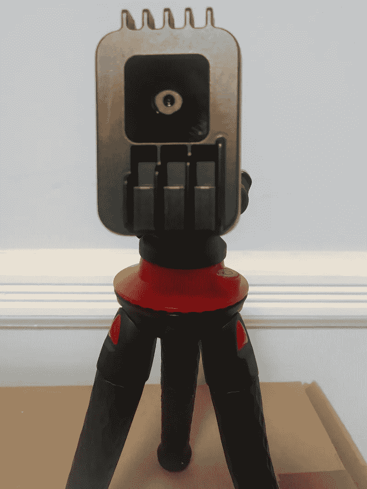

# 从头开始构建可视化搜索引擎还值得吗？

> 原文：<https://towardsdatascience.com/is-it-still-worth-it-to-build-a-visual-search-engine-from-scratch-65d9fc2f0b6b?source=collection_archive---------22----------------------->

## Google Vision API 产品搜索缩短了开发定制模型的漫长旅程

作者图片

# 介绍

我在 2018 年推出了[FootShirt.com](https://www.footshirt.com)，雄心勃勃地为喜欢收集球衣和/或对球衣所传达的历史和价值观充满热情的足球(英式足球)粉丝创造一个平台。

[FootShirt.com 的视觉搜索引擎](https://www.footshirt.com/visual-search)是最受欢迎的网站功能之一。本文将解释我如何构建视觉搜索引擎，从定制的机器学习模型开始，然后切换到[谷歌视觉 API 产品搜索](https://cloud.google.com/vision/product-search/docs)。

# 什么是视觉搜索引擎？

视觉搜索引擎是被设计成通过输入图像来搜索信息的搜索引擎。这些搜索引擎通常使用计算机视觉技术在大型数据库中搜索数字图像。

两个最著名的视觉搜索引擎(有时称为反向图片搜索)是 [TinEye](https://tineye.com/) 和 [Google Images](https://www.google.com/imghp) 。虽然这些服务在寻找相似图片方面表现良好，但是它们不能用于有效地识别足球衫，因为它们没有与图片相关联的标签。

# 开发定制深度学习模型的漫长旅程

## 问题定义

识别球衣意味着找出球队、赛季和球衣类型(主场/客场/第三场等)..).人类很难识别一件球衣，因为球衣制造商(耐克、阿迪达斯、彪马等..)需要每年设计新的球衣，同时尊重球队的颜色和身份。因此，球衣之间的差异可以相当小，尤其是如果球衣赞助商保持不变。

比识别狗 vs 猫还难！(图片由作者提供)

## 打包照片与用户生成的图像

[FootShirt.com 的视觉搜索引擎](https://www.footshirt.com/visual-search)依赖于一个包含+7，000 张参考图片的数据库。谷歌对什么是参考图片或打包图片做了很好的解释:

> 好的参考图像清晰地展示了产品，并且图像中没有任何其他物体。好的参考图像的典型例子是“打包”图像。这些图像通常用于在产品页面或广告中向用户展示产品，通常在白色背景前拍摄。

视觉搜索引擎将用户拍摄的或从网络上获取的照片作为识别球衣的输入。因此，收集和标记用户生成的图像(或 ***有噪声的*** 图像)以包括在用于训练模型的数据集中是很重要的。这显然是一个繁琐的过程，许多用户生成的图像不足以进行模型训练，主要原因如下:

*   繁忙的背景
*   剪得很差的照片
*   图像中的其他产品
*   光线不好

## 模型:去噪卷积自动编码器

一旦我建立了一个包含近 20，000 张照片的数据集，我就开始选择模型。基于一些研究，我决定实现一个去噪卷积自动编码器。首先，我强烈推荐下面这篇解决类似问题的 Medium 文章:[https://Medium . com/@ Soren Lind/a-深度-卷积-去噪-图像自动编码器-分类-26c777d3b88e](https://medium.com/@sorenlind/a-deep-convolutional-denoising-autoencoder-for-image-classification-26c777d3b88e)

简而言之，去噪卷积自动编码器将提取重要的特征来识别球衣，因为网络将被训练输出我们给它的输入。但是我们将通过限制中间的层(通常称为潜在空间或瓶颈层)的大小来做到这一点。这个潜在空间代表了识别球衣的重要特征，可以很容易地使用库进行比较，例如[aroy](https://github.com/spotify/annoy)。

自动编码器(作者插图)

在参考图像上训练的常规自动编码器不会为我们的用例工作，因为视觉搜索引擎需要能够处理用户生成的图像。因此，用户生成的图像也将在训练中使用(因此 ***去噪*** 在去噪卷积自动编码器中)。

左:用户生成的图像(“有噪声”)，中:参考图像，右:自动编码器重建的图像(作者插图)

我不会讲太多细节，但下面是我在培训中遇到的一些问题:

*   随着图像分辨率的提高，模型的精确度下降得很快。如前所述，球衣之间的差异可能很小，细节很重要。我选定了 256 x 256 的分辨率。
*   该模型需要许多层才能运行良好。
*   只有在对模型进行 400 个时期的训练后，准确度才开始可接受(+70%)。

因此，训练时间成为一个问题，因为模型需要训练许多小时甚至几天(使用谷歌 Colab 上的 GPU 或谷歌云平台上的英伟达特斯拉 V100/P100)。

然而，当我将数据集中的图像转换为 [TFRecords](https://www.tensorflow.org/tutorials/load_data/tfrecord) 并开始在 [Google Colab](https://colab.research.google.com/) 上使用 TPU 时，我能够显著减少训练时间。

培训损失正在下降(作者插图)

用于训练的时期越多，重建的图像就越好(作者插图)

## 现实世界中的结果

在使用 Flask 部署了模型之后，是时候看看可视化搜索引擎在现实世界中的表现了。总的来说，结果是好的…

是啊，它的工作！搜索引擎正确地识别出了尤文图斯 2005-2006 赛季主场球衣(插图由作者提供)

但是**不太好**如下例所示:

模特过于强调运动衫的整体形状(长袖)(作者插图)

该模型的准确性不够好(在低 70%)，视觉搜索引擎的维护也是有问题的，因为新的参考球衣需要编码，新的骚扰指数需要建立。

# 谷歌视觉 API 产品搜索来了

[Google Vision API 产品搜索](https://cloud.google.com/vision/product-search/docs)能否在足球衫上表现良好？我使用 Google Vision API Product Search[这样的产品时，主要担心的是底层模型无法泛化，这使得它不适合正确识别足球球衣。不通过超级参数调整、虚拟机配置、重新培训等，我能获得更高的准确性吗..？](https://cloud.google.com/vision/product-search/docs)

关于如何使用 Google Vision API 产品搜索，我不会讲太多细节，Google 提供的文档非常好。然而，我将解释快速推出可视化搜索引擎所需的主要步骤。除了浪费时间之外，开发定制模型是最重要的。许多应用程序模块，如图像处理、模型评估、Flask API 已经完成。这就是为什么推出一个基于谷歌视觉 API 产品搜索的视觉搜索引擎只需要几个小时的主要原因。

## 格式化批量导入 CSV 文件，并将图片上传到 Google 云存储桶。

最简单的开始方式是按照文档中提供的指南[准备一个 CSV 文件用于批量导入。CSV 文件将用于同时创建带有参考图像的产品集和产品。利用 FootShirt.com 数据库和一些 Python 代码，创建 CSV 文件相当容易。](https://cloud.google.com/vision/product-search/docs/csv-format)

用于批量导入的 CSV 文件的摘录(图片由作者提供)

然后，您需要将图像**和**CSV 文件存储在 Google 云存储桶中。

## 创建产品集，创建多个产品及其参考图像

使用 Google 提供的 [Python 代码示例](https://cloud.google.com/vision/product-search/docs/create-product-set)和之前创建的 CSV 文件，您可以使用批量导入来创建包含产品的产品集。这可能需要 5 到 30 分钟，具体取决于您拥有的图像数量。

## 考验的时候到了！

谷歌再次提供了优秀的代码示例[来搜索产品，或者在我们的例子中识别一件球衣。](https://cloud.google.com/vision/product-search/docs/searching)

通过使用[谷歌视觉 API 产品搜索](https://cloud.google.com/vision/product-search/docs)， [FootShirt.com 的视觉搜索引擎](https://www.footshirt.com/visual-search)现在表现更好(准确率在 90%左右)。我最喜欢的功能之一是 API 返回的分数或置信度(在括号中，在下面的截图中)。这允许设置一个阈值，低于该阈值时，您将让您的用户知道没有找到结果。

谷歌视觉 API 产品搜索似乎在很大程度上依赖于文本识别，或者在足球球衣识别的背景下，依赖于赞助商的名称。下面的例子表明赞助商的名字比球衣颜色更重要(第二次点击是白色球衣，而输入是黑色球衣，但是赞助商是相同的！)

这一次，视觉搜索引擎没有被长袖善舞所欺骗

我确认了我的直觉，提供了一张没有赞助商的球衣图片作为输入，而我知道参考图片上有赞助商的名字。 [Google Vision API 产品搜索](https://cloud.google.com/vision/product-search/docs)在寻找合适的比赛(AC 米兰 2018–2019 主场球衣)时遇到了更多困难，在没有赞助商的情况下作为第一和第二选择的相似球衣返回。

仍不完美，但很接近——前 3 次命中之间的置信度分别为 0.62、0.61、0.58(作者举例说明)

## 费用

关于[成本](https://cloud.google.com/vision/product-search/pricing)的一句话。您需要为图像的存储和 API 调用的数量付费。

谷歌视觉 API 产品搜索——定价(作者插图)

对于像 FootShirt.com[这样拥有数万张图片的网站来说，存储成本和预测成本是合理的(一个可视化搜索引擎每月不到 10 美元！).](https://www.footshirt.com)

# 结论

FootShirt.com 的视觉搜索引擎可以通过提供你的球衣图片来帮助你在[FootShirt.com](https://www.footshirt.com)上建立一个数字收藏。但搜索引擎也可以用来在易贝买卖球衣之前识别球衣，或者识别你在网络或社交媒体上找到的球衣。

[Google Vision API 产品搜索](https://cloud.google.com/vision/product-search/docs)满足了我对识别足球球衣的视觉搜索引擎的所有要求:界面简单、预测速度快、成本低。

我鼓励你测试一下 FootShirt.com 的视觉搜索引擎。

[FootShirt.com 的视觉搜索引擎](https://www.footshirt.com/visual-search)正在运行(作者插图)

另一方面，我还没有体验完用机器学习模型来识别足球球衣。我的下一个项目可能是使用新的 [OAK-1](https://store.opencv.ai/products/oak-1) 进行实时推理。请继续关注，不要犹豫发表您的评论！

OAK-1:用于实时推理的 4K 相机(图片由作者提供)