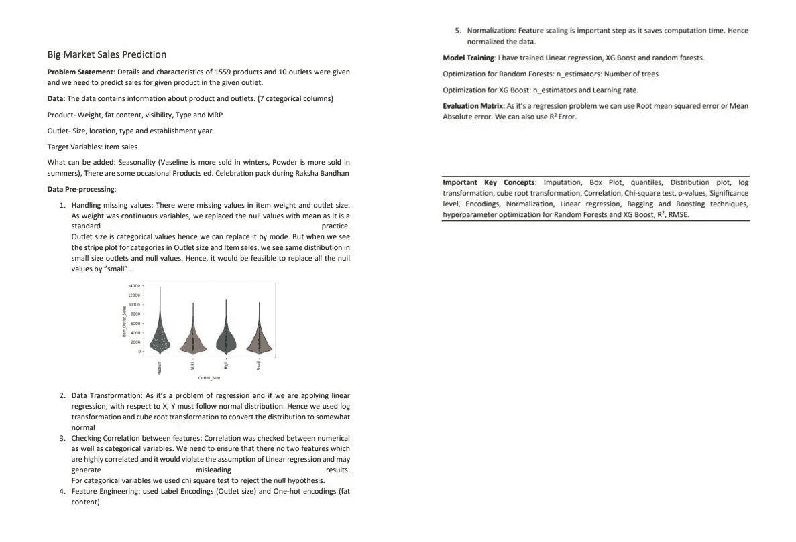
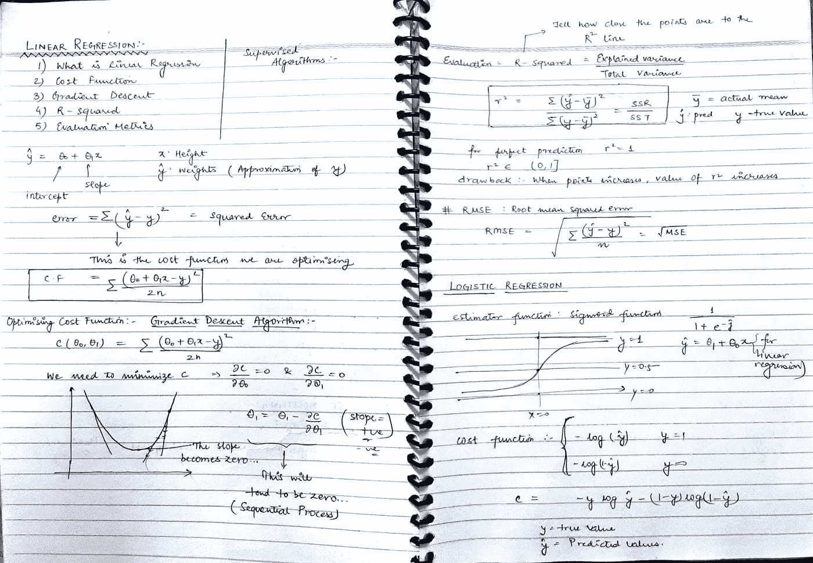
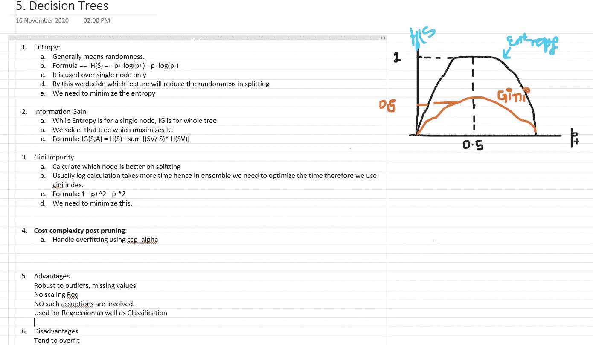

# 做一份好的数据科学简历就够了吗？

> 原文：<https://towardsdatascience.com/is-making-a-good-resume-for-data-science-enough-20d4f8f4b740?source=collection_archive---------31----------------------->

## 面试前你必须做的 4 件事。

由作者创建

对于任何职位来说，制作一份好的简历都是非常困难的。这种忙乱是合理的，因为你的简历是你给面试官的第一印象。它应该整洁、干净、易读，并且应该包含所有你专业做的事情。

当我在研究如何写一份好的简历时，我发现了很多可以用来写一份好简历的资源。如果你想要好的简历模板，你可以登录背面的。如果你的简历需要动作动词，你可以在这里访问(来自哈佛的文件)。

但问题是，**是一份足够好的简历**？

# 让我们来看一些统计数据。

*   平均来说，10%的求职申请会收到面试邀请。通过面试的人中，有 20%得到了这份工作。( [Zety](https://zety.com/blog/resume-statistics) )
*   在被发现在简历上撒谎的 31%的人当中，65%的人要么没有被雇佣，要么被解雇。( [Hrdive](https://www.hrdive.com/news/more-than-a-third-of-people-admit-to-lying-on-resumes/570565/) )
*   根据 Monster 的 2019 年招聘人员状况调查， **85%** 的招聘人员表示，候选人在简历中夸大了技能和能力。([怪物](https://www.monster.com/career-advice/article/when-you-lie-on-your-resume))

招聘人员认为人们在简历中夸大其词的一个原因是候选人没有做好充分准备。想象一下你已经完成了一些你无法解释细节的课程、项目或实习。它不可否认地表明你并不像你在简历中提到的那样熟练。(担心的一大理由。)

很明显，即使你准备了一份好看的简历，你被选中的几率也很低。你还应该知道如何在面试中解释你的简历。这就是这篇文章的全部内容。让我们开始吧。

# 技巧 1:讲故事的艺术

对于你在简历中提到的任何项目或实习，在头脑中创造一个故事，从开始到结束。现在，当我们一起使用故事和项目时，大多数人会感到困惑。

让我们看一个例子。

作者图片

以上是一个大市场销售预测问题的工作流程。它从“了解您的数据”开始，然后是数据预处理、模型训练、评估矩阵和我学到的重要概念。

在您制定工作流程时，您应该牢记以下问题:

*   你对数据了解多少？存在哪些变量类型？需要哪种数据转换？
*   我是如何开始解决我的问题的？
    是否需要特征工程？我需要更多数据吗？
*   我面临的障碍是什么，我如何清除它们？
    不平衡分类？违反假设？处理缺失值或异常值？
*   我为什么选择这个算法？我是如何评价的呢？
*   我得到了什么结果？我能解释我的结果吗？

所有这些问题对面试都至关重要。招聘人员肯定会问这些问题，分析你解决问题的熟练程度，以及你解决任何问题的方法。

现在，让我们看看这种讲故事方法的好处:

*   一旦你在脑子里做了一个工作流程，你就自信了，你可以更好地解释你在项目中做了什么。你应该知道招聘人员问的大多数问题的答案。
*   这个工作流程会让你在面试中更有条理。此外，招聘人员会知道你对这个职位有多认真。
*   这个强大的工具还能让你知道可以问哪些问题。一旦你开始按时间顺序描述你的项目，你就可以预测在特定的时间点会出现什么问题。
*   数据科学就是从数据中推导出故事。所以，这种做法也会在面试后对你的职业生涯有所帮助。

同样，你可以用这种方法来解释你的实习经历或职业经历。从你发现问题的地方开始。需要什么样的头脑风暴来找到可行的解决方案？您是如何找到最佳解决方案的？然后描述你是如何实现的，最后是结果。

# 技巧 2:复习

在项目和实习结束后，一般来说，招聘人员会就你相关课程作业中提到的话题问一些技术问题。相关的课程可能包括你在大学里学习的课程、在线学习平台或任何其他来源。

如果你把所有的题目都过一遍，你就很难一遍又一遍的花很多时间。因此，当你第一次修改你的课程时，试着做一些简短的笔记。

作者图片

我修改过算法，在一些网络课程里教过。在准备面试的时候，我试着做简短的笔记。这对我帮助很大。一旦我做了这些笔记，并仔细阅读了几次，这些概念就在我的脑海中形成了。

作者图片

在上图中，我已经提到了决策树算法的所有内容。它包含了对面试至关重要的所有基本定义。

一旦你做到了这一点，搜索面试中关于这个话题/课程的一般性问题。你会发现大量的资源。准备好所有这些材料肯定会增加你对题目的理解。

# 提示 3:时间表

我的简历包含了我的课程、职业经历、项目、课外活动等等。准备一份简历，你需要一些专门的时间。

制定时间表不是一件容易的事情。你有几周时间来复习过去几年学过的所有话题。你可以按照下面的步骤做一个时间表。

1.  首先列出所有你想**复习**的题目。
2.  试着根据你在每个题目上的强项来排序。你弱项的题目一定要排在最前面。面试日期越来越近，时间就越来越快。因此，当你有足够的时间时，分类将帮助你处理脆弱的话题。即使你可以留下一两个字符串主题，也没关系。
3.  选择一个或几个固定的时间来复习所有的东西。
4.  最后也是更困难的一步是开始。所以，开始复习吧。

如果你有计划，你可以在给定的时间内获得更多。我在面试前 20 天就开始做这些事情了，还有我的常规课程。这是一个紧张的过程。但最棒的是，我可以在项目和相关课程之间建立联系。我可以利用我在以后的课程中掌握的不同技术产生新的想法。

# 提示 4:你在简历中提到但从未提及的事情

正如统计数据显示的那样，有很多人在简历中撒谎。我强烈建议你不要在面试中这样做，因为招聘人员什么都知道。请只强调那些你曾经做过的事情。

但是到了**某个** **程度**，你可以补充一些你没有做过的事情。例如，在解决一个预测建模问题时，您可能会运行 xgboost 算法，并在简历中提到结果，而对该算法没有深入的了解。

招聘人员明白你可能不知道所有的事情。不可以！他们希望看到的是，你所做的，你是以最大的诚意去做的。今天，公司需要真诚和努力工作的人。技术方面是可以教的，但真诚的品质是教不来的。

# 总结性的新闻报导

工作安排是一个非常密集的过程。你必须在 45 分钟的时间里展示你多年来所做的一切。45 分钟可以改变你的一生。我从这个过程中学到的是:

*   制作一份好的简历是不够的。你应该知道简历中的每一个术语。这使我们能够在有限的时间内展示我们的整个旅程，并产生更大的影响。这也有助于我们以最大的诚意向招聘人员证明我们简历的每一个方面。
*   有了适当的计划，你可以实现任何事情。**任何事情**！

一旦你经历了这个过程，我相信你会对你的选择更有准备和信心。面试不仅是知识的游戏，也是气质的游戏。