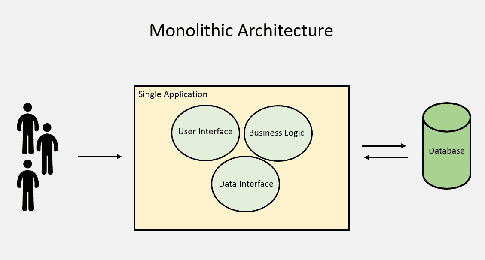
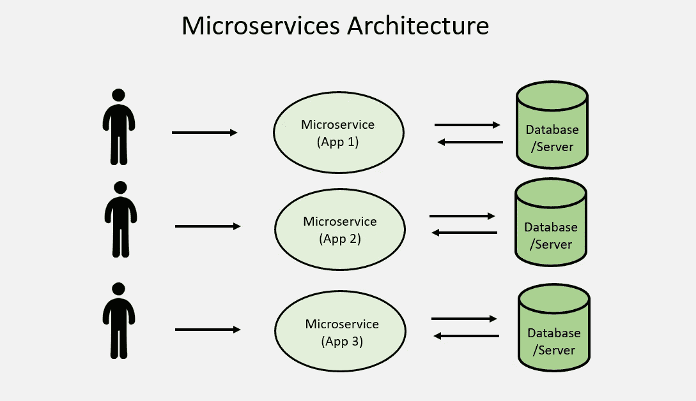

# 微服务架构是机器学习部署的最佳选择吗？

> 原文：<https://towardsdatascience.com/is-microservice-architecture-the-best-choice-for-machine-learning-deployment-39ae325a2baf?source=collection_archive---------27----------------------->

## 了解整体架构和微服务架构之间的差异

埃里克·普劳泽特在 [Unsplash](https://unsplash.com?utm_source=medium&utm_medium=referral) 上拍摄的照片

## 介绍

机器学习部署趋势正朝着敏捷性、可扩展性、灵活性和向云计算平台转变。随着数据量和需求的增加，以前使用中央团队和整体架构管理和部署应用程序的组织在扩展时遇到了瓶颈。因此，微服务架构正在成为组织的一种流行方法，并已被网飞、亚马逊、优步、Grab 等大型组织采用。

在本文中，我们将了解:

*   什么是整体架构？
*   什么是微服务架构？

## 什么是整体架构？

单体建筑(图片由作者提供)

整体架构被认为是构建应用程序的传统方法。单一应用程序由中央数据团队从一个集中的位置进行管理，这意味着所有流程都作为一个统一的单元运行。

通常，整体式应用程序使用一个可以由多个开发人员开发的大型代码库。如果其中一个开发人员想要对代码进行修改，他们将不得不访问相同的代码库并对整个堆栈进行修改。如果代码库变得越来越大，诸如添加新特性之类的更改最终会变得更加复杂。最终，应用程序**将不再是可伸缩的**，因为复杂性增加了，新的特性也不容易添加。此外，由于所有的进程都是相互连接和相互依赖的，所以单个进程的故障将导致整个应用程序的故障，并且必须重写整个应用程序。

然而，单片应用仍然具有一些优点，例如:

*   **易于部署** —因为所有东西都在一个应用程序中，所以您只需要处理一个特定的文件。
*   **易于测试&调试—** 由于一切都在一个不可分割的单元中，端到端测试可以更快地完成。
*   **易于开发** —由于单一应用一直是传统方法，任何数据平台/工程成员都能够开发单一应用。

## 什么是微服务架构？

微服务架构(图片由作者提供)

虽然我们知道单片架构是基于单个统一单元的构建，但微服务架构是高度分散的，它将单个大型应用程序/单片应用程序分解为一组较小的独立单元。每个微服务将专注于一个特定的功能，并通过 API(应用程序接口)与其他微服务进行通信。

让我们来看看为什么机器学习模型经常被选择部署为微服务的优势:

*   **可扩展** —每个微服务都是独立的组件，运行自己的流程，独立部署。由于每个服务都是独立部署的，因此特定的微服务可以独立于整个应用进行扩展。
*   **敏捷性** —微服务应用中的故障只会影响特定的服务，而不会影响整个应用。因此，修复和调试将在特定的微服务上完成，而不是暂停和修复整个应用程序。
*   **灵活性** —团队成员不受用于创建和部署微服务的编程语言或工具的限制，并且可以为每个微服务拥有不同的框架。此外，如果有先前开发的代码，团队成员可以利用这些代码，而不是重新构建它们。
*   **自主性** —使用微服务架构方法进行开发允许更多的团队自主性，因为每个成员都可以专注于开发专注于特定功能的特定微服务，例如每个成员都可以专注于构建专注于机器学习部署过程中特定任务的微服务，例如数据摄取、功能工程、数据验证、模型评分等。
*   **易于理解** —由于事物被分割成更小的组件，单个微服务应用程序更易于理解和管理，因为通常一个微服务专注于一项特定的任务。

微服务架构现在对你来说似乎是最完美的方法，但尽管如此，也有缺点。以下是一些已确定的缺点:

*   **更高的成本** —与单片架构相比，微服务通常更昂贵，因为它需要更多的资源。因为每个服务都是相互独立的，它需要自己的 CPU/实例和环境。此外，该公司将需要雇用或提供培训，以拥有一组能够理解、开发和维护微服务的熟练团队。
*   **复杂性** —虽然随着代码库的扩大，整体架构可能会变得复杂，但微服务架构可以由几十个或数百个不同的服务组成(例如:[优步已经发展到拥有超过 2200 个微服务](https://eng.uber.com/microservice-architecture/#:~:text=As%20Uber%20has%20grown%20to,benefits%20of%20a%20microservice%20architecture.))，这些服务需要无缝和安全地通信。有了这么多的微服务，调试会变得更具挑战性，因为问题跟踪不会那么简单。
*   **安全** —微服务通常部署在云平台上，需要通过网络相互通信，这带来了安全挑战，因为这为外部人员获得系统访问权限创造了机会。

## 结论:

根据业务/项目的场景，如果组织刚刚形成，团队很小，项目是轻量级的——可以使用整体架构方法。除此之外，对于构建有许多成员的复杂应用程序的大型组织来说，微服务架构方法将是更好的选择。最后，微服务架构可能最适合那些需要在敏捷开发过程中快速开发且团队成员众多的组织。

感谢阅读，我希望你喜欢这篇文章！

## 参考和链接:

[1][https://aws.amazon.com/microservices/](https://aws.amazon.com/microservices/)

[https://eng.uber.com/microservice-architecture/](https://eng.uber.com/microservice-architecture/#:~:text=As%20Uber%20has%20grown%20to,benefits%20of%20a%20microservice%20architecture)

[3][https://solace . com/blog/micro services-优缺点/](https://solace.com/blog/microservices-advantages-and-disadvantages/)

[4][https://www . n-IX . com/micro services-vs-monolith-which-architecture-best-choice-your-business/](https://www.n-ix.com/microservices-vs-monolith-which-architecture-best-choice-your-business/)