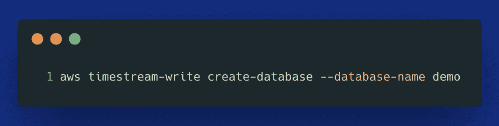
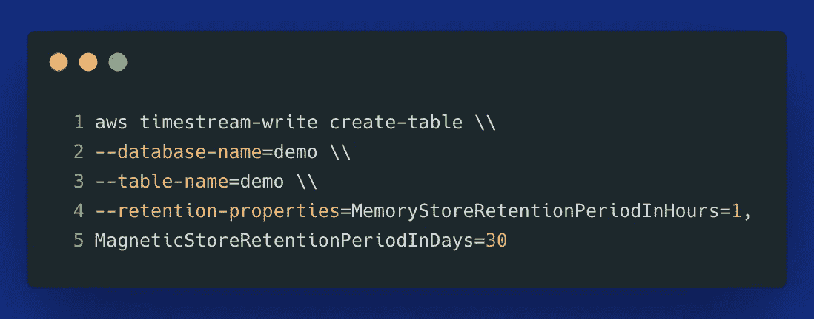
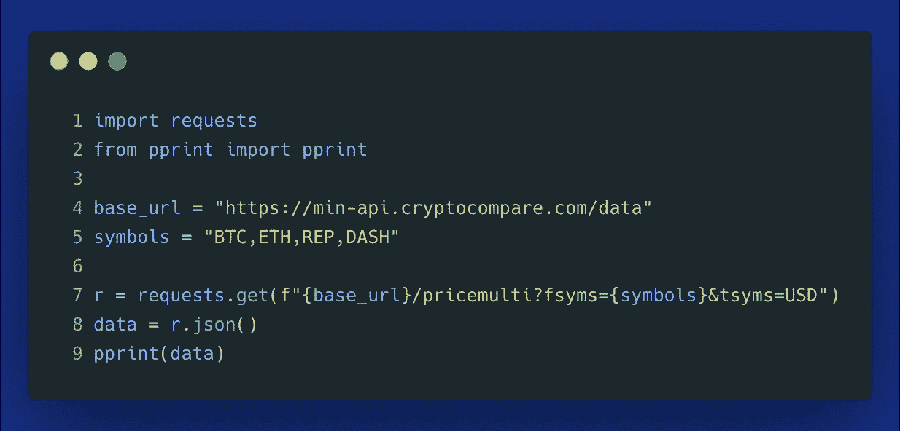
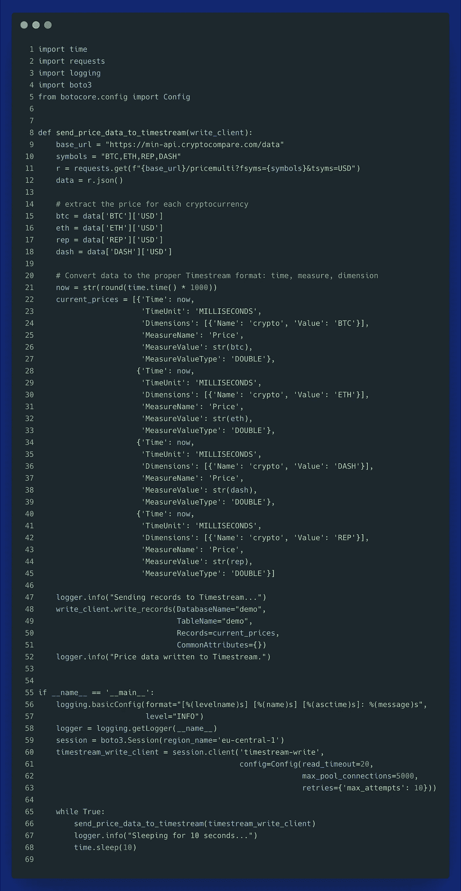
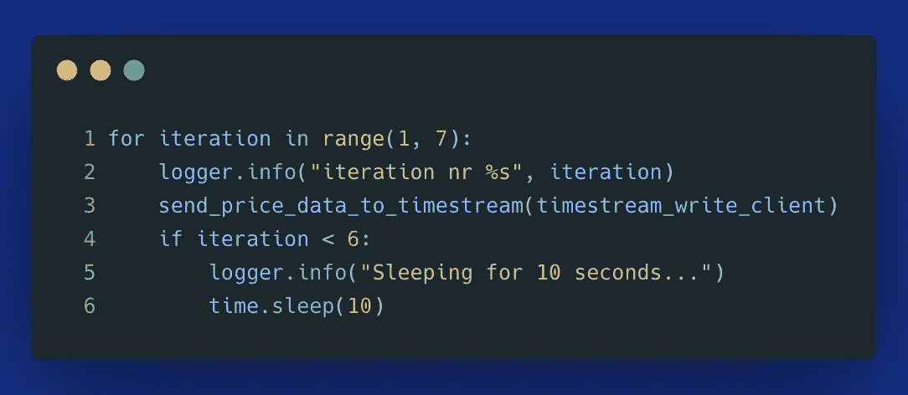

# 对于您的分析用例，实时处理值得吗？

> 原文：<https://towardsdatascience.com/is-real-time-processing-worth-it-for-your-analytical-use-cases-f0e16272e71c?source=collection_archive---------34----------------------->

## 实时技术非常强大，但是它们会显著增加数据架构的复杂性


照片由 [Victor Wang](https://www.pexels.com/@victor-wang-1267136?utm_content=attributionCopyText&utm_medium=referral&utm_source=pexels) 从 [Pexels](https://www.pexels.com/photo/bird-s-eye-view-photography-of-high-rise-buildings-2415499/?utm_content=attributionCopyText&utm_medium=referral&utm_source=pexels)

与批处理相比，实时数据管道提供了一个显著的优势——消费者可以更快地获得数据。在传统的 ETL 中，在明天的夜间作业完成之前，您无法分析今天的事件。如今，许多企业都依赖于在几分钟、几秒钟甚至几毫秒内即可获得的数据。借助流技术，我们不再需要等待预定的批处理作业来查看新的数据事件。新数据进入时，实时仪表板会自动更新。

尽管有这些好处，实时流还是给整个数据处理、工具甚至数据格式增加了许多额外的复杂性。因此，仔细权衡改用实时数据管道的利弊至关重要。在本文中，我们将研究几个选项，以最少的架构更改和维护工作获得实时范例的好处。

# 传统方法

当您听说实时数据管道时，您可能会立即想到 Apache Kafka、Flink、Spark Streaming 和类似的框架，这些框架需要大量知识来操作分布式事件流平台。这些开源平台最适合以下场景:

*   当您需要持续摄取并合理处理**大量**实时数据时，
*   当您预期**多个生产者**和**消费者**并且您想要分离他们的通信时，
*   或者当您想要拥有底层基础架构时，可能需要**本地** ( *例如合规性*)。

虽然许多公司和服务试图促进底层分布式集群的管理，但该架构仍然相当复杂。因此，您需要考虑:

*   你是否有足够的资源来运营这些集群，
*   您计划使用该平台处理多少数据，
*   增加的复杂性是否值得努力。

在接下来的几节中，如果您的实时需求无法证明自我管理的分布式流媒体平台所增加的复杂性和成本是合理的，我们将研究替代选项。

# 亚马逊 Kinesis

AWS 很久以前就意识到了客户在管理消息总线架构方面的困难[(2013 年)](https://aws.amazon.com/about-aws/whats-new/2013/11/14/introducing-amazon-kinesis/)。因此，他们提出了 kine sis——一个试图让实时分析变得更容易的服务系列。通过利用无服务器 Kinesis 数据流，您可以在 AWS 管理控制台中点击几下来创建数据流。一旦配置了估计的吞吐量和碎片数量，就可以开始实现数据生产者和消费者了。即使 Kinesis 是无服务器的，您仍然需要监控消息大小和碎片数量，以确保不会遇到任何意外的写限制。

在[我的上一篇文章](https://betterprogramming.pub/aws-kinesis-vs-sns-vs-sqs-a-comparison-with-python-examples-6fc688bfd244)中，你可以找到一个 Kinesis 生产者(*源*)使用 Python 客户端向 Kinesis 数据流发送数据的例子，以及如何通过利用 **Kinesis 数据消防软管**交付流向 S3 ( *消费者/目的地*)连续发送微批数据记录。

或者，为了使用来自 Kinesis 数据流的数据，我们可以:

*   使用 **Kinesis 数据分析**汇总和分析数据，
*   使用 Apache Flink[将这些数据发送到 **Amazon Timestream**](https://docs.aws.amazon.com/timestream/latest/developerguide/ApacheFlink.html) 。

与将数据直接发送到所需应用相比，使用 Kinesis 数据流的主要优势在于**延迟**和**解耦**。Kinesis 允许您在流中存储数据长达七天，并且有多个消费者可以同时接收数据。这意味着，如果一个新的应用程序需要收集相同的数据，您可以向流程中添加一个新的消费者。由于 Kinesis 架构级别的解耦，这个新的消费者不会影响其他数据消费者或生产者。

# 亚马逊时间流

如前一节所述，Kinesis 的主要优势是解耦。如果你不需要多个应用程序定期从流中消耗数据，你可以通过使用 Amazon Timestream 大大简化这个过程——一个**无服务器时间序列数据存储**，允许你在附近的*实时分析数据。底层架构足够智能，可以首先将数据接收到内存存储中，以便快速检索实时数据，然后根据指定的保留期自动将“旧”数据移动到更便宜的长期存储中。更多关于 Timestream 的内容，请看[这篇文章](/amazon-timestream-is-finally-released-is-it-worth-your-time-e6b7eff10867)。*

**为什么您会使用时间序列数据库来存储实时数据？**任何新的数据记录都会在特定时间进入**流**。您可能会跟踪价格随时间的变化、传感器测量、日志、CPU 利用率——实际上，任何实时流数据都是某种时间序列。因此，考虑使用像 Timestream 这样的时间序列数据库是有意义的。该服务的简单性使其非常有吸引力，尤其是如果您想使用 SQL 检索数据进行分析的话。

当将 Timestream 的 SQL 接口与 Kinesis 数据分析中可用的接口进行比较时，Timestream 显然是赢家。Kinesis SQL 相当晦涩，引入了很多特定词汇。相比之下，Timestream 提供了一个直观的 SQL 接口，其中有许多有用的内置时间序列函数，使得基于时间的聚合( *ex。分钟或小时时段*)容易得多。

> **旁注:**不要在 Timestream 中的查询末尾使用分号。如果你这样做，你会得到一个错误。

## 演示:使用 Python 实时摄取到时间流中

为了演示 Timestream 如何工作，我们将把加密货币的价格变化发送到 Timestream 表中。

让我们从创建一个时间流数据库和表开始。我们可以从 AWS 管理控制台或 AWS CLI 完成所有这些工作:



上面的代码应该在您的 AWS 区域中创建一个**数据库**。确保使用其中一个有时间流的**区域**。

> **补充说明:**查找任何 AWS 服务可用地区的最简单方法是查看定价页面:[https://aws.amazon.com/timestream/pricing/](https://aws.amazon.com/timestream/pricing/)。

现在我们可以创建一个**表**。您需要指定您的内存和磁存储保持期。



我们的数据库和表就创建好了。现在我们可以从 [Cryptocompare API](https://min-api.cryptocompare.com/documentation?key=Price&cat=multipleSymbolsPriceEndpoint) 获得最新的价格数据。这个 AP 提供了许多有用的端点来获取关于加密货币市场的最新信息。我们将专注于获取选定加密货币的实时价格数据。



我们将获得以下格式的数据:

```
{'BTC': {'USD': 34406.27},
 'DASH': {'USD': 178.1},
 'ETH': {'USD': 2263.64},
 'REP': {'USD': 26.6}}
```

此外，我们需要将这些数据转换成适当的 Timestream 格式，具有**时间**列、**度量**和**维度**。下面是我们可以用来每 10 秒钟接收一次新数据的完整脚本:[https://gist.github.com/d00b8173d7dbaba08ba785d1cdb880c8](https://gist.github.com/d00b8173d7dbaba08ba785d1cdb880c8)。



就是这样！最耗时的部分是定义您的维度和度量(第 21–44 行)。您应该**小心**度量和维度的设计:使用 Timestream，您只能查询单个表中的数据。不允许表之间的联接。因此，在开始将数据接收到 Timestream 之前，提前考虑您的访问模式非常重要。

这是数据最终的样子。请注意，摄入时间以 UTC 表示:


AWS Timestream:在查询控制台中浏览结果—作者图片

我们现在可以轻松地将 Timestream 连接到 Grafana，实现近乎实时的可视化。但那是另一篇文章的内容了。

# 永无止境的剧本

在上面的时间流例子中，在单个进程中运行，我们使用了使用`while True`定义的永无止境的循环。对于一直接收数据的简单服务来说，这是一种常见的方法，通常作为后台流程或容器编排平台中的服务运行。

# 按分钟计划的作业

连续运行脚本的替代方法是计划每分钟运行一次的服务。这种方法的好处是，它允许您将这个接近实时的过程作为批处理作业来处理，这简化了您的架构。你可以把它想象成一个反向的 Kappa 架构:当 Kappa 以与实时数据相同的方式处理批处理时(*流优先方法*)，这种方法把实时数据流(*批优先方法*)分成微批处理。

现在，我们仍然大约每 10 秒钟接收一次数据，而不是`while True`，但实际过程是每分钟执行一次，这使我们能够跟踪哪些运行是成功的，并且不依赖于单个作业运行的健康状况:



没有“正确”或“错误”的方法。这种方法的主要目的是将接近实时的摄取作为批处理作业来处理。这里有一个完整的要点:[https://gist.github.com/d953cdbc6edbf8b224815cc5d8b53f73](https://gist.github.com/d953cdbc6edbf8b224815cc5d8b53f73)。

# 你应该选择哪个选项？

以下问题可能有助于您针对您的用例做出正确的决策:

*   您希望使用实时流解决哪些**问题**:是异常检测、警报、产品推荐、动态定价算法、跟踪当前市场价格、了解用户行为？在头脑中有一个特定的用例可以帮助您确定适合这项工作的工具，尤其是因为市场上有许多专门的工具。
*   在您的使用案例中，哪个**延迟**是可接受的？如果您的数据在收到事件或数据流 1 分钟后可用于分析，可以吗？或者相反，您需要一毫秒的延迟，因为否则，这些数据将不再是可操作的？
*   你有多少**资源** ( *员工和预算*)来维持你的平台运营？构建自己的 Kafka 集群、使用一些托管服务或者 Amazon Kinesis 或 Amazon Timestream 等无服务器选项是否有意义？
*   你打算如何**监控**和**观察**你的数据流的健康状况？如果您利用无服务器技术， [Dashbird](https://dashbird.io/) 可能是一个很好的选择，可以轻松监控您的无服务器 AWS 堆栈，并通知您有关故障和异常的信息。
*   教你的团队如何使用这个特定的平台需要多少培训？
*   哪些**数据源**需要实时摄取，即**数据生产者**？
*   您希望从哪个**目标数据存储库** ( *数据湖、数据仓库、特定数据库*)中检索该数据，即**数据消费者**？您希望如何检索这些数据——通过 SQL、Python，还是仅通过分析仪表板？
*   您希望以哪种方式(*基于架构的*)处理这些数据？ [Kappa，Lambda](/a-brief-introduction-to-two-data-processing-architectures-lambda-and-kappa-for-big-data-4f35c28005bb) ，或者其他架构值得考虑**区分实时和批量**？

# 结论

最终，这取决于您尝试使用实时流技术解决的问题、问题的规模以及可用的资源。在许多情况下，一个简单的分钟批处理作业可能就足够了。它允许有一个单一的架构来满足所有的数据处理需求，并且在数据生成后几分钟甚至几秒钟内就可以获得数据。

对于其他场景，Kinesis 数据流或 Amazon Timestream 可以提供简单而有效的方法来添加(近)实时功能，而只需很少的维护工作。最后，如果你有知道如何操作 Kafka、Flink 或 Spark Streams 的员工，如果你想拥有自己的基础设施而不依赖云提供商，这些会很有帮助。像往常一样，思考手头的问题将有助于评估权衡，并为您的用例做出最佳决策。

**感谢您的阅读！**