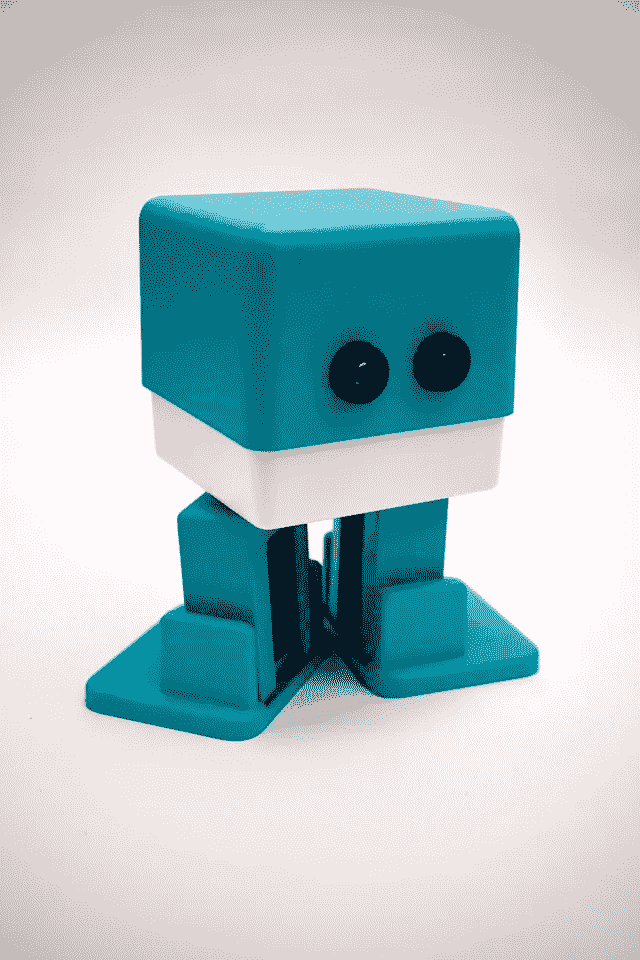
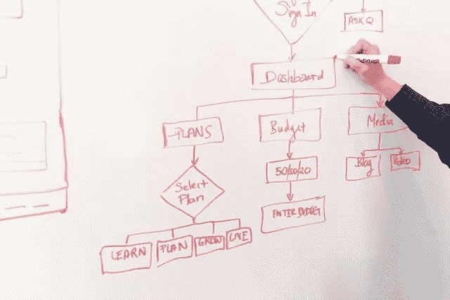

# 机器人过程自动化(RPA)真的适合任何人吗？

> 原文：<https://towardsdatascience.com/is-rpa-really-anybodys-cup-of-tea-c3b808b4043?source=collection_archive---------34----------------------->

## 揭示在将这种流行的软件技术应用于业务流程自动化之前一些未知的考虑因素。

照片由[日常基础](https://unsplash.com/@zanardi)在 [Unsplash](https://unsplash.com/)

机器人过程自动化(RPA)最大的吸引力在于其标榜的易用性。这种软件技术成功的目标群体是人力资源、财务等职能部门。，仅仅是因为这样的支持功能被认为不太懂技术。从而使完美的候选人尝试一种工具，这种工具是为任何想要加入“自动化”潮流的人准备的，并探索通过减少手动的、重复的任务来带来一些生产率的提高。基于我对这种技术的使用，我提出了我对它的简单性的看法，以及那些探索其实现的人需要注意的潜在警告。

照片由[摄于](https://www.pexels.com/@thisisengineering)[像素](https://www.pexels.com/)上的这个工程

## 什么和什么时候

有很多在线资料可以用来详细说明这项技术的功能、它的潜在用例以及新手的实现方法(为采用这项技术所做的市场营销工作令人印象深刻！).简而言之，我的摘要是，它是一个自动化工具，采用“软件机器人”的形式。它可以简单地是多出来的一双手，来承担做平凡的和重复的任务的角色，根据预先定义的逻辑执行动作。拿走那些吸干人类创造力的“肮脏、无聊”的工作。

如果你执行的任务符合上述描述，反思一下你的日常工作。让我们考虑一个例子——假设你的任务是在网页上频繁地执行一些动作。完成这项任务的典型尝试包括参考利益相关者的文档，并将这些文档的更新反映到网页上。并且每次从利益相关者那里收到新的更新时，您都在重复相同的步骤。接下来，让我们看看 RPA 如何在此示例场景中提供帮助。

照片由[克里斯蒂娜](https://www.pexels.com/@divinetechygirl)在[像素](https://www.pexels.com/)上拍摄

## 怎么做

与任何项目管理一样，解决方案工作始于从头到尾制定详细的步骤顺序，将任务分解为解决方案。

RPA 最受推崇的功能之一是它能够根据用户的动作记录屏幕上的活动。根据我的经验，让我与你分享一下，虽然当我们只处理一个应用程序(例如浏览器)上的动作时，这个功能很好，但一旦你开始从一个应用程序跳到另一个应用程序，捕捉你的多应用程序动作就变得相当复杂了。在记录的最后，重新运行记录的工作流来进行测试通常会导致错误，并且您最终会得到一个不完整的自动化流程。

根据我在这种情况下的经验，我可以保证的解决方案是挑选执行所需操作的适当活动(在 UiPath 上称为 UI path，用于构造 RPA 解决方案的 UI)。在 UiPath 上，RPA 解决方案构建为一个流程图，从第一步到最后一步构建一个又一个操作(/activity)。要为我们上面的示例场景构建 RPA 工作流，同时记录一个应用程序上的操作，就像在网页上一样，肯定是一种可行的方法。在记录结束时，UiPath 将这些动作转换成连续的活动，以测试准确的捕获。然后你所要做的就是把剩下的拼图拼在一起，让机器人把网页动作和外部网页动作连接起来。仔细考虑一下，我们将重复这些步骤，直到所有更新都从文档转移到网页，并再次对新文档重复相同的步骤序列——这在编码领域是“循环”的典型用例因此，将该技术特有的内置便利性与编码基础知识相结合，可以极大地增强您构建强大而健壮的 RPA 解决方案的能力。

安妮在 [Unsplash](https://unsplash.com/) 上的照片

## RPA 是所有自动化需求的最终解决方案吗？

简单的答案是否定的。正如我在我的[上一篇文章](/if-you-only-have-time-for-one-thing-as-a-people-analyst-spend-it-on-this-57383104e841?sk=2d3918be92b0a878d7d64d795366c43e)中详述的那样，仅仅因为应用程序的数量是无限的，就提高编程技能的重要性，我仍然坚持我的立场。此外，我认为 RPA 并不适合所有人，因为它在分支到复杂任务时会面临挑战。也就是说，在单个应用程序内简单的“记录&重复”式自动化方面，RPA 肯定有它的优势，所以它的应用程序真的取决于。

令人欣慰的是，在构建 RPA 解决方案时，帮助热线肯定是可用的，可以从在线社区寻求帮助/提示(向 Google 致敬！).此外，鉴于其广泛的市场营销，RPA 通常也会为大型本地应用程序提供支持网络。

尽管如此，最大化该工具实际上可以归结为如何根据您的需求和业务任务来塑造它，应用基本的编程知识，而不仅仅是依赖花哨的 UI 技巧。我当然会鼓励尝试一下，体验一下这项技术能提供什么。最终，根据手头的业务任务，它将成为您的另一个武器库。