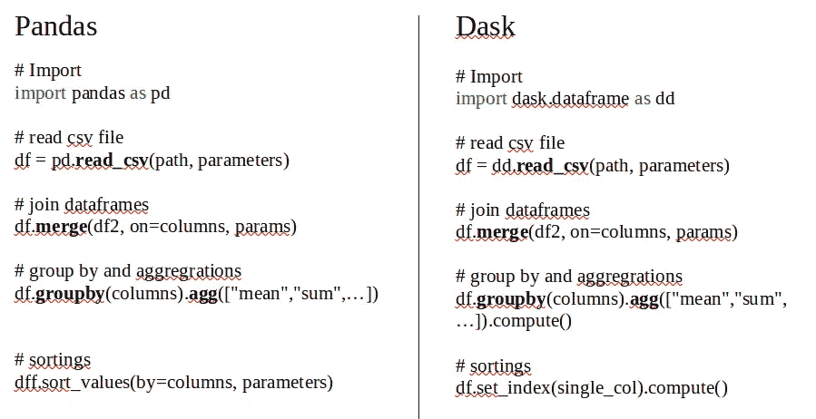
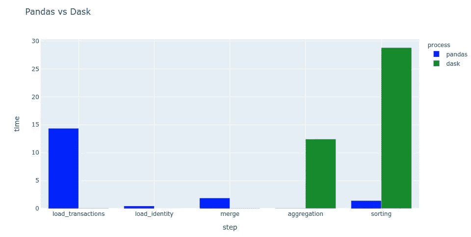
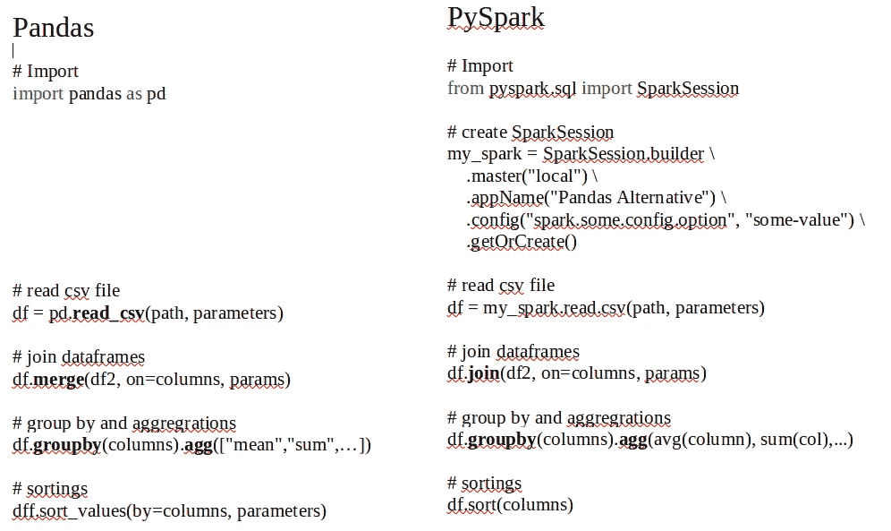
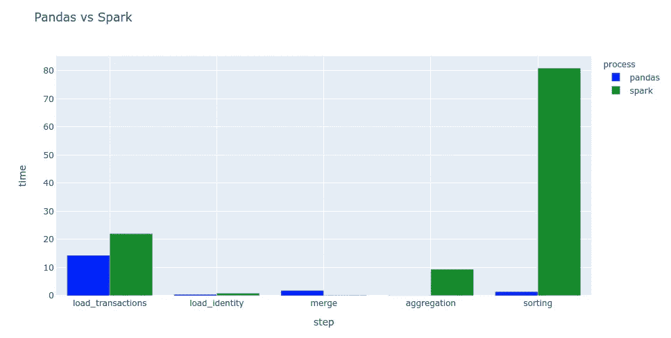
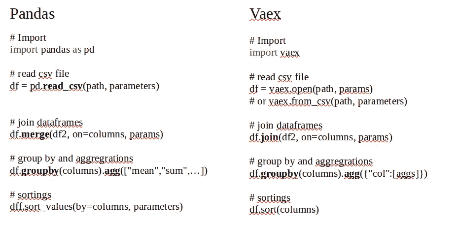
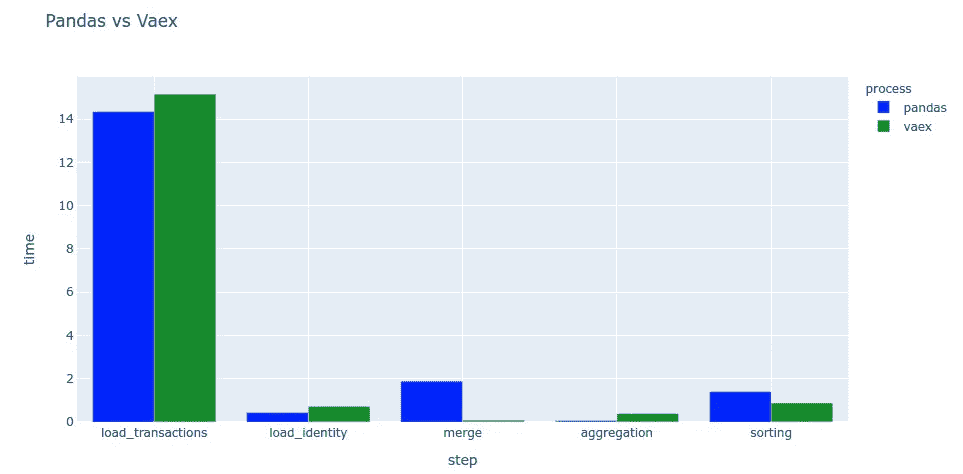
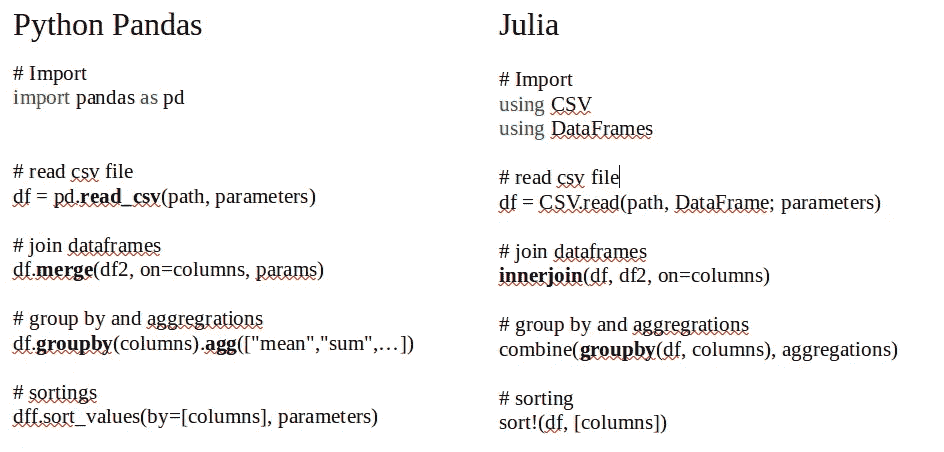
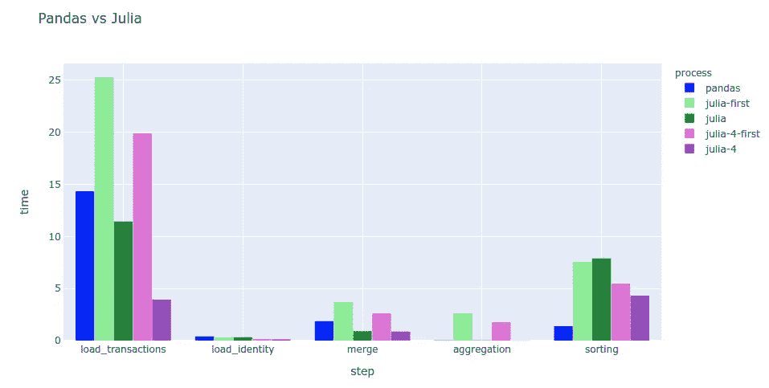
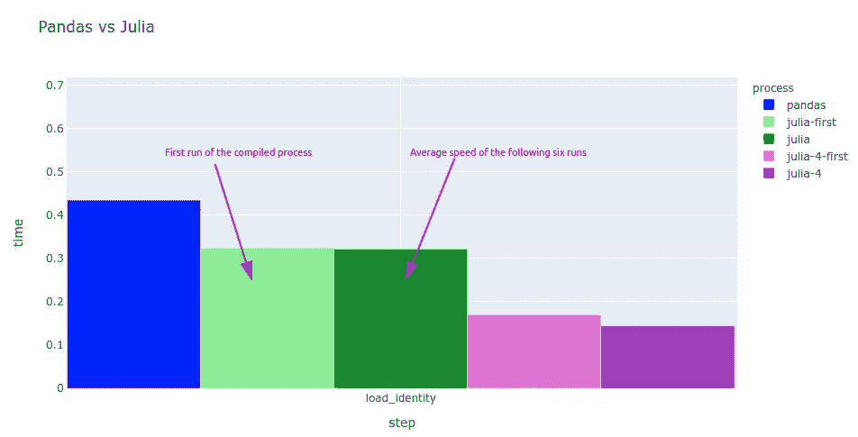

# 当数据集符合内存时，是否有比熊猫更好的东西？

> 原文：<https://towardsdatascience.com/is-something-better-than-pandas-when-the-dataset-fits-the-memory-7e8e983c4fe5?source=collection_archive---------9----------------------->

## 探索 Vaex，Dask，PySpark，摩丁和朱莉娅


图片作者。

表格格式仍然是最典型的存储数据的方式，可以说没有比 python 的熊猫更好的工具来探索数据表了。尽管熊猫的能力范围很广，但它也有局限性。在这种情况下，你必须选择另一种选择。然而，如果数据集能很好地适应你的记忆，放弃熊猫而使用另一个工具有意义吗？

Pandas 是一个方便的表格数据处理器，提供了多种方法来加载、处理和导出数据集为多种输出格式。熊猫可以处理大量的数据，但它受到你的电脑内存的限制。数据科学有一条黄金法则。如果数据适合内存，使用熊猫。**这个规则还有效吗？**

> 当数据适合您的电脑内存时，使用熊猫

熊猫替代品仅在以下情况下被推荐:

*   熊猫的加工过程很慢
*   数据不适合可用内存

让我们在一个中等规模的数据集上探索其中的几个替代方案，看看我们是否能获得任何好处，或者证实你只是使用熊猫，毫无疑问地睡觉。

你可以在 [GitHub](https://github.com/vaclavdekanovsky/data-analysis-in-examples/tree/master/DataFrames/Pandas_Alternatives) 上查看完整的代码

*   [pandas _ alternatives _ POC . ipynb](https://github.com/vaclavdekanovsky/data-analysis-in-examples/blob/master/DataFrames/Pandas_Alternatives/pandas_alternatives_POC.ipynb)—探索 dask、spark、vaex 和 modin
*   [julia_POC.ipynb](https://github.com/vaclavdekanovsky/data-analysis-in-examples/blob/master/DataFrames/Pandas_Alternatives/Julia_POC.ipynb) —探究 julia 和 julia 性能测试
*   [Performance_test.py](https://github.com/vaclavdekanovsky/data-analysis-in-examples/blob/master/DataFrames/Pandas_Alternatives/Performance_test.py) —运行 python perf。控制台中的测试
*   [Results _ and _ charts . ipynb](https://github.com/vaclavdekanovsky/data-analysis-in-examples/blob/master/DataFrames/Pandas_Alternatives/Results_and_Charts.ipynb)—处理性能测试日志并创建图表

# 熊猫替代品

让我们首先探讨反对熊猫替代品的论点。

1.  它们不像熊猫那样普遍
2.  文档、教程和社区支持较少

我们将逐一回顾几个备选方案，并比较它们的**语法、计算方法**和**性能**。我们再来看 [Dask](https://dask.org/) 、 [Vaex](https://vaex.io/docs/index.html) 、 [PySpark](https://spark.apache.org/docs/latest/api/python/index.html) 、 [Modin](https://modin.readthedocs.io/en/latest/) (全部用 python)和 [Julia](https://julialang.org/) 。这些工具可以分为三类:

*   并行/云计算— Dask、PySpark 和 Modin
*   内存高效— Vaex
*   不同的编程语言— Julia

## 数据集

对于每种工具，我们将使用 [Kaggle 欺诈检测数据集](https://www.kaggle.com/c/ieee-fraud-detection/data)来比较基本操作的速度。它包含两个文件`train_transaction.csv` (~700MB)和`train_identity.csv` (~30MB)，我们将加载、合并、聚合和排序这两个文件，看看性能有多快。我将在我的 4 核 16MB 内存的笔记本上进行这些操作。

> 我们将加载、合并、分类和汇总数据

# Dask 并行化数据帧

Dask 的主要目的是并行化任何类型的 python 计算——数据处理、并行消息处理或机器学习。如何分散计算的方法是使用计算机集群的能力。即使在单台 PC 上，利用多个处理内核，计算也可以运行得更快。

Dask 处理数据帧的模块方式通俗地称为[数据帧](https://docs.dask.org/en/latest/dataframe.html)。它的强大源于并行性，但您必须意识到这是有代价的:

1.  Dask API 没有熊猫的丰富
2.  结果必须具体化

## Dask 语法

Dask 的语法和熊猫很像。



Pandas 和 Dask 的语法比较。作者图片

如您所见，两个库中的许多方法完全相同。您会注意到 dask 基本上缺少排序选项。那是因为平行排序比较特殊。Dask 只提供了一种方法，那就是`set_index`。索引按定义排序。

这个想法是使用 Dask 来完成繁重的工作，然后将减少的和更小的数据集移动到 pandas 进行最后的润色。这就引出了第二个警告。Dask 结果必须用`.compute()`命令具体化。

正如您将在 [PySpark](#961e) 简介中看到的，dask 不会计算任何东西，直到系统提示它这样做。所有的步骤都准备好了，等待你的命令开始工作。

## 为什么我们需要计算()结果？

你可能会想，为什么我们不立即得到结果，就像你经营熊猫业务一样？原因很简单。Dask 主要用于数据不适合你的内存的情况，由于这个原因，初始操作的结果，比如一个巨大的数据帧的装载不能被具体化，因为你没有足够的内存来这样做。

这就是为什么您要准备计算步骤，然后让集群计算并返回一个更小的仅包含结果的集合。

```
# the dask code goes for example like this:
df = dd.read_csv(path)
d2 = dd.read_csv(path2)
re = df.merge(d2, on="col")
re = re.groupby(cols).agg(params).compute()
```

## Dask 性能

如何比较用于不同目的的两个平台的速度并不简单。结果也可能被数据扭曲。一个工具可以非常快速地合并字符串列，而另一个工具则擅长整数合并。

为了展示这些库有多快，我选择了 5 个操作，并比较了它们的速度。我重复了 7 次性能测试，我测得我的 cpu 和内存使用率从未超过 PC 的 50%(i7–5600 @ 2.60 GHz，16GB Ram，SSD 磁盘)。除了操作系统和性能测试之外，没有其他进程在运行。

*   `load_transactions` —读取约 700MB 的 CSV 文件
*   `load_identity` —读取约 30MB 的 CSV 文件
*   `merge` —在字符串列上连接这两个数据集
*   `aggregation` —对 6 列进行分组并计算总和与平均值
*   `sorting` —对合并数据集排序 3 次(如果库允许)



熊猫和达斯克的速度比较。在[中绘制图表。快递](/visualization-with-plotly-express-comprehensive-guide-eb5ee4b50b57)。图片作者。

看起来 Dask 加载 CSV 文件非常快，但原因是 Dask 的懒惰操作模式。加载被推迟，直到我在聚合期间具体化结果。这意味着 Dask 只准备加载和合并，但是与聚合一起执行。

Dask 很少支持排序。甚至官方的指导方针也说要运行并行计算，然后把计算出来的(和小得多的结果)传给熊猫。

即使我尝试`compute`read _ CSV 结果，Dask 在我的测试数据集上也慢了大约 30%。这只是证实了最初的假设，即 Dask 主要在数据集不适合内存的情况下是有益的。

# PySpark

这是用于 [Spark](https://spark.apache.org/) 的 python API，一个分析大数据引擎。Spark 在 [Hadoop](https://hadoop.apache.org/) 平台上发展，可能是最流行的云计算工具。它是用 Scala 编写的，但是 [pySpark](https://databricks.com/glossary/pyspark) API 中的许多方法可以让您在不损失 python 解释速度的情况下进行计算。

与 Dask 类似，首先定义所有操作，然后运行`.collect()`命令来具体化结果。还有比`collect`更多的选项，你可以在 [spark 文档中读到它们——动作](https://spark.apache.org/docs/latest/rdd-programming-guide.html#actions)。

## PySpark 语法

Spark 使用弹性分布式数据集(RDD)来执行计算，操作它们的语法与 pandas 非常相似。通常会有产生相同或相似结果的替代方案，如`sort`或`orderBy`方法。

开始时，您必须初始化 Spark 会话。然后，您可以使用 python API 准备这些步骤，或者您可以从 [Spark SQL](https://spark.apache.org/docs/latest/api/python/pyspark.sql.html) 中受益，并用 SQL 编写代码。



熊猫语法与 PySpark 的比较。图片作者。

> 想试的话不一定要装 Spark，因为 PySpark 包自带了一个 spark 实例。不过，你必须在你的电脑上安装 java。

## 火花性能

使用我在 [Dask](#a5b0) 部分描述的 pySpark 运行了相同的性能测试，结果是相似的。



熊猫和 pyspark 的速度对比。图片作者。

不同之处在于，spark 读取 csv 的一部分，以便推断数据帧的模式。在这种情况下，将整个数据集加载到熊猫上会花费更多的时间。

Spark 是一个巨大的计算平台，利用大集群的力量从庞大的数据集获得洞察力。在相对较小的数据上使用 spark 不会产生预期的速度提升。

# Vaex

到目前为止，我们已经看到了在更多的计算机核心和集群中的许多计算机之间分配工作的平台。对于符合记忆的数据集，他们通常不能打败熊猫。Vaex 的目标就是这样做。

创建这个库是为了让数据集的基本分析速度快得惊人。Vaex 不支持 pandas 的全部功能，但它可以非常快速地计算基本统计数据并创建一些图表类型。

## Vaex 语法

熊猫和 vaex 语法没有太多区别。



熊猫和 Vaex 语法的比较。图片作者。

## Vaex 性能

与前两个工具不同，Vaex 的速度与示例数据集上的 pandas 相似，在某些领域甚至更快。



熊猫和 vaex 的速度比较。图片作者。

通常你会和熊猫相处得很好，但是有时候你会很纠结，这时就该试试 vaex 了。在本文中， [Jonathan Alexander 做了一个更大的性能测试](/beyond-pandas-spark-dask-vaex-and-other-big-data-technologies-battling-head-to-head-a453a1f8cc13)，以发现 Vaex 可以击败其他方法。它主要是主人加入。

# 朱莉娅

Julia 在数据科学社区有点受欢迎。它被预言有一个宏伟的未来，尽管突破还没有发生。然而，也有很多人喜欢上了[茱莉亚](https://julialang.org/)处理事情的方式。我是其中之一。

与 python 相反，Julia 是一种[编译的](https://en.wikipedia.org/wiki/Compiled_language)语言。这通常会带来更好的性能。这两种语言都在 Jupyter notebook 中运行，这就是 Julia 在数据科学概念证明中受欢迎的原因。

## Julia 语法

Julia 是专门为数学家和数据科学家开发的。你可以在[我们为什么创建 Julia 的文章](https://julialang.org/blog/2012/02/why-we-created-julia/)中读到 Julia 结合了许多现有编程语言的好处。

尽管 Julia 是一种不同的语言，但它以 pythonic 的方式做很多事情。最重要的是，它会在适当的时候使用自己的技巧。我喜欢确定这是一个可变操作的符号。优雅小巧(相比熊猫的`inplace=True`)。

另一方面，在 python 中，许多东西都发展了一种首选的超时处理方式。朱莉娅经常提供几种方法来做最基本的事情，比如阅读 csv 文件。从 1.0 版本开始，语法就相当稳定，但是您最喜欢的方法将来可能会被弃用。

让我们比较一下 pandas 和 julia 中的数据加载、合并、聚合和排序。



Pandas 和 Julia 语法的比较。图片作者。

让我们看看朱莉娅的数据帧是否能打败熊猫。

## 朱莉娅表演

考虑到朱莉娅的速度不是那么简单。当你第一次运行 Julia 代码时，即时编译器需要把它翻译成计算机语言，这需要一些时间。这就是为什么任何代码的第一次运行都比后续运行花费更长的时间。

在下面的图表中，您可以看到第一次运行明显长于其余六次测量的平均值。我还尝试在单核(`julia`)和四核(`julia-4`)上运行 Julia。



熊猫和茱莉亚的数据处理速度比较。在[中绘制图表。快递](/visualization-with-plotly-express-comprehensive-guide-eb5ee4b50b57)。图片作者。

> 您可以通过将环境变量`[JULIA_NUM_THREADS](https://docs.julialang.org/en/v1/manual/environment-variables/#JULIA_NUM_THREADS)`设置为您想要使用的内核数量来运行更多内核的 julia。从 1.5 开始，你可以通过`julia -t n`或`julia --threads n`来启动 julia，其中 n 是期望的内核数量。

使用更多内核进行处理通常会更快，julia 非常支持开箱即用的并行化。您可能会担心编译速度，但您不必担心。代码编译一次，改变参数不会强制重新编译。编译完`CSV.read(joinpath(folder,file), DataFrame)`之后，即使你改变了源文件的路径，下面的调用也不会被编译。这就是为什么您在`load_identity`步骤中看不到任何延迟，因为 CSV 读数之前已经编译过了。



当我们运行已经用另一个参数编译过的 csv_read 时，它不会被重新编译。图片作者。

# 摩丁

在我们结束关于熊猫替代品的讨论之前，我必须提一下摩丁图书馆。其作者声称，摩丁利用并行性来加速熊猫 80%的功能。不幸的是，我很难看到这些好处。有时它会在初始导入命令期间中断。在其他场合，摩丁说:“不支持，默认为熊猫”，尽管操作最终崩溃，留下 4 个 python 进程，每个进程消耗大量内存。后来花了一些时间来终止这些进程。

我必须说，我喜欢摩丁背后的想法，我希望有一天这些差距将被覆盖，这将提升摩丁到一个值得考虑的替代位置。

# 结论

我们已经探索了几种流行的 pandas 替代品，以发现如果数据集足够小，可以放入内存，使用其他东西是否有意义。

没有一个并行计算平台能在速度上打败熊猫。考虑到它们更复杂的语法、额外的安装要求和缺乏一些数据处理能力，这些工具不再是 pandas 的理想替代品。

Vaex 显示了在数据探索期间加速某些任务的潜力。随着数据集越来越大，这种优势会变得更加显著。

Julia 的开发考虑到了数据科学家的需求。它可能不会像熊猫一样受欢迎，也可能不会像熊猫一样提供所有的特技。对于某些操作，它可以提供性能提升，而且我必须说一些代码在 julia 中更优雅。即使 Julia 没有进入前 20 种最流行的编程语言，我想它是有前途的，如果你关注它的发展，你就不会犯错误。

你喜欢这篇文章吗，看看我写的其他教程:

*   [如何持久保存熊猫数据帧的替代方法](/stop-persisting-pandas-data-frames-in-csvs-f369a6440af5)
*   [演示如何使用折线图](/highlighted-line-chart-with-plotly-express-e69e2a27fea8)
*   [将地址列表转换成地图](/pythons-geocoding-convert-a-list-of-addresses-into-a-map-f522ef513fd6)