# 那种红酒够好吗？

> 原文：<https://towardsdatascience.com/is-that-red-wine-good-enough-49326a4c08e4?source=collection_archive---------40----------------------->

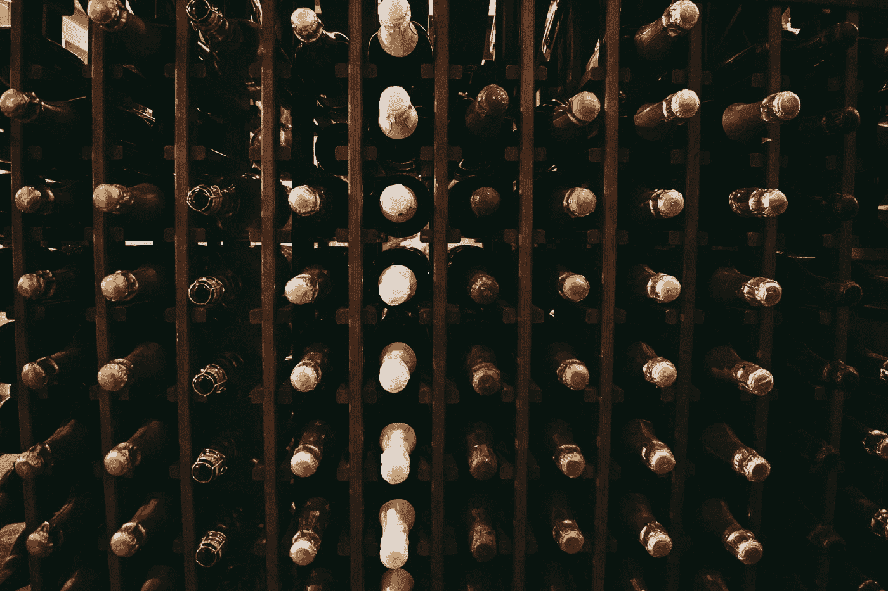

[*资料来源:陈彦蓉/Unsplash*](https://unsplash.com/photos/LffQyvibxUs)

## 介绍预测建模的基本工作流程并演示如何记录该过程的介绍性教程。

让我们假设我们被一个酿酒厂雇佣来建立一个预测模型来检查他们红酒的质量。传统的葡萄酒检测方法是由人类专家来完成的。因此，该过程容易出现人为错误。目标是建立一个生产葡萄酒测试客观方法的流程，并将其与现有流程相结合，以减少人为错误。

为了建立预测模型，我们将使用 UCI 机器学习库提供的数据集。我们将尝试根据与葡萄酒相关的特征来预测葡萄酒的质量。

**目标:**

*   探索数据
*   预测葡萄酒质量(二元分类)
*   浏览模型结果

# 探索数据

**加载数据，库和主浏览数据**

```
# libraries
library(dplyr)
library(ggplot2)
library(caTools)
library(caret)
library(GGally) dataFrame = read.csv("https://archive.ics.uci.edu/ml/machine-learning-databases/wine-quality/winequality-red.csv", sep = ';')summary(dataFrame)##  fixed.acidity   volatile.acidity  citric.acid    residual.sugar  
##  Min.   : 4.60   Min.   :0.1200   Min.   :0.000   Min.   : 0.900  
##  1st Qu.: 7.10   1st Qu.:0.3900   1st Qu.:0.090   1st Qu.: 1.900  
##  Median : 7.90   Median :0.5200   Median :0.260   Median : 2.200  
##  Mean   : 8.32   Mean   :0.5278   Mean   :0.271   Mean   : 2.539  
##  3rd Qu.: 9.20   3rd Qu.:0.6400   3rd Qu.:0.420   3rd Qu.: 2.600  
##  Max.   :15.90   Max.   :1.5800   Max.   :1.000   Max.   :15.500  
##    chlorides       free.sulfur.dioxide total.sulfur.dioxide    density      
##  Min.   :0.01200   Min.   : 1.00       Min.   :  6.00       Min.   :0.9901  
##  1st Qu.:0.07000   1st Qu.: 7.00       1st Qu.: 22.00       1st Qu.:0.9956  
##  Median :0.07900   Median :14.00       Median : 38.00       Median :0.9968  
##  Mean   :0.08747   Mean   :15.87       Mean   : 46.47       Mean   :0.9967  
##  3rd Qu.:0.09000   3rd Qu.:21.00       3rd Qu.: 62.00       3rd Qu.:0.9978  
##  Max.   :0.61100   Max.   :72.00       Max.   :289.00       Max.   :1.0037  
##        pH          sulphates         alcohol         quality     
##  Min.   :2.740   Min.   :0.3300   Min.   : 8.40   Min.   :3.000  
##  1st Qu.:3.210   1st Qu.:0.5500   1st Qu.: 9.50   1st Qu.:5.000  
##  Median :3.310   Median :0.6200   Median :10.20   Median :6.000  
##  Mean   :3.311   Mean   :0.6581   Mean   :10.42   Mean   :5.636  
##  3rd Qu.:3.400   3rd Qu.:0.7300   3rd Qu.:11.10   3rd Qu.:6.000  
##  Max.   :4.010   Max.   :2.0000   Max.   :14.90   Max.   :8.000
```

从特征上看，我们认为“质量”是我们的目标特征。我们总共有 11 个特征用作预测器。

# 探索特性

## 转换目标特征

由于我们将讨论分类模型，我们将把我们的目标特征从连续类转换成二进制类。这样我们就能适应一个广泛使用但非常简单的分类模型。

*原始目标特征标签的分布*

```
# checking ratio of different labels in target feature
prop.table(table(dataFrame$quality)## 
##           3           4           5           6           7           8 
## 0.006253909 0.033145716 0.425891182 0.398999375 0.124452783 0.011257036dataFrame = dataFrame %>%
  mutate(quality_bin = as.factor(ifelse(quality <= 5, 0,1))) %>%
  select(-quality) p = round(prop.table(table(dataFrame$quality_bin))*100,2)
```

经过改造后，我们有 53.47%的案例被归类为好酒，而 46.53%的案例被归类为劣酒。

我们在这里有一个很好的目标类分布！这很好。否则，我们将不得不处理*数据平衡*。虽然我们不会在本教程中讨论这个领域，但这是一个很好的讨论领域。所以对于那些将要了解它的人来说，这是额外的加分！

简而言之，我们希望**在我们的目标特征**中有一个来自不同标签的观察值的平衡分布。否则，一些 ML 算法会过度拟合。

# 可视化探索预测器

**探索酸度**

```
dataFrame %>%
  ggplot(aes(x = as.factor(quality_bin), y = fixed.acidity, color = quality_bin)) +
  geom_boxplot(outlier.color = "darkred", notch = FALSE) +
  ylab("Acidity") + xlab("Quality (1 = good, 2 = bad)") + 
  theme(legend.position = "none", axis.title.x = element_blank()) + 
  theme_minimal()
```

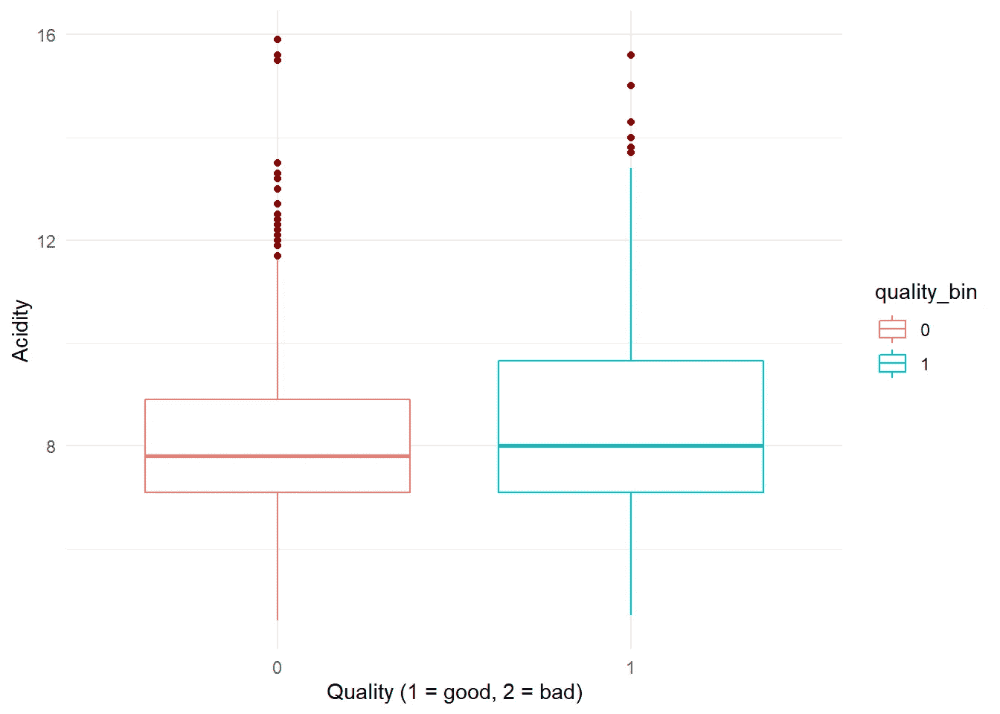

我们有多个连续的特征，可以用相似的方式绘制出来。这意味着我们将不得不一次又一次地重写我们刚刚在代码块中写的代码:viz _ acidity。在编码中，我们不想那样做。因此，我们将创建一个函数，并将其包装在我们的代码中，以便将来可以重用它！

如果听起来太多，就坚持下去。一旦你看到代码，它会变得更有意义。

```
# boxplot_viz
# plots continuous feature in boxplot categorized on the quality_bin feature labels from dataFrame 
# @param feat Feature name (string) to be plotted
boxplot_viz = function(feat){ dataFrame %>%
    ggplot(aes_string(x = as.factor('quality_bin'), y = feat, color = 'quality_bin')) +
    geom_boxplot(outlier.color = "darkred", notch = FALSE) +
    labs(title = paste0("Boxplot of feature: ", feat)) + ylab(feat) + xlab("Quality (1 = good, 2 = bad)") + 
    theme(legend.position = "none", axis.title.x = element_blank()) + 
    theme_minimal()
}boxplot_viz('volatile.acidity')
```

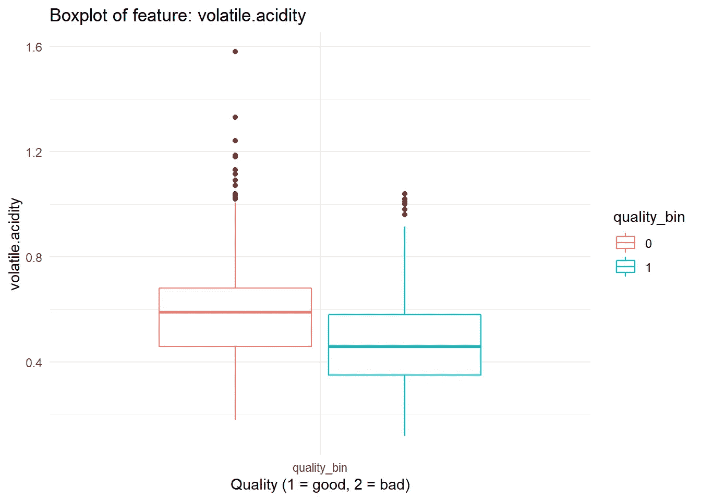

```
for (i in names(dataFrame %>% select(-'quality_bin'))){
  print(boxplot_viz(i))
}
```

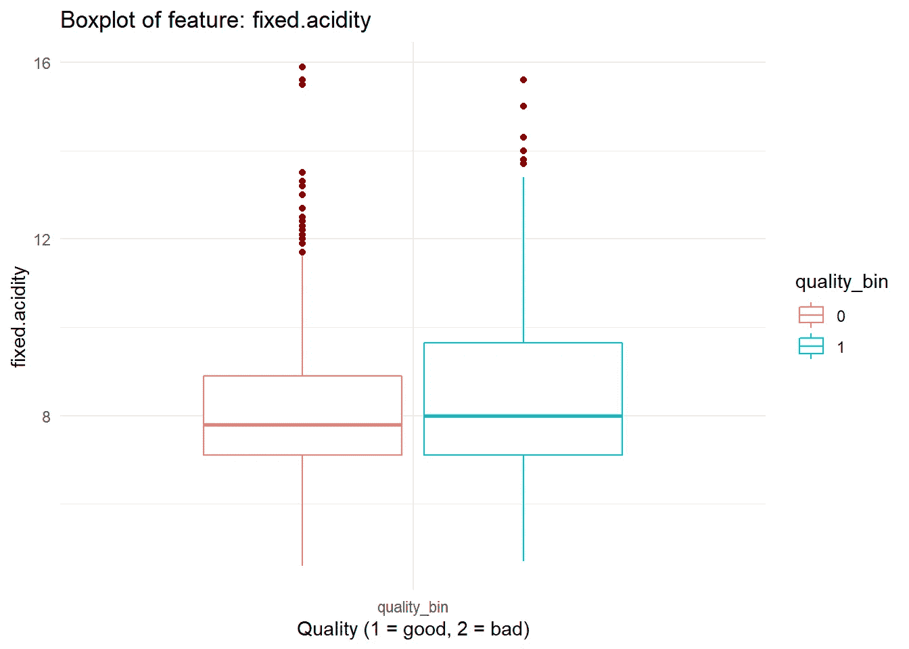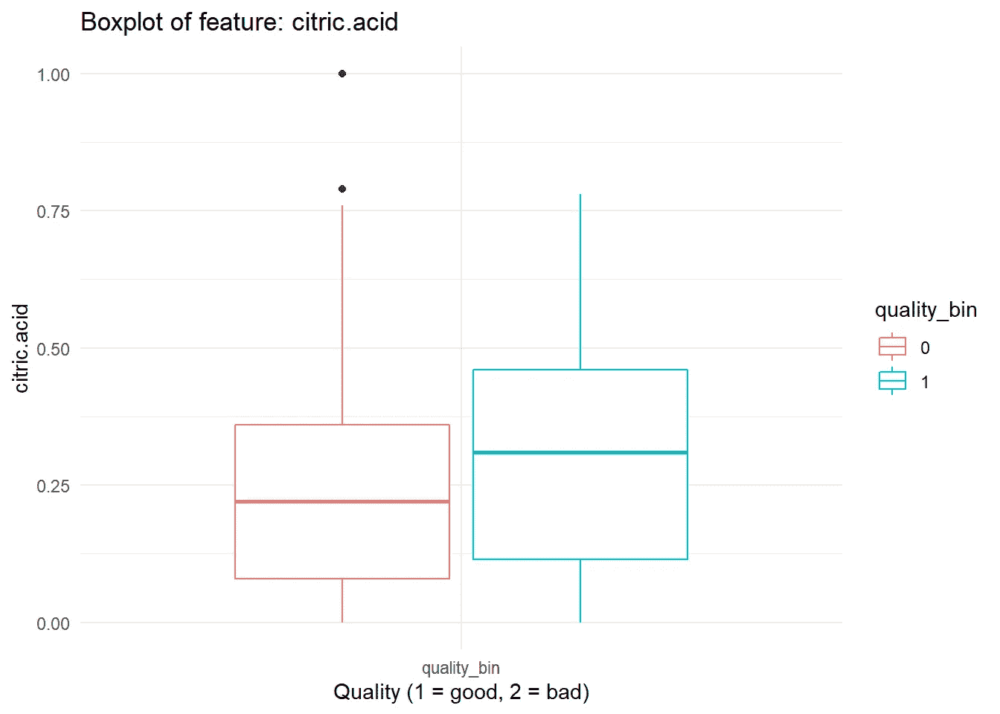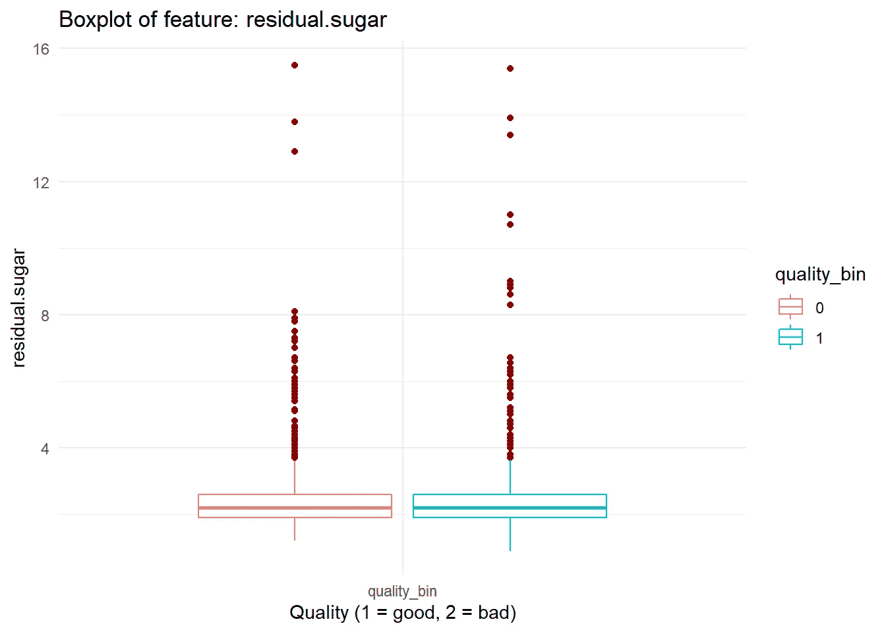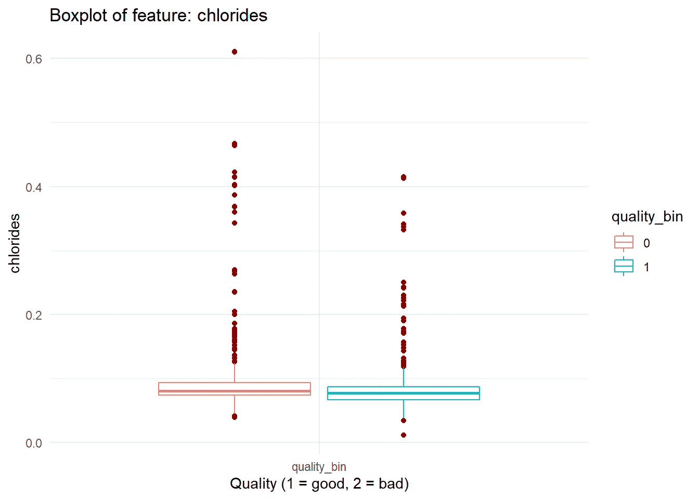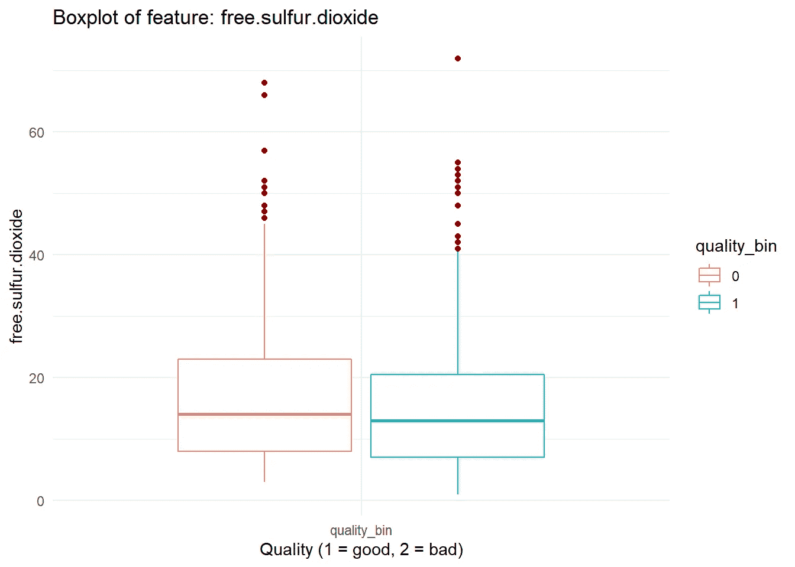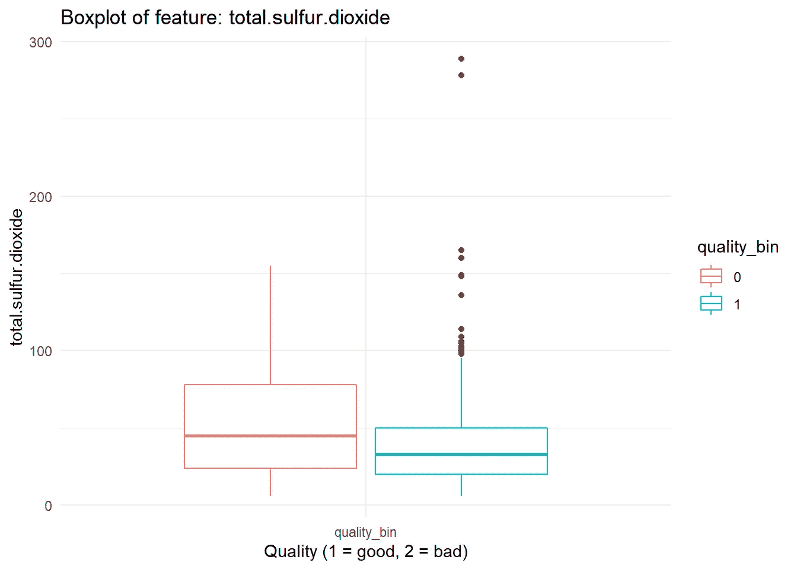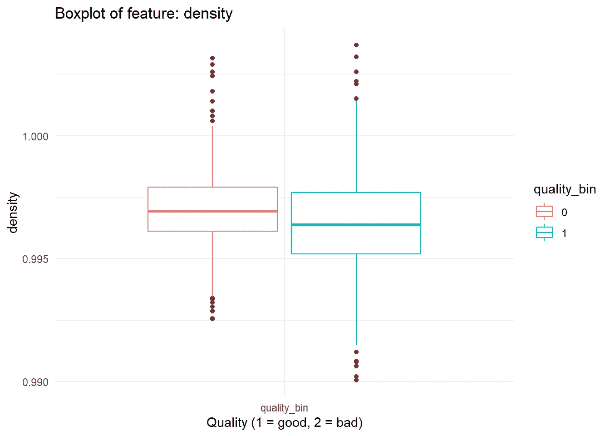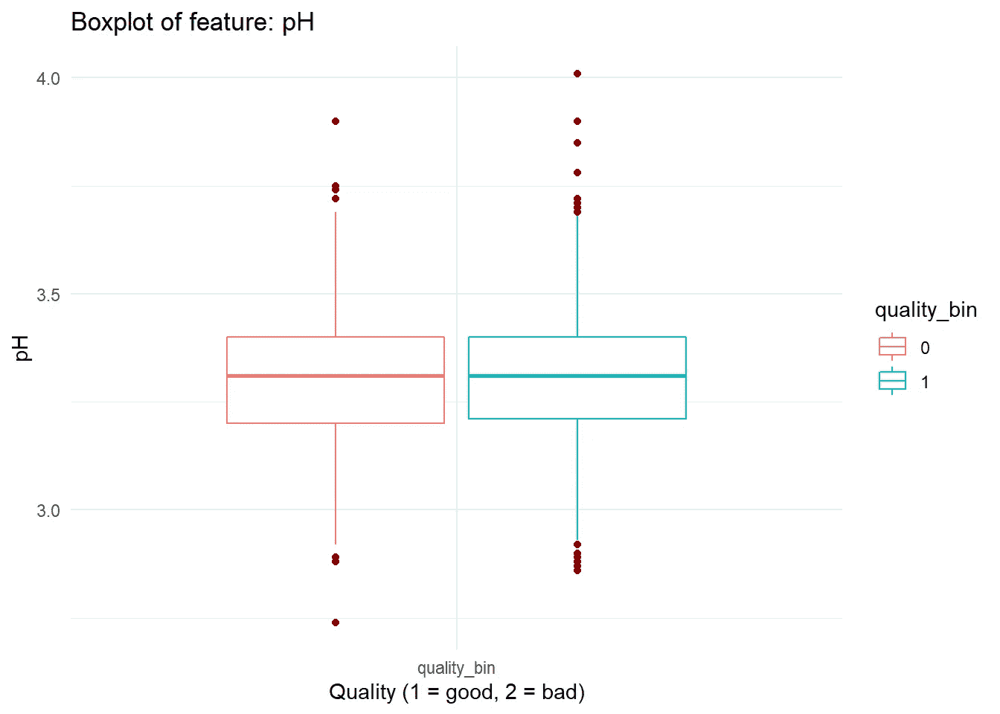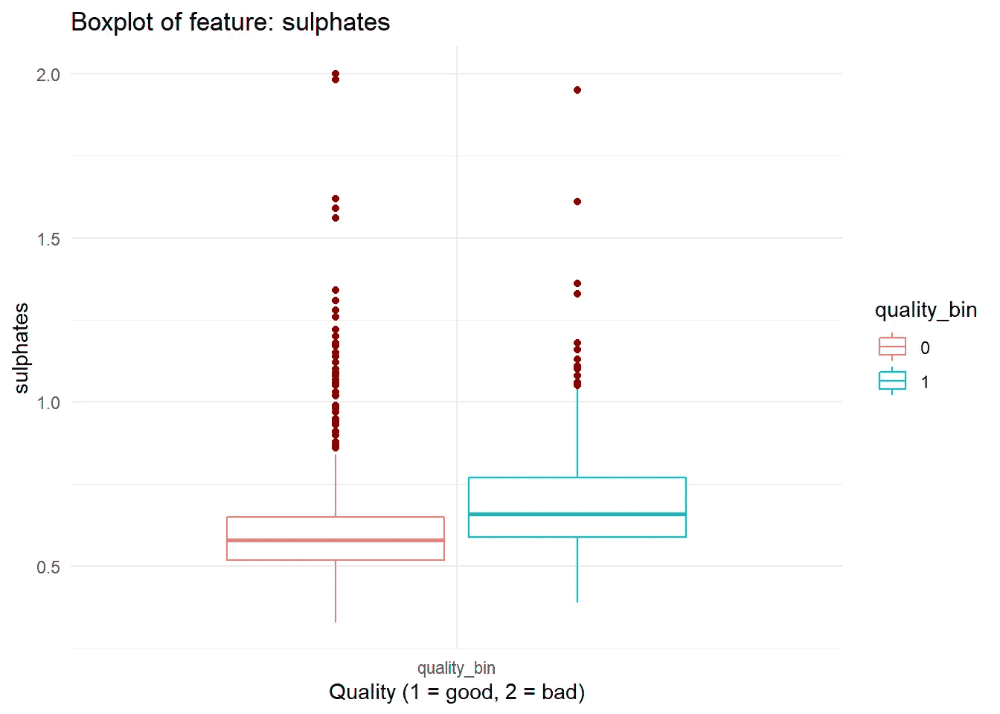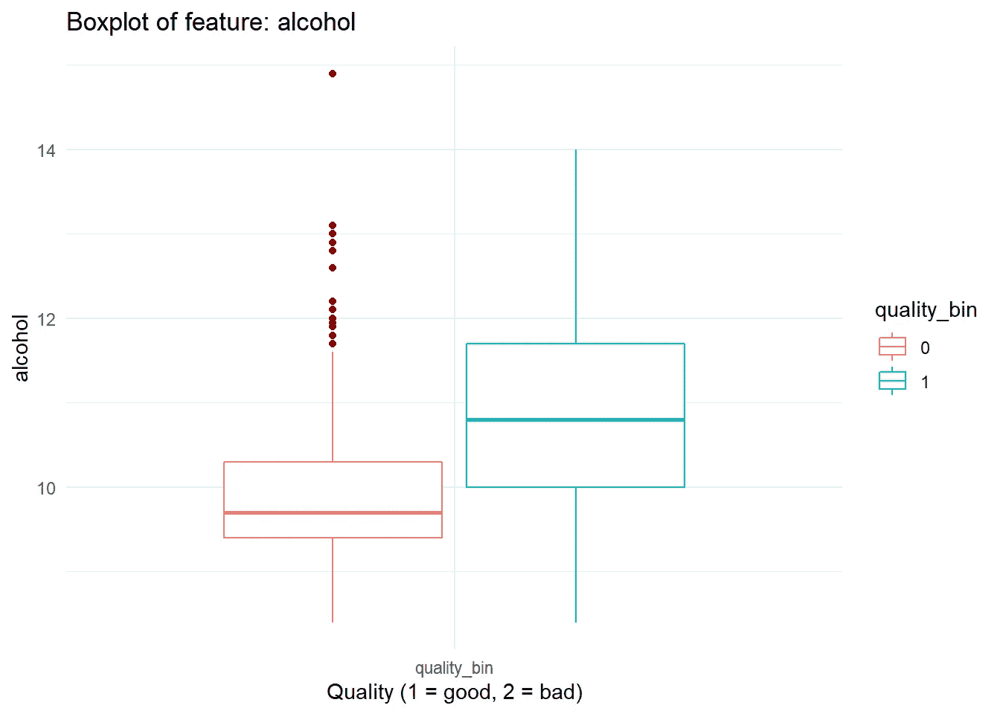

# 检查相关性

我们可以快速检查我们预测者之间的相关性。

```
dataFrame %>% 
  # correlation plot 
  ggcorr(method = c('complete.obs','pearson'), 
         nbreaks = 6, digits = 3, palette = "RdGy", label = TRUE, label_size = 3, 
         label_color = "white", label_round = 2)
```

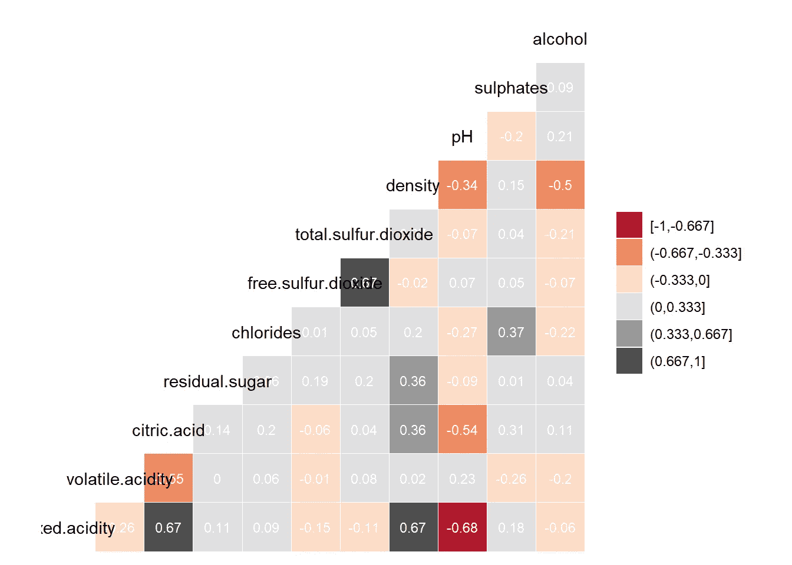

高度相关的特征不会向模型添加新的信息，并且模糊了单个特征对预测器的影响，因此难以解释单个特征对目标特征的影响。这个问题叫做**多重共线性**。一般来说，我们不想保留相关性非常高的特征。

*   相关性的阈值应该是多少？
*   我们如何决定丢弃哪个变量？
*   相关特征会损害预测准确性吗？

所有这些都是很好的问题，值得好好了解。所以，对于那些将要学习的人来说，再一次加分！

在基于相关性做出任何决定之前，检查特征的分布。除非任意两个特征有线性关系，否则相关性意义不大。

# 特征工程

根据从数据探索中获得的见解，可能需要转换某些要素或创建新要素。一些常见的特征工程任务有:

*   特征的规范化和标准化
*   宁滨连续特征
*   创建复合特征
*   创建虚拟变量

本教程不会涵盖*特征工程*，但这是一个很好的探索领域。在拟合任何预测模型之前，在必要的特征工程之后进行大量的数据探索是绝对必要的先决条件！

# 拟合模型

## 拆分数据

在现实世界中，我们根据被称为**训练数据**的历史数据训练我们的预测模型。然后，我们将该模型应用于新的未知数据，称为**测试数据**，并测量性能。因此，我们可以确定我们的模型是稳定的，或者没有过度拟合训练数据。但是由于我们无法访问新的葡萄酒数据，我们将按照 80:20 的比例将数据集分成训练和测试数据。

```
set.seed(123)
split = sample.split(dataFrame$quality_bin, SplitRatio = 0.80)
training_set = subset(dataFrame, split == TRUE)
test_set = subset(dataFrame, split == FALSE)
```

让我们检查一下训练和测试数据中的数据平衡。

```
prop.table(table(training_set$quality_bin))## 
##         0         1 
## 0.4652072 0.5347928prop.table(table(test_set$quality_bin))## 
##        0        1 
## 0.465625 0.534375
```

# 训练数据的拟合模型

我们将在数据集上拟合**逻辑回归**分类模型。

```
model_log = glm(quality_bin ~ ., 
                data = training_set, family = 'binomial')
summary(model_log)## 
## Call:
## glm(formula = quality_bin ~ ., family = "binomial", data = training_set)
## 
## Deviance Residuals: 
##     Min       1Q   Median       3Q      Max  
## -3.3688  -0.8309   0.2989   0.8109   2.4184  
## 
## Coefficients:
##                        Estimate Std. Error z value Pr(>|z|)    
## (Intercept)           17.369521  90.765368   0.191  0.84824    
## fixed.acidity          0.069510   0.112062   0.620  0.53507    
## volatile.acidity      -3.602258   0.558889  -6.445 1.15e-10 ***
## citric.acid           -1.543276   0.638161  -2.418  0.01559 *  
## residual.sugar         0.012106   0.060364   0.201  0.84106    
## chlorides             -4.291590   1.758614  -2.440  0.01467 *  
## free.sulfur.dioxide    0.027452   0.009293   2.954  0.00314 ** 
## total.sulfur.dioxide  -0.016723   0.003229  -5.180 2.22e-07 ***
## density              -23.425390  92.700349  -0.253  0.80050    
## pH                    -0.977906   0.828710  -1.180  0.23799    
## sulphates              3.070254   0.532655   5.764 8.21e-09 ***
## alcohol                0.946654   0.120027   7.887 3.10e-15 ***
## ---
## Signif. codes:  0 '***' 0.001 '**' 0.01 '*' 0.05 '.' 0.1 ' ' 1
## 
## (Dispersion parameter for binomial family taken to be 1)
## 
##     Null deviance: 1766.9  on 1278  degrees of freedom
## Residual deviance: 1301.4  on 1267  degrees of freedom
## AIC: 1325.4
## 
## Number of Fisher Scoring iterations: 4
```

让我们绘制 p 值最低/绝对 z 值最高的变量。

```
p = varImp(model_log) %>% data.frame() 
p = p %>% mutate(Features = rownames(p)) %>% arrange(desc(Overall)) %>% mutate(Features = tolower(Features))p %>% ggplot(aes(x = reorder(Features, Overall), y = Overall)) + geom_col(width = .50, fill = 'darkred') + coord_flip() + 
  labs(title = "Importance of Features", subtitle = "Based on the value of individual z score") +
  xlab("Features") + ylab("Abs. Z Score") + 
  theme_minimal()
```

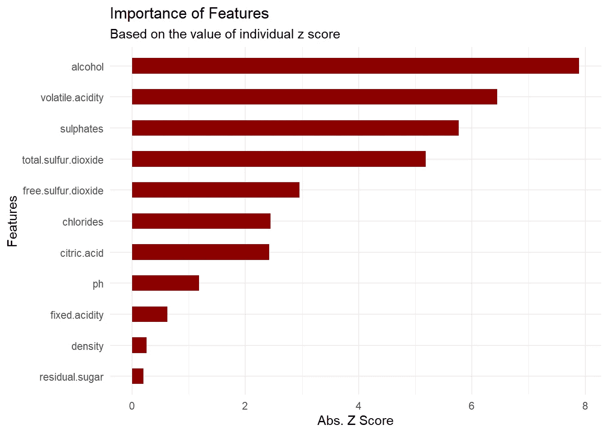

# 检查模型性能

我们将通过在我们以前看不到的测试数据上运行来检查我们的模型表现如何。我们将比较预测结果和实际结果，并计算一些常用的二元分类模型性能测量指标。

```
# predict target feature in test data
y_pred = as.data.frame(predict(model_log, type = "response", newdata = test_set)) %>% 
  structure( names = c("pred_prob")) %>%
  mutate(pred_cat = as.factor(ifelse(pred_prob > 0.5, "1", "0"))) %>% 
  mutate(actual_cat = test_set$quality_bin)p = confusionMatrix(y_pred$pred_cat, y_pred$actual_cat, positive = "1")
p## Confusion Matrix and Statistics
## 
##           Reference
## Prediction   0   1
##          0 108  46
##          1  41 125
##                                           
##                Accuracy : 0.7281          
##                  95% CI : (0.6758, 0.7761)
##     No Information Rate : 0.5344          
##     P-Value [Acc > NIR] : 9.137e-13       
##                                           
##                   Kappa : 0.4548          
##                                           
##  Mcnemar's Test P-Value : 0.668           
##                                           
##             Sensitivity : 0.7310          
##             Specificity : 0.7248          
##          Pos Pred Value : 0.7530          
##          Neg Pred Value : 0.7013          
##              Prevalence : 0.5344          
##          Detection Rate : 0.3906          
##    Detection Prevalence : 0.5188          
##       Balanced Accuracy : 0.7279          
##                                           
##        'Positive' Class : 1               
##
```

**模型性能总结:**

*   **准确率** : 72.81%的葡萄酒样本被正确分类。
*   **灵敏度/召回率** : 73.1%的实际好酒样本被正确分类。
*   **Pos Pred 值/精度**:总好酒预测的 75.3%是实际好酒。

# 概要洞察

让我们总结一下我们从练习中学到的关于葡萄酒测试的知识:

*   酒精含量、挥发性酸度、硫酸盐和总二氧化硫是影响葡萄酒质量的四个最重要的统计学特征。
*   给定我们分析的 11 个特征的信息，我们可以在大约 73%的情况下准确预测葡萄酒质量，
*   这比使用传统的基于专家的方法获得的准确度高大约 26%。

人们能区分 5 度以下的葡萄酒和 10 度以上的葡萄酒，对于白葡萄酒只有 53%的可能性，对于红葡萄酒只有 47%的可能性


# 感谢阅读！

通过阅读这篇文章，您应该对 R 中的函数是如何工作的有一个基本的了解，以及如何在您的个人生活中使用它！

**不确定接下来该读什么？我为你挑选了另一篇文章:**

<https://curious-joe.medium.com/have-r-look-after-your-stocks-8462af2ee3c1>  

# 阿拉法特·侯赛因

*   ***如果你喜欢这个，*** [***跟我上媒***](https://medium.com/@curious-joe) ***了解更多***
*   ***让我们连线上*** [***领英***](https://www.linkedin.com/in/arafath-hossain/)
*   ***有兴趣合作吗？查看我的*** [***网站***](https://curious-joe.net/)