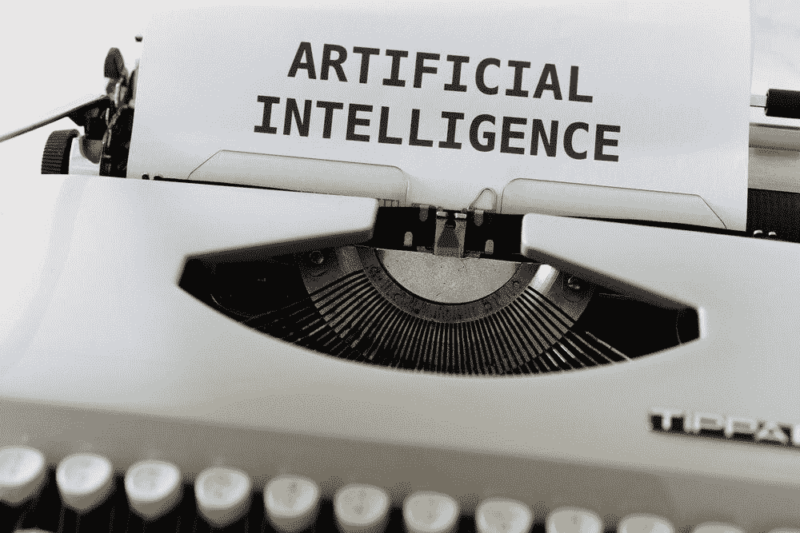

# AI 的民主化好不好？

> 原文：<https://towardsdatascience.com/is-the-democratization-of-ai-good-1bdb2ce563d8?source=collection_archive---------38----------------------->

## *一篇关于 AI 民主化是否对网络有益的观点和讨论文章*

图片来自 Unsplash，作者[马库斯·温克勒](https://unsplash.com/photos/tGBXiHcPKrM)

在现代教育时代，几乎任何有网络连接的人都可以学习他们想学的任何东西。学习 AI 也是如此，现在，任何具备必备背景的人都有机会学习 AI 并构建 AI 程序。当我说“民主化”时，我指的是容易获得人工智能教育和学习，更重要的是，容易获得建立可扩展的人工智能应用程序。在我今年夏天早些时候写的一篇文章中，我讨论了我在人工智能伦理方面的个人经历，以及我如何不重视我的工作的意义。那篇文章在这里:

 [## 论人工智能应用的严肃性

### 一个关于理解人工智能项目背后的影响和伦理的故事和信息

towardsdatascience.com](/on-the-seriousness-of-ai-applications-f512fd3ced56) 

我总是听说任何一种学习的民主化都是有益的，这一点我大体上同意。这也延伸到了人工智能，对于我人工智能职业生涯的主要部分，我完全同意。我是一名高中生，直到 11 个月前才开始学习微积分课程。然而，到那时为止，我已经在人工智能方面取得了很大进步，因为我可以从免费的 Youtube 视频和在线项目中学习。然而，在这一点上，在考虑了我和其他人是如何使用 AI 后，我的强烈意见有些动摇。虽然老实说，我对这个话题没有固定的看法，但在这篇文章中，我将讨论我认为 AI 民主化的一些主要好处，更重要的是，一些缺点是什么，因为我相信许多人都不会谈论它。

# 好人

我会尽量缩短这一部分。显然，有太多的理由说明让这么多的人能够接触到人工智能是有益的。首先，它为人们提供了学习和建立职业生涯的机会，这是他们以前从未有过的。对于那些可能没有机会接受正规教育的人来说，训练营、Coursera 课程和谷歌的认证是人们进入人工智能和寻找工作机会的绝佳选择。此外，它允许像我这样的年轻开发人员建立对人工智能的兴趣，并在大学里追求它。

最重要的是，人工智能的民主化为未来几十年创造了一大批人工智能工程师、研究人员和开发人员。这一点很重要，因为只有在历史上，我们才能向如此年轻的人传授如此复杂的概念。这无疑应该会加速 AI 的成长，并帮助它融入我们社会的更多部分。然而，有人担心我们将这些新的人工智能系统融入我们日常生活的速度有多快。虽然我可以举出更多的好处，但我会在这里停下来，因为我想你已经明白了。在我看来，更重要但讨论较少的是人工智能易于使用的一些负面影响。

# 坏事

老实说，人工智能的可访问性没有太多的负面影响，然而，主要的和明显的一个是伦理问题。

作为一名年轻的开发人员，我的工作在 AI 社区经常被视为噱头。虽然社区中的退伍军人经常过度赞扬我的工作，但有时他们并不重视我的理解和工作。当我试图启动真正的应用程序或对我的工作产生真正的影响时，这导致了重大问题。正如我在上面链接的文章中所描述的，许多人伸出手来，警告我关于我工作的道德问题。问题是我不理解道德规范，也不愿意去想它。

一个主要问题是，几乎每门初级人工智能课程，包括我自己的课程，都讨论了人工智能可以在哪些领域实施，这些领域存在重大的伦理问题，例如医疗保健。对于开始学习人工智能的年轻孩子来说，他们相信他们可以创建人工智能系统用于真实的系统，让他们忘乎所以。对于渴望和驱动的年轻头脑，他们不会接受否定的答案，会直接进入一个项目，而不考虑伤害。这正是我所做的。这就是我害怕民主化的原因，因为它将人工智能交给了那些可能不理解他们在建设什么以及为什么他们的工作有潜在危险的人。虽然这只是我为数不多的保留意见之一，但却是非常重要的，应该予以考虑。

这就提出了一个问题，人们应该从什么时候开始接触人工智能？我相信它可以在大学早期，但老实说，这是一个具有挑战性的问题来回答。一个更好的解决方案是在任何人工智能课程或课程表中包含多个伦理课程。这将是一门课程的第一课，这样学生们才能确切地了解人工智能伦理是什么，以及它们为什么如此重要。这将加强学生的谨慎和责任感，从而解决这个问题。

另一个主要问题是缺乏理解。快速浏览 Coursera，可以发现很多 AI 课程只注重开发，没有理论。这意味着学习人工智能的新人只是在学习如何用 Keras 和 PyTorch 编写神经网络代码，而不理解它背后的任何理论。我很快就成为这个陷阱的受害者，我希望在不久的将来写下这段经历。这是 AI 社区的一个主要问题，因为它创造了没有适当技术背景的工程师。如果理论在开始时没有被恰当地教授，那么以后就很难恰当地执行它，因为它是一个基础。因此，一旦新的人工智能开发人员进入就业市场，他们是较弱的候选人，如果他们被雇用，人工智能的进步就会停止。为了让人工智能以它需要的速度发展，我们需要恰当有效地教导新的开发者。

这是人工智能民主化的两大负面，主要是因为我亲眼看到和经历了这些。如果你有任何其他的担忧，请在评论中告诉我，这样我们就可以讨论它们了。

# 最后的想法

我真诚地相信人工智能的民主化对网络是有益的。如果它不存在，我就写不出这篇文章。我实际上只有 17 岁，就在几十年前，这么年轻的人对如此先进的课题如此了解是不可思议的。但现在，在 2021 年，我很难称得上是独一无二的，有些比我年轻的学生知道的甚至比我还多。我认为我们面临的关于人工智能民主化的主要问题可以很容易地解决，只需要那些建立这个机构的人的正确认识和努力。但是现在，我会尽我最大的努力来防止我自己和我周围的人落入阻碍人工智能发展的陷阱。希望这篇文章能让合适的人看到，并帮助他们改变心态。