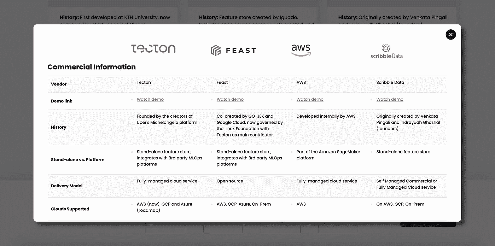
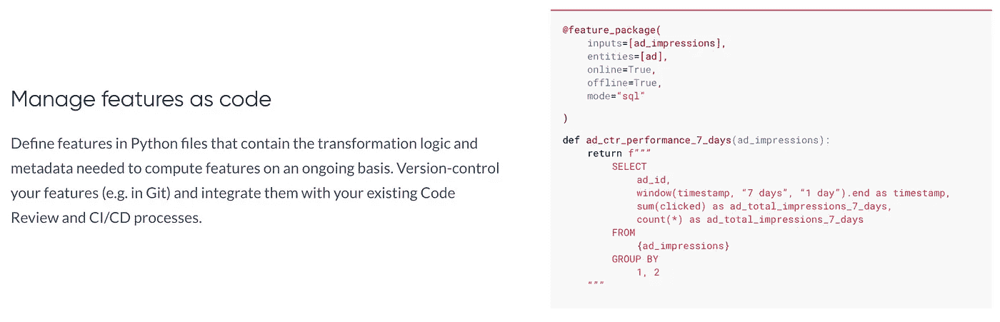
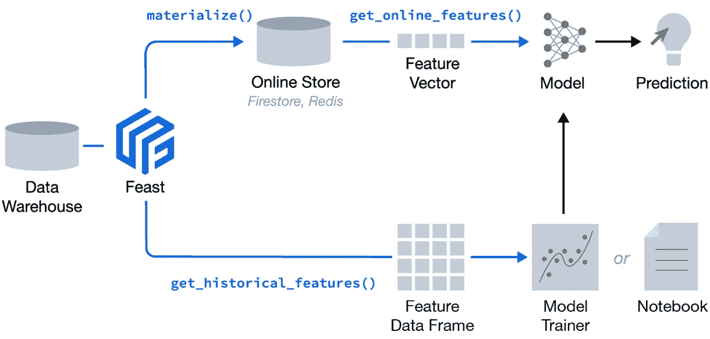

# 彩虹之上有特色店吗？

> 原文：<https://towardsdatascience.com/is-there-a-feature-store-over-the-rainbow-291cab94e8a5?source=collection_archive---------6----------------------->

## 如何为您的使用案例选择合适的功能库

图片由叶夫根尼·切博塔列夫通过[像素](https://www.pexels.com/)拍摄

在一个蓬勃发展的 SaaS 垂直市场中艰难地选择任何工具，让我想起了《绿野仙踪》中的那首歌*—*—*越过彩虹*——这首歌最初由朱迪·加兰演唱，但被夏威夷活动家伊斯雷尔·kamakawiwoʻole.完美翻唱

> 在彩虹之上的某个地方，天空是蓝色的，你敢于梦想的梦想真的会实现
> 
> 有一天我会对着星星许愿，醒来时发现乌云已经离我远去，烦恼就像柠檬汁一样融化了

所以，是的，我们很容易感觉像多萝西在寻找传说中的*特色商店*！但是，任何旅程都是这样开始的，对吗？带着一种睁大眼睛和极度缺乏知识的感觉。考虑到这一点，多一点信息和经验可以帮助我们获得足够的知识来开始这段旅程。

# 几个好问题

功能商店无疑已经成为 MLOps 生态系统中最受关注的新参与者之一。但是，伴随炒作而来的是许多问题。这篇博客旨在提供一些关于如何根据您的特定需求和要求来识别最佳特性库的建议。

与所有探索之旅一样，我们的功能商店探索始于提出正确的问题。在考虑选择什么样的功能商店时，可以问自己以下几个问题:

*   有什么好的方法来分析我的选择，即筛选越来越多的解决方案？为此，你真的需要了解你自己，你的组织，你的团队。
*   今天能得到的有多少是真正“跨越彩虹”的？翻译——什么是真实的，什么是炒作？
*   我能自己做吗？建而不买？也许有一个骗局要造？？？
*   我的团队的目标如何与我的选择相交？

现在，是时候看看我们潜在的工具包了！

# 欢迎来到选择

大约三年前，我和我的一位同事开始对所有可用的主要和次要 MLOps 工具的细微方面进行编目(该文档供我们工作的咨询公司内部使用，很抱歉我不能分享)。我们创造了一个超级有用的工具。

这有助于我们区分各种产品和服务。它帮助我们向其他顾问介绍了各种选择之间的区别。然而，如果您在过去几年中一直关注 MLOps 对话，您会知道市场上充斥着许多开源项目和 SaaS 工具。用博·伯翰讽刺而睿智的话来说，我能让你在任何时候对任何事情都感兴趣吗？当然，他说的是互联网，但老实说，如果你对一切都开放的话，MLOps 市场开始变得有点势不可挡。

因此，正如你所料，我们所做的编目是不可持续的——正确维护是一个巨大的难题。我们开始走上记录太多排列、太多选择的道路。虽然这很有教育意义，但我们也碰到了非常重要的事实。

*大多数决策者，甚至是工程师，都需要对工具有更直观的理解，也就是说，肮脏的细节会在适当的时候出现，但我们关键的、固执己见的要点是什么。*

记住所有这些，[这个由 MLOps 社区成员管理的功能商店](https://mlops.community/learn/feature-store/)的比较被很好地放在一起并且非常方便，所以我将把它作为一个参考点。该页面提供了一个直观的方向，可以开始就考虑哪些功能商店进行有意义的讨论。此外，它通常符合我所认为的功能存储，即 ML 功能的离线和在线存储，重点是通过存储、转换定义、标准化、时间旅行、沿袭和治理进行数据和功能管理。

最后一点很重要，因为并不是所有被称为*特性库*的东西都是一个。这是一个越来越流行的术语，许多技术供应商都热衷于赶时髦，不管什么很快被接受为功能商店的合适定义。

# 比较功能商店

你很可能不熟悉特色商店。如果这是真的，你可能会试图过滤掉炒作，得到什么是重要的。因此，让我们坚持一些基本原则，比如与云供应商的集成、交付方法和销售模式。

基础知识实际上很重要，因为可能有两个主要杠杆控制着你的决策过程——政策和金钱——这两个杠杆都已经在影响你的偏好。换句话说，这些基本要素可以很好地将产品分成大致适合您的环境的组。

从这里开始，可能值得考虑一下功能商店中的主要产品功能。例如，从源代码到定义、自动化和服务的整个特性生命周期的管理。或者，治理实际上存在于别处的所述生命周期。或者，满足在线用例的能力。

对于这次对话，我将选择[泰克顿](https://www.tecton.ai/)、[盛宴](https://docs.feast.dev/)、 [AWS Sagemaker 功能商店](https://aws.amazon.com/sagemaker/feature-store/)和 [scribbleData](https://www.scribbledata.io/product) 进行比较，这当然不是一个详尽的列表，但这是一个很好的起点，并且适用于本次练习。

功能商店评估[对比页面](https://mlops.community/learn/feature-store/) |图片由 MLOps 社区提供

## 基础知识

关于泰克顿和 scribbleData，首先要注意的是，它们更像 SaaS 风格。相比较而言，Feast 是一个开源工具，AWS 的功能商店是 Sagemaker 平台的一部分。

下一个吸引我眼球的是对云平台的支持——有不同级别的支持(现在和路线图)。如果你是 AWS 优先购买者，你可能会选择 Sagemaker。如果你在 Azure 上，只有泰克顿和盛宴适用。如果你是一家 GCP 商店，或者害怕被云供应商锁定，除了 AWS 的功能商店，其他都适用。为了这个练习，让我们保留我们的多云选项，从列表中删除 AWS 的功能商店。

那么，其他的基础呢？先说发货和销售模式。考虑到 Tecton 和 scribbleData 不是开源的，并且是更明显的 SaaS 产品，它们从 Feast 中形成了一个独立的分支，这就引出了一个问题——我能使用 Feast 构建自己的吗？这是一个重要的问题，值得我在下面提供它自己的部分。所以，让我们转而关注这个 SaaS-y 分支。

在这里，我们可以看到另一个分裂——Tecton 是一个完全托管的云服务，而 scribbleData 提供了一个自我管理的路线。此外，这两种产品的定价模式也不同。泰克顿提供了一种基于消费的定价方法，而 scribbleData 似乎提供了每节点成本或其他潜在的东西。这两家技术供应商的这种“为使用付费”的方法在通过 PoC 评估您的用例时非常有用。不过，如果不进行 TCO 分析，中长期的影响就不太清楚。

与任何采购决策一样，在可以协商的商业协议与您的工程团队的目的、能力、成本以及您需要支持的用例之间，总会有一个平衡行为。对于这个练习，大部分都是推测性的。然而，我认为有两个主要的用例会促使人们做出关于 Tecton 和 scribbleData 的决定。

## 支持两个关键用例

在回顾 Tecton 和 scribbleData 时，我想到了两个关键的用例。

第一个用例是完整的生命周期支持。更具体地说，我指的是特性转换的管理，它包括通过 CI/CD 编排的**特性定义**和**自动转换**。值得注意的是，AWS 的特性库和 Feast 中都没有特性定义和自动转换。然而，泰克顿和 scribbleData 都支持这一点。

特征定义示例|图片作者[泰克顿](https://www.tecton.ai/product/)

为了使这些潜在的新术语更加清晰，特征定义的含义是用于定义如何创建特征的框架或代码——字面意思是可以被调用来创建特定特征的 SQL、python 或其他声明性函数。当然，这也应该通过 CI/CD 流程进行版本控制和编排。这将我们带到自动化转换，它指的是处理特征值的整个 ML 数据管道的编排，可能包括回填数据等内容，确保批处理和在线功能可用性和编排可观察性之间的对等性。

考虑到对特性定义和自动转换的一些变化的需求，在特性库中看不到这两个组件是很奇怪的，对吗？我的意思是，术语*功能商店*实际上暗指这个时代的这两个组件。

第二个用例是为训练和在线 ML 模型自动存储和提供数据。离线存储培训和在线存储(如果需要)中的功能需要高度准确和精确。离线数据必须允许数据科学家执行“时间旅行”，以生成过去任何时间点的训练数据，或批量评分。在线数据用于实时预测。由于在线 ML 模型的低延迟要求，这是具有在线支持的功能商店的亮点。将数据放入离线存储和在线存储，并使所有功能易于访问以进行培训和服务，即使是在在线模式下，也是一项挑战。

同样，Tecton 和 scribbleData 以及 AWS 和 Feast 都通过在线功能摄取以及与存储和转换服务的集成来支持这种用例。然而，如果使用 scribbleData，通过 API 呈现这些在线功能取决于管理管道的工程师。

这些是相对高级的用例。如果这两个不是非常相关，或者您想自己动手构建它，该怎么办？

# 自己造？

一些组织致力于开源选项。其他人会说他们希望他们的工程师有为教育目的构建自己的工具的经验。就我个人而言，我认为只致力于开源工具在特定场景下是有意义的，但如果被教条地追求，这就是一个危险信号。此外，我不认为过多地重新发明轮子是有意义的——对教育有一点帮助是好的，但如果你想得太远，你可能会拖团队的后腿，错过新技术的优势。

如果你想自己建立一个功能商店，考虑一下这个。功能存储只是一个数据仓库，具有适当的编排、逻辑和视图——直到您需要支持在线 ML 部署用例。如果你只关心批量部署，我认为这增加了构建你自己的特性库的可行性。如果你愿意使用 BigQuery、Snowflake 或其他现代数据仓库，这一点尤其正确。请注意，如果你走那条路，你可能会发现自己在重新发明已经存在于 Feast 中的东西。

现在，如果你肯定是追求在线用例，我的建议是使用 Feast 来做一些更复杂的在线过程，当然，除非你想要一个教育体验。

盛宴工作原理示意图|图片来自[盛宴](https://feast.dev/)

值得注意的是，Feast 是开源的，但最初是在对 BigQuery 的强大支持下构建的。看起来对本地文件系统、SQLite、Redshift 和 DynamoDB 的支持已经存在了。

Feast 是我之前提到的理想化功能商店的一个很好的开端。它没有完全满足我列出的品质——转换定义、规范化、时间旅行、传承和治理——但有了体面的工程师在你身边，你的团队肯定可以达到 Feast 功能商店的定义。

如果你真的想建立自己的博客，我建议你看看另外两个中型博客([一个](/mlops-building-a-feature-store-here-are-the-top-things-to-keep-in-mind-d0f68d9794c6)和[两个](https://medium.com/data-for-ai/building-an-analytics-feature-store-93450fa90f78))。

# 结论

彩虹之上有特色店吗？依我拙见，还没有。用户很难获得好的信息。MLOps 功能商店评估框架是一个很好的工具，可以帮助进行比较，但由于 TCO 和供应商成熟度等因素，中长期观点尚不明确。

也就是说，我确实认为像上面提到的那些工具正在接近一个健壮的特性库，这是我们许多人都希望看到的。简而言之，有 SaaS 选项提供先进的能力，至少作为进入特色商店世界的优秀跳板。如果您计划在生产中支持少量的 ML 模型，尤其是如果这些模型中的任何一个被期望以在线模式进行推断，那么检查它们是值得的。

我在上面已经提到了，但是它确实应该被强调一点。功能商店的现代 SaaS 实现确实在在线 ML 用例方面表现出色。SaaS 选项肯定有替代模式——比如数据流+大查询(+盛宴)，火花流+三角洲湖，或者更有针对性的东西。然而，要很好地支持在线用例，还需要大量的工程工作。相比之下，具有开发数据仓库或客户数据平台经验的工程师会对面向批量的特性商店非常熟悉([CDP](https://servian.dev/technical-walk-through-of-a-customer-data-platform-use-case-895c713c16b8))——大致相同的工具，只是规则有所改变。

对于那些雄心勃勃并热衷于构建开源的人来说，我认为有一个机会在等待着他们。难道一个小的、专注的团队不能缩小 Feast 和许多人认为的理想特性商店之间的差距吗？如果你是这种心态，你可能会考虑让[为盛宴贡献](https://docs.feast.dev/project/contributing)。

如果你想了解更多关于特色商店的信息，或者想与人交流以帮助你，我强烈推荐你加入 [MLOps 社区 Slack](https://go.mlops.community/slack) 群组，这里每天都有很多这样的对话。