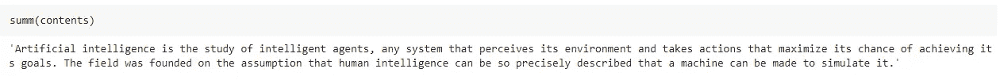
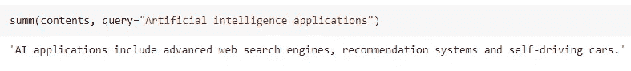
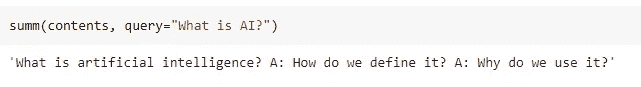
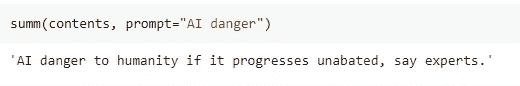
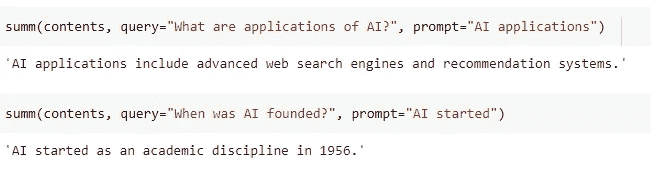

# 这是由 Salesforce 开发的最好的文本摘要框架吗？

> 原文：<https://towardsdatascience.com/is-this-the-best-text-summarizer-framework-developed-by-salesforce-6f625edf3c04?source=collection_archive---------17----------------------->

## 基于 CTRLsum 的 Python 可控文本摘要


图片由 [Gerd Altmann](https://pixabay.com/users/geralt-9301/?utm_source=link-attribution&amp;utm_medium=referral&amp;utm_campaign=image&amp;utm_content=2985525) 从 [Pixabay](https://pixabay.com/?utm_source=link-attribution&amp;utm_medium=referral&amp;utm_campaign=image&amp;utm_content=2985525) 拍摄

文本摘要技术是指从长文本文档中提取最重要的信息。它可以用来创建一个简短、准确、流畅的文档摘要。文本摘要器的目的是减少文档的阅读时间，使选择过程更容易。

Python 中有各种开源的文本摘要器，但是在本文中，您可以阅读 Salesforce 团队在[论文](https://arxiv.org/abs/2012.04281) `**CTRLsum: Towards Generic Controllable Text Summarization**.`中开发的最新摘要技术

# CTRLsum:

**CTRLsum** 是一个通用的可控摘要系统，用于在给定关键字、查询或前缀形式的控制标记或设置的情况下处理文本摘要。CTRLsum 还可以在不受控制的设置中实现文本的强摘要。

Salesforce 团队提出了 CTRLsum paper 的 Pytorch 实现。参考他们的 [GitHub 库](https://github.com/salesforce/ctrl-sum)来获得使用预训练的 CTRLsum 模型以及训练新模型的说明。

[Hyunwoong Ko](https://github.com/hyunwoongko) 围绕 CTRLsum 开发了一个 python 包装器，可以从 PyPI 安装，称为[summarizer](https://github.com/hyunwoongko/summarizers)。summarizers 包只需几行 Python 代码就可以使用 CTRLsum 的实现。

在本文中，我们将进一步讨论 summarizers Python 包的实际实现。

# 总结者:

`**summarizers**` 是基于 Salesforce 的 [CTRLsum](https://github.com/salesforce/ctrl-sum) PyTorch 实现的可控摘要包。截至目前，summarizer 只支持英语，不支持其他语言。

## 安装:

`**summarizers**` 软件包可以从 PyPI 安装，使用:

```
**pip install summarizers**
```

# 用法:

在开始之前，使用`from summarizers import Summarizers`导入库并实例化`Summarizers()`类的对象。它带有预先训练的模型，用于普通摘要、论文摘要和专利摘要，使用关键字普通、论文、专利作为参数传递给`Summarizers()`对象。

```
**summ = Summarizers('normal')**  # <-- default.
summ = Summarizers('paper')
summ = Summarizers('patent')
```

它还提出了 GPU 加速，使用参数`device=’cuda’`

在实例化`**Summarizers()**`对象后，可以执行不同类型的汇总，包括:

1.  基本概述
2.  面向查询的摘要
3.  抽象自动问题检测
4.  基于提示的摘要
5.  带提示的查询聚焦摘要

我们将进一步讨论上述每一种总结技术及其实现。

> 我将使用维基百科中一篇关于人工智能介绍的文章来生成上述摘要。

## (1.)基础总结:

基本摘要可用于生成长文本文档的简短摘要。这不涉及生成摘要时的任何控制。



## (2.)查询聚焦摘要:

您可以基于指定的查询生成摘要文本。如果想要将查询与摘要放在一起，可以使用以查询为中心的摘要。



## (3.)抽象的自动问题检测:

抽象问答可以通过在查询参数中提供一个问题作为参数来进行。



## (4.)基于提示的总结:

您可以使用参数`prompt`生成一个以某个序列开始的摘要。



## (5.)带有提示的查询聚焦摘要:

您可以通过询问查询来生成摘要，并强制摘要以给定的提示开始。



# 结论:

对于在应用自然语言处理领域工作的开发者来说，这是一个非常有用的软件包。这是一个方便的工具，可以用几行 Python 代码生成大型文本语料库的受控摘要。

> 请参考我以前的一篇关于使用 Sumy 包进行文本摘要的文章:

</summarize-long-text-documents-using-machine-learning-d49aaf5fc99a>  

# 参考资料:

[1]总结者 GitHub 库:[https://github.com/hyunwoongko/summarizers](https://github.com/hyunwoongko/summarizers)

> 感谢您的阅读