# VAE 是一个好的随机生成器吗？

> 原文：<https://towardsdatascience.com/is-vae-a-good-random-generator-6f518c87cb49?source=collection_archive---------49----------------------->

## **VAE 的另一种美德**

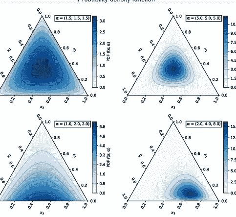

维基百科-狄利克雷

这个职位是我之前的[职位](/on-distribution-of-zs-in-vae-bb9a05b530c6)的延续。回想一下，我在那里讨论过是否使用 ELBO 训练 VAE，编码器收敛到期望的最佳参数(传统上，我们考虑高斯分布，因此参数是均值和标准差)。情况似乎不是这样:当我们希望优化编码器(在这种情况下是标准高斯编码器)时，我们需要单独训练它们。仅关注 ELBO 公式中的 KL 散度项:

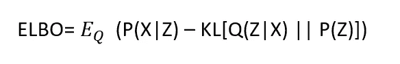

作者

当我们使用整个公式时，我们获得了模糊的图像，但是编码器没有收敛到标准的高斯分布

**但是这种发动机有什么潜在的应用吗？**

我们暗示的一个方向是" ***"编码器作为随机发生器能有多好？"***

下面的算法可以提供这个问题的答案:

*仅使用 KL 术语训练编码器

*为期望的分布生成样本(例如**标准正常** ) ( **生成样本**)

*从编码器生成 Z 值

假设我们正在处理一个具有 KL 散度解析形式的分布(如高斯分布)，比较期望分布和以下各项之间的 KL 散度:

1**生成样本**

两个 Z

3 编码器的参数。

# 高斯情形

在高斯情况下，Z 的生成机制与随机样本的生成机制相同[(重新参数化技巧](https://jaan.io/what-is-variational-autoencoder-vae-tutorial/))，因此在最佳情况下，第 1 条和第 2 条必须合并。仍然需要证明最佳方案已经实现。

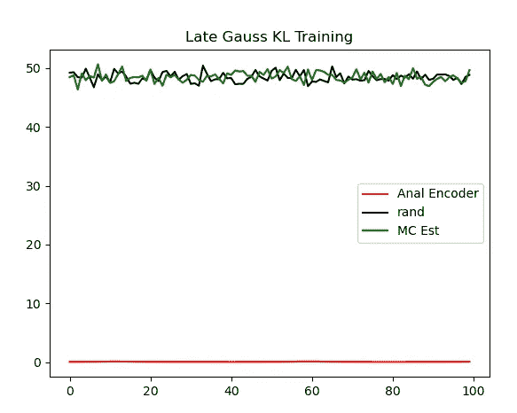

作者

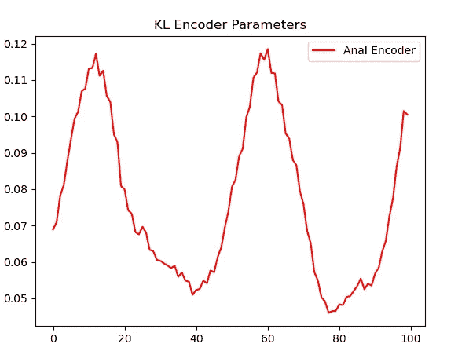

作者

在后面的图表中:

**红色曲线**代表编码器值(即神经网络中的值)

**绿色曲线-**Z 的

**黑色曲线—** 随机样本

X 轴代表迭代次数和 Y，KL 值。

可以看出，绿色曲线和黑色曲线的表现几乎相同(从更远处看是最佳情况)。

以一种独特的方式，高斯情况允许多一个封闭形式的度量:[**wassertin 2 度量**](https://djalil.chafai.net/blog/2010/04/30/wasserstein-distance-between-two-gaussians/)

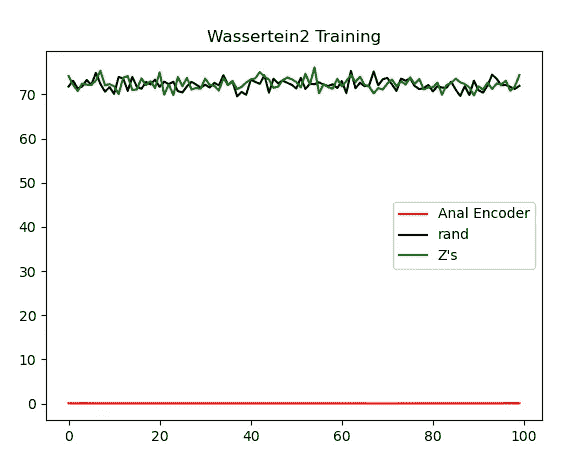

作者

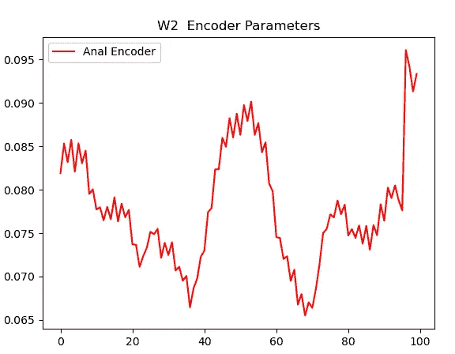

作者

我们可以看到，这些图形类似于 KL 散度情况，只是值不同。

我们可以总结出，在高斯情况下，编码器可以生成具有与标准高斯相似的 KL 散度的 Z 作为采样函数本身(例如 **torch.randn** 或 **numpy.random**

这听起来很酷，但是:

*   我们不能改进正则语言的随机抽样函数
*   如果我们不能改进，我们可以对标题中提出的问题给出肯定的答案，但训练引擎实现 numpy.random 的冗长过程并不吸引人

我们有两个选择:

*   放弃
*   检查其他通用发行版

幸运的是，我是一个古董爱好者

# 伽马射线盒

## 什么是伽玛分布？

为了对[伽马、](https://sites.stat.washington.edu/thompson/S341_10/Notes/week4.pdf)有一个很好的直觉，考虑一个测量事件时间到达的过程，但不仅仅是单个事件，还有 **K** 个事件。

有两种方法来参数化伽马，

**α β** 其中 **α** 表示到达量 **K (** 也称为**形状**)，而 **β** 是到达率。在某些地方，G amma 由 **K** 和 **θ** 定义

PDF 是:

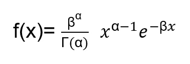

作者

其中**γ**是伽玛函数。正如我提到的 **α** 是“到达的数量”

如果我们将 **α** 设为 1，那么**γ(1)= 1(**检查[这里](https://keisan.casio.com/exec/system/1180573444)或者相信我)，pdf 变成:

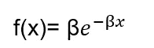

作者

这正是**泊松**分布(测量单个到达)

## 几个属性:

支撑是整个正实轴，这意味着如果

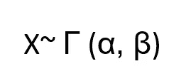

作者

而 b 是常数，X +b 没有伽玛分布。另一方面，标量缩放成立

作者

暗指

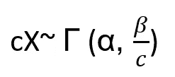

作者

对于正极 **c**

最后如果 X 是一个 r.v。

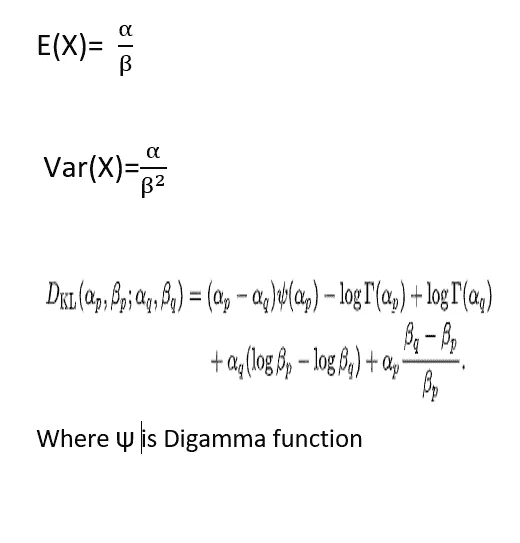

维基百科-Drichlet

所以我们有了很好的公式，我们能向前迈进，创造出基于伽马射线的 VAE 吗？

# 伽玛和 VAE

只要我们考虑从输入到编码器上层的道路。答案是**没问题。当我们从编码器转移到解码器时，障碍出现了。**

“传统”VAE 的神奇之处基于高斯分布的伟大特性:

**如果 X r.v .具有随机分布，那么每个仿射变换都具有高斯分布。**

这种方式允许从固定分布中取样，并容易地将其映射到所需的分布。这允许我们得到保持分布，避免对随机变量求导。Gamm 就不是这种情况了。

我们可以缩放它，但它对 **α没有影响。**挺拉屎的吧？然而，也有好消息:我们不关心解码器，因为在我们的实验中，我们研究的随机方式 Z 只是为了测试，我们不区分它们。

## 那么它是如何工作的呢？

我们设定一个**目标函数**(例如**γ(1，1)γ(4，3) )**

关于潜在尺寸，我们可以取 1 或更多，如果目标在所有维度上都是固定的，那么就像有一个巨大的批量。

我们基于**目标函数**创建一个样本

我们像以前一样训练编码器。我们的兴趣是理解 Z 的实际分布，看看它是否更接近目标函数

然后是样本。

如何从 Z 的样本量得到 **α β** ？

*   计算平均值
*   计算方差
*   方差和平均值之间的比率提供了 **β，**使用平均值我们得到 **α。**

## 结果

对于**γ(4，3)** 我们得到了下面的图形

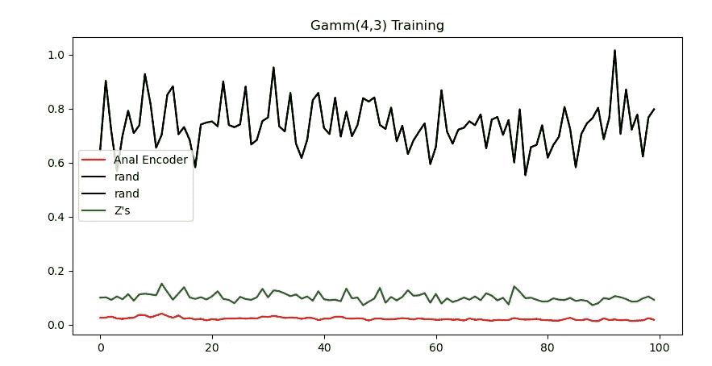

对于**γ(5，2)** 我们得到了下面的图形

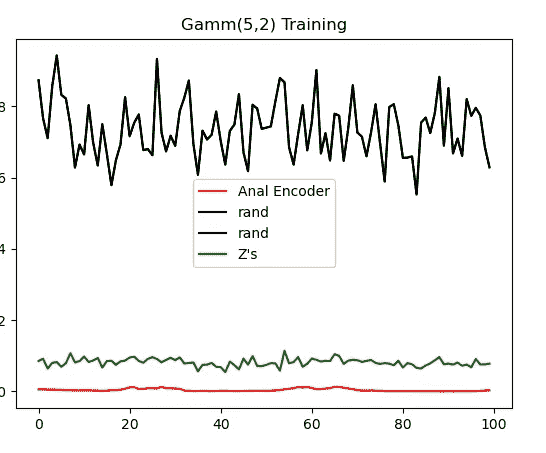

我做了一些额外的实验，展示了同样的画面:

**与高斯相比，我们可以发现 VAE 使用伽马 VAE** 提供了更高精度的样本

# **狄利克雷**

狄利克雷是概率向量的分布。具有 K 维狄利克雷分布的 r.v .是向量 x1，x..xk ),使得它们都是正的，并且它们的和是 1

此外，我们还有:

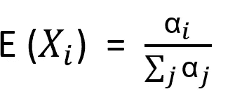

作者

和

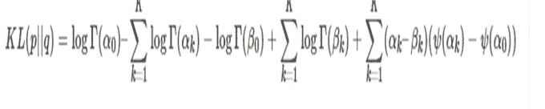

维基百科(一个基于 wiki 技术的多语言的百科全书协作计划ˌ也是一部用不同语言写成的网络百科全书ˌ 其目标及宗旨是为全人类提供自由的百科全书)ˌ开放性的百科全书

狄利克雷为什么有趣？

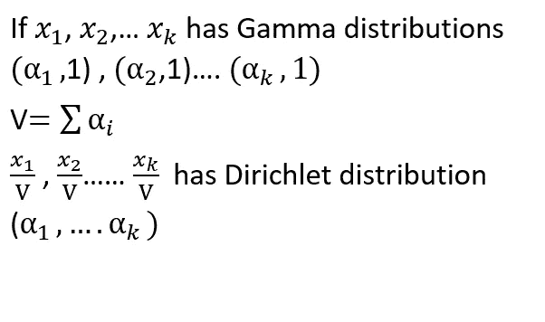

作者

因此，我们将遵循具有更大潜在维度的相同伽马机制，并且损耗将遵循[狄利克雷](http://bariskurt.com/kullback-leibler-divergence-between-two-dirichlet-and-beta-distributions/) KL 公式

一些图表也显示了狄利克雷中的伽马现象:

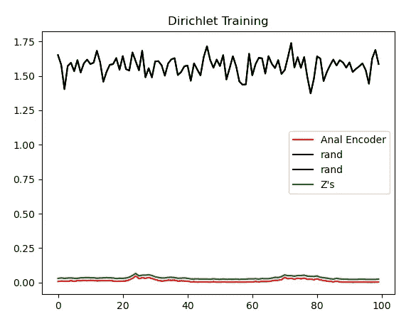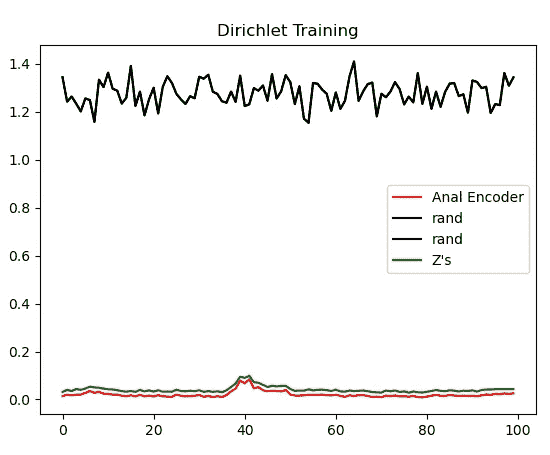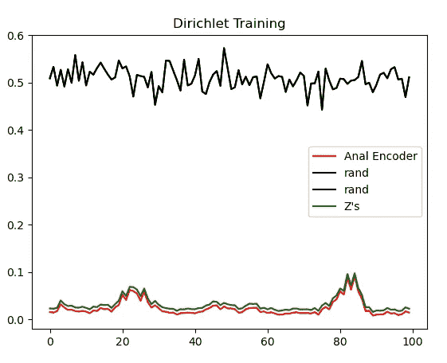

## 摘要

我们看到，与高斯分布相比，我们可以获得比 Gamma 和 Dirichlet 中的随机样本更接近(KL -wise)给定分布的样本。关于原因，我没有深刻的理论支持。这些现象的发生可能是由于错误的样本量或其他潜在的超参数。但是它们发生了。我相信进一步的研究是有益的

这个帖子的代码是[这里是](https://github.com/natank1/VAE_Gamma_Dir)。

此外，在工作期间，我需要 Pytorch 没有提供的几个度量函数:

*   多变量高斯函数之间的加权系数 2
*   在多变量高斯和对角协方差高斯"**对角**"之间插入 2(在 Pytroch 术语中称为**独立**
*   在两条**对角线**高斯线之间
*   **对角线**和标准高斯线之间的垫圈 2
*   **对角线**和多变量高斯线之间的 KL 散度
*   对角高斯和标准高斯之间的 KL 散度

我把它们都整理在这个[文件](https://github.com/natank1/VAE_Gamma_Dir/blob/main/Wasserstein_metric_for_Gaussians2.py)里了。

谢谢你。

# 来源

[https://en.wikipedia.org/wiki/Dirichlet_distribution](https://en.wikipedia.org/wiki/Dirichlet_distribution)(图片开头)