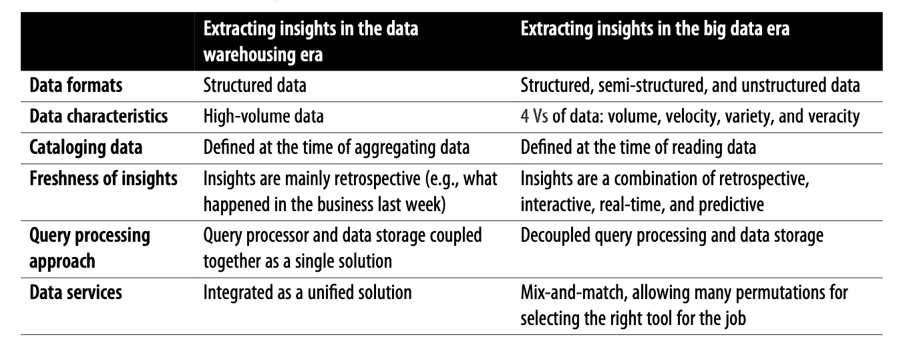

# 你的数据和人工智能/人工智能团队经得起未来考验吗？

> 原文：<https://towardsdatascience.com/is-your-data-ai-ml-team-future-proof-f73361ad1fd4?source=collection_archive---------28----------------------->

## 除了技能，智商，情商，找数据智商(DQ)

GIF by [giphy](https://giphy.com/gifs/theoffice-FJOvTamQl8rVJG71K3)

随着技术的快速演进，数据工程师、数据分析师、数据科学家、ML 工程师、AI 产品开发人员的角色在未来 3-5 年内将会有显著的不同！

> 你如何证明你的数据+人工智能/人工智能团队雇佣的未来？您当前的团队能够学习当今不存在的技术技能吗？

考虑一下数据工程师的角色。二十年前，这个角色主要围绕数据仓库模式设计，[写模式治理](https://medium.com/wrong-ml/schema-on-read-curse-of-data-lakes-our-5-antidotes-1386199d262f?source=friends_link&sk=cff1d1104f9f82f495f1bf453327d76c)，生成每周业务报告。这是数据被视为 IT 开支的一部分的时代。

在过去的十年里，随着 [Hadoop 时代](https://medium.com/wrong-ml/extracting-insights-from-data-is-becoming-a-key-differentiator-for-enterprises-in-every-sector-bdcc4a7d9ce7?source=friends_link&sk=f1e817a6aaeb5fc7884e4596d45d19b7)，数据仓库设备内的集成服务被用于数据摄取、ETL、数据目录、数据争论、治理、解耦存储和处理、NoSQL 持久性存储、可视化的[技术](https://a16z.com/2020/10/15/the-emerging-architectures-for-modern-data-infrastructure/)的[挑选](https://medium.com/wrong-ml/crossing-the-big-data-chasm-with-sql-7680de6b857c?source=friends_link&sk=b6848b3ed2740b3a363ecd219a22ac5a)组合所取代。数据工程师的技能更多地转向各种技术的集成，以创建数据管道。随着数据规模的增长，ETL 的挑战转向了有效利用分布式查询处理范例，如 MapReduce。如今，数据被认为是一个区分因素，业务团队希望管道变化能够快速转变，从而产生新的指标/见解。

按作者分类的表格

> 总结一下:你今天在面试中评估的技能很有可能会变得无关紧要。你如何确保被雇佣的人不仅仅在今天需要的技能上是好的，而且在未来不断变化的技术环境中也是有效的。

> 我的方法是在面试中寻找 7 种特质。我将这些特征称为**数据智商(或 DQ)** 。与智商和情商类似，我认为 DQ 对于数据+人工智能/人工智能领域的所有团队招聘都至关重要。

**DQ#1:对业务环境的端到端理解的好奇心**——洞察力将如何被使用，由谁使用，做出什么决定，等等。这意味着数据工程师有兴趣了解业务度量或 ML 模型将如何产生影响。同样，数据科学家有兴趣了解数据集的局限性或摄取或处理中的障碍。

GIF via [giphy](https://giphy.com/gifs/Strawburry17-unleashed-riftside-the-WlJS0sZ9499ixOfalC)

**DQ#2:从数据到洞察力再到影响力的极端所有权** —不认为将原始数据转化为洞察力是要完成的工作。大多数候选人忘记了从洞察力到影响力的最后一英里。多年来，我观察到优秀员工的一个重要特征是，努力看到自己的工作产生影响(即，洞察力以某种形式得到应用)。他们不会停止，直到我们从洞察力到影响力！

**DQ#3:现实地看待统计的力量**——数据中可能没有足够的统计意义来改变你的零假设。在广泛参与之前，能够运用自己的判断力来区分信号和噪音。对于这种特质，我最喜欢的问题是分享[马克·吐温的名言](https://en.wikipedia.org/wiki/Lies,_damned_lies,_and_statistics)“谎言、该死的谎言和统计”，并请候选人分享他们的经历。

**DQ#4:猎人与农民的心态**——凭直觉寻找见解和解决方案。探索的渴望是关键。判断这一特征的一个方法是候选人接受广泛观点的能力，而不是接受第一个想法，即，由宽入窄。

**DQ#5:冷静的骄傲/对失败的宽容**——在探索的海洋中游泳，知道什么时候继续游泳，什么时候停止(快速失败)。列表中的第二点和第五点是矛盾的——我见过表现出强烈极端自主性的候选人很难对他们的工作保持冷静和中立。

**DQ#6:相信实验的力量** —度量标准之间的因果关系是一种假设，除非用实验来证明！在大多数成功的数据项目中，关键是减少从最初的想法到第一次实验的时间。不管未来的技术如何，数据团队的每个人都必须坚信实验的力量。

GIF via [giphy](https://giphy.com/gifs/markrober-elephant-toothpaste-elephanttoothpaste-devilstoothpaste-URvk3RuR5NJvUxnoPX)

**DQ#7:拥抱不确定性**——快速迭代，并在新数据的背景下修改决策。这也广泛地转化为通过综合模式从错误中学习的能力。一些候选人从不确定性下的经营中获得乐趣，而一些人则走上了另一个极端。今天你可能已经有了一个清晰的路线图和轨迹，但是要为快速转变的时期做好准备，在这个时期团队需要适应不确定性。

GIF via [giphy](https://giphy.com/gifs/GuiltyParty-att-atthellolab-hello-lab-ZgUMYIFxX5Quy6JpnS)

> 总而言之，我在未来的招聘中寻找 DQ。这些年来，我在 Data + AI/ML 团队中看到了 DQ 与对不断变化的技术和技能要求的适应性之间的强烈关联。

**渴望更多——查看一篇关于“**[**ML 项目中可能出错的 98 件事**](/51-things-that-can-go-wrong-in-a-real-world-ml-project-c36678065a75) **”的相关文章还有，跟着我上** [**中**](https://modern-cdo.medium.com/) **获取我自以为是的定期简讯** [**艾无 BS**](https://medium.com/swlh/ai-without-bs-weekly-newsletter-1-d4a4c579ed38)