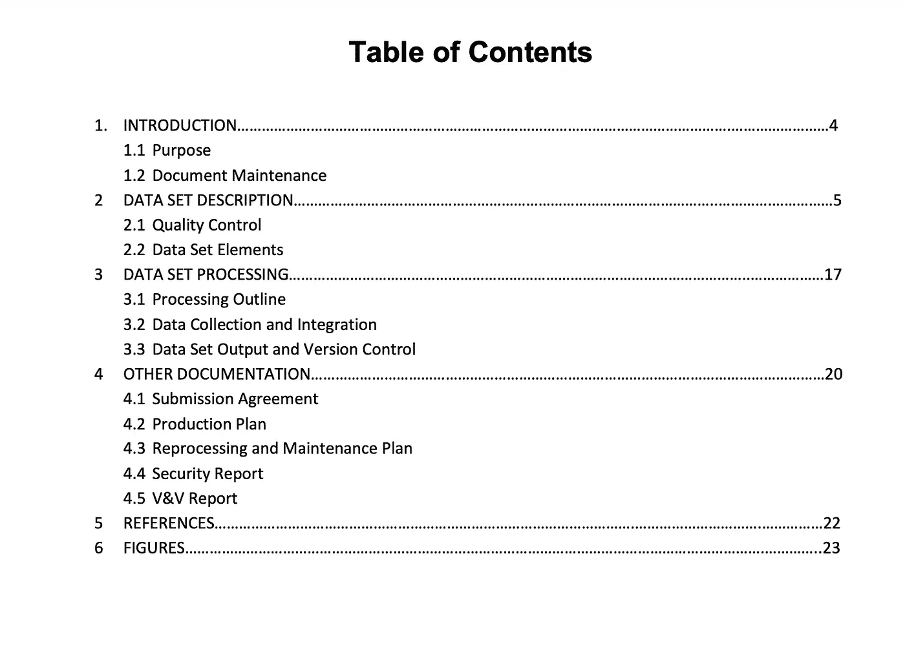
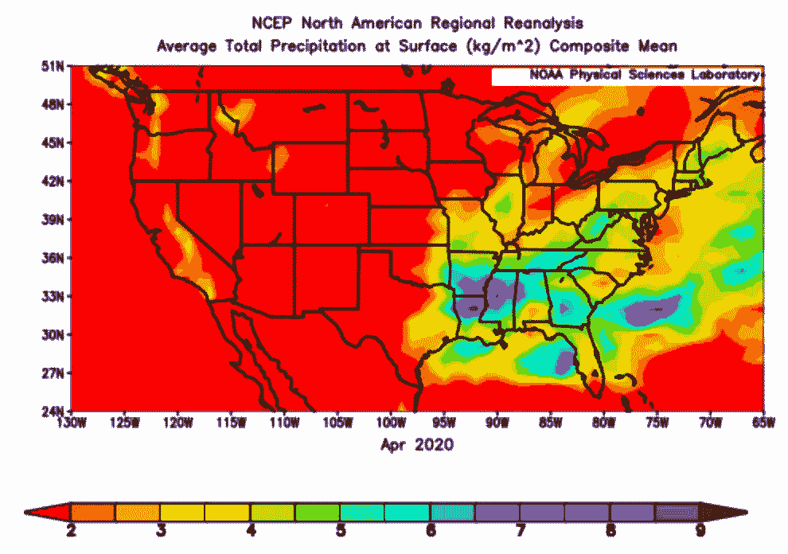

# 你的数据好吗？如何辨别。

> 原文：<https://towardsdatascience.com/is-your-data-good-how-to-tell-25815cab7e27?source=collection_archive---------41----------------------->

## 验证数据和模型非常重要

拥有“好的数据”意味着什么？是否所有数据都能够用于开展研究或向相关方提供信息？应该采取什么步骤来确定数据是否“好”？在实施线性回归、神经网络、逻辑回归、决策树或在其上建立模型之前，应该采取措施确定任何给定数据集的准确性和精确性。你可能在想，“嗯……所有这些额外的数据处理只会占用我更多的时间来构建我的模型。”真的！然而，花额外的时间来辨别你的数据是否正确是防止你在以后的工作中出错的一个很好的方法。不要忘记传播误差是非常真实的事情，原始数据集中的任何误差都可能导致最终分析中的更多误差。我们开始吧。

**1。检查来源**

不，它不需要 R、Python 或 Julia 的代码行。它不需要使用大量计算能力的复杂算法。它只是在网上搜索和深入挖掘潜在数据源的能力。虽然看起来很简单，但你可以从科学组织、政府机构或大学免费获得的大多数数据集通常都经过了严格的审查。有大量的校准协议来确保用户将访问的数据得到尽可能正确和准确的处理。

如何确定一个来源是否有效？首先看看托管数据的组织。如上所述，他们是传播数据的合法机构吗？美国地质调查局的 EarthExplorer 工具是我经常访问的 LANDSAT 卫星图像在线存储库。美国地质调查局是一个被认可的网站，由美国联邦政府支持。现在，如果我从*乔的野生卫星世界*得到我的数据。嗯，Joe 的网站似乎有很多免费的数据，但他只是将这些数据收集到一个存储库中，并放在自己的网站上。我真的不知道他从哪里得到的数据，我只知道它就在那里，可能准确也可能不准确。

美国地质调查局地球探测器概述。作者照片。

这里的一般经验法则是:如果数据不在一个被认可或可信的网站上，你应该怀疑它的真实性。

**2。元数据审查**

元数据是数据的一个方面，每个人都了解但很快就会忘记。元数据是数据集的隐藏细节和信息，通常随数据集一起下载。您可以将元数据视为数据的自述文件。它解释了数据集内观察到的变量、时间覆盖范围、分辨率(或粒度)、发布日期、创建者等特征。

当您使用 wget 或 REST API 将数据集直接拉入 Excel、R、Python 或 Julia 时，您并不总是能看到元数据。有时数据被直接拉进数据框、矩阵、向量等，你没有时间做一个完整详细的检查。在其他情况下，您可能会下载数据而根本没有获得任何元数据，在这些情况下，您应该对您拥有的信息保持警惕。尝试做一些额外的调查，以找到更多关于您刚刚导入到 r 中的内容的信息。作为一项挑战，您能找到常用 Iris 数据集的元数据吗？

请经常查看元数据，这样不仅可以更好地了解您正在使用的数据，还可以验证其真实性。是否有缺失字段？有细节遗漏吗？如果元数据字段中似乎缺少了显而易见的关键细节，那么可能需要一些额外的调查来找到它。始终通过查找和阅读元数据进行彻底的背景调查。

NCEI 气候数据目录。作者照片。

**3。** **(比较)描述性统计**

描述性统计本身并不足以检验数据质量。原因是数据集的平均值、中值、最小值和最大值不能告诉您数据是否来自可靠的来源，或者数据是否被篡改过。缺失值不是欺诈性数据的标志，许多著名的数据源都有缺失值。零不是坏数据的指示符，许多观察值可能真的是零，或者零可以用作指示坏数据的方式(尽管在其他情况下需要使用零，因为它可以影响数据集的整体统计；您更有可能看到 N/A、Null 或-9999)。

但是，如果您的数据非常常见，您可以比较两个数据集，以确定它们是否在彼此的范围内。我称之为比较描述统计学。例如，我用于降水研究的两个数据集是北美区域再分析(NARR)和气候预报系统(CFS)。这两个数据集都是栅格，具有不同的像元大小(分辨率)，测量方式也略有不同。我可以对两者的同一时间段进行观察，进行描述性统计，看看它们有多相似。通常，尽管分辨率不同，我们还是会看到相似的结果。

如果您自己的研究有多个数据集，最好同时获取两个数据集并比较它们的值。应该调查任何主要的差异，如果需要，您可以使用这些信息来丢弃数据。

北美区域再分析降水的合成图。作者照片。

我希望你发现这三个技巧对识别好的数据有帮助。鉴于当今数据科学家可获得的海量信息，梳理每个数据集可能具有挑战性，但构建有用且可靠的模型是非常必要的。请继续关注我的下一篇文章，了解如何快速轻松地找到好的数据！