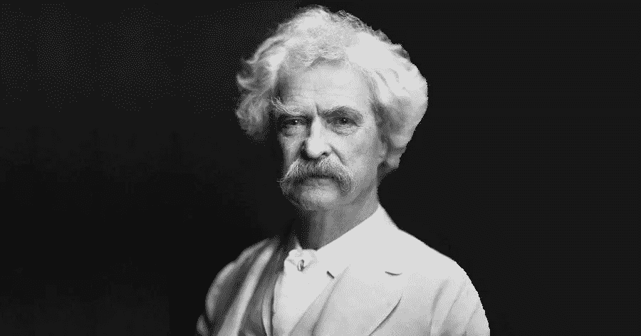

# 您的数据战略是否遗漏了一个关键领域？

> 原文：<https://towardsdatascience.com/is-your-data-strategy-missing-the-mark-5f3a8d32dbc?source=collection_archive---------29----------------------->

## 任何一项数据计划所带来的好处都将受到组织信息素养成熟度的影响和限制。

马克·吐温著 AF 布拉德利著。维基共享(公共领域)

向任何数据领导者询问他们的数据战略；他们可能会从他们的现代数据架构开始，提到诸如数据湖、事件流或非结构化/半结构化数据等时髦词汇。接下来，他们可能会钻研他们正在使用或计划使用的技术。例如，Kafka、Fivetran、Snowflake 或 Looker 都可以用来解释他们的数据策略。你所询问的数据领导者也可能描述他们打算如何通过他们的数据科学团队来操作他们的 ML 驱动的见解或开发复杂的模型。

数据栈背后的架构、模式和技术本身并不是数据策略。同样，您打算通过该数据堆栈实现或执行的业务目标本身并不是数据策略。那么，*什么* *你缺什么*？

# 有时

时光倒流一点点，你会发现到处都是数据专业人士，他们渴望解释“数据湖”将如何彻底改变我们管理大量数据的方式。数据湖的主要和固有优势是什么？首先，提供一个“转储”数据的地方，然后弄清楚它的用途。数据湖可以消除所谓的数据孤岛。

再往前追溯，你会发现数据仓库和数据集市的支持者。现在，你会听到更新的概念，如数据湖屋或流行的水冷却器概念，[数据网格](https://martinfowler.com/articles/data-monolith-to-mesh.html)。数据网格的主要固有优势是什么？为了*启用*，数据湖打算消除的数据筒仓结构。

计算的进步淘汰了传统的建模技术。物理模型可以成为逻辑抽象。范式转变和数据平台即服务支持不同的大规模数据域。

改变。在这个世界上，景观不断变化，技术来来去去，模式和观点在解决问题/创造问题的永恒舞蹈中潮起潮落，什么是你的基本数据策略？

# 抽象的目标

最强大的目标有时也是最简单的。虽然持续交付能够实现您的运营和业务目标的数据实践对您的战略至关重要，但定义一个与当前技术或业务趋势无关的更抽象的目标变得越来越重要。经常被忽略的抽象目标是什么？它是组织内企业数据和信息素养的结构化和持续传播。有一种遗留的期望，即只有数据分析师需要理解概念数据模型，只有软件工程师需要理解架构，或者只有业务分析师从详细的、跨领域的业务事件理解中受益。

任何一项数据计划所带来的好处都将受到组织信息素养成熟度的影响和限制。

# 叙述的基础

达到的信息素养程度不会因人而异，也不会因团队而异。它不是客观可测量的，只是数据策略的一部分，尽管是基础部分。然而，对开发和传播数据驱动文化这一核心组件的认真关注不应该作为优先事项被忽视。

如果利用它们的团队不符合定义、业务相关性、影响它们的变量或使用它们的基本愿望，那么提供见解、为您的解决方案带来五个 9 以及复杂的数据科学模型都将毫无意义。

“不读书的人并不比不识字的人优越”这句格言最初是马克·吐温说的。

作为一名现代数据领导者，你的工作不仅仅是讲述故事，甚至教组织阅读，还要激发阅读的欲望和渴望。

[***请关注我或通过我的推荐链接注册 Medium 来支持我的写作。谢谢！***](https://datadfw.medium.com/membership)