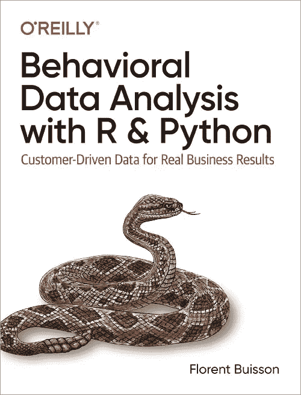

# Zillow 是不是“被诅咒了？”行为经济学视角

> 原文：<https://towardsdatascience.com/is-zillow-cursed-a-behavioral-economics-perspective-5b5165bb085b?source=collection_archive---------14----------------------->

## 意见

## iBuying 业务告诉我们预测模型的使用和误用

*(本文基于我的书* [*【使用 R 和 Python 的行为数据分析:真实业务结果的客户驱动数据】*](https://amzn.to/3xjz03F)*【1】)*

# **简介**

房地产公司 Zillow 最近宣布，在过去几个月亏损超过 3 亿美元后，它将关闭其购房部门 Offers，并解雇 25%的员工。

Zillow Offers 是该公司进军 iBuying 的一次尝试:用 Zillow 的话说，*“即时买家，通常被称为 iBuyers，是一种房屋买卖服务，通常以市场价格直接从卖家手中购买场外房屋，并在进行轻微维修和更新后迅速在公开市场上出售”*【6】。Zillow 的核心业务是列出待售房产(即房地产市场)，这是一项由他们著名的房屋估价工具 Zestimate 支持的活动。

作为一名行为科学家，我很清楚后见之明和叙述偏见。当专注于一个单一的过去事件时，很容易陷入一个简单解释的幻觉，而这个解释一直是可预测的。人们也很容易采取“内部观点”，关注手头案件的细节和轶事，而不是采取更广泛的“外部观点”。例如，我看到过类似“数据科学对于这个用例来说不够精确”或“市场太不稳定”的解释[3，4，5]；这些并没有说明在同一时期，其他 iBuyers，如 Opendoor 和 Offerpad，比 Zillow Offers 表现得更好。然而，有充分的理由相信预测分析不是这个行业的正确工具。在描述这些原因之前，我将首先介绍不同类型的分析。

# 不同类型的分析

“数据科学”已经涵盖了所有的业务分析，只要它们足够新奇，但在我看来，一个关键的区别在于描述性分析、预测性分析和因果分析:

*   描述性分析提供了数据的描述。简单地说，我认为它是“现状”或“我们衡量的”分析。上个月有多少客户取消了订阅？我们去年赚了多少利润？描述性分析是最简单的分析形式，但它也没有得到应有的重视。许多组织实际上很难获得清晰统一的运营视图。
*   预测分析提供了一种预测。我认为它是“假设目前的条件持续下去，将会是什么”或“我们还没有测量”的分析。大多数机器学习方法都属于这种类型的分析，并帮助我们回答诸如“下个月有多少客户会取消订阅？”以及“该订单是否具有欺诈性？”
*   最后，因果分析提供了数据的原因。我把它想成“如果呢？”或“在不同条件下会怎样”的分析。它回答了一些问题，比如“除非我们给他们发优惠券，否则下个月会有多少客户取消订阅？”。

在过去 25 年左右的时间里，预测分析席卷了整个世界，如今，大批数据科学家正忙于为企业构建预测模型。这些模型并不完美(正如约吉·贝拉所说，*“很难做出预测，尤其是对未来的预测”*)，但它们通常胜过拥有数十年经验的人类专家。那么，我们为什么应该期待预测分析在智能交通领域表现不佳呢？有两个原因:

*   房屋买卖行为受到多种波动因素的影响(又名人类是复杂的)；
*   iBuying 市场具有很强的战略意义。

在接下来的两节中，我将研究这两个方面并指出它们的解决方案。

# **房屋买卖行为受多种波动因素影响**

当所研究的现象服从少数稳定且众所周知的因素时，预测分析效果最佳。让我们以风力涡轮机的预测性维护为例:

*   相关因素的数量是有限的，它们之间的相互作用也是有限的。一旦你考虑了风力、运动部件之间的摩擦和材料的腐蚀，你就对将要发生的事情有了很好的把握。
*   物理定律是不变的(引力不放任何一天假！).
*   物理学很好理解。为了简单起见，模型可能会忽略次要或罕见的现象，如百年一遇的风暴，但即使出现这种异常情况，结果仍然是可以预测的:叶片将会断裂和坠落，而不是罢工或退出。

另一方面，在房地产市场:

*   有许多许多不同的因素在起作用——人口统计、经济，但也有文化和心理因素——它们有着复杂的相互作用。这意味着即使是 3 或 4 个最重要的方面的预测能力也会令人失望地低。
*   这些因素不是恒定的；偏好会随着时间而改变，有时会变得很残酷。房地产市场的三个特征放大了这一点。第一，行为“参差不齐”；一次买或卖一整栋房子，消费者不可能轻易减少他们每月 5%的住房消费。二是交易时机灵活；人们可以根据市场情况匆忙或推迟购买新房子，而不是推迟购买食品或家庭用品。最后，住房可能是人们财富的一大组成部分，这放大了价格变化的影响(相反，当咖啡变得更贵时，更少的人变得更富有并疯狂消费)。这可能会导致交易量出现过山车式的变化，这在其他消费品中是看不到的。
*   前两个方面的结合意味着市场可能的“状态”数量是巨大的(这个问题在统计学和其他定量领域被称为“维数灾难”)。从数学建模的角度来看，这具有重要的意义。预测分析在预测与训练数据“足够接近”的预测值组合的结果时表现最佳。不可否认，在任何非平凡的数据集中，拥有*个唯一的*个数据点，以及训练数据集中从未出现过的预测值组合是很常见的(几乎任何连续变量，如身高或收入，都会出现这种情况)。但是，大多数情况下，即使是唯一的数据点也可以通过训练数据集中的点的线性组合来近似。相反，在房地产市场的情况下，很容易想象整个本地市场(比如说，凤凰城地区)立刻就进入了未知的水域。然后，预测分析必须依赖外推，随着我们远离先前观察到的值，外推变得越来越不稳健(也称为过度拟合)。

> “就房地产市场而言，很容易想象整个本地市场(比如说凤凰城地区)会立刻进入未知领域。预测分析必须依赖外推，随着我们远离之前观察到的值，外推越来越不可靠(也就是过度拟合)。”

因此，房地产市场为分析提供了一个棘手的难题。这不是一个新问题。早在 20 世纪 70 年代，宏观经济学家罗伯特·卢卡斯(Robert Lucas)就阐明了这一点(凯恩斯模型的“卢卡斯批判”)。他建议我们识别人类行为的更深层次的参数，比如消费者偏好，我非常同意。

**将因果分析与潜在行为驱动因素的分析结合起来使用，可以缓解这些问题**。在我的书中，我为此开发了我所谓的“数据分析的因果行为框架”。

数据分析的因果行为框架

预测分析满足于构建高准确度的黑盒，而因果分析则致力于挖掘在某种情况下起作用的基本规律和规则。这种目标上的差异意味着因果分析在“常规”情况下的预测能力通常低于其预测兄弟，但在更复杂和多变的情况下会大放异彩。

# iBuying 市场具有很强的战略意义

iBuying 业务的一个重要特点是，你对单个物业进行投标。这句话实际上有很多东西需要解开，所以让我们一次解开一部分:

*   每个属性都是独一无二的。即使在最统一的市场中，房屋之间也略有不同(例如不同程度的磨损)。特别是，不同位置的两个几乎相同的房子不能像超市货架上的豆子罐头那样互换；购房者对不同地段的偏好不同:有人的“离市区远”，就是有人的“离我父母近”。
*   每笔交易都是独一无二的。超市出售许多相同或相似的商品，而房地产交易大多是一对一的。即使有人在卖几套房子，一套房子的价格也不会自动适用于另一套。房子也是不经常转手的长效产品。
*   没有固定的价格。卖家从相对较高的价格(与他们的预期相比)开始，逐渐降低价格，直到找到买家。反过来，买方可能会试图通过谈判降低价格。相反，没有正式公布销售价格的人可能仍然会接受潜在买家的自发报价。这一点在这里尤其重要，因为 85%的 iBuyers 购买的是以前不在市场上的房子(资料来源)。最后，当多个买家对同一物业感兴趣时，他们可能会出价高于对方，因为没有“先到先得”的规则。

所有这些方面结合起来意味着，所谓的“房地产市场”实际上是一个房子的个体、临时、议价市场的松散集合。因此，Zillow 宣称的成为房地产“做市商”的愿望——类似于股票市场的“做市商”——充其量也只是一个不稳定的基础。我们谈论“约会市场”,但成为它的做市商意味着什么？？？

特别是，这让 Zillow 受到了**赢家的诅咒**。拍卖理论中这个听起来不祥的概念指的是*本质上*导致买家支付过高价格的情况。通过一个简化的例子可以很好地理解这一点，所以让我们想象一下，在一个市场中有三个 iBuyers。他们每个人都建立了一个机器学习模型来预测他们可以有利可图地购买和出售房屋的价格。因为他们可以使用相同的资源(装修承包商等)。)，这三个价格都一样。比方说，一栋 30 万美元的房子是一笔有利可图的交易，不管是哪家卖家做的。这三家公司建立的预测模型也很相似:它们中的每一个都有三分之一的时间正确预测价格(在前面的例子中是 30 万美元)，三分之一的时间低于 10%(27 万美元)，三分之一的时间高于 10%(33 万美元)。这意味着，就其本身而言，每种模式都相当合理且有利可图。最后，为了简单起见，我们假设三个模型的误差是独立的。一家公司的模型预测超调并不影响另一家公司的模型准确的概率，也不影响其误差的方向。

如果这三家公司在一个给定的市场上相互竞争，他们最终将平均获得三分之一的房屋，但大多数都是以虚高的价格购买的。一般 30 万美元的房子会收到一个 27 万美元的出价，一个 30 万美元的出价，以及一个 33 万美元的出价。换句话说，尽管每家公司的平均出价是有利可图的，但平均的*中标*却不是。胜利者被自残的成功所诅咒。

> “尽管每家公司的平均投标都是有利可图的，但平均的*中标*却不是。胜利者被诅咒以自残的成功”。

您可以看到这与预测分析的局限性有着怎样的联系。即使一个模型能够非常准确地预测一处房产的潜在转售价格，如果使用不当也会导致损失。最重要的是，任何销量或市场份额目标都将使你的盈利能力取决于你的竞争对手的模型的准确性:如果你的竞争对手有糟糕的模型，并为物业支付过高的价格，你只能通过支付更高的价格来击败他们！幸运的是，博弈论者和拍卖理论家已经开发了模型和工具，可以通过模拟其他参与者的战略行为来帮助缓解这些问题。

# **结论**

概括一下:我不认为 iBuying 业务存在固有缺陷，我也不认为算法在定价方面不如人类的观点有说服力。然而，我确实认为这一业务线为预测分析带来了独特的挑战，预测分析产生了一些更广泛的见解:

*   就像谚语中的锤子一样，预测分析并不总是适合某项工作的工具。有时一个问题需要描述性或因果分析。
*   如果你想让你的模型在经济周期和动荡中表现良好，你需要理解并考虑人类行为的基本的、持久的驱动因素。
*   一些市场大大偏离了许多买方和许多卖方以单一价格交换相同产品的理论理想。在这种情况下，你需要使用相关的经济学概念，如博弈论和拍卖理论。否则，你也会被诅咒！

# 但是等等，还有呢！

最后不要脸的塞来了。如果你想了解更多关于赢家的诅咒，̶y̶o̶u̶̶s̶h̶o̶u̶l̶d̶̶r̶e̶a̶d̶̶m̶y̶̶b̶o̶o̶k̶，你应该读读理查德·泰勒的书。)，另外[在 LinkedIn 上关注经济学家约翰·李斯特](https://www.linkedin.com/posts/john-list-4727b6a_naturally-occurring-markets-and-exogenous-activity-6862377570437017600-oHQL)。然而，如果你想了解更多的因果分析以及如何在商业中使用它来理解人类行为，我的书会告诉你:

*   如何建立因果图，理解因果关系；
*   如何想清楚更深层的心理和行为因素；
*   如何建立模型，为商业决策提供有益的信息；
*   以及许多其他关于在商业中分析客户数据的很酷的事情。

# 参考

*   [1] F. Buisson，[用 R 和 Python 进行行为数据分析:真实业务结果的客户驱动数据](https://amzn.to/3xjz03F)，奥赖利媒体，2021。
*   [2] R. Thaler，[《赢家的诅咒:经济生活中的悖论和异常现象](https://smile.amazon.com/Winners-Curse-Paradoxes-Anomalies-Economic-ebook/dp/B007QUY3GO/)，第一版。1994 年，kindle ed。2012.
*   [3]《卫报》，[*《3 亿美元的翻身仗:房地产网站 Zillow 的一方骗局是如何严重出错的》*](https://www.theguardian.com/business/2021/nov/04/zillow-homes-buying-selling-flip-flop) ，2021 年 11 月 4 日。
*   [4]华尔街日报，[Zillow 到底哪里出了问题？2021 年 11 月 17 日，一个房地产算法打乱了它的大赌注。](https://www.wsj.com/articles/zillow-offers-real-estate-algorithm-homes-ibuyer-11637159261)
*   [5]连线，[为什么 Zillow 无法让算法式房屋定价发挥作用](https://www.wired.com/story/zillow-ibuyer-real-estate/)，2021 年 11 月 11 日。
*   [6] Zillow Research，2021 年 9 月 7 日，iBuyers 帮助人们搬家的次数创下纪录。