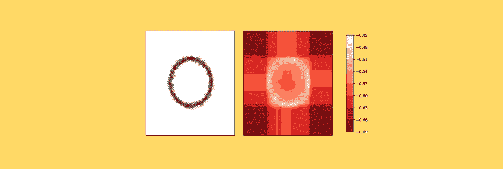
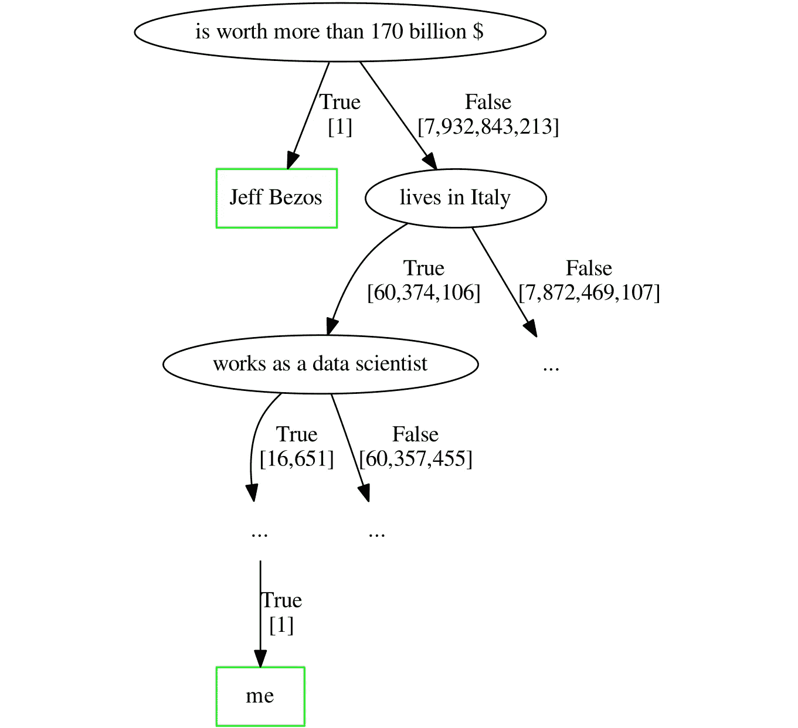
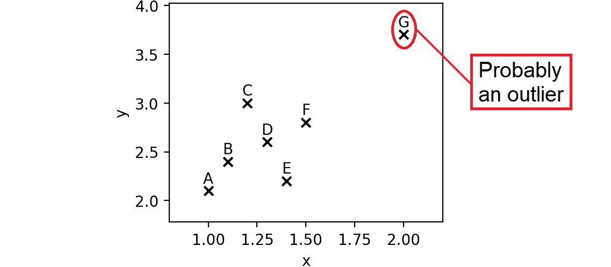
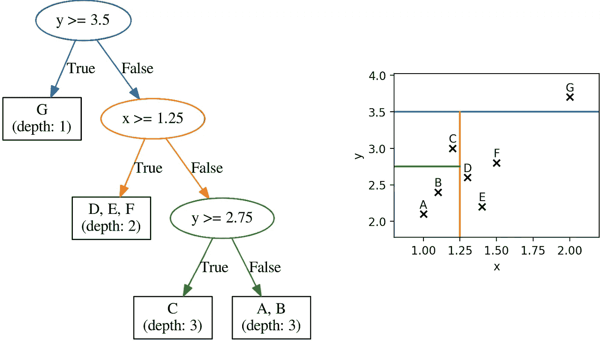
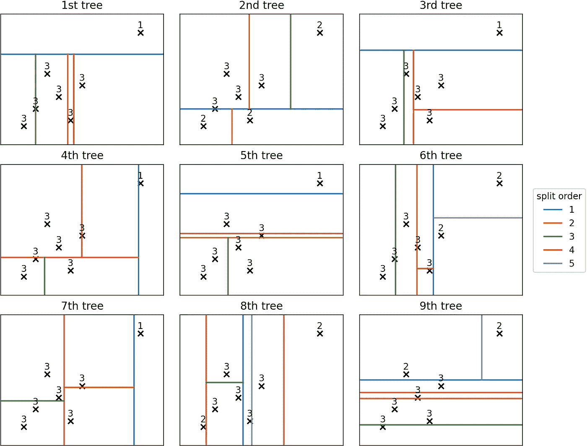
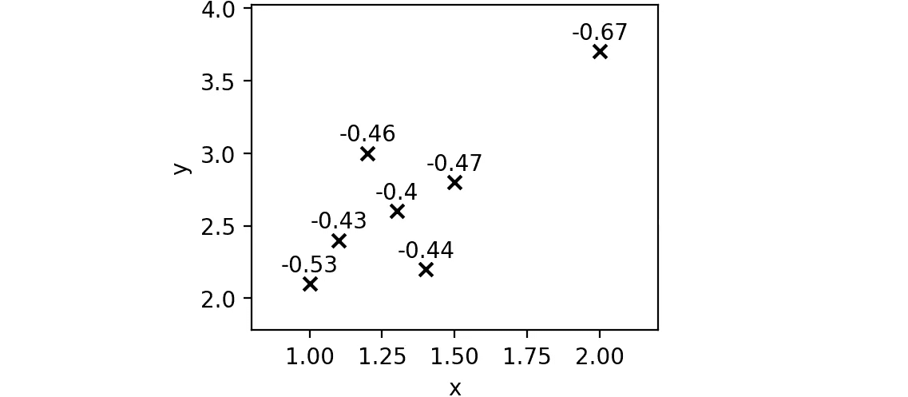
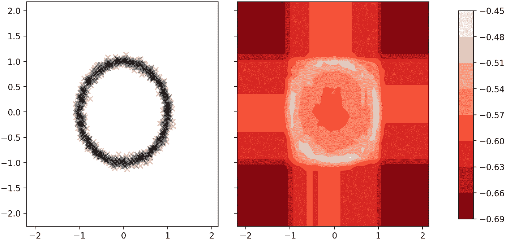

# “隔离森林”:任何数据科学家都应该知道的异常检测算法

> 原文：<https://towardsdatascience.com/isolation-forest-the-anomaly-detection-algorithm-any-data-scientist-should-know-1a99622eec2d?source=collection_archive---------3----------------------->

## 通过出色的无监督算法进行异常检测(也可在 Scikit-learn 中获得)



[图片由作者提供]

“隔离森林”是诞生于 2009 年的一个高明的异常检测算法([此处](https://www.researchgate.net/publication/224384174_Isolation_Forest)为原文)。它已经变得非常流行:它也在 Scikit-learn 中实现(参见[文档](https://scikit-learn.org/stable/modules/generated/sklearn.ensemble.IsolationForest.html))。

在本文中，我们将欣赏这种算法背后的直觉之美，并借助一些例子理解它到底是如何工作的。

# “为什么异常检测如此困难？”

异常(或异常值)检测的任务是识别与大多数观察值相比“非常奇怪”的数据点。

这在一系列应用中非常有用，从故障检测到发现金融欺诈，从发现健康问题到识别不满意的客户。此外，它也有利于机器学习管道，因为[已经证明](https://axon.cs.byu.edu/papers/smith.ijcnn2011.pdf)去除异常值会提高模型的准确性。

异常检测之所以如此困难，是因为它是一个无人监管的问题。换句话说，我们通常没有标签来告诉我们哪些实例实际上是“异常”。或者更确切地说，即使我们有标签，也很难将异常检测框定为监督问题。事实上:

*   异常很少见；
*   异常是新奇的；
*   异常各不相同。

出于所有这些原因，监督技术通常不适合异常检测。

# 隔离森林有什么特别之处

传统的异常检测方法大致是:

1.  描述“正常实例”是什么样子的(这通常涉及到聚类分析)。
2.  将不符合这些配置文件的所有实例标记为离群值。

隔离森林引入的创新是，它直接从异常值开始，而不是从正常观察值开始。

> 核心思想是基于使异常独特的特征来“隔离”异常应该是非常容易的。

从技术上讲，这转化为这样一个事实，**如果我们在所有观察值上拟合一个决策树，离群值应该比“正常”实例更接近树的根。**

这是什么意思？让我们用一个例子来说明这一点。

假设我们有一个数据集，其中包含了目前活着的所有 7，932，843，214 个人的数据。我们想要多少变量就有多少变量:年龄、净资产、居住地、职称…

这样的数据集中有哪些离群值？请记住，异常值不一定是错误的数据:它们只是与总体中的其他数据点非常不同的数据点。在这个例子中，杰夫·贝索斯肯定是一个异数。

现在想象一下，我们可以拟合一个决策树，使得每个末端叶子包含一个且只有一个人。换句话说，这棵树完全没有修剪。如果隔离森林背后的假设是正确的，那么杰夫·贝索斯会比我自己更接近树根。



一棵完全未修剪的决策树，其中每一片末端叶子代表世界上的一个人[图片由作者提供]

作为一个局外人，杰夫·贝索斯更容易被孤立:只要问一句“他的身价超过 1700 亿美元吗？”就够了在近 80 亿人中找回他。另一方面，由于我比杰夫·贝索斯普通得多，你可能需要至少 10 个是非题来缩小搜索范围，直到找到我。

# 在引擎盖下寻找

现在我们已经看到了隔离森林背后的主要直觉，让我们借助一些简单的数据点来尝试理解算法的确切机制。

```
import pandas as pddf = pd.DataFrame({
    'x': [1.0, 1.1, 1.2, 1.3, 1.4, 1.5, 2.0],
    'y': [2.1, 2.4, 3.0, 2.6, 2.2, 2.8, 3.7]
}, index = ['A', 'B', 'C', 'D', 'E', 'F', 'G'])
```



一些数据点[图片由作者提供]

从 A 到 F 的项目表示一个非常紧凑的点云:它们是“正常的”数据点。与这些实例相比，G 可能是一个异常值:它对于 *x* 和 *y* 都有异常值。

隔离林是以树为基础的，所以让我们根据这些数据拟合一棵树:



数据点上的树随机拟合。[图片由作者提供]

> 注意，这棵树是随机生长的。

这里最基本的概念是**每个元素所在叶子的深度**。例如，在这个树中，称为 G(我们的离群值)的观察值在深度 1(例如，离根节点 1 层)，而 C 在深度 3。

**隔离林背后的想法是，平均而言，离群点将比正常实例更接近根节点(即，在更低的深度)。**

在机器学习中，关键是迭代。事实上，如果我们随机拟合许多决策树，然后对不同树上的每个观察值的深度取平均值，我们会发现一个“平均深度”，它代表了一个“外部性”的经验度量。

# Scikit 中的隔离林-学习

让我们通过 Scikit-learn 的实现来看一个使用示例。

```
from sklearn.ensemble import IsolationForestiforest = IsolationForest(n_estimators = 100).fit(df)
```

如果我们从森林中取出前 9 棵树(`iforest.estimators_[:9]`)并绘制它们，我们会得到:



隔离林的前 9 个(100 个)决策树。每个数据点旁边的数字是它在树中的深度。[图片由作者提供]

看一看这前 9 棵树，我们已经可以看到一个模式:G 往往比任何其他点的深度低得多(平均 1.44)。的确，第二个点是平均深度为 2.78 的 A。

> 从概念上讲，这正是该算法的工作原理:平均深度越低，出现异常值的可能性就越大。

然而，在实践中，我们不能使用平均深度，因为树的深度取决于它所适合的样本数。由于这个原因，我们需要一个公式来考虑实例的总数。这是论文中提出的公式:


刘提出的“另类”评分。[截图自[此处](https://www.researchgate.net/publication/224384174_Isolation_Forest)

其中 *n* 是实例的数量， *h(x)* 是在特定树中找到数据点的深度( *E(h(x))* 是它在不同树中的平均值)，而 *H* 是调和数。

*s(x，n)* 是一个介于 0 和 1 之间的数字，其中分数越高，越有可能是异常值。

> 注意:Scikit-learn 的实现返回与上面定义的分数相反的分数。所以上面所说的仍然有效，但是带有负号。

在我们的小数据集上，分数由下式给出:

```
scores = iforest.score_samples(df)
```

让我们来看看我们每一点的估计分数:



隔离森林估计的分数[图片由作者提供]

正如我们所料，G 更有可能是一个离群值，因为它的分数低于所有其他分数。

除了我们的玩具数据集，模拟算法在某些特定情况下会产生什么也很有趣。例如，如果我们在两个变量( *x* 和 *y* )上取一些大致形成圆形的数据点，这是我们将通过隔离森林获得的分数的等值线图:



我们将通过隔离林获得的分数的数据点(左)和等高线图(右)。[图片由作者提供]

有趣的是，不仅最极端的区域可能是异常值，而且位于圆圈中心的部分也可能是异常值，因为它是 *x* 和 *y* 的不寻常组合。

感谢您的阅读！我希望这篇文章对你有用。

我感谢反馈和建设性的批评。如果你想谈论这篇文章或其他相关话题，你可以发短信给我[我的 Linkedin 联系人](https://www.linkedin.com/in/samuelemazzanti/)。