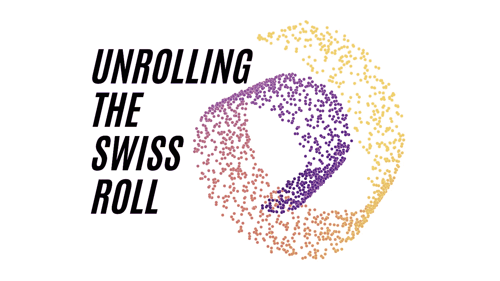
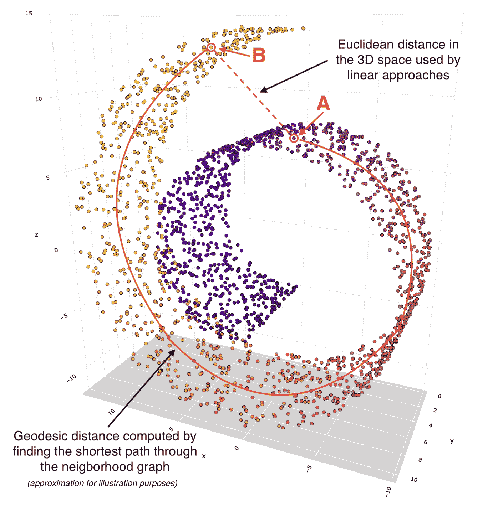
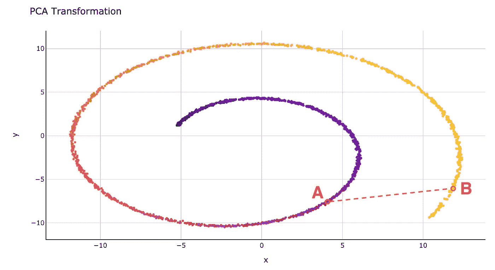
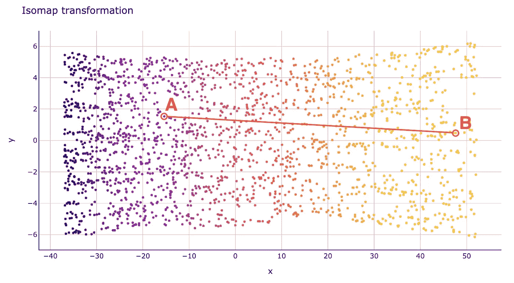
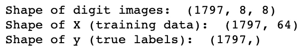
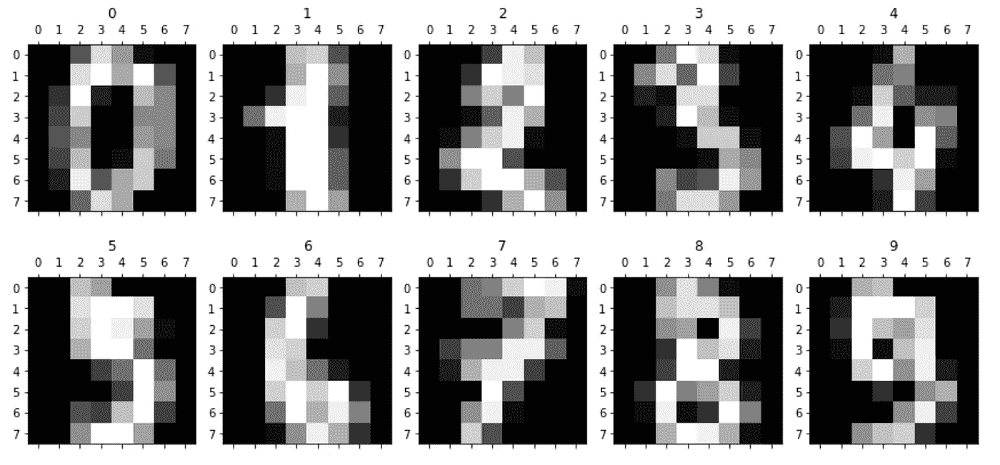
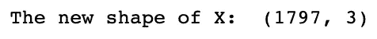

# Isomap 嵌入——一种令人敬畏的非线性降维方法

> 原文：<https://towardsdatascience.com/isomap-embedding-an-awesome-approach-to-non-linear-dimensionality-reduction-fc7efbca47a0?source=collection_archive---------7----------------------->

## 机器学习

## 如何用等距映射“展开瑞士卷”？

等距映射(Isomap)。图片由[作者](https://solclover.com/)提供。

## 介绍

我继续机器学习算法系列，看看另一种称为等距映射或简称为 **Isomap** 的降维技术。

在文章中，我回答了以下问题:

*   Isomap 属于机器学习技术的哪一类？
*   Isomap 是如何工作的？我通过一个直观的例子来解释，而不是复杂的数学。
*   如何在 Python 中使用 Isomap 对我的数据进行降维？

## 机器学习算法家族中的 Isomap

有这么多的机器学习算法，可能永远不可能将它们全部收集和分类。然而，我已经尝试为一些最常用的做了，你可以在下面的**互动**旭日图中找到。确保通过单击浏览图表👇在不同的类别上对**进行放大并展示更多的**。

机器学习算法分类。由[作者](https://solclover.com/)创建的互动图表。

***如果你喜欢数据科学和机器学习*** *，请* [*订阅*](https://solclover.com/subscribe) *每当我发表一个新的故事，你都会收到一封电子邮件。*

如你所见，Isomap 是一种**无监督机器学习**技术，旨在**降维。**

它不同于同类中的其他一些技术，它使用了一种非线性的降维方法，而不是 PCA 等算法使用的线性映射。我们将在下一节看到线性和非线性方法的不同之处。

## 等距映射(Isomap)是如何工作的？

Isomap 是一种结合了几种不同算法的技术，使其能够使用非线性方式来降低维度，同时保留局部结构。

在我们查看 Isomap 的示例并将其与主成分分析(PCA)的线性方法进行比较之前，让我们列出 Isomap 执行的高级步骤:

1.  使用 KNN 方法**找到每个数据点的 k 个最近邻居**。这里，“k”是您可以在模型超参数中指定的任意数量的邻居。
2.  一旦找到邻居，**构建邻居图**，其中如果点是彼此的邻居，则这些点彼此相连。非相邻的数据点保持不连接。
3.  **计算每对数据点(节点)之间的最短路径**。通常，这是弗洛伊德-沃肖尔或迪克斯特拉的算法是用于这项任务。注意，这个步骤通常也被描述为寻找点之间的**测地线距离**。
4.  **使用**[**【MDS】**](/mds-multidimensional-scaling-smart-way-to-reduce-dimensionality-in-python-7c126984e60b)**计算低维嵌入**。给定每对点之间的距离是已知的，MDS 将每个对象放置到 N 维空间中(N 被指定为超参数)，以便尽可能地保留点之间的距离。

对于我们的例子，让我们创建一个称为瑞士卷的 3D 对象。这个物体由 2000 个独立的数据点组成。图表是交互式的，所以请务必旋转它，以熟悉它的确切形状。

交互式 3D 瑞士卷。图由[作者](https://solclover.com/)提供。

接下来，我们想使用 Isomap 绘制这个三维瑞士卷的二维图。为了跟踪这个转换过程中发生了什么，让我们选择两个点:A 和 b。

3D 瑞士卷上两点之间的欧几里得距离与测地线距离。图片由[作者](https://solclover.com/)提供。

我们可以看到这两个点在 3D 空间中彼此相对靠近。如果我们使用线性降维方法，如 PCA，那么这两个点之间的欧几里德距离在较低的维度上仍然有些相似。请参见下面的 PCA 转换图:

使用 PCA 将 3D 瑞士卷缩减为二维。图片由[作者](https://solclover.com/)提供。

注意，PCA 中 2D 物体的形状看起来像从特定角度拍摄的同一 3D 物体的照片。这是线性变换的一个特点。

与此同时，Isomap 等非线性方法给了我们一个非常不同的结果。我们可以把这种转变描述为展开瑞士面包卷，把它平放在 2D 表面上:

使用 Isomap 将三维瑞士卷缩减为二维。图片来自[作者](https://solclover.com/)。

我们可以看到，2D 空间中 A 点和 B 点之间的距离是基于通过邻域连接计算的测地线距离。

这就是 Isomap 能够在平衡局部和全局结构之间的关系的同时执行非线性降维的秘密。

## 如何在 Python 中使用 Isomap 对我的数据进行降维？

现在让我们使用 Isomap 来降低 MNIST 数据集(手写数字的集合)中图片的高维度。这将使我们能够看到不同的数字在三维空间中是如何聚集在一起的。

**设置** 我们将使用以下数据和库:

*   [Scikit-learn 库](https://scikit-learn.org/stable/index.html)用于
    1)来自 sklearn 数据集的 MNIST 数字数据([load _ digits](https://scikit-learn.org/stable/modules/generated/sklearn.datasets.load_digits.html))；
    2)执行等距映射([Isomap](https://scikit-learn.org/stable/modules/generated/sklearn.manifold.Isomap.html))；
*   用于数据可视化的 [Plotly](https://plotly.com/python/) 和 [Matplotlib](https://matplotlib.org/stable/contents.html)
*   [熊猫](https://pandas.pydata.org/docs/)用于数据操作

让我们导入库。

接下来，我们加载 MNIST 数据。

导入数据的形状。图片由[作者](https://solclover.com/)提供。

让我们显示前 10 个手写数字，这样我们可以更好地了解我们正在处理的内容。

前 10 个手写数字的图像(8x8=64 像素)。图片由[作者](https://solclover.com/)提供。

**等距映射** 我们现在将应用 Isomap 将 X 数组中每条记录的维数从 64 减少到 3。

转换数据后的数组形状。图片由[作者](https://solclover.com/)提供。

最后，让我们绘制一个 3D 散点图，看看将维度减少到 3 后的数据是什么样子。

这是一个带有结果的**交互式**图。确保旋转它以查看每组数字之间的间隔。

Isomap 结果-3D 空间中的数字集群。图片由[作者](https://solclover.com/)提供。

正如您所看到的，Isomap 在将维度从 64 减少到 3 的同时保留非线性关系方面做得非常出色。这使我们能够在三维空间中可视化手写数字的集群。

如果我们愿意，我们现在可以轻松地使用分类模型之一，如[决策树](/cart-classification-and-regression-trees-for-clean-but-powerful-models-cc89e60b7a85)、 [SVM](/svm-classifier-and-rbf-kernel-how-to-make-better-models-in-python-73bb4914af5b) 或 [KNN](/k-nearest-neighbors-knn-how-to-make-quality-predictions-with-supervised-learning-d5d2f326c3c2) 来预测每个手写数字标签。

## 结论

Isomap 是降维的最佳工具之一，使我们能够保留数据点之间的非线性关系。

我们已经看到了 Isomap 算法是如何在实践中用于手写数字识别的。类似地，您可以使用 Isomap 作为 NLP(自然语言处理)分析的一部分，在训练分类模型之前减少文本数据的高维度。

我真诚地希望这篇文章能让您轻松地了解 Isomap 是如何工作的，以及它在数据科学项目中的好处。

如果您有任何问题或建议，请随时联系我们。

干杯👏
**索尔·多比拉斯**

***如果你已经花光了这个月的学习预算，下次请记得我。*** *我的个性化链接加入媒介是:*

<https://solclover.com/membership>  

你可能喜欢的其他故事:

</t-sne-machine-learning-algorithm-a-great-tool-for-dimensionality-reduction-in-python-ec01552f1a1e>  </umap-dimensionality-reduction-an-incredibly-robust-machine-learning-algorithm-b5acb01de568> 