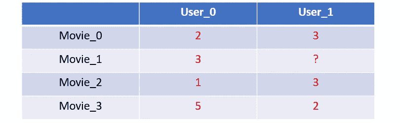
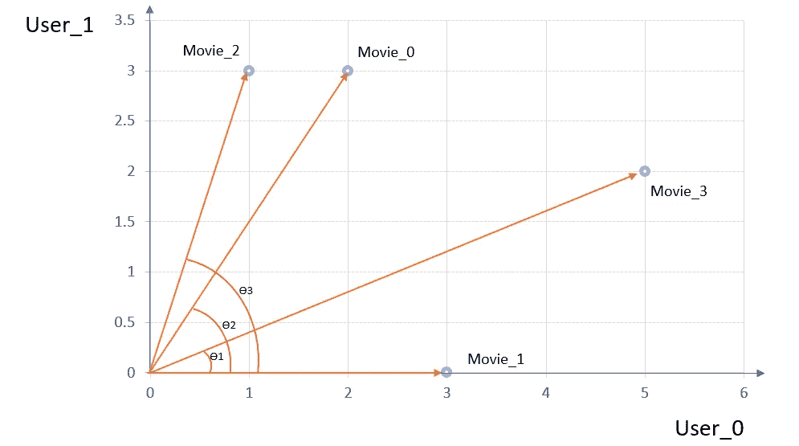
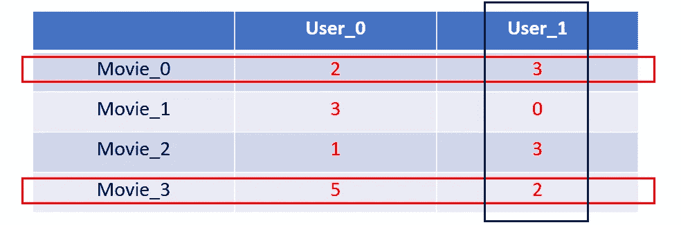
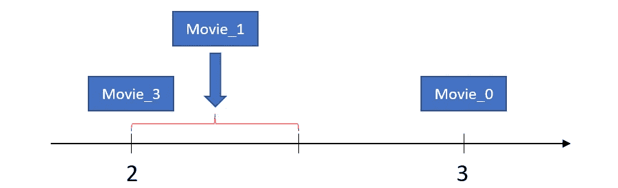
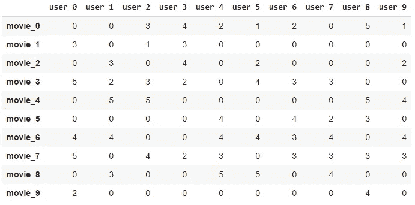
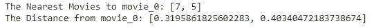
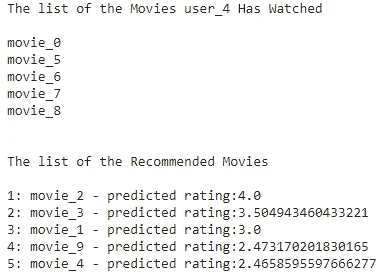
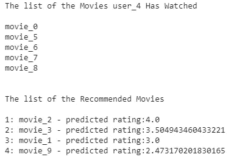

# Python 中基于项目的协同过滤

> 原文：<https://towardsdatascience.com/item-based-collaborative-filtering-in-python-91f747200fab?source=collection_archive---------0----------------------->

## 用 python 实现基于项目的协同过滤的实践。


照片由 [CardMapr.nl](https://unsplash.com/@cardmapr?utm_source=medium&utm_medium=referral) 在 [Unsplash](https://unsplash.com?utm_source=medium&utm_medium=referral) 上拍摄

**基于项目的协同过滤**是利用用户评分，利用项目间相似性的推荐系统。在本文中，我解释了它的基本概念，并实践了如何使用 Python 制作基于项目的协同过滤。

# 基本概念

这种方法的基本假设是**用户对相似的电影给出相似的评级**。考虑下面的电影分级表。



在本例中， `**User_1**`对`**Movie_1**`的评级为空。让我们使用基于项目的协同过滤来预测这个评级。

*   **步骤 1:找到与你想要预测分级的电影最相似(最接近)的电影。**

有多种方法可以找到最近的电影。在这里，我使用了<https://en.wikipedia.org/wiki/Cosine_similarity>**余弦相似度。在使用余弦相似度时，替换为 0 的缺失值。看下图。 *x 轴*代表`**User_0**`的等级， *y 轴*代表`**User_1**`的等级。然后，我们可以为空间中的每部电影找到点。例如，`**Movie_3**`对应于空间中的点(5，2)。**

****

**余弦相似度用 **cos(θ)** 来衡量两个向量之间的距离。随着θ增大，cos(θ)减小(θ= 0°时 cos(θ) = 1，θ= 90°时 cos(θ) = 0)。因此，θ值越小，这两个向量就越接近(相似性越大)。由于θ1 最小，θ3 最大，`**Movie_3**`离`**Movie_1**` **，**，`**Movie_2**`最远。**

****这里值得注意的是，电影之间的相似度是由所有用户决定的。**例如，`**Movie_1**`和`**Movie_3**`之间的相似度是使用`**User_0**`和`**User_1**`的评分来计算的。**

*   ****第二步:计算用户对最相似电影的评分加权平均值。****

**用户对相似的电影给出相似的评级。因此，当我们预测用户对电影的评级时，使用用户对类似电影的评级的平均值是合理的。将最近邻的数量设置为 2。然后我们使用`**Movie_3**`和`**Movie_0**`来预测`**User_1**`对`**Movie_0**`的评分。**

****

**`**User_1**` 对`**Movie_3**`的评分为2，`**User_1**`对`**Movie_0**`的评分为 3。如果`**Movie_3**`和`**Movie_0**`与`**Movie_1**`距离相同，我们可以通过`**User_1**`估算出`**Movie_1**`的等级为 2.5。但是，如果认为`**Movie_3**`更靠近`**Movie_1**`，则`**Movie_3**`的重量应该大于`**Movie_0**`的重量。因此，如下图所示，`**Movie_1**`的预测评级将更接近于`**Movie_3**`的评级。使用余弦相似度作为权重，预测评分为 2.374。**

****

# **制作电影推荐器**

**为了更好地理解，这里使用了具有 10 部电影和 10 个用户的数据集。(数字是随机抽取的。)**

```
**df**
```

****

*   **10 部电影和 10 个用户**
*   **0 表示缺少值。**
*   **用户给电影评分的百分比是 50%(只给 50 分)。在真实的电影数据集中，这个百分比变得小于 10%。**

**如果用户没有对电影进行评级，我假设用户没有观看电影。**

## **计算最近的邻居**

**`**sklearn.neighbors**`库中的`**NearestNeighbors()**`可用于使用**余弦相似度**计算电影之间的距离，并为每部电影找到最近的邻居。**

```
from sklearn.neighbors import NearestNeighborsknn = NearestNeighbors(metric='cosine', algorithm='brute')
knn.fit(df.values)
distances, indices = knn.kneighbors(df.values, **n_neighbors=3**)
```

**最近邻居(`**n_neighbors**`)的数量被设置为 3。由于这包括电影本身，通常它会找到除电影本身之外的两个最近的电影。**

```
indices**[Out] array([[0, 7, 5],
             [1, 3, 7],
             [2, 1, 6],
              ....
             [9, 0, 7]])**
```

**`**indices**`显示每部电影的最近邻居的指数。每一行对应于`**df**`中的一行。一行中的第一个元素是最相似(最近)的电影。一般是电影本身。第二个元素是第二个最近的，第三个是第三个最近的。比如第一行`**[0,7,5]**`，离`**movie_0**`最近的电影是自己，第二个最近的电影是`**movie_7**`，第三个是`**movie_5**`。**

```
distances**[Out] array([[0.00000000e+00, 3.19586183e-01, 4.03404722e-01],        [4.44089210e-16, 3.68421053e-01, 3.95436458e-01],        [0.00000000e+00, 5.20766162e-01, 5.24329288e-01],
 ....
[1.11022302e-16, 4.22649731e-01, 4.81455027e-01]])**
```

**`**distances**`显示电影之间的距离。数字越小，表示电影越近。该数组中的每个数字对应于**索引**数组中的数字。**

## **示例:预测用户对电影的评级**

**预测用户对电影的评价相当于计算用户对相似电影的评价的加权平均值。**

**实际上，通过`**user_7**`预测`**movie_0**`的评级。首先，使用`**NearestNeighbors()**`找到`**movie_0**`的最近邻居。**

```
**# get the index for 'movie_0'**
index_for_movie = df.index.tolist().index('**movie_0**')**# find the indices for the similar movies** sim_movies = indices[index_for_movie].tolist()**# distances between 'movie_0' and the similar movies** movie_distances = distances[index_for_movie].tolist()**# the position of 'movie_0' in the list sim_movies** id_movie = sim_movies.index(index_for_movie)**# remove 'movie_0' from the list sim_movies** sim_movies.remove(index_for_movie)**# remove 'movie_0' from the list movie_distances** movie_distances.pop(id_movie)print('The Nearest Movies to **movie_0**:', sim_movies)
print('The Distance from **movie_0**:', movie_distances)
```

****

**与`**movie_0**`最相似的电影是`**movie_7**`和`**movie_5**`，与`**movie_0**`的距离分别为 0.3196 和 0.4034。**

**计算预测评级的公式如下:**

*****【r(m，u) =* { *∑ ⱼ S(m，j)R(j，u)* } */ ∑ ⱼ S(m，j)*****

*   *****R(m，u)*** :用户*对电影 ***m*** 的评分***
*   ******S(m，j)*** :电影 ***m*** 与电影 ***j*** 的相似性***
*   ******j ∈ J*** 其中 ***J*** 是与电影 ***m*** 相似的电影的集合***

***这个公式简单地暗示了用户*对电影*的预测评级是用户*对类似电影的评级的加权平均值。当电影 ***m*** 和电影 ***k*** 越接近时，每个评价的权重越大。该项的分母使所有权重之和等于 1。******

****让我们用`**user_7**`， **R(0，7):** 来预测`**movie_0**`的评分****

******R(0，7)=[S(0，5)÷R(5，7)+S(0，7)÷R(7，7)]/[S(0，5)+S(0，7)]******

****由于`**movie_0**`和`**movie_5**`以及`**movie_0**`和`**movie_7**`之间的距离分别为 0.4034 和 0.3196，相似性为****

*   ****S(0，5) = (1-0.4034)****
*   ******S(0，7)** = (1-0.3196)。****

****因为 **R(5，7)** = 2、 **R(7，7)** = 3，所以预测的 **R(0，7)** 为 2.5328。****

## ****建立一个推荐者****

****下面的代码预测了所有没有看过的电影的收视率。(`**n_neighbors = 3**`)****

****原始数据集`**df1**`的副本更新了`**user_4**`的所有预测评级。以下代码是使用更新的数据集为选定用户显示推荐电影的函数。****

****例如，让我们为`**user_4**`推荐 5 部电影。****

```
**recommend_movies('user_4', 5)**
```

********

****输出显示用户已经观看的电影列表和推荐的电影列表。`**movie_2**`对`**user_4**`的预测评分最高。****

****这个项目的目标是建立一个推荐器，为选定的用户推荐电影。如果我们在推荐器中输入一个用户名，推荐器应该返回具有最高预测评级的推荐电影列表。结合上面的代码，我们可以为任何选定的用户构建电影推荐器。****

****下面用`n_neighbors = 3`和`the number of recommended movies = 4`为`user_4`推荐电影。****

```
**movie_recommender('user_4', 3, 4)**
```

********

****在本文中，我简要解释了基于项目的协同过滤的基本概念，并展示了如何使用这种方法构建推荐引擎。****

****本练习的附加代码和电影数据集可以在[这里](https://github.com/yjeong5126/movie_recommender/tree/master/item_based_collaborative_filtering)找到。****