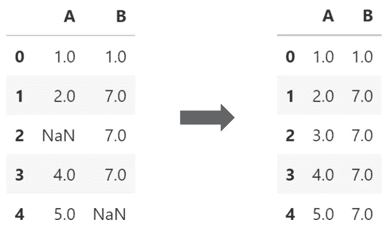
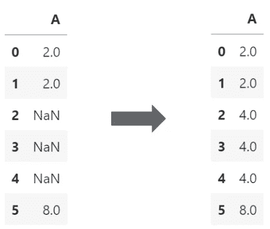
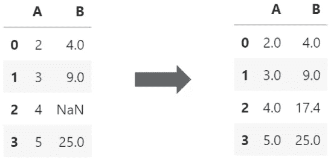
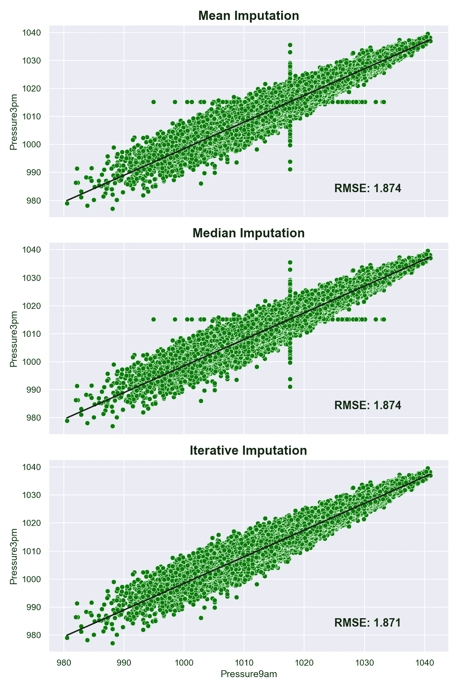

# 使用 Scikit-learn 进行迭代插补

> 原文：<https://towardsdatascience.com/iterative-imputation-with-scikit-learn-8f3eb22b1a38?source=collection_archive---------8----------------------->

## 使用高级插补策略增强模型结果

# 介绍

虽然对于许多数据科学家来说，拥有一个良好、干净且预处理需求最小的数据集是理想的场景，但真实世界的数据通常并不理想。某些预处理步骤(如归一化和变换)有助于创建可能的最佳模型，但在技术上是可选的，也就是说，如果忽略了输出质量的差异，可以在没有这些步骤的情况下创建模型。然而，一个不容忽视的常见问题是*缺少*数据。

用给定的统计方法填充缺失数据的过程被称为插补，有多种形式。在本文中，我将讨论一些最常见的插补方法，并将它们与一种更先进的方法**迭代插补**进行比较，这种方法可以增强模型结果。

# 常见插补方法

一些最常见的插补方法包括根据现有数据，用给定变量的平均值**或中值**填充缺失数据。在这两者之间做出选择很大程度上取决于正在处理的数据。在数据以某种方式倾斜的情况下，中位数可能更合适。相反，正态分布的数据可以使用平均值或中位数，因为两者相对来说是相同的。让我们来看看实现它们的几种方法。

## 使用熊猫和熊猫

用数字和熊猫来计算价值是小菜一碟。在下面的示例中，列`A`和`B`各有一个缺失值。然后使用 NumPy 中的`nanmean()`函数计算列`A`的平均值，并忽略任何缺失值。同样的过程应用于列`B`,取而代之的是中值。然后将`fillna()`函数应用于每一列，以填充缺失的值。下面显示了该代码的输出，右侧包含每个相应列的估算值。

图片作者。上面代码的输出。

## 使用简单估算器

Scitkit-learn 的`SimpleImputer` ( [查看文档](https://scikit-learn.org/stable/modules/generated/sklearn.impute.SimpleImputer.html))是估算缺失值的另一种方法。虽然看起来比 NumPy 和 Pandas 的例子稍微复杂一些，但是使用`SimpleImputer`有几个关键的好处。首先，缺失值可以设置为您喜欢的任何值，并且不必像在 Pandas 中使用`fillna()`函数那样等同于`np.nan`。此外，简单地通过改变`strategy`参数，插补策略可以在以下四个选项之一之间轻松改变:

*   `"mean"` —用平均值替换缺失值
*   `"median"` —用中间值替换缺失值
*   `"most_frequent"` —用最常见的值替换缺失值
*   `"constant"`-用`fill_value`参数中指定的任何值替换缺失值。在您希望用字符串“missing”而不是实际值来替换缺失值的情况下，这可能很有用。

图片作者。上面代码的输出。

# 迭代插补

仅在处理多变量数据时有用，scikit-learn ( [视图文档](https://scikit-learn.org/stable/modules/generated/sklearn.impute.IterativeImputer.html#sklearn.impute.IterativeImputer))中的`IterativeImputer`利用其他功能中可用的数据来估计要估算的缺失值。它通过一个…

> …迭代循环方式:在每一步，一个特性列被指定为输出`y`，其他特性列被视为输入`X`。已知的`y`在`(X, y)`上安装一个回归器。然后，使用回归变量来预测`y`的缺失值。以迭代的方式对每个特征进行此操作，然后对`max_iter`插补轮次重复此操作。返回最后一轮插补的结果。[ [来源](https://scikit-learn.org/stable/modules/impute.html#iterative-imputer)

如果这看起来仍然有点抽象，希望下面的例子将有助于澄清事情。由于`IterativeImputer`仍处于试验阶段，导入`enable_iterative_imputer`是使用的一个需求。

图片作者。上面代码的输出。

该虚拟数据的底层模式旨在使列`B`成为列`A`的平方。虽然并不完美，但`IterativeImputer`确实填充了一个有点接近“真实”值 16.0 的值。将结果与使用均值插补策略(12.7)或中值插补策略(9.0)获得的结果进行比较，可以清楚地看出在这种情况下使用迭代插补策略的好处。

# 使用真实数据的比较

我最近有机会用真实世界的数据集测试了`IterativeImputer`，同时创建了一个[澳大利亚第二天降雨预测模型](https://github.com/tjkyner/australian-rain-prediction)。虽然我不会在这里详细介绍整个项目，但它确实是一个很好的例子，说明迭代插补如何比一些更简单的策略更有益。使用来自[源数据集](https://www.kaggle.com/jsphyg/weather-dataset-rattle-package)的`weatherAUS.csv`文件，使用以下三种不同策略估算连续特征:

1.  平均插补
2.  中位数插补
3.  迭代插补

我选择比较`Pressure9am`和`Pressure3pm`特性，因为它们彼此直接相关，并呈现出线性关系，这对于评估非常有用。下面的代码用三种不同的策略估算缺失的数据，沿着回归线绘制数据，然后显示[均方根误差](https://en.wikipedia.org/wiki/Root-mean-square_deviation) (RMSE，越低越好)。

图片作者。上面代码的输出。

即使不考虑 RMSE 值，迭代插补策略也应该能突出显示出更好的拟合值。由于均值和中值策略用相同的值填充所有缺失值，因此在数据中心附近会形成一个十字形形状，这不一定符合总体趋势。然而，迭代插补策略能够利用包含在其他特征中的信息来近似该值，从而产生更清晰的图，更准确地符合趋势。

你可能认为 RMSE 从 1.874 提高到 1.871 没什么大不了的——你是对的。虽然它本身并不引人注目，但有几件事要记住:

1.  在`Pressure9am`和`Pressure3pm`特征中丢失的数据量只有大约 10%。因此，与均值和中值策略相比，RMSE 值只能提高这么多。
2.  这种比较仅针对两个要素，而完整的数据集包含更多要素。当在建模过程中使用所有数据时，这些特征中的每一个的小的改进可以导致整体的大的改进。

# 结论

在处理单变量数据时，使用平均值或中位数等简单的插补策略可能是有效的。处理多元数据时，迭代插补等更先进的插补方法可以产生更好的结果。Scikit-learn 的`IterativeImputer`提供了一种快速简单的方法来实现这样的策略。

**Github**:[https://github.com/tjkyner](https://github.com/tjkyner)
**中**:[https://tjkyner.medium.com/](https://tjkyner.medium.com/)
**LinkedIn**:[https://www.linkedin.com/in/tjkyner/](https://www.linkedin.com/in/tjkyner)