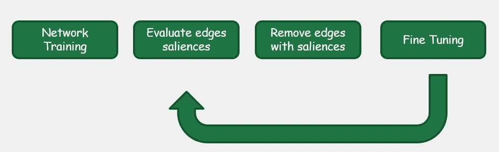

# Julia 中人工神经网络的迭代剪枝方法

> 原文：<https://towardsdatascience.com/iterative-pruning-methods-for-artificial-neural-networks-in-julia-c605f547a485?source=collection_archive---------10----------------------->


摩根·豪斯尔在 [Unsplash](https://unsplash.com?utm_source=medium&utm_medium=referral) 上的照片

## [思想与理论](https://towardsdatascience.com/tagged/thoughts-and-theory)

## 基于剪枝的压缩技术综述

近年来，深度学习模型在实时嵌入式应用中变得更加流行。特别是，这些模型已经成为从自然语言处理到计算机视觉等几个领域的基础。计算能力的增加有利于面对**实际挑战，这些挑战已经通过采用广泛的神经网络**得到解决；随着网络越来越深入，模型大小也增加，**引入了对指定输出没有贡献的冗余参数**。最近，研究人员专注于如何通过修剪多余的参数来减少存储和计算能力而不损害性能的不同方法。

本文的参考实现语言是 Julia [1]，这是一种最近开发的面向科学计算的编程语言。特别是，我们将扩展 Flux 库[2，3]，通常用于机器学习。

## 为什么修剪？

**自 80 年代末开始使用的剪枝算法**【4，5】**包括从网络中删除单个权重或整个神经元，以减少冗余，同时不牺牲准确性**。为了在通过示例训练的系统中获得良好的泛化能力，应该使用适合数据的最小系统[6]。经验证据表明，训练一个大型网络，然后压缩它，比从头开始训练一个较小的网络更容易[7]。


(*作者图片*)

这种方法的问题在于，通过**去除太多的边缘，可能会丢失所学的内容**。主要的困难在于找到最佳的模型尺寸。因此，我们可以将剪枝视为一个神经网络架构搜索[8]问题，目标是**为所考虑的任务**找到最佳网络。修剪方法的各种实现主要在四个方面不同:

*   **结构**:结构化剪枝包括消除网络中的整个神经元，并允许使用更小的矩阵来加速计算。另一方面，非结构化修剪更灵活，因为它允许消除单个连接，但不能有效地加速神经网络的计算。


(*图片作者*)

*   **显著性**:可以被视为与每个边缘相关联的重要性，根据所采用的策略来确定是否应该消除它
*   **调度**:决定每一步要淘汰的网络比例。例如，一次性修剪包括在一个步骤中消除网络的期望百分比。其他可能的策略是在每一步消除网络的恒定部分，或者采用更复杂的调度功能。
*   **微调**:在修剪阶段之后，准确度通常会下降，因此重新训练网络以稳定它可能是有用的。有不同的可能方法来处理微调。在边缘消除之后，可以使用修剪步骤之前具有的相同权重(没有被消除)来训练，或者使用在某个先前阶段具有的边缘的权重，或者从开始重新初始化剩余的边缘

## 数量修剪

这是最简单的剪枝算法。在共同训练阶段之后，去除具有较低显著性的连接。链接的显著性仅由其权重的绝对值给出。幅度修剪有两种主要的变体。一旦所需百分比的连接被固定，**逐层幅度修剪**将从每层移除该百分比的边，而**全局幅度修剪**将从整个网络移除一个百分比，而不区分层。更复杂的分层剪枝技术引入了灵敏度分析阶段，允许为每层指定不同的稀疏度阈值，以便在不太敏感的层中消除更多的边(即那些权重的消除对网络结果影响较小的边)。首先，**总是需要一个训练阶段，以便了解哪些是网络最重要的连接**，那些具有最高绝对值的连接。**在消除**显著性较低的连接后，**网络性能将会下降**。



(*图片作者*)

由于这个原因，从最后获得的权重开始重新训练网络而不从头重新初始化参数是必要的。修剪参数的百分比越高，精度下降越多，这就是为什么修剪通常迭代地进行，一次消除一小部分网络。这意味着需要一个时间表，在这个时间表中，我们指定要删除的网络部分，分多少步，每一步要删除多少个连接。

## 镗孔预处理步骤

```
**using** Flux: onehotbatch , onecold
**using** MLDatasetstrain_x , train_y = CIFAR10.traindata()
test_x , test_y = CIFAR10.testdata()X = Flux.flatten(train_x)
Y = onehotbatch(train_y , 0:9)test_X = Flux.flatten(test_x)
test_Y = onehotbatch(test_y , 0:9)data = Flux.Data.DataLoader ((X,Y),batchsize = 128, shuffle=true)
test_data = Flux.Data.DataLoader ((test_X ,test_Y), batchsize = 128) 
```

## 快速实现

修剪通常通过将权重设置为零并在随后的训练中冻结它们来实现。我的实现使用了一种基于元素的操作，将权重矩阵乘以二进制剪枝掩码。


(*图片作者*)

第一个矩阵代表神经网络层的权重，而第二个矩阵是**掩码，它将某个阈值**下的所有值设置为零，在本例中为 0.5

在 Flux 中，简单的致密层由两个基本部分定义。首先，一个 struct 包含三个字段:权重、偏置和激活函数。

```
**struct** Dense{F, M <: AbstractMatrix , B}
  weight :: M
  bias::B
  sigma::F
end
```

第二个关键部分是表示向前一步计算的函数，如下所示:

```
**function** (a::Dense)(x:: AbstractVecOrMat)
  W, b, sigma = a.weight , a.bias , a.sigma
  **return** sigma.(W*x .+ b)
end
```

我开发的实现扩展了 Flux 提供的实现，如前所述，添加了带有矩阵掩码的 Hadamard 乘积。然后，层 PrunableDense 被定义为一种结构，该结构通过添加用于位矩阵的字段来重用密集层:

```
**struct** PrunableDense
  dense :: Dense
  mask:: BitMatrix
end
```

其次，我们重新定义了前向阶跃函数，以包括掩模矩阵的哈达玛乘积:

```
**function** (a:: PrunableDense)(x:: AbstractVecOrMat)
  W, b,sigma , M = a.dense.W, a.dense.b, a.dense.sigma , a.mask
  **return** sigma .((W.*M)*x .+ b)
end
```

现在你可以用你想要的方式使用这些可修剪的密集层，然后减少你的神经网络的大小！

## 文献学

[1]杰夫·贝赞森、艾伦·埃德尔曼、斯特凡·卡尔平斯基和维尔拉·B·沙阿。朱莉娅:一种新的数值计算方法。暹罗评论，59(1):65–98，2017。

[2]迈克尔·英尼斯、埃利奥特·萨巴、基诺·菲舍尔、达里亚·甘地、马尔科·康采托鲁迪洛索、尼图·玛利亚·乔伊、泰詹·卡尔马里、阿维克·帕尔和维尔拉·沙阿。带有通量的时尚造型。更正，abs/1811.01457，2018。

[3]迈克·英尼斯。通量:优雅的机器学习与朱莉娅。开源软件杂志，2018。

[4]史蒂文·雅诺夫斯基。《神经网络中的剪枝与剪枝》,物理评论 A，39:6600–6603，1989 年 6 月

[5]戴维斯·布拉洛克、何塞·哈维尔·冈萨雷斯·奥尔蒂斯、乔纳森·弗兰克尔和约翰·古塔格。神经网络剪枝是什么状态？arXiv 预印本:2003.03033，2020。

6 Anselm Blumer、Andrzej Ehrenfeucht、David Haussler 和 Manfred K Warmuth。奥卡姆剃刀。信息处理通讯，24(6):377–380，1987。

7 拉塞尔·里德。剪枝算法-综述。IEEE 神经网络汇刊，4(5):740–747，1993。

[8]，孙明杰，周廷辉，，和特雷弗·达雷尔。重新思考网络修剪的价值，2019。