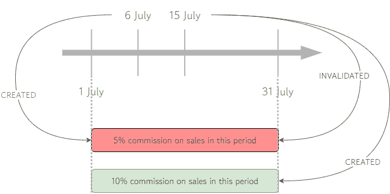

# 这只是语义|数据如何自己说话(不)

> 原文：<https://towardsdatascience.com/its-just-semantics-how-data-speaks-not-for-itself-d8c036ae96b5?source=collection_archive---------34----------------------->

## 一致的见解需要一致的数据

过去三个月你有多少活跃客户？在这篇文章的结尾，如果你回答“看情况”，我已经达到了我的目标。没有上下文，这个问题应该是不可能回答的。

戴维·特拉维斯在 [Unsplash](https://unsplash.com?utm_source=medium&utm_medium=referral) 上拍摄的照片

是的，我是那种“视情况而定”的人。当你问他们一个问题时，他们会用另一个问题来回答。正如喜剧小品《[专家](https://www.youtube.com/watch?v=BKorP55Aqvg)》(看着很痛苦，因为这确实很真实)中所描述的那样，专家知道这个问题是不合理的，并尽力解释为什么他需要更多的上下文，以便“用透明墨水画出 7 条垂直的红线”。

如果你想回答我关于活动客户端数量的第一个问题，你可以很快给出答案。然而，这将是一个错误的或不完整的答案，因为你没有问我对“客户”、“活跃”的定义是什么，或者哪些日期对所述三个月的衡量是重要的。

在这种特殊情况下，如果某人的每月订购借记订单在您所想的 3 个月内有效(他选择了 30 日)会怎样？但因为是公共假日，它实际上只在 1 号爆炸，不在你想查看的三个月期限内。如果第一天他的账户里没有足够的钱，并且被拒绝了怎么办？他活跃吗？是三个月以内吗？他现在也取消了订阅，但只在下个月生效…

为了证明这一点，我把这个例子弄得过于复杂了……上下文很重要。仅仅通过查看原始的不一致的数据，是不可能对算法有意义的。关于这些学究式的问题中哪一个是不必要的，需要一些解释。

# 业务和技术有效性

当我 12 年前开始我的职业生涯时，我的老板教给我的第一课是技术生效日期和业务生效日期之间的区别。从那时起，我一直认为这种区别是常识，直到在我的日常对话中出现了某种趋势。起初我以为只是我，然后随着越来越多的会议突然出现，有效日期完全被混淆，我开始接受这样的想法，也许不是我，也许是你。

我不得不多次重复这个对话……多年来在不同的背景下，有时是对同一个人。就在那时，我意识到常识并不那么普遍(借用伏尔泰的一句话)

我觉得说出来很傻，但我会说的。

技术生效日期不同于业务生效日期。数据可以是技术上有效的，但不是业务上有效的。数据可以在业务有效期内，但在技术上无效。不同的来源和不同的系统处理技术有效性和业务有效性的方式完全不同。

在我职业生涯的开始，我在 SAP 中开发了一个模块，这个模块处理得非常好，这是我还没有在其他地方看到过的。这是一个巨大的领域开销，但毫无疑问，数据是什么。只有当我开始看到其他系统中缺少这一点时，我才明白为什么它经常如此令人困惑。简而言之，每个对象有七个元数据字段来描述这一点:技术来源、技术目的、业务来源、业务目的、版本、无效对象标志和无效版本标志。有了这七个字段，你就知道发生了什么。

我就用一个例子来说明。销售代理合同上有一条佣金规则，规定对产品的销售收取 5%的佣金。该规则是在 7 月 6 日(技术有效期)技术上创建的(用户在前端键入)。然而，该规则本应在 7 月 1 日至 31 日生效(商业有效期)。后来它被删除了(技术上在 15 日被删除),并建立了一个新的规则，规定 10%的佣金具有相同的有效性。上面列出的七个元数据字段能够很容易地描述这种情况。

作者图表

我不打算讨论这七个字段是否在每种情况下都值得，但是有这么多的数据信息消除了任何可能的混乱。它让我明白了真正理解每个数据点背后的背景需要什么。

如果你能接受源代码系统会以不同的方式处理这一事实，这对你(从精神健康的角度)会有好处。即使在一个源系统内部，它也可以被不同地处理。

我还看到源系统在开始时以“保持简单愚蠢”的方式开始，然后系统地向表中添加更多的技术日期。你逐渐看到这个易读的 KISS 模型变形为一个不连贯的 WTF 模型。一些源系统有一个仅包含当前记录的活动表，并将它们的历史表保存在单独的表中。其他人有混合。

所以不要试图修复上游系统，你会失败的。我们应该接受不同的来源会以不同的方式呈现这一点，照原样阅读数据，或者试图照原样连接数据，无论如何都不是一件简单的任务。

# 小麦

所报告的数据的粒度指的是所存储的细节的级别，以及在数据集中暴露了哪些相关联的对象。以保险为例:支付的保费值是存储在客户和利益层，还是仅汇总到客户和月度视图中？(也就是说，您是查看所有产品的累计保费，还是单独查看您的人寿保险和您的猫的宠物保险)

在谈论谷物时，一些常见的混淆是围绕产品、子产品以及它们之间的分组。产品的标签和等级结构，特别是在保险和投资行业，会使这变得复杂。然而，随着公司开始收集或收购其他公司，这些公司的产品具有不同的标签和结构，数据集必须合并或存放在一起，情况变得更加复杂。

# 语义学

你必须预先定义某些术语的含义。这听起来是显而易见的常识，对吗？还记得我之前说的常识吗？这一点往往没有做到(我自己也不觉得羞耻)。我想是因为人们不想为了确立这个意义而问太多的问题，让自己觉得或者显得很愚蠢。

一段时间前，我是一个团队的成员，负责一个俄语项目，我没有提前询问地域、地区、区域和分支之间的不同含义。(也许是因为它的所有俄语版本听起来都类似于以英语为母语的人。(Прошу прощения, мои русские коллеги!).很长一段时间，我都认为它们是一回事，只是同义词而已。事实上，它不是。事实证明，在许多业务流程中，理解这种差异非常重要。

所以，简单的规则…不要觉得自己很蠢。经常并尽早询问某些商业术语的含义，并有一个核心术语表。人们会克服最初认为你的问题愚蠢的想法(可能在 10 秒钟内)，或者他们会觉得不那么愚蠢，因为他们也不知道。

真的，是双赢。我向你保证，房间里还有另一个“愚蠢”的人，非常感激你问了他没有勇气提出的问题。(当然，不要傻傻地在俄罗斯问这个问题，因为这可能是你问的最后一个问题)

下面是我看到的其他几组术语的列表，它们之间的区别经常不清楚:

*   政策、计划、协议、利益、产品
*   当事人、客户、顾客、销售线索、潜在客户
*   中介、经纪人、顾问、销售代理
*   证券、工具、投资工具、投资组合

这些都是你 ***认为*** 的例子，你知道它的意思，但我保证另一个组织或业务单位在完全不同的上下文中使用相同的术语。甚至你自己团队里的人也会对它的含义有不同的看法。

同样，和有效期一样，不同的来源会有不同的标签。不同的源也会以不同的方式处理层次结构或分组。因此，确定需要建模的业务实体并确保目标消费者同意它们的意思是很关键的。

这就是我大力支持能够在敏捷和快速失败的环境中工作的原因。问题是，即使我说你应该得到企业的同意，他们也不会知道，直到你向他们展示错误的东西。

因此，或许我可以稍微改变一下我的建议:让他们明白你的想法，让他们告诉你这是多么错误(他们会的)。

我一开始说背景很重要。原始数据需要在对消费者或消费算法有意义的上下文中呈现。算法获得的训练数据将假设关联是正确的。有人仍然需要决定如何连接来自不同来源的原始数据，以便它们以相同的语义意义注册，具有相同的粒度并与相同的时间有效性相关联。

对于受过训练的人来说，这听起来很像是我在提倡历史上被称为数据仓库的东西。在数据湖时代，它最近经历了许多标签，“策划”或“消费者”区，以及数据湖屋的出现。我现在不打算详细说明这一点，因为我正试图接触受过训练和未经训练的人，要全面地解决这个问题需要更多的背景知识。

组织正在收集越来越多的数据，要么通过收购其他公司(因此无法控制上游来源如何构建数据)，要么探索不同的方法从客户那里收集数据。这不可避免地意味着，BI 环境经常会得到一张医院通行证，并被指示去理解这种疯狂——去“基于所有这些丰富的信息创造洞察力”。

一些应用可能不像其他应用那样依赖于时间，或者说，不正确的时间完整性的后果并不严重。然而，如果你在精算应用中弄错了粒度和关联，你可能会产生一个漂亮的预测模型，预测下一个索赔将来自哪里。然而，它将成为算法的装饰性植物:漂亮，但没什么用。

我们应该小心，不要迷失在我们试图创造的所有这些见解的宣传中，并记住只有一致的数据才能提供一致的见解。

那么，让我们再试一次:在过去的三个月里，你有多少活跃的客户？