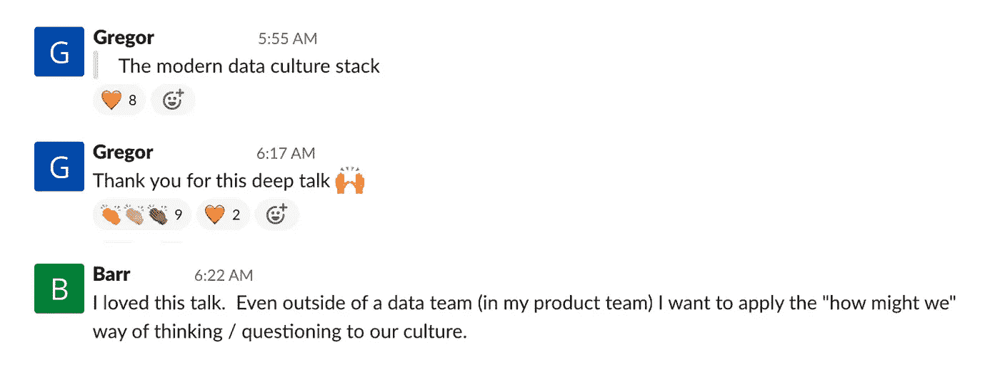
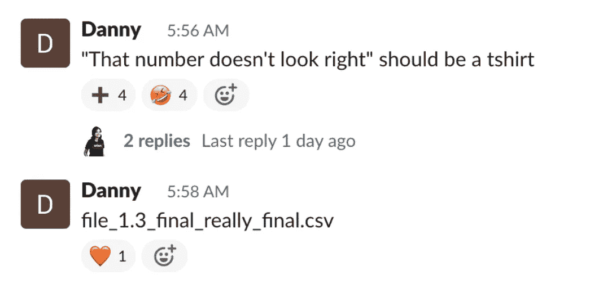
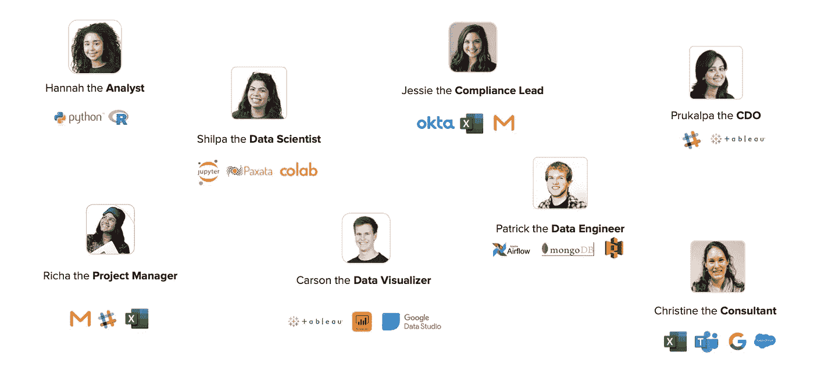
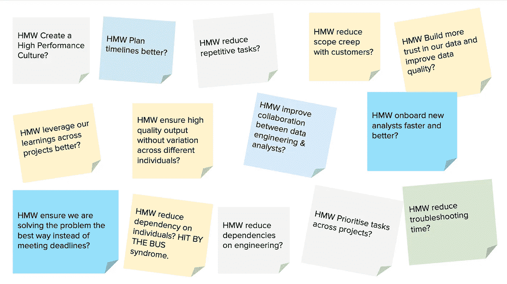
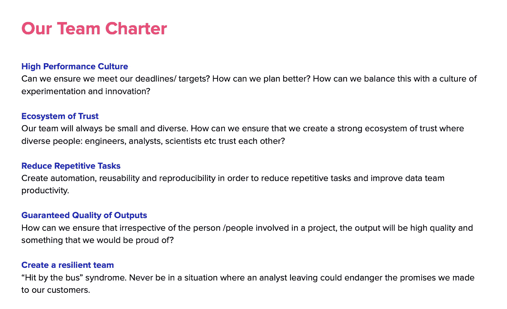
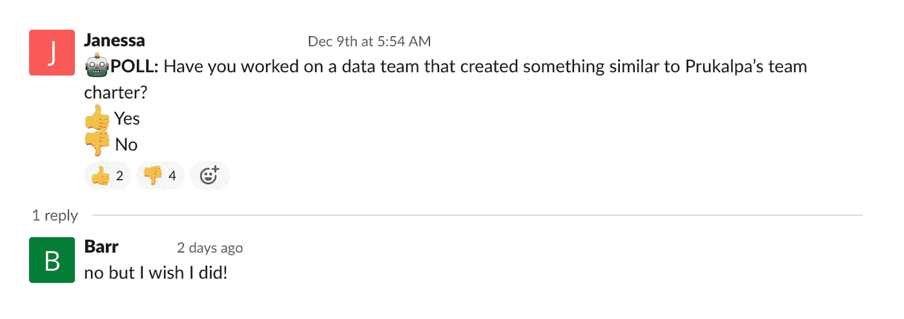
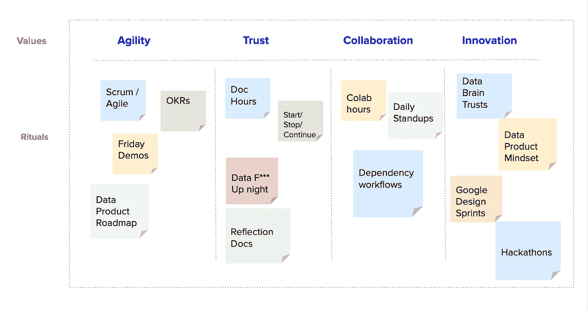
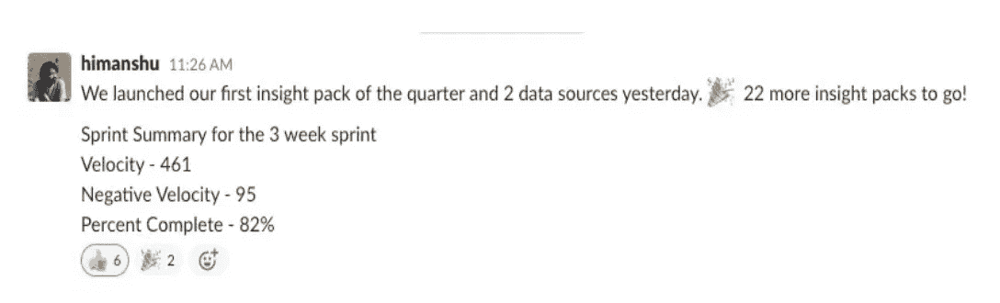
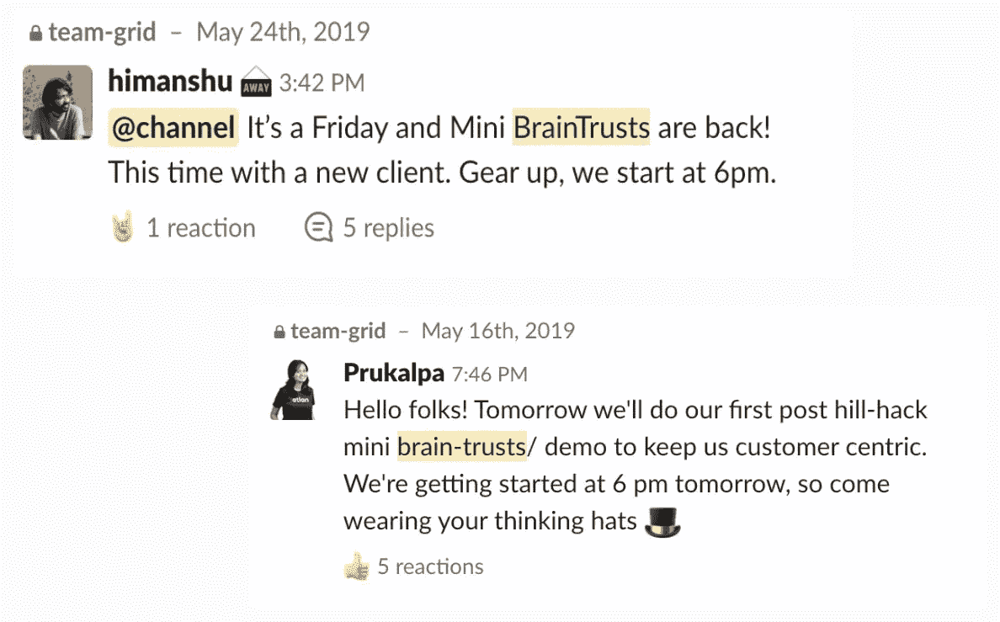
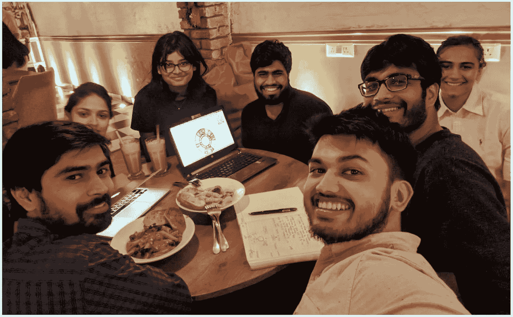

# 现代数据文化栈的时代到了

> 原文：<https://towardsdatascience.com/its-time-for-the-modern-data-culture-stack-493036315ed2?source=collection_archive---------16----------------------->

## [行业笔记](https://towardsdatascience.com/tagged/notes-from-industry)

## 建立一个理想的数据团队不仅仅是使用正确的数据堆栈。

由[罗伯特·阿纳奇](https://unsplash.com/@diesektion?utm_source=unsplash&utm_medium=referral&utm_content=creditCopyText)在 [Unsplash](https://unsplash.com/?utm_source=unsplash&utm_medium=referral&utm_content=creditCopyText) 上拍摄

几天前，我在 [dbt Coalesce](https://coalesce.getdbt.com/) 做了一个关于我建立数据梦之队的经历的演讲，在那里我引入了一个术语，我称之为**“现代数据文化栈”**。这是我多年来一直在思考的话题，但即便如此，我还是对社区的反应感到惊讶。

*来自我演讲期间的 dbt Slack 讨论。(图片由 Atlan 提供；编辑删除全名和照片。)*

在过去的两年里，关于现代数据堆栈——改变了我们工作方式的工具——有太多的噪音。就像应该有的那样。坦率地说，在现代数据堆栈出现之前，我们处理数据的方式已经支离破碎。数据世界的第一个“增量”自然需要来自让数据团队变得更有效的工具。

在过去的四年中，现代数据栈取得了巨大的进步，由于采用了像雪花和 dbt 这样的工具，它已经成为主流。由于新工具的出现，现代数据堆栈中早在去年就存在的缺口(在元数据管理、数据治理和可观察性等领域)正在迅速得到填补。随着这一领域如此多的创新，我确信在未来几年内，所有数据团队将最终拥有一个接近“完美”的数据堆栈。

这让我相信，随着我们进入 2022 年，对话需要从对更好工具的需求转移到下一个“delta ”,最终帮助我们创建梦想数据团队——现代数据文化堆栈。这些是最佳实践、价值观和文化习俗，将帮助我们这些不同的数据人(或 dbt 创造的“[紫色人](https://blog.getdbt.com/we-the-purple-people/)”)走到一起，有效地合作。

# 构建理想数据团队的挑战，或者为什么每个数据团队都需要文化堆栈

*喜欢这个！(来自我演讲时 dbt 的 Slack 社区。图片由 Atlan 提供；编辑以删除全名。)*

多年来，我一直在为建设优秀数据团队的承诺和挑战而奋斗。数据驱动的团队有潜力在未来几年推动最伟大的创新，如消除 COVID，使自动驾驶汽车成为现实，或将人送上火星。但是我们都知道作为一个数据团队一起工作的日常困难…

*   当一个重要的仪表板坏了，一大早就疯狂地给工程师打电话
*   “看在上帝的份上，给我数据吧”的请求在几周的等待后
*   老板发来的令人揪心的“这个数据看起来不对劲…”电子邮件
*   “难道‘column _ xxy 81’的意思不明显吗？”或者“为什么会有‘file _ 2 _ final _ final . CSV’和‘file _ 3 _ final . CSV’？!"关于时差的问题

之所以如此困难，是因为…嗯，数据团队是有史以来最多样化的团队之一。他们由分析师、工程师、分析工程师、科学家、业务用户、产品经理等等组成——所有人都有自己的工具偏好、技能和限制。结果是协作开销和数据混乱。

我们数据团队的成员及其个人工具偏好。(图片来自 Atlan。)

亚特兰蒂斯诞生于这些挑战之中。2016 年，我们启动了“流水线项目”，开始测试新的方法，让我们的团队更加敏捷，减少开销，提高生产力，建立弹性。两年后，我们的敏捷度提高了六倍。我将这 6 倍的敏捷性归因于两个关键驱动因素——我们的**技术栈**(或现代数据栈)，以及我们的**文化栈。**

> *建立理想的数据团队不仅仅是使用正确的数据堆栈。这是关于建立一个强大的文化堆栈。*

我将详细介绍我们是如何创建这种文化体系的，以及我们在反复试验后发现的最佳实践。这并不意味着您应该采用这些确切的做法！相反，它们是帮助你自己的团队思考什么适合你的一个起点。

# 1.为你的文化堆栈打下基础:团队价值观和章程

我们首先召集我们的整个数据团队进行了一次模拟谷歌设计冲刺[的练习。](https://designsprintkit.withgoogle.com/methodology/phase1-understand/hmw-sharing-and-affinity-mapping)

我们都充满了挫败感，但是几个小时的抱怨并不能帮助我们前进(尽管感觉很棒！).因此，我们使用 **HMWs** 或“**我们如何能够**”问题，将我们的痛点重新定义为机会。

这些成为了我们数据团队的梦想清单——所有我们希望在未来做得更好的事情。

*我们如何提问的例子。* ( *图片由 Atlan 提供。)*

然后，我们将这些目标转化为团队章程，或我们希望我们的数据团队遵循的关键价值观。

我们多年前的团队章程。(图片由 Atlan 提供。)

这个章程不一定要完美。(显然，我们的不是！)我们没有花费大量的时间来精心设计美丽的语言，而是确保我们达成一致并继续前进。

*来自 dbt 的 Slack 社区。(图片由 Atlan 提供；编辑删除全名和照片。)*

# 2.用强化你价值观的仪式将价值观转化为行动

很多人认为文化“就这么发生了”。这是一种神秘的生物，这就是它的本质…

我坚决不同意。[文化不是凭空产生的。通过将你的价值观转化为更具体的东西，你可以努力创造你渴望的文化。我们通过“仪式”做到了这一点。](https://hbr.org/2016/07/dont-let-your-company-culture-just-happen)

例如，我们最终将我们团队的章程固化为 4 个关键价值观:敏捷、信任、协作和创新。然后，我们通过将每个价值映射到特定的仪式，努力将它们转化为真实的东西。

将我们的文化价值观映射到新的团队仪式中。(图片由 Atlan 提供。)

人们对可能有帮助的仪式有不同的想法，所以我们尝试了许多新的传统和流程。有些效果很好，有些则很糟糕。但是在这个过程中，我们学到了更多关于如何帮助我们的团队一起工作的知识。

总之，这些习惯成为了**文化堆栈**，为我们的数据堆栈和人员堆栈提供动力，并帮助我们变得更加快乐和敏捷。

*来自 dbt 的 Slack 社区。(图片由 Atlan 提供；编辑删除全名和照片。)*

# 3.推出新的仪式，自下而上而不是自上而下

我非常相信以自下而上而不是自上而下的方式来促进文化仪式的建立。由于这个原因，我认为构建一个新的仪式观念的最好方法是一个“**实验**”。如果实验成功了，那么它就会成为一种仪式，成为你的团队工作的一种方式。如果不行，你就试试别的。

以下是创造这些新仪式的一些最佳实践:

*   **从就共同的原则和问题达成一致开始**:确保你理解并同意贯穿你的仪式的具体想法。例如，我们的一个习惯是每季度进行一次[开始、停止、继续练习](https://www.teamretro.com/retrospectives/start-stop-continue-retrospective/),以揭示我们作为一个团队想要解决的最大问题。
*   **让团队达成共识:**在我们第一次开始尝试敏捷和 Scrum 之前，我们整个团队都阅读了《T2 Scrum》一书来理解这个过程背后的基础。**这是关键。像 Scrum 这样的新流程看起来像是一个巨大的开销——如果自上而下地执行，它很可能会变成另一个苦差事。**
*   **衡量您的进步:**我们毕竟是数据人！对我们来说，每周的速度测量和完成百分比目标有助于激励团队，让我们不断前进。一条简单的每周 Slack 消息向我们展示了我们是如何前进和改进的，这让世界变得不同。
*   建立一种有益提问的文化:没有人会有正确的答案，所以重要的是放下自我，创造开放、友好的交流。例如，在我们的日常站立活动中，我们会问这样的问题:“你为什么没有实现本周的目标？”或者“是什么阻碍了你完成这项任务？”。创造一种彻底坦诚和信任的文化有助于我们不断学习如何在未来做得更好。

我们的每周进度信息。(图片由 Atlan 提供。)

# 😍聚焦我们最喜爱的仪式，帮助我们实践我们的价值观

## 支持创新的数据智囊团

我们担心关注业绩会降低我们的创新能力，所以我们成立了**智囊团**。(这是我们无耻地借鉴了皮克斯的想法，并为我们的数据团队做了修改。[阅读这个伟大的观点，了解他们是如何做到的。](https://www.fastcompany.com/3027135/inside-the-pixar-braintrust))

大多数情况下，只有一两个人从事一个数据项目，但是整个团队都有集体的知识，并且从过去的项目中学到了有用的东西。

在我们的智囊团中，我们会很快将这些知识用于早期项目。我们召集团队 30 分钟，向每个人简要介绍项目，然后通过结构化的头脑风暴过程来帮助每个人创造和贡献他们的创新想法。

一些松散的消息宣布我们的智囊团会议。(图片由 Atlan 提供。)

## 数据抄袭方支持信任和协作

由于数据团队如此多样化，人们很难理解彼此的挫折。

例如，销售主管可能一开始是销售代表，但大多数数据经理都不是数据工程师，大多数数据工程师都不是分析师。因此，当仪表板损坏时，分析师很容易质疑，“工程师是否完成了他的工作？!"或者让数据团队互相攻击。

这些抄袭派对有助于将这些不满公开化。我们在一个周五的晚上抽出一两个小时，坐在一起吃晚饭，开始抱怨那个星期出了什么问题。这些非但没有带来麻烦，反而帮助我们增强了对彼此工作的同理心和理解。

*我们的一个数据剽窃团体的照片。(图片由 Atlan 提供。)*

这只是两种仪式的一个例子，但是我们投资了大量其他的仪式，比如每日站立、[实施敏捷](https://humansofdata.atlan.com/2020/04/scrum-for-remote-data-team/)、鼓励运输文化的每周演示，以及文档时间。

我不想在这里写一本书，所以我将在我的[周刊时事通讯中深入探究我们的文化仪式。](https://metadataweekly.substack.com/)

# 对数据领导者的一些最终想法

随着 2022 年的到来，我建议大力投资现代数据文化体系，就像投资现代数据体系一样。就像你的数据栈一样，建立一个更好的文化并不容易或迅速。这需要时间、信任和实验。会有很多失败，但如果你不断评估和沟通，你最终会拥有一个梦想的数据团队。

如果你真的想建立一种数据文化，我也建议你考虑建立一个“数据支持”团队。这可以模仿一个[销售支持团队](https://www.hubspot.com/sales-enablement)，该团队负责推动销售的文化仪式、支持和项目管理。这些角色非常新，所以你可能想在你的团队中寻找对文化和团队建设有热情的人。我认为非常适合的人物角色类型是具有构建社区或项目管理天赋的分析师，或者是“参谋长”类型的人。

*当你步入 2022 年时，问问你自己——你的团队中是否有人的全职工作是考虑你的数据文化堆栈？*

**觉得这个内容有帮助？在我的时事通讯《元数据周刊》上，我每周都写关于活动元数据、数据操作、数据文化和我们的学习建设的文章。** [**在此订阅。**](https://metadataweekly.substack.com/)