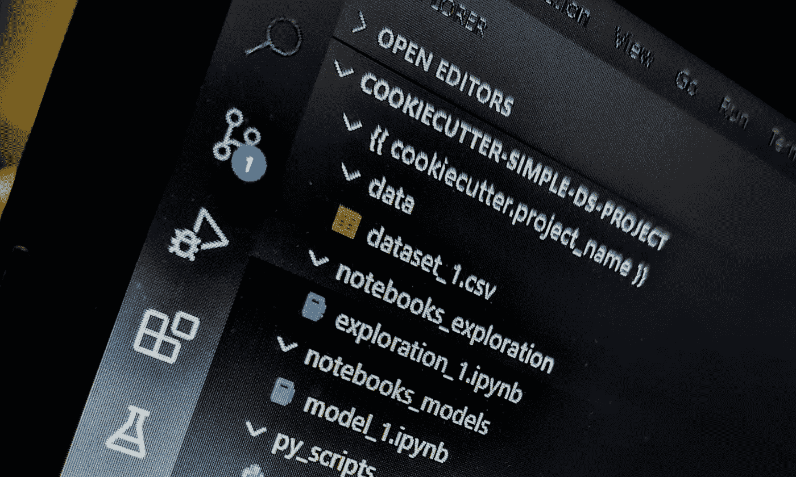
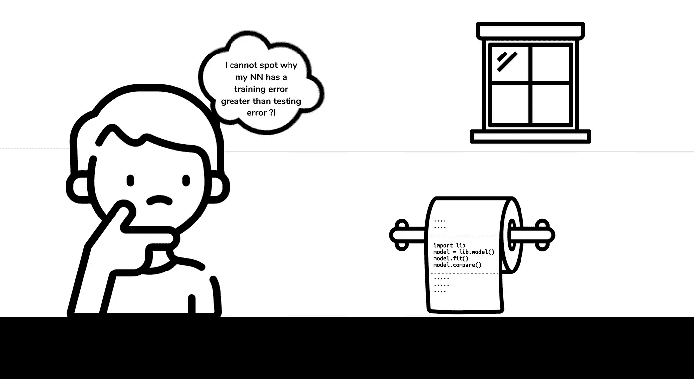
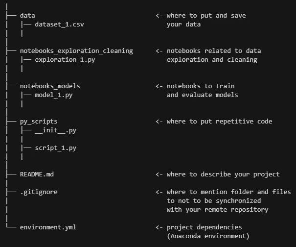
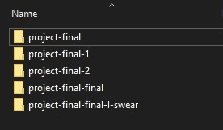

# 是时候构建您的数据科学项目了

> 原文：<https://towardsdatascience.com/its-time-to-structure-your-data-science-project-1fa064fbe46?source=collection_archive---------12----------------------->

## 构建数据科学项目的简单模板



[作者插图]

# 为什么笔记本电脑在数据科学界如此受欢迎？

当你深入数据科学领域时，你会很快注意到[笔记本](https://en.wikipedia.org/wiki/Notebook_interface)是工作和分享数据科学项目的常用工具。

在某种程度上，这是一个有充分理由和良好基础的选择。笔记本将代码、图形和文本汇集在一个单一快速的交互式“生态系统”中。

*让我们退一步讲，*

要运行一行 python 代码，我可以说没有什么比直接在控制台中执行它更快的了。然而，当您必须运行多行代码时，这就变得不方便了。想象一下，在一个控制台中定义一个功能是多么的笨拙和不切实际。

另一方面，python 脚本是创建和执行长代码的一种便捷方式。然而，它在数据科学的环境中也是不切实际的，因为它不能很好地扩展。事实上，无论何时你想写一段代码，你都必须创建一个 python 文件。因此，花点时间想想在一个数据科学项目中创建的笔记本单元的数量。当然，它将让您了解您将创建多少 python 文件，以及确保它们的执行顺序是多么具有挑战性。

**简而言之，笔记本提供了一种运行 python 代码的方式，就像在控制台上一样快，同时还能编写代码片段。因此，它们扩展了基于控制台的行为，并增加了交互性。**

就我个人而言，我发现这些是使笔记本电脑在数据科学社区中获得如此巨大人气的核心功能。

# “一个笔记本结构”运行良好，直到…

作为一名数据科学学生，我过去常常以笔记本的形式提交我的作业和微型数据科学项目。除了我上面提到的优点之外，在一个笔记本上组织我的工作也很方便，因为我可以嵌入图形和[注入降价](https://jupyter-notebook.readthedocs.io/en/stable/examples/Notebook/Working%20With%20Markdown%20Cells.html)来编写文本/等式，从而进一步阐述我的推理。

直到我参与了一个研究实习，我才意识到这个“**一个笔记本结构**”的局限性。特别是，我注意到当项目变得越来越大时，这种方法不能很好地扩展。

当我开始获取、清理和探索数据时，单元格的数量呈指数级增长，我很快就被数量庞大的变量淹没了。此外，当尝试新的方法时，我注意到我一直在写重复的代码。最后，为了避免变量之间的歧义以及一些笔记本单元格不会影响其他单元格，我将代码的一些(许多)部分切换到注释中。老实说，我通常会关闭[笔记本内核](https://jupyter.readthedocs.io/en/latest/projects/kernels.html)并重启环境。

**简而言之，在一个笔记本中编写整个项目的代码是不切实际的，在这个笔记本中，人们获取、探索和清理数据，然后设置、训练和评估模型。**

如果一个人想发现一个 bug，或者决定在一个又长又乱的笔记本上做些什么，这甚至会是一个噩梦，笔记本上满是切换成注释的代码块。

从这次不幸的经历中，我明白了“一个笔记本结构”并不是处理大项目的最佳选择。



[作者的迷因]

# 在采取行动之前先谷歌一下

我相信数据科学是软件编程和应用数学(概率、统计、优化……)之间的接口。在从事数据科学项目时，我经常意识到我编码比其他任何东西都多。清理数据需要代码，理解数据需要可视化，而可视化又需要代码，…

当我编码时，我开发了所谓的“谷歌一下”反射。因此，每当我忘记/怀疑某件事或陷入某个错误时，我就简单地谷歌一下。

> “有人说一个软件工程师只是一个专业的谷歌搜索者”， [Fireship，如何像一个高级软件工程师一样“谷歌一下”。](https://thedailytechie.com/how-to-google-it-like-a-senior-software-engineer/)

就个人而言，养成这种习惯是最好的救生习惯之一，它可以让你从用详细的包装文件来填充大脑中解放出来。与其死记硬背，不如学会如何高效地搜索信息。

接下来，我浏览了互联网来寻找我的问题的解决方案，特别是一个用于组织的项目结构，从而能够扩大我的工作。显然，我找到了我要找的东西。我发现了一个千篇一律的模板项目:“ [cookiecutter data-science](https://drivendata.github.io/cookiecutter-data-science/) ”。它是一个千篇一律的模板，旨在提供一个标准化的数据科学项目结构。

# 标准项目结构背后的动机

我承认我的不幸经历让我明白我是多么迫切地需要一个项目结构。然而，在仔细研究了模板[描述](https://drivendata.github.io/cookiecutter-data-science/)和它的 [GitHub 库](https://github.com/drivendata/cookiecutter-data-science)之后，我更加确信标准结构的重要性，并且意识到它为“你和其他人”提供的优势。

一方面，它可以有效地组织思想和代码，从而加快工作流程。所以，你不会在“路中间”迷路，或者站在笔记本前无语地想“我到底在想什么”。

另一方面，它保证了代码的可共享性和可复制性。因此，其他人将能够快速直接跳转到他们感兴趣的代码部分。更重要的是，他们不会在重新执行你的代码时遇到麻烦。

我立刻认为我解决了我的问题，我所需要的就是采用这个项目结构。然而，这并不像我想象的那么容易。的确，**熟悉包含一些文件和文件夹的项目结构非常困难，以至于我完全忽略了它们的用途——尤其是对于像我这样的初学者。**

为了使这个项目结构适应我的用例，我花了几个小时的思考和实验来理解这个结构，并根据我的需要调整它。最后，我决定采用下面的结构:"**简单的 DS 项目**"

# “简单的 DS 项目”结构

在这一节中，我将详细介绍“**简单 DS 项目**”结构的每个组件。此外，我将强调每一个项目背后的目的和动机。



“简单的 DS 项目”结构[作者插图]

## “数据”文件夹

数据科学的一个基本目标是从数据中获得洞察力。因此，它是必不可少的成分。

该文件夹的目的是收集所有项目原始数据。另一方面，它也可以作为一个“桶”,用来保存预处理过的数据，以避免每次都重复相同的操作。

## “笔记本 _ 探索 _ 清理”文件夹

该文件夹将包含所有与数据清理相关的笔记本。但是*为什么把探索和清理放在一个文件夹里，而不把它们分开放在不同的文件夹里呢？*

在我参与的每个项目中，我从来没有能够独立于清理数据来探索数据(反之亦然)。事实上，正是在探索阶段，我决定了如何处理这些数据。例如，在可视化数据列中缺失值的比例之后，我决定如何处理它们(例如，删除它们，或者用中位数替换它们……)。

最后，在探索-清理您的数据之后，确保将它保存在**“data”文件夹**中，以便以后在构建模型时使用。

## “笔记本 _ 模型”文件夹

顾名思义，这个文件夹专门用于构建、训练和评估模型的笔记本。我强烈建议将每个型号放在一个笔记本中。

此文件夹的典型结构是， *model_1。* [*ipynb*](https://fileinfo.com/extension/ipynb#:~:text=An%20IPYNB%20file%20is%20a,and%20analyze%20data%20using%20Python.&text=IPYNB%20notebooks%20are%20plain%20text,easy%20to%20share%20with%20others.) ， *model_2.ipynb* ，…或者如果你想给你的文件起一个有意义的名字，没有什么比用模型的名字命名更好的了，例如，*linear _ regression . ipynb*， *lasso.ipynb* ， *ridge.ipynb* ， *elasticNet.ipynb*

## “py_scripts”文件夹

*让我们想象以下(循环出现的)情况，*

在 *exploration_1.ipynb* 中，你写了一段代码来可视化一个数据列。后来，在尝试另一种方法时，您需要在 *exploration_2.ipynb* 中使用相同的代码来制作类似的可视化效果，所以您复制粘贴了这些代码以便重用。在 *exploration_3.ipynb* 中，你另一次需要这个可视化，所以你再次复制粘贴那个东西，…

同时使用多台笔记本电脑的一个主要缺点是编写重复的代码。**“py _ script”文件夹**的主要目的就是为了克服这样的问题。事实上，它将作为一个 python 包，您可以在其中放置所有重复的代码。所以，每当你注意到你在多次复制粘贴一个代码时，只要把它重写为一个函数，把它放入 python 模块，瞧！当你需要它的时候，你可以直接导入它，就像导入一个普通的 python 模块一样。

## “README.md”文件

**自述。** [**md**](https://fileinfo.com/extension/md) 是一个用来描述你的项目的 markdown 文件。在这里，您将设定项目的背景，提及其目的，并陈述重现其发现的指导原则。

在浏览项目时，我总是先浏览它们的自述文件，然后再深入研究它们的内容。因此，请始终记住，该文件位于项目的最前面。

## 的”。gitignore”文件

当在一个大项目上工作时，使用[版本控制](https://en.wikipedia.org/wiki/Version_control)软件变得强制性，特别是如果项目有不止一个贡献者的话。 [Git](https://en.wikipedia.org/wiki/Git) 结合 [GitHub](https://en.wikipedia.org/wiki/GitHub) 就是其中之一，可以使项目管理变得简单高效。



不使用版本控制时的麻烦

尤其是**”。gitignore" file** 包含了 Git 不应该跟踪的所有文件和文件夹的名称，因此不会与 GitHub 库同步。通常，它包含缓存和构建文件夹的名称。此外，您可以在其中包含**“data”文件夹**，尤其是当您使用超过 100MB 的大型数据集时。

除此之外，如果你不熟悉 Git 和 GitHub(坦白地说，你不应该熟悉)，可以考虑花点时间去了解它们。当然，这将是你编程生涯的一个转折点。

## “environment.yml”文件

在数据科学中，第三方包的使用无处不在，如 *numpy、scikit-learn* 。那么，*您如何告诉其他人运行您的代码需要安装哪些依赖项呢？*

**"environment.yml"** 意在回答这个问题，因为它包含了 Jupyter 内核运行代码或笔记本所需的所有 python 包。

除此之外，这个文件很容易创建和使用。要使用 anaconda 提示符将您的 [conda 环境](https://docs.conda.io/projects/conda/en/latest/user-guide/concepts/environments.html)导出到您的项目目录，只需使用 **cd** 并运行以下命令:

```
conda env export > environment.yml
```

通过将这个文件添加到您的项目中，您可以确保其他人在执行您的代码时不会发现问题，更重要的是，您可以保证您的发现的可重复性。事实上，其他人只会运行下面的命令来复制您的 conda 项目环境

```
conda env create -f environment.yml
```

连接到它，然后运行代码。

# “简单 DS 项目”入门

## 生成项目结构

使用**“简单的 DS 项目”**结构很容易上手。您所需要做的就是安装[cookiecutters](https://cookiecutter.readthedocs.io/en/1.7.2/)——一个从模板项目创建项目的 python 包——通过运行

```
pip install cookiecutter
```

然后，执行下面的命令，按照提示创建/设置项目及其名称

```
cookiecutter https://github.com/Badr-MOUFAD/cookiecutter-simple-DS-project.git
```

完成后，**“简单的 DS 项目”**结构将在您的本地机器上生成，并准备开始工作…

## 集成开发环境(IDE)说明

当使用这个项目结构时，您会注意到您不断地从一个笔记本移动到另一个笔记本，从一个笔记本移动到一个 python 文件，…我发现这有点限制性。

[IDE](https://en.wikipedia.org/wiki/Integrated_development_environment) 是减轻这种限制的工具，因为它们可以在项目目录和文件之间轻松地转换。事实上，通过侧栏中显示的目录树，您可以看到项目的所有信息。此外，您可以在同一环境中修改文件。

在我的例子中，我使用 [VS 代码](https://code.visualstudio.com/)结合 [Jupyter 扩展](https://marketplace.visualstudio.com/items?itemName=ms-toolsai.jupyter)。

# 总结和结论

“简单 DS 项目”是一个受“cookiecutter 数据科学”启发的模板。它提供了一个入门级的结构来组织你的工作，当处理一个“有点大的项目”。

此外，它不是一个可以完全遵循的结构。你可以根据自己的需要进行调整和完善。老实说，我会根据我参与的项目不断地修改它，添加/删除文件和文件夹。

**记住，当你在项目中工作时，你组织工作的方式会不断发展。**就我而言，我注意到自己最近开始越来越向最初的结构——“cookiecutter 数据科学”靠拢。当我重新思考是什么阻止了我直接采用它时，我发现并不是结构本身的复杂性，而是我不熟悉处理一个项目，在这个项目中，我操作多个具有不同扩展名的文件夹和文件(python、notebooks、markdowns 等等)。**我相信“简单 DS 项目”模板会让您顺利完成这一过渡。**

最后，**要查看模板**的实时版本，可以访问它的 [GitHub 库](https://github.com/Badr-MOUFAD/cookiecutter-simple-DS-project)。在那里，您还可以找到源代码。