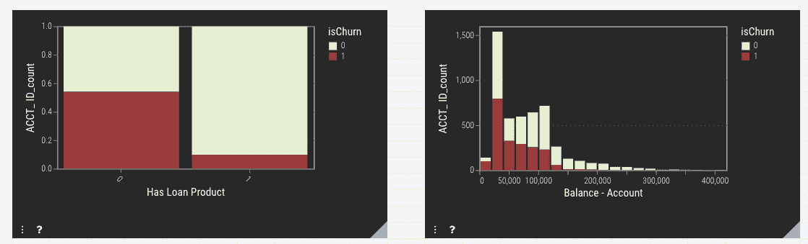
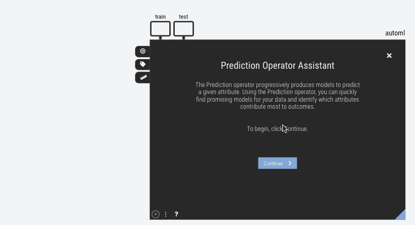
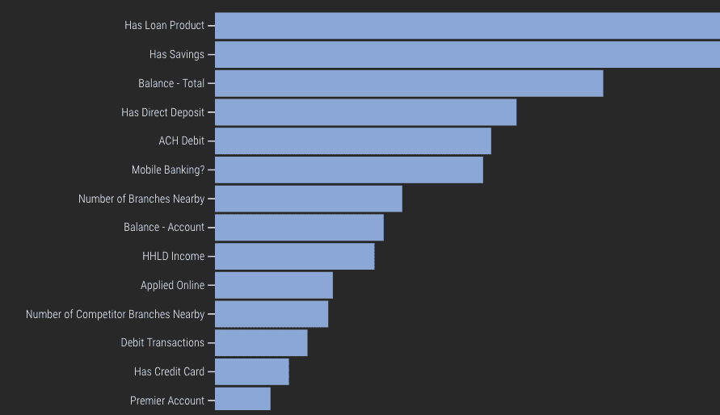
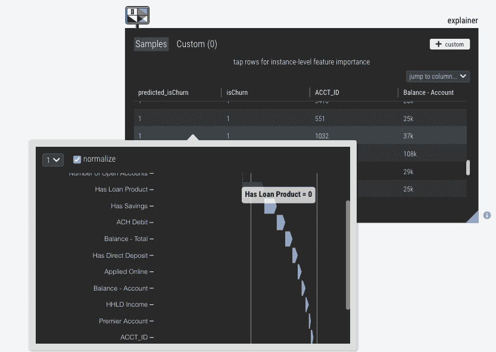

# 是时候像条形图一样使用 AI 和机器学习了。

> 原文：<https://towardsdatascience.com/its-time-to-use-ai-and-machine-learning-like-bar-charts-a21caf6ebcfa?source=collection_archive---------31----------------------->

## 组织需要更广泛地部署人工智能和机器学习，而不仅仅是数据科学团队。

> *是的，将 ML 民主化会导致不完善的模型，有时甚至是错误的决策。但是不完美的 ML 并不比不完美的 Excel 商业分析差。数据的可用大小和规模要求更多的分析师具备一套升级的技术。*

AI 和机器学习(AI / ML)被太多的谨慎和崇敬对待。AI / ML 作为一个下棋、赢得危险的黑盒进行营销，它获得了不应有的恐惧和尊重。结果，它成了一种特殊的工具，为“大项目”而保留。

但是机器学习仅仅是一种新的方式**将已经被检验的模式映射到已经被瞄准的结果变量**。

以前，在 BI 报告工具中，分析师可能会深入到一些人口统计变量:按年龄、性别、地理位置和与公司的关系划分的流失率条形图。从这一结果中，营销人员可能会注意到一种模式，即年龄在 35-50 岁之间的男性，他们拥有较高的余额和贷款产品，以最高的利率保留下来。这种特定的分析几乎每天都在几乎每个组织中发生，并且可以被认为是“快速人类学习模型”

作者在 Einblick 中创建的图像

机器学习完成完全相同的任务。随着数据科学工具(如 AutoML)的最新进展，ML 的创建开始变得大众化，现在获取结构化数据集并创建良好的模型变得轻而易举。缺乏 Python 或 R 的知识不再是 ML 应用的障碍。

*AutoML 工具复杂多样；Einblick 的 AutoML 向导是一个直接应用于分类任务的例子——作者在 Einblick 中创建的*图像

一旦 ML 运行完成，现在很容易重现上面的洞察力。首先，检查特征重要性输出将向我们展示最重要的人口统计因素的定性等级排序。该模型已经成为评估候选驱动因素的一种更全面的方法，并且可以进一步彻底探索顶级驱动因素(包括使用条形图！)

*XGBoost 回归的 Einblick 中的 Shapley 可视化—* 作者在 Einblick 中创建的图像

同样，好的 ML 工具会进一步解释所创建的模型，它可以让您遍历各个预测。这成为一种实用而具体的方式来显示和理解客户的个人资料如何导致预测的行为。大多数*人类*会欣赏有形的例子，即使机器学习是大规模完成的。

*了解一个账户的不同变量如何影响预测的和实际的客户流失。—* 作者在 Einblick 中创建的图片

一个 ML 模型并不真的需要成为一个生产化的评分 API 来对我们的分析师有用。上述可视化*非常快*完成，识别关键驱动因素和使用直接输出的可消化范围意味着分析师不需要太多特殊培训。当然，也没有限制；图形化表示的基于 XGBoost 的模型可以按原样生产，也可以由数据科学家进行微调。

尽管在不了解完整技术实现的情况下使用机器学习存在缺陷，但由不完善的 ML 支持的任何商业决策都不可能比仅在电子表格中产生的现有不完善分析更糟糕。一个不完美的分析世界认识到，以上的 ML 输出是递增的，例如，根据直觉逐个搜索驱动程序。

最终，组织数据科学战略需要在应用高级数据科学方面争取更大的灵活性，并创造一种环境，认识到在多个应用级别从 ML 中获取价值是很容易的。在日常分析中，数据透视表、饼图和机器学习应该同等对待，因为它们在为明智的决策创建数据驱动的输入方面都有重要作用。

*原载于 ein blick:*[https://ein blick . ai/its-time-to-use-ai-and-machine-learning-like-bar-charts/](https://einblick.ai/its-time-to-use-ai-and-machine-learning-like-bar-charts/)

*Einblick 是世界上第一个可视化数据计算平台，创建与数据最自然的交互。在*[https://einblick.ai/product/](https://einblick.ai/product/)了解更多关于我们的信息