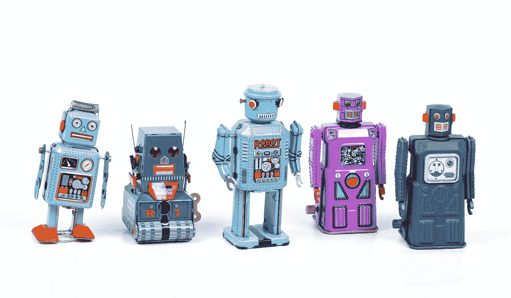

# 多智能体强化学习与合作人工智能

> 原文：<https://towardsdatascience.com/ive-been-thinking-about-multi-agent-reinforcement-learning-marl-and-you-probably-should-be-too-8f1e241606ac?source=collection_archive---------4----------------------->

## 帮助人类相互合作的工具？

埃里克·克鲁尔在 [Unsplash](https://unsplash.com/s/photos/swarm-robots?utm_source=unsplash&utm_medium=referral&utm_content=creditCopyText) 上的照片

多代理强化学习(MARL)是强化学习的一个子领域，它变得越来越相关，并且一直让我感到惊讶——在继续阅读这篇文章之前，你*必须*观看 OpenAI 的这个视频，它展示了在这一领域正在进行的惊人研究。

无论如何，MARL 已经在流行的[策略游戏](https://openai.com/projects/five/)中取得了令人难以置信的成功，已经证明是有趣的新兴行为的催化剂(如上文所述)，并将是几项新兴技术持续发展的关键，不同自动驾驶汽车之间的通信就是这样一个例子。这篇文章将首先讨论这个子领域是什么，描述它与合作人工智能的关系，然后迅速转移到这些研究领域在未来将产生的巨大影响。

## 什么是多智能体强化学习？

**普通强化学习**关注的是一个环境中的单个主体，寻求在该环境中最大化总报酬。你可以想象——或者只看这个[视频](https://www.youtube.com/watch?v=gn4nRCC9TwQ&ab_channel=TechInsider)——一个正在学习走路的机器人，它的总体目标是不摔倒地走路。它会因为没有摔倒而获得奖励，通过反复试验，并最大化这些奖励，机器人最终学会了走路。在这种情况下，我们有一个*单个*代理人寻求通过最大化总报酬来实现目标。

**多智能体强化学习**研究多个智能体如何在一个共同的环境中相互作用。也就是说，当这些智能体与环境和其他智能体相互作用时，我们能观察到它们合作、协调、竞争或集体学习来完成特定的任务吗？它可以进一步分为三大类:

**合作**:所有的代理都朝着一个共同的目标努力

**竞争**:代理为了完成一个目标而相互竞争

两者的混合:想象一下一场 5v5 的篮球比赛，同一个队的人互相配合，但是两个队却在互相竞争。

MARL 的一个典型例子是一群机器人试图营救一个人。每个机器人对其环境只有部分的可观察性(他们只能看到他们下面的一小块土地)，因此机器人需要相互协调来营救个人。

在这里，我们可以看到科幻与现实之间的壁垒迅速化解。你可能已经在想象机器人团队建造房屋、自动驾驶汽车无缝交互或分布式资源管理。

## 大规模合作、合作人工智能及其未来影响

大规模的合作是我们人类取得惊人成功的关键因素。正是通过人类的集体智慧和协作，我们才能够完成令人难以置信的壮举。为了实现大规模合作，我们创建了能够实现大规模合作的机制。也就是说，我们创造了协议(信仰系统，政府系统，等等。)来诱导大规模的合作，这样一个人在与完全陌生的人合作时会感到舒服。人类的许多失败和生存威胁可以被视为一个协调或合作的问题(核军备竞赛，气候变化，世界大战等)。).如何使用 MARL 来解决这些协调问题？进入[合作 AI](https://deepmind.com/research/publications/Open-Problems-in-Cooperative-AI) 。

**合作人工智能**是人工智能中的一类问题，寻求使用人工智能来解决或有助于解决合作问题。这项研究的重点是(1)建立具有合作能力的人工智能，以及(2)创造可用于促进群体(包括机器和人类)合作的人工智能。

人类的成功在很大程度上取决于我们与他人合作的能力，如果有一天人工智能可以用来改善人类之间的合作，这可能会导致人类进步和减轻人类痛苦方面的令人难以置信的进步。

人工智能可以用来增强人类的超级能力——大规模合作。在这一框架下，不难想象人工智能被用来帮助谈判和平条约、创造更强大和公平的政府形式，或者帮助人类相互合作以避免存在性灾难(气候变化、流行病、核浩劫)。事实上，这种研究已经存在，最近多主体系统框架被用于[设计税收政策](https://blog.einstein.ai/the-ai-economist/):

多智能体强化学习以及其他学科(博弈论、自然语言处理、多智能体设计等)。)是将被用来解决合作人工智能中存在的这些问题的工具。这是另一个在 MARL 框架内对这类问题进行研究的例子。

## 想了解更多？

如果你有兴趣学习更多关于合作人工智能的知识，我推荐阅读[合作人工智能](https://arxiv.org/abs/2012.08630)中的未决问题。我有没有被说服开始在泥灰岩里打探？这个 [github repo](https://github.com/LantaoYu/MARL-Papers) 提供了一个不错的 MARL 研究论文集。流口水来进行你自己的泥灰实验？看看[宠物动物园](https://www.pettingzoo.ml/)！

无耻地为我的[网站](https://pierrehaou.github.io/)和 [twitter](https://twitter.com/PierreHaou) 插上一脚——更多的 MARL(项目/博客帖子)内容即将到来！

**参考文献**

[1]: Y .哈拉里，[智人](https://www.ynharari.com/book/sapiens-2/) (2015)

[2]:艾伦·达福、爱德华·休斯、约拉姆·巴赫拉赫、坦图姆·科林斯、凯文·r·麦基、乔尔·z·雷博、凯特·拉森、托雷·格雷佩尔，《合作人工智能中的开放性问题》(2020 年)，[https://arxiv.org/abs/2012.08630](https://arxiv.org/abs/2012.08630)

[3]:不太可能的 AI。(2021 年 4 月 12 日)。CSL 研讨会:雅各布福斯特[视频]。YouTube。https://www.youtube.com/watch?v=ii_SwIsY8aU&ab _ channel = implebable ai

[4]: P. Barekatin，[https://www . quora . com/What-is-multi-agent-reinforcement-learning](https://www.quora.com/What-is-multi-agent-reinforcement-learning)