# Python 中的 Jaccard 相似性和 Jaccard 距离-统计

> 原文：<https://towardsdatascience.com/jaccard-similarity-and-jaccard-distance-in-python-statistics-f6aa214a9816?source=collection_archive---------45----------------------->

## 在本教程中，我们将探索如何在 Python 中计算 Jaccard 相似性(索引)和 Jaccard 距离


乔尼·克洛在 [Unsplash](https://unsplash.com/s/photos/similar?utm_source=unsplash&utm_medium=referral&utm_content=creditCopyText) 上的照片

**目录**

*   介绍
*   什么是 Jaccard 相似性
*   计算 Jaccard 相似度
*   什么是 Jaccard 距离
*   计算雅克卡距离
*   非对称二元属性的相似性和距离
*   用 Python 计算 Jaccard 相似度
*   用 Python 计算 Jaccard 距离
*   Python 中非对称二元属性的相似性和距离
*   结论

# 介绍

Jaccard 相似性(Jaccard 指数)和 Jaccard 指数被广泛用作相似性和相异性度量的统计量。

它在[实用统计](https://amzn.to/3M9EZPB)中的应用范围从简单的集合相似性，一直到复杂的文本文件相似性。

为了继续学习本教程，我们需要以下 Python 库:scipy、sklearn 和 numpy。

如果您没有安装它，请打开“命令提示符”(在 Windows 上)并使用以下代码安装它:

```
pip install scipy
pip install sklearn
pip install numpy
```

# 什么是 Jaccard 相似性

Jaccard 相似性(也称为 Jaccard 相似性系数，或 Jaccard 指数)是一种用于测量两个[集合](https://pyshark.com/everything-about-python-set-data-structure/)之间相似性的统计数据。

它的用途进一步扩展到测量两个对象之间的相似性，例如两个文本文件。在 Python 编程中，Jaccard 相似性主要用于度量两个集合之间或者两个非对称二进制向量之间的相似性。

数学上，Jaccard 相似度的[计算](https://amzn.to/3vnkzN2)就是简单地取集合交与集合并的比值。

考虑两套 **A** 和 **B** :


作者图片

那么它们的 Jaccard 相似性(或 Jaccard 指数)由下式给出:

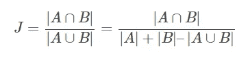

作者图片

让我们把这个公式分成两部分:

**1。提名人**

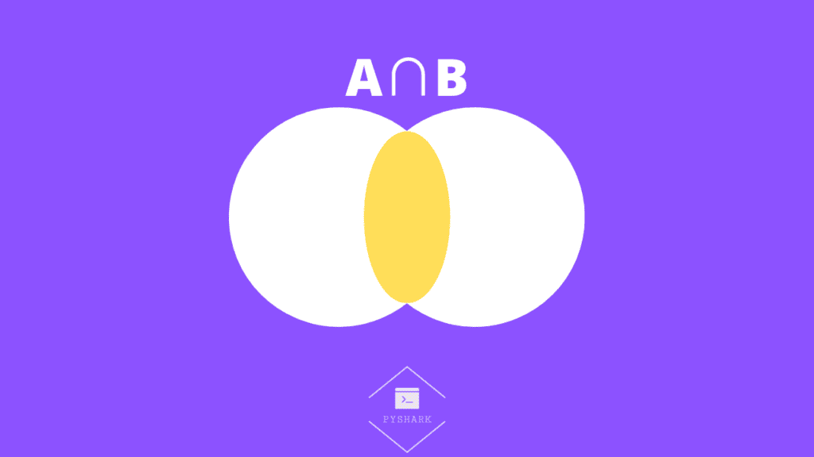

作者图片

**2。分母**


作者图片

使用 Jaccard 相似性的公式，我们可以看到相似性统计只是上述两个可视化的比率，其中:

*   如果两组相同，例如 **A** = {1，2，3}和 **B** = {1，2，3}，那么它们的 Jaccard 相似度= 1。
*   如果集合 **A** 和 **B** 没有公共元素，比如说 **A** = {1，2，3}和 **B** = {4，5，6}，那么它们的 Jaccard 相似度= 0。
*   如果集合 **A** 和 **B** 有一些公共元素，例如 **A** ={1，2，3}和 **B** = {3，4，5}，那么它们的 Jaccard 相似度是区间上的某个值:0 ≤ J(A，B) ≤ 1。

# 计算 Jaccard 相似度

考虑两组:

*   **A** = {1，2，3，5，7}
*   **B** = {1，2，4，8，9}

或者视觉上:


作者图片

第一步:

作为第一步，我们需要找到 **A** 和 **B** 之间的[集合交集](https://pyshark.com/python-set-operations/#python-set-intersection):

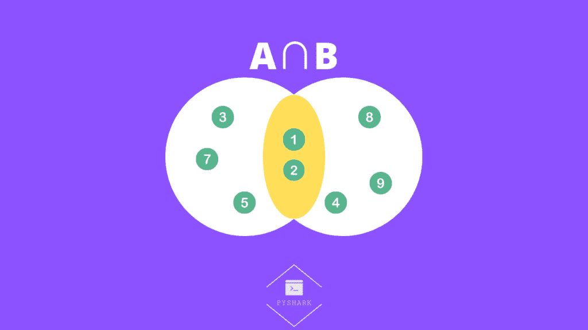

作者图片

在这种情况下:

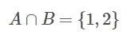

作者图片

**第二步:**

第二步是找到 **A** 和 **B** 的[套装接头](https://pyshark.com/python-set-operations/#python-set-union):


在这种情况下:


作者图片

**第三步:**

最后一步是计算交集和并集的大小之比:

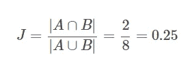

作者图片

# 什么是 Jaccard 距离

与 Jaccard 相似性(Jaccard 指数)不同，Jaccard 距离是两个[集合](https://pyshark.com/everything-about-python-set-data-structure/)之间不相似性的度量。

数学上，Jaccard 距离的[计算](https://amzn.to/3vnkzN2)是集合并集和集合交集之差与集合并集之比。

考虑两套 **A** 和 **B** :


作者图片

那么它们的 Jaccard 距离由下式给出:

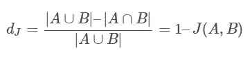

作者图片

让我们把这个公式分成两部分:

**1。提名人**

提名者也可以写成:

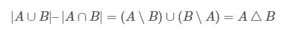

作者图片

这实际上是 A 和 B 之间的[设置对称差](https://pyshark.com/python-set-operations/#python-set-intersection)，由下面信息图中的黄色区域显示:

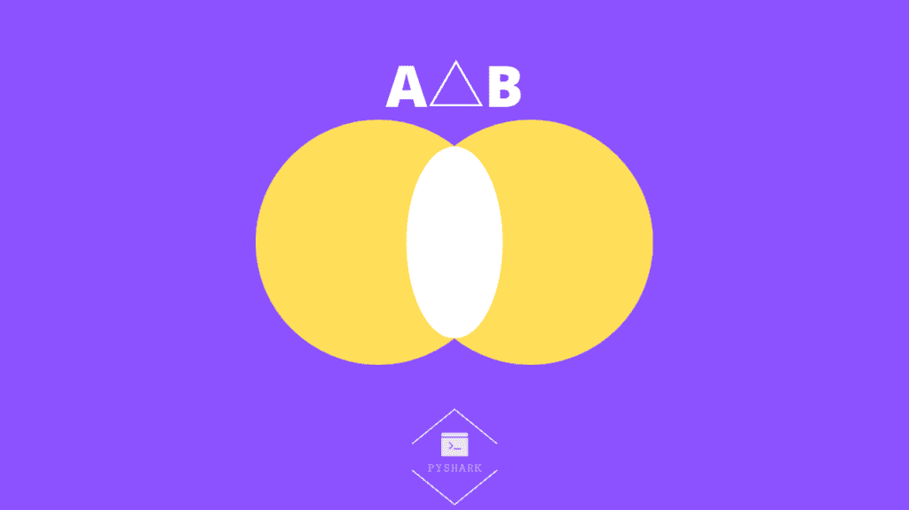

**2。分母**

分母实际上是 A 和 B 的[集合联合](https://pyshark.com/python-set-operations/#python-set-union)，如下面信息图中的黄色区域所示:


使用 Jaccard 距离的公式，我们可以看到，相异统计量只是上述两种可视化的比率，其中:

*   如果两组相同，例如 **A** = {1，2，3}和 **B** = {1，2，3}，那么它们的 Jaccard 距离= 0。
*   如果集合 **A** 和 **B** 没有公共元素，比如说 **A** = {1，2，3}和 **B** = {4，5，6}，那么它们的 Jaccard 距离= 1。
*   如果集合 **A** 和 **B** 有一些公共元素，例如 **A** ={1，2，3}和 **B** = {3，4，5}，那么它们的 Jaccard 距离是区间上的某个值:0 ≤ d(A，B) ≤ 1。

# 计算雅克卡距离

考虑两组:

*   一个 = {1，2，3，5，7}
*   **B** = {1，2，4，8，9}

或者视觉上:


**第一步:**

作为第一步，我们将需要找到 A 和 B 之间的[集合对称差](https://pyshark.com/python-set-operations/#python-set-intersection):

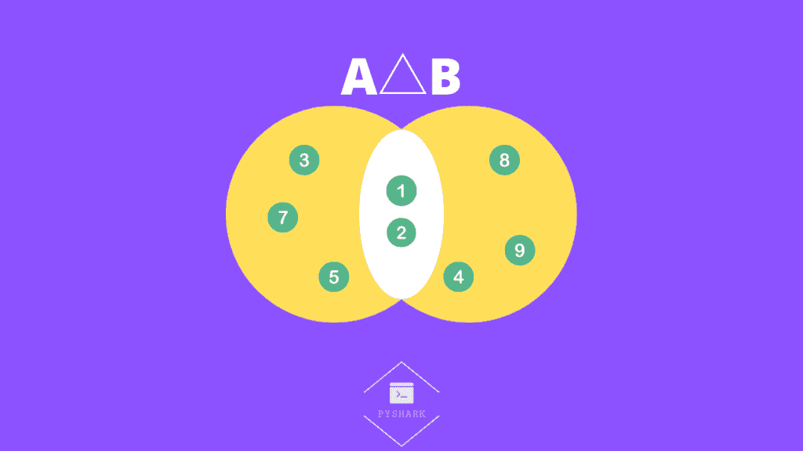

作者图片

在这种情况下:

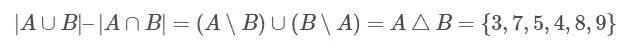

作者图片

**第二步:**

第二步是找到 A 和 B 的[集合接头](https://pyshark.com/python-set-operations/#python-set-union):


在这种情况下:

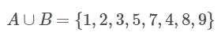

作者图片

**第三步:**

最后一步是计算对称差和并集的大小比:

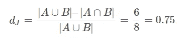

作者图片

# 非对称二元属性的相似性和距离

在本节中，我们将研究 Jaccard 相似性和 Jaccard 距离的更具体的应用。更具体地说，它们对不对称二元属性的应用。

从它的命名上，我们已经可以猜到一个[二元属性](https://www.sciencedirect.com/topics/computer-science/binary-attribute)是什么了。它是一个只有两种状态的属性，这两种状态是:

*   0，表示属性不存在
*   1，意味着属性存在

这种不对称性源于这样一个观点，即如果两个属性都存在(都等于 1)，那么它被认为比两个属性都不存在(都等于 0)更重要。

假设我们有两个向量， **A** 和 **B** ，每个向量都有 *n* 个二元属性。

在这种情况下，Jaccard 相似性(指数)可以计算如下:

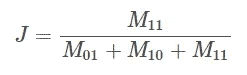

作者图片

和 Jaccard 的距离可以计算为:

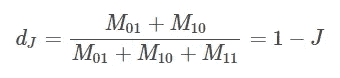

作者图片

其中:

*   M_{11}是属性的总数，其中 **A** 和 **B** 都为 1
*   M_{01}是属性的总数，其中 **A** 为 0， **B** 为 1
*   M_{10}是属性的总数，其中 **A** 为 1， **B** 为 0
*   M_{00}是属性的总数，其中 **A** 和 **B** 都为 0

并且:


作者图片

# 例子

为了更简单地解释这一点，考虑可用于[购物篮分析](https://pyshark.com/market-basket-analysis-using-association-rule-mining-in-python/)的示例。

您经营着一家拥有 6 个产品(属性)和 2 个客户(对象)的商店，并且还要跟踪哪个客户购买了哪个商品。你知道:

*   顾客甲买了:苹果，牛奶咖啡
*   顾客 B 买了:鸡蛋、牛奶、咖啡

可以想象，我们可以构建以下矩阵:

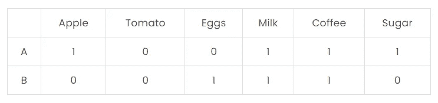

作者图片

其中每个客户的二进制属性表示客户是购买了(1)还是没有购买(0)特定产品。

问题是找到这两个客户的 Jaccard 相似性和 Jaccard 距离。

**第一步:**

我们首先需要找到每个 M 的属性总数:

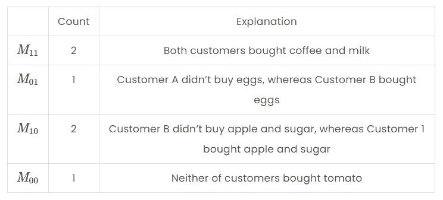

作者图片

我们可以通过对计数求和来验证这些组。它应该等于 6，这是属性(产品)的 *n* 个:

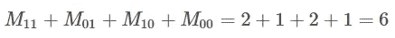

作者图片

**第二步:**

既然我们有了所有需要的输入，我们现在可以计算 Jaccard 相似性:

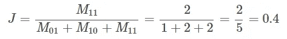

作者图片

和 Jaccard 距离:

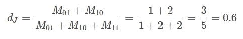

作者图片

# 用 Python 计算 Jaccard 相似度

在本节中，我们将使用在[第一节](https://pyshark.com/jaccard-similarity-and-jaccard-distance-in-python/#calculate-jaccard-similarity)中定义的相同器械包:

*   **A** = {1，2，3，5，7}
*   **B** = {1，2，4，8，9}

我们从用 Python 定义它们开始:

下一步我们将构造一个函数，将 set **A** 和 set **B** 作为参数，然后使用 [set 操作](https://pyshark.com/python-set-operations/)计算 Jaccard 相似度并返回:

然后测试我们的功能:

您应该得到:

```
0.25
```

这与我们手动计算的统计数据完全相同。

# 用 Python 计算 Jaccard 距离

在本节中，我们继续使用与上一节相同的器械包( **A** 和 **B** ):

我们从用 Python 定义它们开始:

下一步，我们将构造一个函数，将集合 **A** 和集合 **B** 作为参数，然后使用[集合运算](https://pyshark.com/python-set-operations/)计算 Jaccard 相似度并返回:

然后测试我们的功能:

您应该得到:

```
0.75
```

这与我们手动计算的统计数据完全相同。

# 在 Python 中计算非对称二进制属性的相似性和距离

我们从导入所需的依赖项开始:

使用我们在[理论章节](https://pyshark.com/jaccard-similarity-and-jaccard-distance-in-python/#similarity-and-distance-of-asymmetric-binary-vectors)中使用的表格:


作者图片

我们可以创建所需的二进制向量:

然后使用库的函数来计算 Jaccard 相似性和 Jaccard 距离:

您应该得到:

```
Jaccard similarity is equal to: 0.4
Jaccard distance is equal to: 0.6
```

这与我们手动计算的统计数据完全相同。

# 结论

在本文中，我们探讨了 Jaccard 相似性(索引)和 Jaccard 距离，以及如何在 Python 中计算它们。

如果你有任何问题或对一些编辑有建议，请随时在下面留下评论，并查看更多我的[统计](https://pyshark.com/category/statistics/)文章。

*原载于 2021 年 12 月 14 日 https://pyshark.com*[](https://pyshark.com/jaccard-similarity-and-jaccard-distance-in-python/)**。**