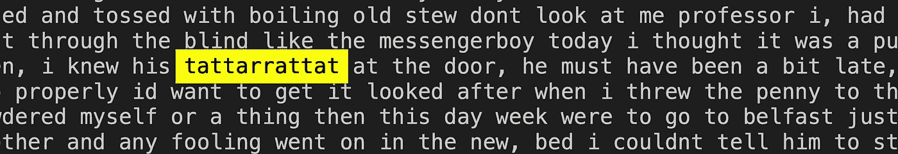

# 詹姆斯·乔伊斯和机器学习

> 原文：<https://towardsdatascience.com/james-joyce-and-machine-learning-3948e55270c0?source=collection_archive---------24----------------------->


雅克·博普拍摄于 [Unsplash](https://unsplash.com/photos/nXycxBmjTCI)

## [实践教程](https://towardsdatascience.com/tagged/hands-on-tutorials)

## 用张量流标点 Penelope

## 詹姆斯·乔伊斯-

> 佩内洛普是这本书的主角。

## 介绍

在这篇文章中，我们将通过训练一个模型来识别和标点*佩内洛普*中的意识流。佩内洛普是爱尔兰作家詹姆斯·乔伊斯的著名作品《尤利西斯》的一部分。在本文中，我们将仔细研究詹姆斯·乔伊斯的独白式作品《佩内洛普》。佩内洛普可能很难读懂。

**卡尔·荣格总结*佩内洛普* -**

> 在这里，令人窒息的空虚变得如此紧张，以至于达到了爆发点。毫无希望的空虚是整本书的基调。

## 语言结构

在进行机器学习之前，让我们简单地了解一下《佩内洛普》中的语言结构。Penelope 的结构相当奇怪，不像英语语料库的通常结构。*佩内洛普*以“是”字开头，也以“是”字结尾。佩内洛普完全致力于《尤利西斯》中的角色莫莉·布鲁姆的“主观”。佩内洛普通常因其“意识流”而被引用。意识流的定义在不同的学术领域会有所不同，但一般来说，它指的是一系列连续的句子。

## 符号化

为了达到本文的目的，我们将简单地用意识流来表示佩内洛普中缺少标点符号。这是对一个学术上很重要的想法的过度简化，但是它将帮助我们在本文的范围内工作。按照意识流的描述，我们可以想象乔伊斯带我们深入莫莉·布鲁姆的思想。

人们通常不用标点符号来思考，这在詹姆斯·乔伊斯的作品中得到了证明。因此，为了找到句子，我们不能使用 *nltk* 包中的句子*分词器*。这是因为*分词器*会通过在字符串中查找句点字符来给出句子。因此，我们不能使用标记符，因为 *Penelope* 只有两个句点，分隔大约 25000 个单词。这就是机器学习的用武之地。

## 模型

第一步包括从互联网档案馆或古登堡计划获取纯文本文件。下一步包括考虑一种方法，我们可以根据詹姆斯·乔伊斯的作品训练一个模型。一种简单的方法是使用二进制分类。我们可以用数字 1 标注*尤利西斯*中的每一句话，用 0 标注一组不是句子的单词。下一步是考虑模型的架构。一个 LSTM 有一个强大的架构设计，特别是对于 NLP，TensorFlow 使它非常容易使用。由于我们将此视为二元分类问题，我们可以看到我们的损失函数对应于二元交叉熵。

```
model = tf.keras.Sequential([
    tf.keras.layers.Embedding(vocab_size, embedding_dim,         input_length=max_length),
    tf.keras.layers.Bidirectional(tf.keras.layers.LSTM(64, return_sequences=True)),
    tf.keras.layers.Bidirectional(tf.keras.layers.LSTM(32)),
    tf.keras.layers.Dense(64, activation='relu'),
    tf.keras.layers.Dense(1, activation='sigmoid')
])
model.compile(loss='binary_crossentropy',optimizer='adam',metrics=['accuracy'])
model.summary()
```

考虑到训练需要一些时间，我们可以将计算分成两部分。训练我们的模型，然后标点*佩内洛普*。为了训练我们的模型，我们可以将佩内洛普从尤利西斯的剩余部分中分离出来。下一步将涉及到逆转尤利西斯剩余部分的每一句话。这些颠倒的句子将被标记为 0。随着本文的深入，这样做的原因将变得更加清楚。现在我们有了我们的训练数据，我们有了我们的模型，所以我们要做的就是训练模型。仅在几个周期内训练该模型后，我们可以看到大约 97%的准确度。一旦在 Google Colab 上训练了模型，我们就可以保存我们的模型，以便在本地机器上测试它。

```
Epoch 1/10
1488/1488 [==============================] - 188s 119ms/step - loss: 0.5992 - accuracy: 0.6194
Epoch 2/10
1488/1488 [==============================] - 177s 119ms/step - loss: 0.2330 - accuracy: 0.8816
Epoch 3/10
1488/1488 [==============================] - 177s 119ms/step - loss: 0.1538 - accuracy: 0.9264
Epoch 4/10
1488/1488 [==============================] - 178s 119ms/step - loss: 0.1149 - accuracy: 0.9471
Epoch 5/10
1488/1488 [==============================] - 177s 119ms/step - loss: 0.0933 - accuracy: 0.9578
Epoch 6/10
1488/1488 [==============================] - 177s 119ms/step - loss: 0.0762 - accuracy: 0.9644
Epoch 7/10
1488/1488 [==============================] - 177s 119ms/step - loss: 0.0696 - accuracy: 0.9675
Epoch 8/10
1488/1488 [==============================] - 178s 119ms/step - loss: 0.0609 - accuracy: 0.9714
Epoch 9/10
1488/1488 [==============================] - 177s 119ms/step - loss: 0.0534 - accuracy: 0.9732
Epoch 10/10
1488/1488 [==============================] - 177s 119ms/step - loss: 0.0544 - accuracy: 0.9733<tensorflow.python.keras.callbacks.History at 0x7f86f03d6160>
```

## 标点符号 Penelope

为了检查我们的模型是否理解一个句子的一般构成，我们可以给模型输入几个句子。第一句话来自*尤利西斯*，我们看到模型预测这句话有 99%的准确率。第二个句子是一个普通的英语句子，我们可以看到这个模型也预测正确。现在，如果我们颠倒第二句话，这里我们看到模型计算的分数小于 1%。这意味着我们的模型通常正确地计算英语句子的构成。我们现在可以运行一个简单的循环，从左到右穿过*佩内洛普*。一旦我们的模型以 99.99%的准确率找到一串单词，我们就可以简单地将句子写入文本文件。

```
s="Solemnly he came forward and mounted the round gunrest."
seq = tokenizer.texts_to_sequences([s])
pad_s = pad_sequences(seq, maxlen=max_length, truncating=trunc_type)
print(model.predict(pad_s))
[[0.9999999]]s="My name is Sean."
seq = tokenizer.texts_to_sequences([s])
pad_s = pad_sequences(seq, maxlen=max_length, truncating=trunc_type)
print(model.predict(pad_s))
[[0.9999671]]s="Sean is name my."
seq = tokenizer.texts_to_sequences([s])
pad_s = pad_sequences(seq, maxlen=max_length, truncating=trunc_type)
print(model.predict(pad_s))
[[0.00011346]]
```

下面我们可以看到我们的模型实时标点*佩内洛普*。

```
f = open(fpath+'PenolopePunctuated.txt', "a") 
i=0 
sentence=""**for** c **in** range(24186):     
   sentence=sentence+" "+wordlist[i]
   currentvalue=model.predict(check(sentence))
   **if**(currentvalue>0.9999)&(currentvalue<1): 
      f.write(sentence+",")
      i=c
      sentence=""      
   i=i+1 
f.close()
```


作者图片

## 反射

看来实验是成功的。目的是让 Penelope 的可读性稍微好一点，同时保留文本中两个独特的句号。詹姆斯·乔伊斯可能是最具智力挑战的作家之一。他设置智力迷宫只是为了嘲讽他的读者。这方面的一个例子是*佩内洛普*中的单词“tattarrattat”。对古典语言学家来说，这是一个珍贵的词。这个词有许多独特的属性。第一，它是一个拟声词。这仅仅意味着乔伊斯创造了一个听起来和拼写一样的单词。用稍微专业一点的术语来说，这个词的词法和音位之间有明显的关系。但也许最有趣的发现与单词“tattarrattat”的回文性质有关。这意味着即使语料库是反向计算的，这个单词的状态仍然保存在 *Penelope* 中。



图片作者(截图来自 PenolopePunctuated.txt)

所以“tattarrattat”这个词倒着读和正着读是一样的。更有趣的是这个词的上下文。乔伊斯用这个词来表达“敲门”。一个问题出现了，乔伊斯为什么要把这个特定的单词做回文？我认为他这样做是为了提醒他的读者，即使文集被倒着读，他的创造力仍然会找到敲开读者意识之门的方法。机器学习可以让我们制作出更加易读的版本；虽然我现在还不会不顾一切。阅读*尤利西斯*目前极其耗费时间。卡尔·荣格很好地传达了这一点。他写道,《尤利西斯》是一个迷人的故事，讲述了都柏林没有发生什么事情的一天。但正是《尤利西斯》中的文字让它成为多产的英国作家詹姆斯·乔伊斯的代表作。

## 最后的话

阅读我们的文本文件的内容让我们对莫莉·布鲁姆的主观性有了一个清晰的了解。然而，从 NLP 的角度来看，还有改进的空间。一个从左到右线性移动的循环是不够的。人类可以从标点符号和单词之间的相关性中获得意义。语言学上有一句名言，“从一个人交的朋友就可以知道这个人是谁”。在这种情况下，可以预期一个句子的最后一个单词和下一个句子的第一个单词之间的句子预测较低。这是作为模型的训练与反对*尤利西斯。通过增加一些额外的条件，我们也许可以开始对《T2》中的语言有一个更好的了解。用句号或逗号给语料库加标点也可以为使用用 BERT、Word2vec 等计算的语义向量来可视化和分析语料库让路。[3][4].这个项目的源代码可以在 Apache 2.0 许可下[这里](https://github.com/seanjudelyons/Ulysses)获得。标点语料库也可以在这个库中找到。*

## 参考

[1] R. Ellmann，[《詹姆斯·乔伊斯书信选》(1975)](https://archive.org/details/selectedletterso0000joyc) ，维京出版社。

[2] C .荣格，[《c . g .荣格文集【第 15 卷】(1953)](https://archive.org/details/collectedworksof15cgju/mode/2up?q=here+the+suffocating+emptiness) ，柏林根基金会。

[3] T. Mikolov，K. Chen，G. Corrado，J. Dean，[向量空间中词表征的高效估计(2013)](https://arxiv.org/abs/1301.3781) ，计算与语言[arXiv.org]。

[4] J. Devlin，M. Chang，K. Lee，K. Toutanova， [BERT:用于语言理解的深度双向变换器的预训练(2018)](https://arxiv.org/abs/1810.04805) ，计算与语言[arXiv.org]。