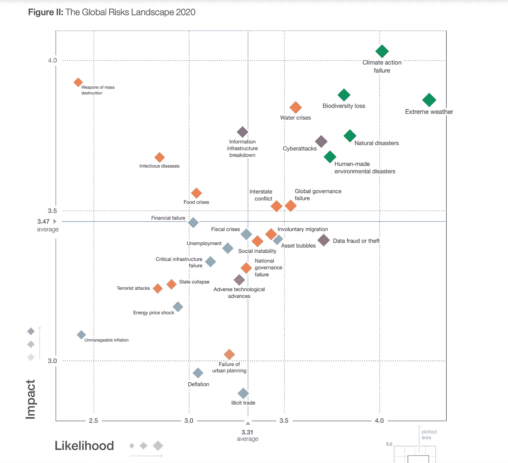
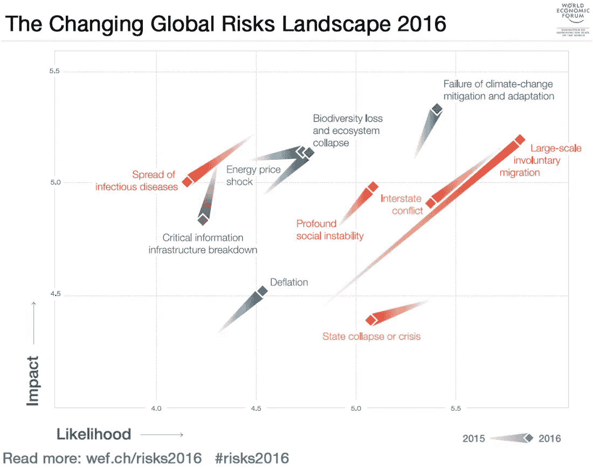

# 一月份最引人入胜的小数据

> 原文：<https://towardsdatascience.com/januarys-most-engrossing-small-data-cc230e2e45b9?source=collection_archive---------61----------------------->

## 全球风险报告

作为一个老学派的数学家，我不寻求从事大数据。相反，这篇文章是关于一个大主题的小数据。自 2006 年以来，每年 1 月发布年度《全球风险报告》( GRR ),作为年度世界经济论坛的背景材料(见下文脚注 1)。这些报告是[冗长的文件，在这里可以免费获得](https://www.weforum.org/search?query=global+risk)分析*的风险*在未来几年(“中期”)会对世界经济产生重大影响的事件的意义上。这些报告提供了来自大型专家小组的一致意见。就我的目的而言，核心部分是一张图表，显示了 36 种风险中每一种风险的感知可能性和经济影响(见脚注 2)。请看下面这张 2020 年 1 月的图片([或点击此链接](https://www.stat.berkeley.edu/~aldous/Real_World/Global_Risk_Report_2020_graphic.pdf))。

2020 年全球风险报告

图表采用标准格式:横轴表示相对可能性，纵轴表示相对经济影响(见脚注 3)。因此，最大的感知风险(在新冠肺炎前夕)出现在右上角，从极端天气开始，然后是气候行动失败。

对我来说，最有趣的潜在概念问题是**中期未来的可预测性如何？**人们经常看到一些随意的断言，比如“没人预测”(或“我预测”)苏联解体，或类似 9/11 的袭击，或 2007-2008 年的金融危机，或新冠肺炎疫情。这种断言是荒谬的。这些本质上都是不可预测的事件，因此只谈论*概率*是有意义的。作为一个具体的例子，关于欧洲冷战的话题，1985 年对 1985-1995 年的一个概率评估(见脚注 4)是
65%:现状
25%:东欧内部叛乱导致苏联控制力下降
5%:苏联对西德的军事攻击
5%:苏联因内部原因而解体

对于最后一个选择，他们的短语“帝国崩溃”被证明是相当准确的。

## 能否判断过去概率评估的准确性？

在预测锦标赛的受控条件下(见脚注 5)，人们确实可以通过评分规则来确定相对预测能力，但这需要不同的预测者评估相同的事件集合。我从来没有见过这样的中期预测数据。GRR 中的许多事件都是相当模糊的，所以不清楚如何获得预测的准确性。

因此，一个底线是，我们不能正式测试 GRR 在过去有多准确。还要注意这是*小数据* : 13 年乘以 36 次事件乘以 2 次评估大约等于 1000 个数字。

## **但是看看过去 GRR 的分析并非正式地讨论它们的准确性是很有趣的。**

那么，他们是如何预测新冠肺炎的呢？事实上，*疫情*风险每年都出现在 GRR 的左上角象限(低可能性，大影响)。正如许多人回顾过去时指出的那样，专家们早就预测这样的疫情会在某个时候发生，同时也承认在任何一年发生的可能性都很小。

2007-2008 年的金融危机怎么样？2007 年 1 月的报告图表(在危机显现之前)判断最大的风险是资产价格崩溃。所以那是成功的。

我们随便挑一年吧。2013 年的主要风险是*长期财政失衡、供水危机、温室气体排放增加、*和*严重的收入差距。*随后几年到底发生了什么？GRR 不再那么担心*财政失衡*(至少在 2021 年之前)。供水危机还没有成为头条新闻，但在 GRR 的列表中仍然很重要。不断增加的温室气体排放已被重新命名为气候行动失败，在可预见的未来，这无疑仍将是最大的风险之一。*严重的收入差距，*改名为*社会不稳定*(对我来说有点意外)随后向中间下降。因此，2013 年没有显著的成功，但反过来说，也没有没有预料到的重大事件。

具有竞争天性的读者可以尝试编写自己的风险列表，与即将到来的 2021 年 GRR 进行比较。我个人最大的猜测包括新冠肺炎引发的财政危机和社会动荡，以及网络攻击。往年，GRR 都是在 1 月中旬举行，但 2021 年的世界经济论坛实体会议目前被推迟到 5 月(而且可能会进一步推迟？)，所以我不确定 2021 年的 GRR 什么时候会出现。

## 所以为什么要在乎呢？

在个人层面上，我们很少有人不考虑个人的未来就过完一天又一天。任何一个阅读 medium.com 的人肯定都会关注当今世界正在发生的一些事情，以及随之而来的对未来的希望和担忧。然而，我们每个人都倾向于只关注未来可能不同的几个方面，隐含地假设其他方面将保持不变。例如，最初的《星际迷航》设想了一个相当乌托邦式的复杂技术未来，但与令人生厌的 20 世纪 60 年代风格的女性形象并置。阅读 GRR 风险清单可能会促使你思考，如果这些风险中的一个或另一个成为现实，你现有的希望和恐惧会受到怎样的影响。

在组织层面上，任何对不确定的未来进行理性规划的尝试都需要将[情景规划和概率预测](https://www.foreignaffairs.com/articles/united-states/2020-10-13/better-crystal-ball)结合起来，这些是互补的而不是对立的:如果你认为某个地缘政治事件有 40%的可能性，你能设计出两个可能发生的情景和三个不可能发生的情景吗？

最后，GRR 举例说明了一个非常广泛的**基线**原则:在任何不确定的环境中，如果其他人已经考虑过它，并且一个人可以确定一个共识或“中间意见”，那么它作为基线是有价值的。当形成你自己的观点或研究别人的观点时，你或他们能阐明*为什么*他们与基线不同吗？如果不是，就不要太在意他们的看法。

年度变化图

_ _ _ _ _ _ _ _ _ _ _ _ _ _ _ _ _ _ _ _ _ _ _ _ _ _ _ _ _ _ _ _ _ _ _ _ _ _ _ _ _ _ _ _ _ _ _ _ _ _ _ _ _ _
脚注 1:[世界经济论坛](https://en.wikipedia.org/wiki/World_Economic_Forum)因其每年一月在达沃斯召开的会议而闻名(并受到广泛批评)。但它也协调除 GRR 之外的许多分析的生产。我个人猜测，这类报告往往会比学术或政府机构的报告更准确，因为它们的输入范围更广，而且更少受制于特定的利益或意识形态。

脚注 2:随着时间的推移，所研究的风险发生了缓慢的变化，最初考虑的较少。

脚注 3:2007 年的图表[有数字可能性和数字美元影响。多年来，坐标轴标签已经变得更加定性:对于 2020 年的图表，专家们被要求在 1-7 的模糊尺度上评估可能性和影响，并绘制平均值。这使得评估准确性的尝试更加复杂。](https://www.stat.berkeley.edu/~aldous/Real_World/WEF_2007_graphic.pdf)

脚注 4 *:詹姆斯·邓尼根和奥斯汀·贝的《肮脏战争快速指南*。

脚注 5:预测锦标赛涉及陈述给定事件在给定截止日期之前发生的概率，通常是提前 6-12 个月。见本[高中水平博览会](https://www.stat.berkeley.edu/~aldous/Papers/pi20.pdf)或本[更精采的记述](https://www.stat.berkeley.edu/~aldous/Papers/prediction_paradox.pdf)。但是对于中期赛事来说，这样的比赛并不实用，因为需要等到赛事结果确定之后。