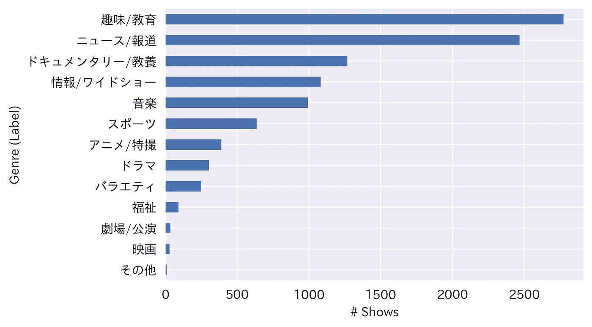
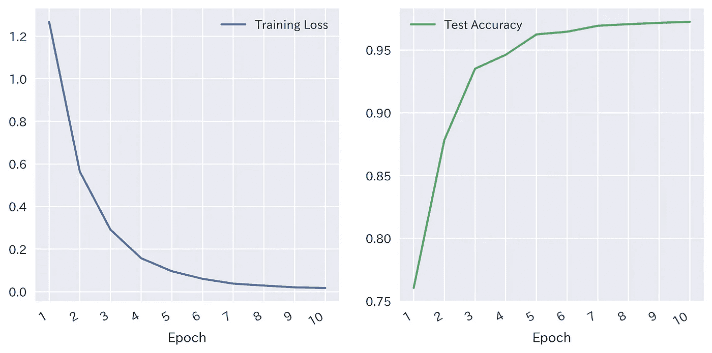
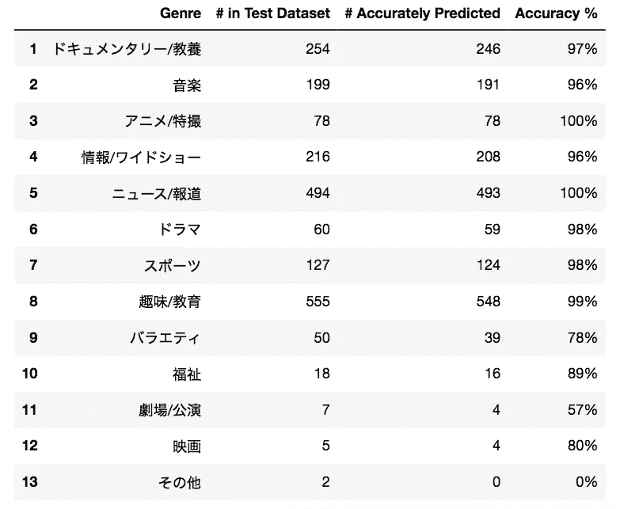
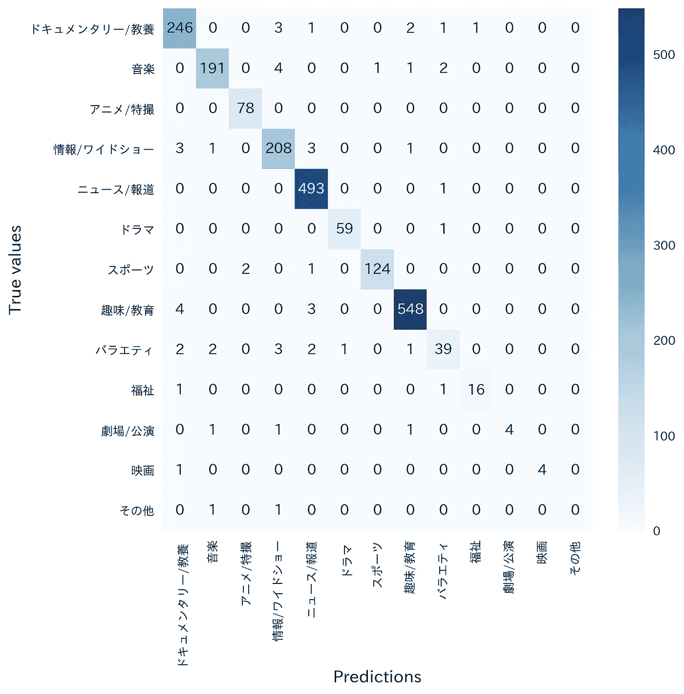

# 使用 BERT 实现 97%准确率的日语多类文本分类

> 原文：<https://towardsdatascience.com/japanese-multiclass-text-classification-with-97-accuracy-using-bert-11b1fdc7c27e?source=collection_archive---------16----------------------->

## 将 NHK(日本广播公司)节目分为多种类型

康纳·乐迪在 [Unsplash](https://unsplash.com/) 上的照片

您是否有一些日文文本，如客户反馈、用户评论或邮件内容，并希望从手头的数据中提取见解？下面介绍的模型在处理日语文本时，在多类分类方面表现出色。该模型很好地理解了日语，并且可以潜在地用于许多应用领域中的许多目的，例如流失率预测、消费者细分、消费者情绪分析。

> P.S:这个模型只需更改 2 行就可以轻松适应其他语言。

***数据***

我们将使用 NHK(日本广播公司)的节目信息作为我们的数据源。通过 [NHK 的节目安排 API](https://api-portal.nhk.or.jp/) ，可以获得全日本电视、电台、网络电台未来 7 天安排的所有节目的【标题、字幕、内容、流派】。

***问题陈述***

利用节目的标题、副标题和内容，我们将尝试预测其类型。一个节目可以有多种类型，如下所示:

Title: あさイチ「体験者に聞く 水害から家族・暮らしを守るには？」
Genre: 1) 情報/ワイドショー, 2) ドキュメンタリー/教養

In the above case, we will be assuming this show’s genre is 情報/ワイドショー (Information/ Wide show)

> 该模型的一个改进将是可以预测每个节目的多个类型，这将使该问题成为多类多目标问题。

***【探索性数据分析(EDA)】***

我收集了 2021 年 8 月 30 日至 2021 年 9 月 24 日之间播出(或将播出)的 10，321 个独特节目的信息。以下是 10，321 个节目中所有 13 种类型(标签)的分布情况:

作者图片

正如您所看到的，数据是高度不平衡的，因此我们将在将数据分为训练和测试时对其进行“分层”(即:保持测试数据中的标签分布与整个数据集相同)，并使用加权 F1 分数作为适合不平衡数据集的准确性度量。

***数据处理***

我们将数据分为训练(80%)和测试(20%)数据集。我们将在训练数据集上训练模型，并在 10 个时期内跟踪测试数据集的准确性(时期:模型遍历整个训练数据集的 1 个步骤)。产生最高精度的时期将被用作最终模型，并且来自该模型的结果将被认为是模型精度。

***型号***

我们模型的输入将是每个节目的“标题”、“副标题”和“内容”的连接。有些节目没有上述所有信息，但只要至少有一个字段(标题总是可用)就没问题

模型的输出将是 13 个可用类型的概率分布，我们将把具有最高概率的类型作为模型输出，并将其与真实值进行比较。

***伯特***

为了训练这个模型，我们将使用 BERT 的一个预训练模型，并针对我们的问题对它进行微调。查看[这篇文章](/bert-explained-state-of-the-art-language-model-for-nlp-f8b21a9b6270)，看看伯特是如何工作的。我们将使用🤗拥抱人脸库，它提供了一个获取预先训练的 BERT 模型的接口。我们将要获取的预训练模型是[***Bert-base-Japanese-v2***](https://huggingface.co/cl-tohoku/bert-base-japanese-v2)*，它是由东北大学的研究人员使用维基百科中的 3000 万个日语句子训练的。对于微调，我们将使用[***BertForSequenceClassification***](https://huggingface.co/transformers/model_doc/bert.html#bertforsequenceclassification)模型，因为这本质上是一个序列分类问题。*

****结果****

*我们在 Google Colab 的 GPU 运行时环境中训练该模型，因为 BERT 是一个繁重的模型，它在 CPU 上花费的时间明显更长。训练数据以 32 的批量提供给模型，以加速学习并防止 RAM 溢出。模型经过 10 个时期的训练:以下是这 10 个时期的损失和准确性指标:*

**

*作者图片*

*10 个历元似乎足够了，因为训练损失和测试精度在该点之后持平。让我们看看我们是如何预测每个标签的:*

**

*作者图片*

*最后，让我们检查混淆矩阵:*

**

*作者图片*

*看起来不错吧？*

# *结论*

*在本文中，我们使用了一个 BERT 预训练模型，并对其进行了微调，用于多类文本分类，以 97%的准确率将日本电视和广播节目分类为多个流派。*

*我观察到的一个趋势是，随着训练数据变大，准确性也在提高。2 周的数据产生 94%的准确性，而 1 个月的数据能够产生 97%的准确性。我预计，随着更多数据的收集，该模型可以达到近乎完美的预测精度。该模型的下一步将是预测每个节目的多个流派，这将使该问题成为多类别多标签问题。*

*如果你在 danyelkoca@gmail.com 有任何问题/反馈，请告诉我。您可以在下面找到源代码和数据集:*

*数据集:[https://github.com/danyelkoca/NHK/blob/main/data.csv](https://github.com/danyelkoca/NHK/blob/main/data.csv)*

*代码:[https://colab . research . Google . com/drive/12 ezr 2 q 4 mzhe 9m _ Ppv _ RfuqnKt-g 9 yx3f？usp =共享](https://colab.research.google.com/drive/12ezR2Q4MZHE9m_Ppv_RfuqnKt-G9yX3f?usp=sharing)*

*本文日文版:【https://qiita.com/dannyk/items/bee0249af1f77bc416d8 *

*黑客快乐！*