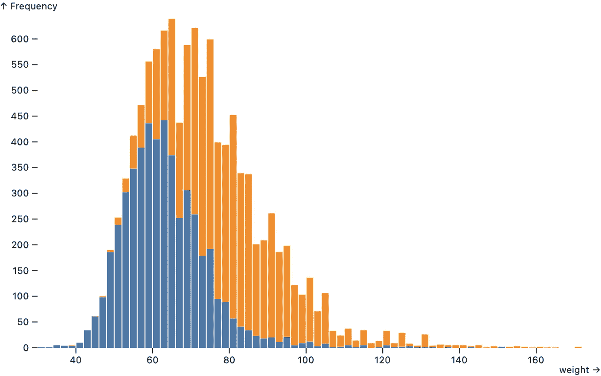

# 用于数据分析的 JavaScript

> 原文：<https://towardsdatascience.com/javascript-for-data-analysis-2e8e7dbf63a7?source=collection_archive---------12----------------------->

## 随着网络开辟了合作的新领域，网络的本地语言 JavaScript 是探索数据和交流见解的最佳选择。

图片:瑞奇·罗瑟的 [*双摆图*](https://observablehq.com/@rreusser/the-double-pendulum-fractal) *。经许可使用。*

关于相机的消亡有利于配备相机的移动电话，蔡斯贾维斯曾打趣说:“最好的相机是你随身携带的。”换句话说，便携性和便利性胜过分辨率、颜色、散景、*等方面的技术差异。*如果你想拍照，手里的相机比留在家里的相机要好。

当被问及 JavaScript 与 Python、R 或 Julia 进行数据分析时，我会想到这一点。其他语言都很棒。它们具有强大的功能，如运算符重载和多维数组、强大的数学和可视化开源库以及活跃的社区。很容易争论为什么它们中的任何一个可能比 JavaScript 更适合数据分析。

然而在我看来，语言差异无关紧要。

部分原因是 JavaScript——语言、网络平台和开源生态系统——每年都在变得更强大。浏览器供应商、标准组织、研究人员和大量全球贡献者对 JavaScript 做了大量的工作。当我们说 JavaScript 很快时，这不是侥幸；是因为*人*做的快。我们都从这一联合努力中受益。

因为 JavaScript 是网络语言，它可以在任何地方运行。就像你口袋里的照相手机一样，几乎每个人都有一个运行 JavaScript 的浏览器——就是你用来阅读本文的浏览器。JavaScript 支持[交互式可视化](https://pudding.cool/2019/02/gyllenhaal/)、[探索性解释](https://ciechanow.ski/internal-combustion-engine/)、[现场分析](https://www.nytimes.com/interactive/2020/11/03/us/elections/forecast-president.html)、[模型模拟](https://observablehq.com/@rreusser/the-double-pendulum-fractal)、[计算艺术](https://twitter.com/makio135)、[游戏](https://ncase.me/trust/)、[测验](https://www.nytimes.com/interactive/2014/upshot/dialect-quiz-map.html)，你能想到的……当有人分享用 JavaScript 实现的分析时，**你看到的不仅仅是他们工作的静态快照；你在浏览器中运行它。通过查询数据、调整假设和提问，你可以超越被动阅读。**

JavaScript 是我们有史以来最丰富的交流媒介，但由于网络的开放性，它还有更多的东西:一种可以检查和修补的媒介，用于学习和合作。浏览器开发工具允许您查看、进入甚至修改正在运行的代码。

网络让我迷上了编程。我最初是通过[查看源代码](https://medium.com/@anildash/the-missing-building-blocks-of-the-web-3fa490ae5cbc)学习 JavaScript 的:如果一个网页做了一些很酷的事情，我会查看它的源代码并修改它，以了解它是如何工作的，并看看我是否可以重新利用它来制作一些有趣的东西。JavaScript 的即时性和可访问性——以及无尽的可能性——使它令人陶醉。

在过去的二十多年里，激励我继续开发软件的是这样一个想法:当你在网上开发东西的时候，你也在教别人如何开发东西。我们都在这个原始的想法之汤里游泳，给予和接受创造性的灵感。

协作和交流是网络存在的原因。网络是我们工作的方式。这是我们学习的方式。这是我们分享想法的方式。正是 web 使 JavaScript 在数据分析方面表现出色(除此之外还有很多其他方面)。在网络上，我们可以一起实时编辑和运行代码，共享数据的探索性视图来回答问题，并解释概念，几乎没有摩擦。我们几乎可以做任何我们能想象的事情。

因此，我钦佩其他语言中许多强大的功能和库，但 JavaScript 因其可移植性和便利性而成为我的首选。这是分享*现场*代码*最简单的方法，任何人都可以编辑*。

当然，还有很多事情要做。JavaScript 可能不是一种用于数据分析的语言，但是这种语言可以扩展以更好地支持它。

我很乐观。JavaScript 在过去十年中有了显著的改进，增加了 async/await、arrow 函数、promises、迭代器、生成器等等。多亏了 ES 模块和像 [Skypack](https://www.skypack.dev) 这样的服务，我们可能最终会看到 Node.js 和浏览器之间更容易的库互操作性(或者至少更少的 bundlers、transpilers 和 loaders 问题)。随着 WebGPU、WebAssembly 和其他标准的开发，JavaScript 的未来一片光明。(详见本·施密特的 [JavaScript 和数据编程的下一个十年](https://benschmidt.org/post/2020-01-15/2020-01-15-webgpu/)。)

我们还需要新的库和抽象，让我们花更多的时间思考数据，而不是纠结复杂的编程。诸如 [Apache Arrow](https://arrow.apache.org/docs/js/) 、 [Arquero](https://uwdata.github.io/arquero/) 、 [tidy.js](https://pbeshai.github.io/tidy/) 、 [Observable Plot](https://observablehq.com/@observablehq/plot) (我也参与了其中)和 [Vega-Lite](https://vega.github.io/vega-lite/) 等开源项目都有所帮助。

用[可观察图](https://observablehq.com/@observablehq/plot)制作的奥运会运动员体重(公斤)直方图。蓝色代表女运动员；橙色代表男性。

作为另一个用于可视化的开源 JavaScript 库 [D3.js](https://d3js.org) 的作者，我听说有人从其他人在网络上公开分享的作品中受到启发，开始学习可视化。有些人甚至以此为职业。

我希望有了更好的工具——特别是支持网络协作的工具——更多的人可以一起释放用数据思考的力量。