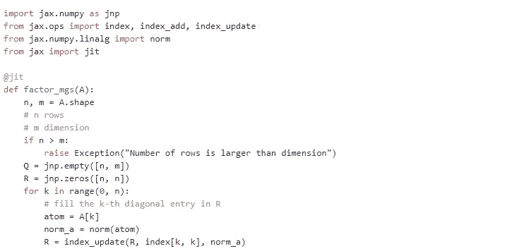

# JAX 第一印象

> 原文：<https://towardsdatascience.com/jax-first-impressions-d85f3c498c21?source=collection_archive---------36----------------------->

## 数值计算

## Python 中速度惊人的独立于硬件的数字代码



JAX 因服用类固醇而变得愚蠢

最近我一直在探索 JAX 图书馆。它是由 Google 工程师开发的用于数值计算的高性能库。目前，它是一个研究图书馆(还没有 1.0 版)，不是谷歌的官方产品。然而，它正在机器学习工程师中获得牵引力。我特别感兴趣的是用 Python 编写数值密集型算法，这些算法在 CPU 和 GPU 上都非常快。

JAX 有一个与 NUMPY 非常相似的 API，尽管它不是 NUMPY 的直接替代品。JAX 包括一个 JIT(实时)编译器，它使用 [XLA](https://www.tensorflow.org/xla/) 来转换基于 JAX 的函数。XLA(加速线性代数)是一个特定领域的线性代数编译器。这使得代码运行速度比普通 Python 实现快 100 倍。

JAX 推广[函数编程](https://en.wikipedia.org/wiki/Functional_programming)。JIT 只能编译纯函数。一个纯函数的输出仅仅基于它的输入，并且没有副作用。因此，在 JAX 编程需要一些小心。特别是，JAX 中的数组类型，称为`DeviceArray`，是一种不可变的数组类型。一旦创建了阵列，就不能修改。这使得编译器可以轻松地对代码进行推理，而不用担心任何副作用，并积极地对其进行优化。不可能修改数组中的单个条目。不过，JAX 以`[index_add](https://jax.readthedocs.io/en/latest/_autosummary/jax.ops.index_add.html)`、`[index_update](https://jax.readthedocs.io/en/latest/_autosummary/jax.ops.index_update.html)`和类似操作符的形式提供了功能替代方案来实现同样的功能。

## JAX 的一个行 QR 分解

我不会在这里详细介绍 JAX。你可以阅读同样的优秀文档。下面我展示一个我在 JAX 实现的 [QR 分解](https://en.wikipedia.org/wiki/QR_decomposition)的实现。通常情况下，我们因式分解[A = QR]。因为 Python 是以行为主的，所以我按行进行因式分解[A = RQ],其中 Q 的行是正交的。使用改进的 Gram-Schmidt 过程实现因子分解。

注意在函数`factor_mgs`中应用的装饰器`jit`。它确保当函数被调用时，它被及时编译。还要注意 Q 中的一行是如何使用`index_update`函数更新的。使用`index_add`函数更新 A 中的行。

## 一点基准测试

我在一台 MacBook 上测试了这个功能。对一个 64x128 矩阵(具有正态分布的随机条目)的因式分解的第一次调用花费了大约 12 秒。后来下降到 300 微秒左右。当心 JAX 的[异步调度](https://jax.readthedocs.io/en/latest/async_dispatch.html)。在结果数组上调用`block_until_ready()`,确保所有的计算都正确地完成了基准测试。第一次调用时，128x256 随机正态矩阵的因式分解需要大约 35 秒。随后的尝试减少到大约 1 毫秒。

## 一个逐行 QR 更新例程

像正交匹配追踪这样的算法可以通过使用 QR 更新过程来优化，其中子矩阵 A 是从字典的原子逐步[逐行]构建的。因此，A 的因式分解也可以逐行建立。下面的函数用逐行分解的矩阵 A 的第 k 行 A 更新 Q 和 R。它使用了 Gram-Schmidt 算法的一个步骤。

让我们展示一些如何使用这个更新过程的代码。

在每次迭代中，我们发送 A 的第 I 行来更新因式分解。Q 和 R 数组被更新并从 update 函数返回。由于 update 的输入参数是不可变的，因此，更新后的数组必须返回给调用者，以确保更新得到反映。XLA 编译器将确保尽可能多地重用设备数组。

注意，我们没有在更新函数定义上直接使用 jit 装饰器。函数的第四个参数 k 是一个整数，它的值在不同的调用中是不同的。从 JIT 的角度来看，它被称为静态参数。不能直接 JIT 编译。然而，在这条线上

```
update = jit(update, static_argnums=(3,))
```

我们能够指定哪些参数适合 JIT 编译，哪些必须被视为静态的。这使我们能够在这样的函数上应用 JIT。更多信息，请阅读[JAX——锋利的钻头](https://jax.readthedocs.io/en/latest/notebooks/Common_Gotchas_in_JAX.html)。

## 笔记

*   默认情况下，JAX 创建 float32 数组并执行 32 位浮点运算。如果您想使用 float64 阵列，请启用该功能。
*   如果您的函数不满足 JIT 的约束，使用它将抛出非常详细的错误。需要一些练习来学习如何编写简洁的数值算法的函数版本。
*   异步调度可能会导致错误的基准。小心确保所有的计算都已完成。