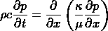
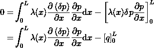
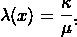
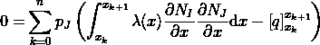
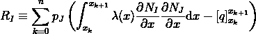
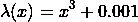
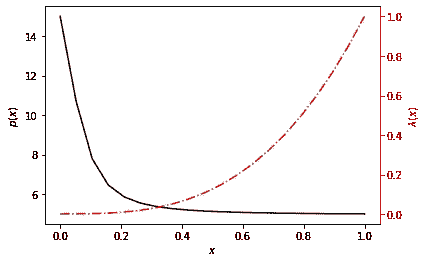
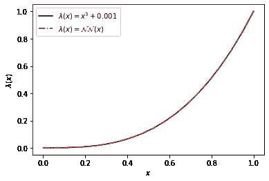
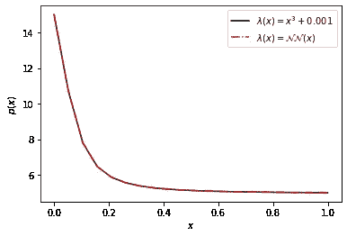
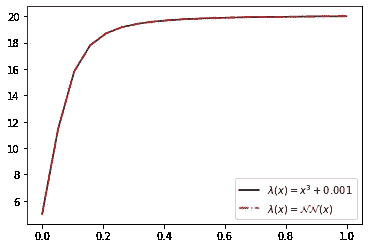

# 有限元分析的 JAX 实现

> 原文：<https://towardsdatascience.com/jax-implementation-of-fea-3e9a690e59c9?source=collection_archive---------50----------------------->

## [实践教程](https://towardsdatascience.com/tagged/hands-on-tutorials)

## 和利用神经网络的高效逆问题求解

图片由[作者](mailto:johntfosterjr@gmail.com)

如果你还没听说的话， [JAX](https://jax.readthedocs.io/en/latest/index.html) 作为一个“服用类固醇的笨蛋”在网上获得了很多关注。就其核心而言，它可以被认为是对 [NumPy](https://numpy.org/) 的替代，其中数组计算可以在可用的 GPU 或 TPU 上加速。仅此一点就值得一看，尤其是如果您有许多 NumPy 代码，您可能希望通过 GPU 加速来加速。目前， [NumPy API 的大部分都是以一一对应的方式实现的](https://jax.readthedocs.io/en/latest/jax.numpy.html)，以及 [SciPy](https://jax.readthedocs.io/en/latest/jax.scipy.html) 中一些最常用的函数。

加速数字仅仅是 JAX 实用化的开始。所有 JAX NumPy 数据结构都可以与大多数纯 Python 代码结合使用，以创建可以自动区分的函数。这包括计算标量函数的梯度，以及向量函数的雅可比矩阵。这些操作可以被组合以计算梯度的梯度等。自动微分功能的更多信息记录在[这里](https://jax.readthedocs.io/en/latest/notebooks/autodiff_cookbook.html)。

此外，还有一个内置的[实时编译器](https://jax.readthedocs.io/en/latest/notebooks/quickstart.html#Using-jit-to-speed-up-functions)，用于编译要在 CPU/GPU/TPU 上执行的函数，并支持[自动矢量化](https://jax.readthedocs.io/en/latest/notebooks/quickstart.html#Auto-vectorization-with-vmap)，即针对标量参数编写的函数可以很容易地跨数组映射。这些可以与前面提到的自动微分功能一起使用。

最后，还有一个与 JAX 相关的非常薄的神经网络库，称为 [stax](https://jax.readthedocs.io/en/latest/jax.experimental.stax.html) 。其他功能更全面的库，如[俳句](https://github.com/deepmind/dm-haiku)、[亚麻](https://github.com/google/flax)或 [Trax](https://github.com/google/trax) 都是基于 JAX 技术开发的。

在接下来的内容中，我将通过实施有限元分析(FEA)模型，然后在训练神经网络对潜在未知的本构模型进行逆解时，使用有限元残差作为目标函数的一部分，来强调 JAX 的大多数这些特征。

作为一个模型问题，我们将从一维压力扩散方程开始，该方程控制具有流体密度 *ρ* 和小压缩率 *c* 的多孔介质中的单相流体流动。

假设稳态，乘以左边的测试函数 *δp* ，并在域(0 *，L* )上按部分积分，我们得到

在哪里

*κ* 为多孔介质的渗透率， *μ* 为流体粘度。 *λ* 被称为*迁移率*，并被假定为空间变化的。

使用伽辽金近似，即 *p = Nᵢ pⱼ* 和 *δp = Nᵢ* 对于 *I，J = 1，2，…* 基函数，并且将域分割成 *n* 个区间，我们现在有

其中对于那些在 *I* ᵗʰ节点上具有支持的函数，隐含了在 *J* 基函数上的求和。上面的右边是我们的剩余，即 *R*

下面，我们将使用高斯积分对这个剩余向量进行积分，并求解未知的节点压力 *pⱼ* 。不失一般性，我们将只考虑 Dirchelet 边界条件，即 *q(x) = 0* 。

虽然这个模型问题是线性的，但我们将实现 FEA 模型以使用方程的剩余形式，并使用非线性牛顿-拉夫森解算器来求解未知数，其中每次迭代的雅可比矩阵通过 JAX 的自动微分来计算。所有的计算都是以一种可以在 GPU/TPUs 上加速的方式编写的，并且是即时编译的。

下面是我们需要的导入，请注意，我们为 JAX 显式启用了 64 位浮点数，因为默认为 32 位。

下面，我们将通过 FEA 使用上面的实现来解决正向问题，以验证事情是否正常工作，并生成一些参考数据，我们将在后续的反向问题中使用。这里，移动功能是

这里我们将写我们的反问题求解器。我们将从上面的`FEAProblem`类继承，这样我们可以重用一些已经定义的函数。

当“已知数据”作为训练数据提供时，我们的目标函数将是有限元残差的 *l* ₂-norm。因为我们正在解决的问题是一个稳态问题，我们将需要向目标函数提供本构模型的端点，否则有无限个有效的解来学习仅相差一个常数的本构模型。如果我们把这种技术扩展到与时间有关的问题，我相信可以避免提供边界约束的需要。

我们将使用`jax.experimental.stax`模块中的一些函数，只是为了使神经网络的构建更容易。我们这里的最小化器将使用来自`jax.scipy.optimize.minimize`的二阶`"BFGS"`方法。

这里，我们假设我们的数据是在有限元模型的节点处提供的，但是通过有限元形状函数在任何给定的空间位置评估残差，可以很容易地概括这种限制。

下面我们将使用前面的有限元解生成的数据来测试我们的反问题求解器。首先，我们定义我们的神经网络架构。这是一个相当简单的函数，因此我们不需要大型和/或复杂的神经网络。这里，我们有一个只有 4 个节点的输入层和一个 *tanh* 激活函数，它提供给单个节点输出。更复杂的架构也可以工作，以更多的计算成本产生相同的结果。

我们还需要定义层`Dense64`，它与`stax.Dense`相同，但被初始化为使用 64 位浮点，以与我们在 FEA 残差计算中的数据结构保持一致。

现在我们实例化模型并求解逆问题，即训练网络。我们必须提供本构模型的端点。假设问题是抛物型的，那么反问题就有无穷多个解(它们都有相同的形状，但是有一个恒定的比例因子)。我们可以通过考虑一个依赖于时间的问题并提供依赖于时间的训练数据来消除这种限制，我们将把它留给未来的工作。

在区域范围内绘制神经网络函数，并与参考进行比较，我们可以看到逆解算器已经很好地“学习”了迁移率函数。

只是为了验证，我们将使用我们的神经网络作为我们的正向有限元解算器中的迁移函数，以证明产生的压力也是准确的。

这种方法相对于例如基于物理学的神经网络的主要优势在于，我们仅“学习”了本构模型，即迁移率函数，而不是具有所提供的边界条件的偏微分方程的解。相反，我们依靠我们的有限元实现来计算解决方案。这意味着我们现在可以使用我们“学到的”本构模型来精确地解决不同边界条件的问题。

*最初发表于*[*【https://johnfoster.pge.utexas.edu/blog/jax-fea/】*](https://johnfoster.pge.utexas.edu/blog/posts/jax-fea/)*。*