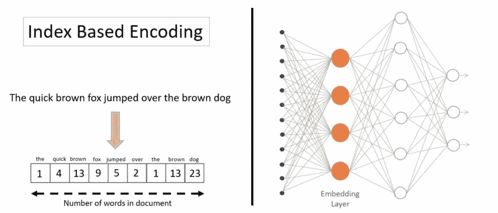
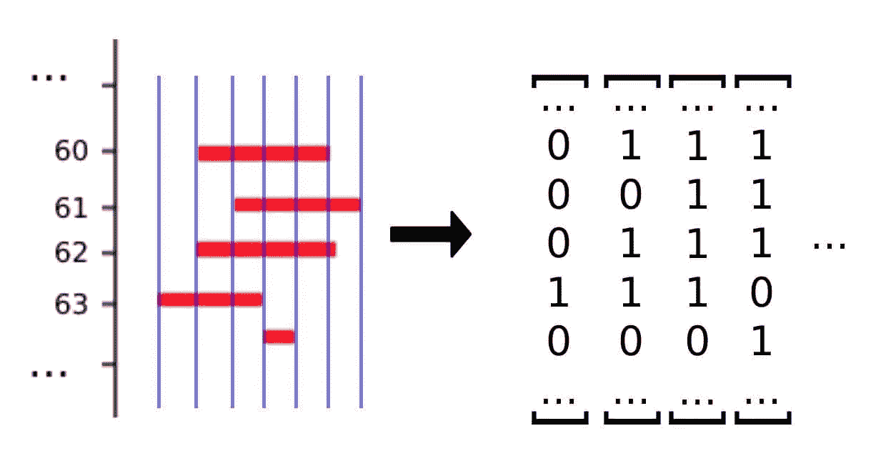
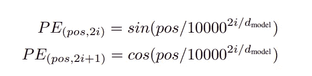
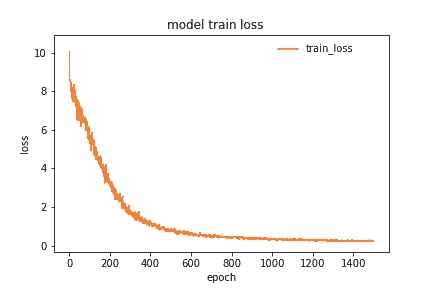
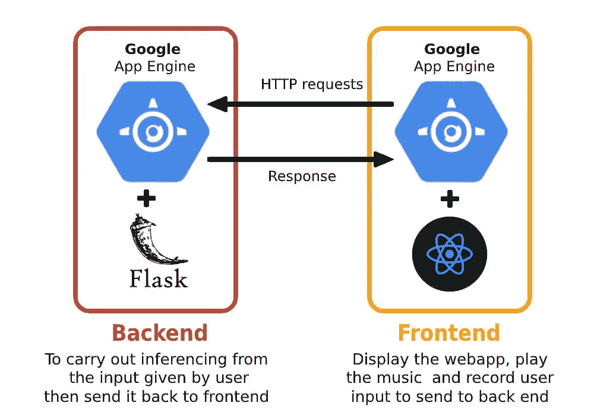

# 使用 GPT 的爵士乐一代

> 原文：<https://towardsdatascience.com/jazz-music-generation-using-gpt-a7ed52b0f468?source=collection_archive---------27----------------------->


亚历克斯·萨莫拉的爵士之夜

## [实践教程](https://towardsdatascience.com/tagged/hands-on-tutorials)

## 使用 GPT 和钢琴卷帘窗编码方法生成爵士音乐

生成式预训练转换器或 GPT 模型在处理自然语言处理(NLP)任务时取得了惊人的结果。然而，该模型结构并不是 NLP 所独有的，并且已经被用于解决其他问题，例如时间序列预测或音乐生成。在这篇文章中，我将分享我使用一个非常简单的 GPT 模型来创作音乐(特别是爵士乐)的方法。

# 目录

*   背景
*   钢琴卷帘窗编码方法
*   数据预处理和分析
*   GPT 模型
*   培养
*   推理
*   Web 应用程序
*   结论

# **背景**

音乐生成任务已经在过去使用深度神经网络解决，例如 RNN 特别是 LSTM 或 CNN 以及最近的 Transformer。在某种程度上，解决这个问题的方法很大程度上受 NLP 的影响，因为歌曲中的音符和段落中的文本之间的结构非常相似。与文本相比，处理音乐的主要区别在于信息编码步骤，我们将在后面探讨。

此外，我选择爵士乐的原因是因为它的不可预测性(爵士乐也是我最喜欢的音乐类型之一)。正如他们常说的，在爵士乐中没有“错误”的音符，特别是在即兴创作中，我很好奇当在爵士乐数据集上训练时，预测的音乐听起来会是什么样子。对于这个项目，我们将只关注使用**钢琴**乐器产生爵士乐。

所有的预处理和培训笔记本都可以在最后找到！

# 钢琴卷帘窗编码方法

通常，midi 对象包含相当多的信息，根据您使用的库，您可以从 MIDI 文件中提取不同的数据或相同的数据，但格式不同。另一方面，MIDI 音符是非常标准的，因为它是 MIDI 乐曲的组成部分。它包含以下信息:速度，音高，开始时间，结束时间。

就像我之前提到的我们如何转换 NLP 模型来解决音乐生成任务，我们需要以一种相对类似于 NLP 中单词编码的方式来编码这些 MIDI 音符信息(NLP 通常使用基于索引的编码来嵌入单词)。然而，对于 MIDI，我们需要表现每个音符多达 4 个特征，其中也包括时间特征。



基于索引的单词编码和嵌入— [文本编码:综述](/text-encoding-a-review-7c929514cccf) [1]

为了解决这个问题，我们决定将 MIDI 转换为钢琴卷帘窗格式，采样间隔为每 16 个音符。因此，钢琴卷首是大小为(song_len，128)的 2D 数组，其中 song_len 是歌曲中第 16 个音符的总数，128 是 MIDI 歌曲中可能的音高数。



MIDI 流(左)转换为钢琴卷帘窗阵列(右)的示例

这种数据编码方法表示每个恒定时间间隔的音符，因此，允许我们将整首歌曲表示成一个紧凑的 2D 数组。从这里，我们可以实现一种类似的单词编码方法，即基于索引对每个音高组合进行编码，然后将它们送入嵌入层。

我们决定不包括速度特征，因为这将导致我们的音高组合词汇爆炸。第 16 个音符是最佳的音程，因为它可以足够准确地表现音乐细节，同时也可以防止我们的钢琴卷阵列变得太长。

理解了这种方法之后，让我们开始研究代码吧！

# 数据预处理和分析

对于我们的数据集，我们选择了 Doug McKenzie 爵士钢琴数据集。虽然这个数据集中只有大约 200 首 MIDIs，但它包含了各种各样的流行爵士歌曲，而钢琴部分通常是干净的，连贯的，很少有缺失的部分。

由于数据集中的所有歌曲都有不同的调号，并且在不同的 BPM 中播放，因此我们进行数据预处理，以便使这些特征标准化。这个标准化步骤很重要，因为它不仅允许模型更好地理解歌曲的结构和模式，而且有助于减少我们的模型稍后的词汇量。

我们使用 Python[**pretty-midi**](https://github.com/craffel/pretty-midi)和 [**music21**](http://web.mit.edu/music21/) 来辅助数据解析和处理步骤。为了提取钢琴部分，我们过滤掉了包含最多音符的流(因为这是钢琴流的常见情况)。extract_midi_info()函数将帮助我们获取需要偏移的调号以及钢琴卷帘窗的 bpm。

preprocess_midi()函数将帮助我们使用 pretty_midi get_piano_roll 函数获取钢琴卷帘窗数组。

对于预处理的最后一步，我们遍历数据集中的所有 MIDI，解析、预处理并将钢琴卷帘窗数组保存为。npy 格式。

# GPT 模型

对我们的数据进行编码后，我们现在可以将其输入到 GPT 架构中，以训练一个自回归模型。如果你不太确定 GPT 是如何工作的，我推荐你读一下[杰伊·阿拉姆马](http://jalammar.github.io/)的这篇博文[【2】](http://jalammar.github.io/illustrated-gpt2/)，它非常详细，见解深刻，我从中学到了很多。

简而言之，GPT 仅利用变压器架构的解码器模块，并将这些解码器模块堆叠在一起，以增加网络的复杂性。


GPT 架构由堆叠的变压器解码器模块组成— [通过生成式预训练提高语言理解](https://www.cs.ubc.ca/~amuham01/LING530/papers/radford2018improving.pdf)

以下 GPT 模型的代码引用自 [Apoorv Nandan](https://twitter.com/NandanApoorv) 用微型 GPT[【3】](https://keras.io/examples/generative/text_generation_with_miniature_gpt/)生成的文本。

对于令牌和位置的嵌入，我们使用了正弦和余弦函数。



位置编码—你所需要的只是注意力[【4】](https://arxiv.org/pdf/1706.03762.pdf)

随意掩饰的自我关注

变压器组

最终模型。

模型摘要:

```
Model: "model"
_________________________________________________________________
Layer (type)                 Output Shape              Param #   
=================================================================
input_1 (InputLayer)         [(None, 600)]             0         
_________________________________________________________________
token_and_position_embedding (None, 600, 128)          5120000   
_________________________________________________________________
transformer_block (Transform (None, 600, 128)          99584     
_________________________________________________________________
transformer_block_1 (Transfo (None, 600, 128)          99584     
_________________________________________________________________
transformer_block_2 (Transfo (None, 600, 128)          99584     
_________________________________________________________________
dense_18 (Dense)             (None, 600, 40000)        5160000   
=================================================================
Total params: 10,578,752
Trainable params: 10,578,752
Non-trainable params: 0
```

# 培养

为了训练我们的模型，我们首先需要从数据集创建训练输入和输出。因此，我们首先将每个独特的音高组合分配给一个整数，如前一部分所述。对于我们的词汇表，我们只考虑前 40000 个最常用的音符组合，包括未知和填充标记。最后，我们对输入数据的钢琴卷首数组进行标记。

我们还将创建我们的定制生成器。该模型的输入将是固定 sequence_length 的符号序列，输出将是相同长度但向右移动一个符号的序列。对于每个时期，我们将遍历数据集中的所有歌曲，在每首歌曲中，我们选择一对输入和输出序列在随机位置进行训练。如果需要的话，我们也可以使用填充。

终于准备好训练了！我们实验了 1500 个时期，32 个批量大小和 600 个序列长度。



# 推理

为了预测一首歌曲，我们需要给它输入一些开始音符，并填充到与训练序列长度相同的大小，即 600。

得到钢琴曲后，我们可以接着转换成 MIDI。这里有几个推理样本，前 5 秒或 10 秒是种子。

这首歌已经播了 10 秒了

# **网络应用**

我和我的团队还创建了一个 web 应用程序来展示我们的建模能力。我们将 React JS 用于 web 应用程序，将 Flask 服务器用于推理任务。为了部署该产品，我们使用 Google 云服务来托管 React web 应用程序和 Flask 推理服务器。



这里有一个 web 应用程序的简短视频演示，不幸的是，由于我的谷歌云平台信用已经用完，应用程序本身不再可用:(

web 应用程序的演示


我们的 web 应用程序的快照

# 结论

尽管只有大约 200 首歌曲的小数据集，我们还是设法开发了一个可以很好地预测爵士音乐的模型。然而，在评估过程中仍然有一些过度拟合的迹象，尽管我们试图增加辍学率，但我们相信这个问题会在更大的数据集上得到解决。

最后，这是我的第一个数据科学项目，它真正教会了我这个项目是为计算数据科学模块而做的。我们这个团由[许鞍华](https://github.com/elliotmoose)、[肖恩·林](https://github.com/oliviergoals)、[西德哈斯·普拉文](https://github.com/sidharth3)和[梅](https://github.com/victorpham1997)组成。特别感谢我的团队成员和我的教授 Dorien Herremans 和 Soujany 茯苓的帮助和指导。

**源代码:**
- N [预处理 otebook](https://github.com/victorpham1997/music-generator-app/blob/main/models_src/model_c_transformer/Mugen_preprocess_V3.ipynb)
-N[训练推理 otebook](https://github.com/victorpham1997/music-generator-app/blob/main/models_src/model_c_transformer/MuGenTransformer-v3-stable-export.ipynb)
-[项目 Github](https://github.com/victorpham1997/music-generator-app)

**参考文献:** 【1】西里坡，罗莎丽亚。“文本编码:回顾”，2019 年 11 月 21 日。[https://towards data science . com/text-encoding-a-review-7c 929514 cccf。](/text-encoding-a-review-7c929514cccf.)

[2]阿拉马尔，杰伊。"图解 GPT-2(可视化变压器语言模型)."图解 GPT-2(可视化变压器语言模型)，2019 年 8 月 19 日。[http://jalammar.github.io/illustrated-gpt2/.](http://jalammar.github.io/illustrated-gpt2/.)

[3]南丹，阿波洛夫。" Keras 文档:用微型 GPT 生成文本."用微型 GPT 生成文本，2020 年 5 月 29 日。[https://keras . io/examples/generative/text _ generation _ with _ miniature _ GPT/。](https://keras.io/examples/generative/text_generation_with_miniature_gpt/.)

[4]瓦斯瓦尼、a、n .沙泽尔、n .帕马尔、j .乌兹科雷特、l .琼斯、A. N .戈麦斯、l .凯泽和 I .波洛苏欣。“你需要的只是关注。arXiv 2017。” *arXiv 预印本 arXiv:1706.03762* (2017)。