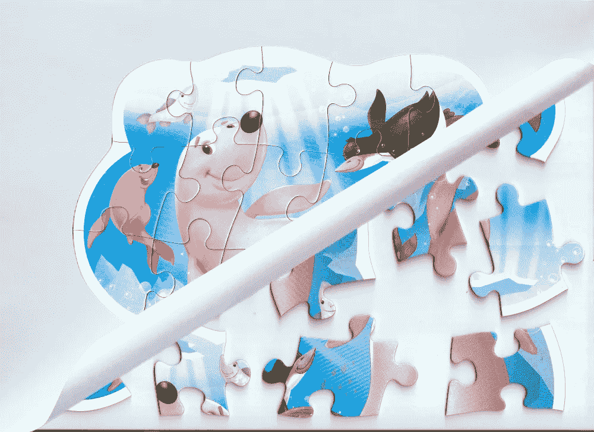
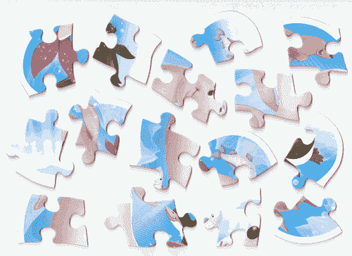
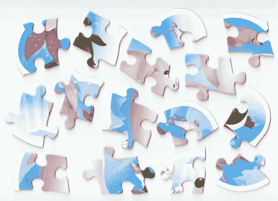
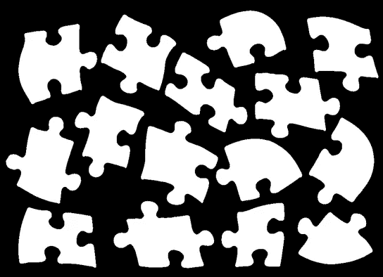
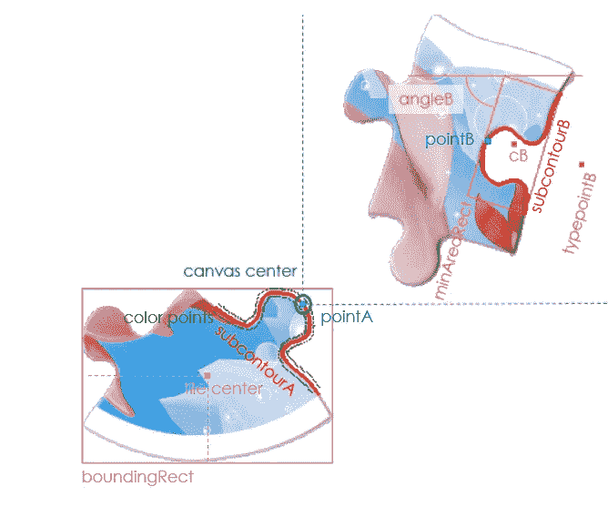
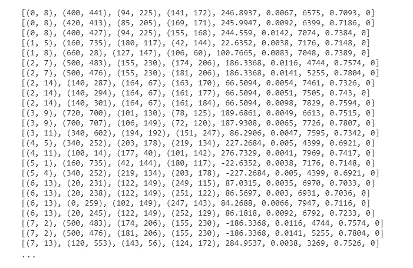
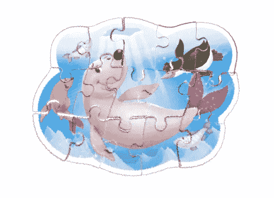
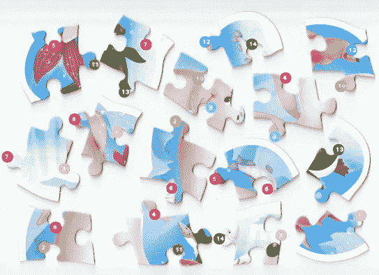

# 拼图玩具人工智能从 A 到 Z

> 原文：<https://towardsdatascience.com/jigsaw-puzzle-ai-from-a-to-z-b4bdb53d8686?source=collection_archive---------6----------------------->

## 使用基本的人工智能工具组装任意现实生活中的谜题

作者图片(由卡斯特兰拼图公司的“北极冰层下的生活”制作)

# 介绍

自人工智能早期以来，我们已经看到了处理拼图难题的多种尝试。然而，爱好者主要集中在特定的方面:只有方瓦，只有非扫描，单色等。

在这里，我们来看一下全面的方法，这种方法在非常简单的同时处理了整个问题。这项工作的想法是展示我们如何能够利用今天的基本人工智能工具来处理拼图游戏解决方案的所有方面。

我们将使用 Google Colab 和 Python 来完成这项工作，这样每个人都能够轻松地理解和复制它，而无需任何特殊的软件。

“用 300 行代码在 60 秒内解决”(图片由作者提供)

# 概观

我们将解决 15 块瓷砖的难题。对于计算机来说，这是一个复杂的问题，因为复杂性主要不是来自瓷砖的数量，而是来自瓷砖的几何形状。我们的拼图是不均匀的圆形，并且有扭曲的弯曲边缘。

提出的方法是为了证明我们可以不局限于任何特殊类型的瓷砖。反之亦然，这个想法是用任何几何形状的瓷砖来解谜。

我们将浏览 300 行 Python 代码。不过，它只涵盖了 3 个主要步骤:

1.  图像处理。它处理如何从扫描中提取瓷砖。
2.  匹配。这是如何找到匹配的瓷砖以及匹配方式的核心部分。
3.  组装。这是一个最终的算法，把瓷砖拼凑成一个整体的图像。

数量少得惊人的基本模块将足以解决我们的彩色拼图。

# 图像处理

我们将零散瓷砖的扫描图像作为输入。它必须是一个良好的扫描没有明显的扫描仪伪影，如彩色条纹或黑边。我的扫描是 A4 格式，重采样为 727 x 1000 像素，大约相当于 90 dpi。

首先，我们将图像绘制封装到函数中，以进一步简化代码。我们想关闭坐标轴，为单通道图像切换到“灰色”色图，等等。

然后，我们加载一个扫描，并使其 RGBA 进一步参与透明度维度。

作者图片

我们可以看到天蓝色背景上的彩色瓷砖。为了能够对瓷砖做任何事情，我们必须首先检测它们。这是一个单一的图像，我们必须把它变成 15 个独立的瓷砖。检测单色背景上的对象的一种可能方法是自适应阈值处理。我们将对我们的图像应用`adaptiveThreshold()`工具，以便从背景中分离瓷砖。`GaussianBlur()`是可选的，但在这里是必要的，因为有些瓷砖有白色边缘，这些边缘与背景融为一体，产生我们必须填充的裂缝。

作者图片

这看起来不错。尽管如此，我们也无能为力。我们需要的是一个清晰的二值图像，其中每个像素要么是瓷砖，要么是背景。因此，我们将使用 OpenCV 轮廓检测和填充技术来完成这个简单的技巧。为了抑制由绘画形成的额外轮廓，我们按照长度降序对检测到的轮廓进行排序，并取 15 个最大的轮廓(手动，因为为了简化代码省略了自动化)。

作者图片

还不好。我们可以看到瓷砖有粗糙的边界和由原始扫描图像中的阴影形成的突出尖峰。抑制尖峰的典型方法之一是中值滤波，即将每个元素转换为周围元素的平均样式。换句话说，如果你的同伴都很矮，而你很高，你也会变矮:)。在`median_filter()`之后，我们通过画一个黑色的轮廓来修整我们的形状。这是为了去掉上面模糊操作产生的阴影和多余的像素。

作者图片

嗯，那很好！现在图像是二进制的:瓷砖对背景，没有半色调。我们可以将它叠加在原始图像上，一个接一个地提取彩色瓷砖。另一个聪明的工具`boundingRect()`将帮助我们从大图像中切割出想要的区块。它的作用是检测包含一个形状的最小包围盒。

作者图片

我们终于拥有他们了！15 块彩色瓷砖，位于 300 x 300 图像的中心，背景透明。前奏结束了，该是主幕了！

# 相称的

匹配的关键思想是拿一对瓷砖，在它们的轮廓中寻找相似的部分，沿着那些部分比较颜色，然后尝试锁定那些部分而不丢失像素。

我们从重新调整我们的瓷砖开始。让我们把它们放在 1400 x 1400 的画布上，这是我们将用来组装整个拼图的画布。这只是一个技术操作，没有任何秘密含义。

在匹配算法中将使用四个辅助函数。所有这些都基于基本的 2D 几何学:

*   `getColors()`被设计成沿着图像的子区域拍摄彩色像素。在子区域的每 3 个点上，我们取 2 个点与子区域的内部和外部正交，深度为 3 个像素(因为我们不知道瓷砖的确切位置)，将颜色转换为 HSV 并添加到列表中。
*   `putOnAnvil()`将输入图像作为 NumPy 数组，并使用 PIL 方法对其进行偏移/旋转，这只是一个技术问题。我们使用它来旋转和重新定位画布瓷砖，将其子上下文中心放入图像中心，以与匹配的瓷砖融合。
*   在组装或装配过程中，当我们移动和旋转拼图和拼块时，`rotatePoint()`有助于跟踪拼块中心。
*   `reScale()`又是一个技术上的东西，用来把点坐标从平铺图像的(300，300)平移到拼图画布的(1400，1400)。在两个空间中工作是必要的，以节省时间而不处理额外的零像素。

所有进一步的代码请记住，OpenCV 工作在(x，y)坐标域，而其他模块是(y，x)。因此，我们将不得不不断地交换和翻转。

在我们深入研究匹配算法之前，让我们先来看看我们将使用的一些主要概念。当我们进行匹配时，我们会谈到图块 A 和 B、子区域和子区域中心(pointA 和 pointB)、边界矩形和图块中心、最小面积矩形及其中心(cA 和 cB)和角度(angleA、angleB)、typepointA 和 typepointB 来说明它是 tab 还是空白、画布中心(“anvil”)以及我们用于颜色匹配的近子区域点。

关键概念(图片由作者提供)

然后我们来看匹配算法本身。看起来很吓人。尽管如此，结构还是很简单。我们用 OpenCV `findContours()`提取两块瓷砖的轮廓。然后，我们取图块 A 的小子图，并将其与图块 b 的小子图进行比较。子图是通过主轮廓的滚动和切片得到的。

我们一个接一个地经历 3 个匹配循环(轮廓匹配、颜色匹配和预拟合)。名字是不言自明的，而想法是不断减少匹配的数量，通过某些标准过滤掉不好的。例如，两个外形相似的轮廓，可能在颜色上完全不相容，所以它们甚至不会到达试衣间。此外，试衣间非常耗时，因此我们希望最少数量的匹配能够通过筛选。

让我们来看看每种情况下都发生了什么:

*   轮廓匹配。这是用公开的简历`matchShape()`完成的。虽然对于曲线来说不是 100%好(我更喜欢用我的方式对待那些)，我们在这里使用它来简化故事。在匹配之前，我们检测子上下文类型(标签或空白)和一般外观(使用`minAreaRect()`)以节省时间和避免明显的失败。正确检测旋转角度需要两个辅助标志(“共线”和“共线”)。这是因为`minAreaRect()`只返回象限 III 中的(0，-90°)角度，而`matchShapes()`根本不返回任何角度。尽管如此，还是有出路的。
*   配色。它遍历过滤后的表单匹配，沿着每个子上下文获取色点，并将它们与`fastdtw()`距离度量进行比较(在这里解释为)。关键是我们必须将颜色转换成 HSV 格式。拼贴的原始 RGB 可能会产生误导，因为 130 与 190 一样接近 160，交换两个通道可能会给你相同的度量，但颜色完全不同。HSV 会做得更好。
*   预装配。这是一个直接尝试融合瓷砖，使用火柴达到这一水平。我们取两个画布块，将它们的子上下文中心叠加在画布的中心，旋转适当的角度，并计算度量。如果图块匹配良好，我们将拥有最小的像素损失(图块不重叠)和最小的结果对轮廓长度(关节边相互贴在一起并隐藏起来不被测量)。一个更健壮的版本包括子区域的叠加和交集比率的计算(此处省略)。

匹配算法的参数化将需要从难题到难题的手动调整:

*   `LENGTH`。这里的子节点长度是 160，大致接近最小节点长度。对于拼图来说，它必须是可变的，因为拼图的大小变化很大。
*   `PRECISION`。这只是一个粗略的过滤器，以消除明显的不匹配。精度允许在子区域边界矩形的尺寸上有差异。它必须非零，因为图像处理不是 100%准确。
*   `STEP_A`、`STEP_B`。步骤只是我们用来获取另一个分包合同的转移。值 1 是一个梦，但它会永远循环，你必须寻找妥协。
*   `MAX_*.`这些参数决定了相应指标的上限。它们主要取决于分辨率和子区域长度。

现在我们在一个循环中为所有可能的配对运行匹配算法。105 对中每对大约 0.5 秒。在这里不到一分钟，但对于 128 块 8192 对的拼图来说，需要一个小时。因此，要快速处理大型拼图，我们需要优化(numba、并行线程)以及算法技巧，如早期拼图分组、预组装等。

得到的匹配列表包含关于图块编号、滚动值、子区域中心坐标、旋转角度和度量的信息。如果没有满足我们限制的匹配，我们的结果将是空的。我们也可能会错过一些比赛，瓷砖可能会在组装过程中锁定。

当我们的匹配算法从图块 0 转到图块 14 时，我们只记录升序对，如(1，5)、(2，6)等。但是，如果(1，5)匹配，那么(5，1)也匹配。这就是为什么我们把比赛展开成一个完整的列表，翻转成对。最后，我们按照配对和匹配度量对匹配列表进行排序，得到如下结果:

作者形象

# 装配

组装的关键思想是通过匹配找到并在画布上有一个图块，尝试将 B 图块锁定到它，根据匹配信息移动和旋转拼图和添加的图块。

也就是说，我们通过匹配子块的中心来获取匹配块，在画布中心将一个点叠加在另一个点上，并按适当的角度旋转块。为了保持对旋转和定位的控制，我们总是在画布的中心做这个动作。我们可以认为这是把每对新的中心放在画布的中心，就像放在铁砧上融合一样。这使我们能够在装配过程中正确旋转和跟踪轮廓和图块中心坐标。

我们将使用一个有用的函数来简化组装算法。当我们旋转拼图和瓷砖时，它的作用是在画布上记录瓷砖的中心和角度。

我们的拼图有 22 个关节，但是匹配算法返回了 37 个匹配。这意味着我们必须在装配过程中过滤正确的零件。我们通过控制像素损失来实现这一点。如果我们向拼图中添加一个新的图块，它出错并部分重叠，这将导致颜色像素的丢失。当像素损失低于某个比率(在我的例子中是所添加图块的 f.i. 10%)时，我们接受该图块，如果它更高——可能我们的匹配是错误的，我们必须尝试另一个。

为了简单起见，我们在这个算法中放弃替换瓷砖，最多只做 10 次尝试来组装拼图，或者在画布上达到 15 个瓷砖时退出循环。这意味着，如果我们放错了瓷砖，或者把正确的瓷砖放错了，我们就不能回去重新做。然而，对于这个难题，这就足够了。

作者形象

嗯，很管用！虽然…图像看起来有点破旧。这是由于多次旋转过程中信息失真造成的。此外，不要忘记我们从一开始就在低分辨率下工作。至少，我们可以看到水下的人们在微笑:)

现在，我们找到了解决方案，可以用找到的匹配项标记原始切片。对于每一对，我们在锁的位置画出一个特定颜色的圆圈，并在两者里面放一个匹配的数字。

作者形象

如您所见，并非所有制表符和空格都已标记。这是因为 14 把锁就足够组装这个拼图了。其他人会自动锁定。

# 结论

在本文中，我们已经经历了拼图游戏解决的整个周期。它清楚地表明，我们可以做到这一点，而无需深入学习，简单地将算法逻辑与当今的高性能人工智能工具相结合。

许多解释和一些算法(如检测瓷砖的数量，在组装过程中更换瓷砖等)被删除，以使故事简短，并保持重点放在总路线上。

虽然这不是最终的方法，但它是全面的，并显示了我们可以使用当今简单的负担得起的工具来处理现实生活中的问题的方法。

学校几何和基本 Python AI 的知识恰好足以解决一个问题，这个问题就在昨天还令人头疼。

*在:*[*GitHub \ Jigsaw-Puzzle-AI*](https://github.com/MaximTerleev/Jigsaw-Puzzle-AI.git)找到源文件