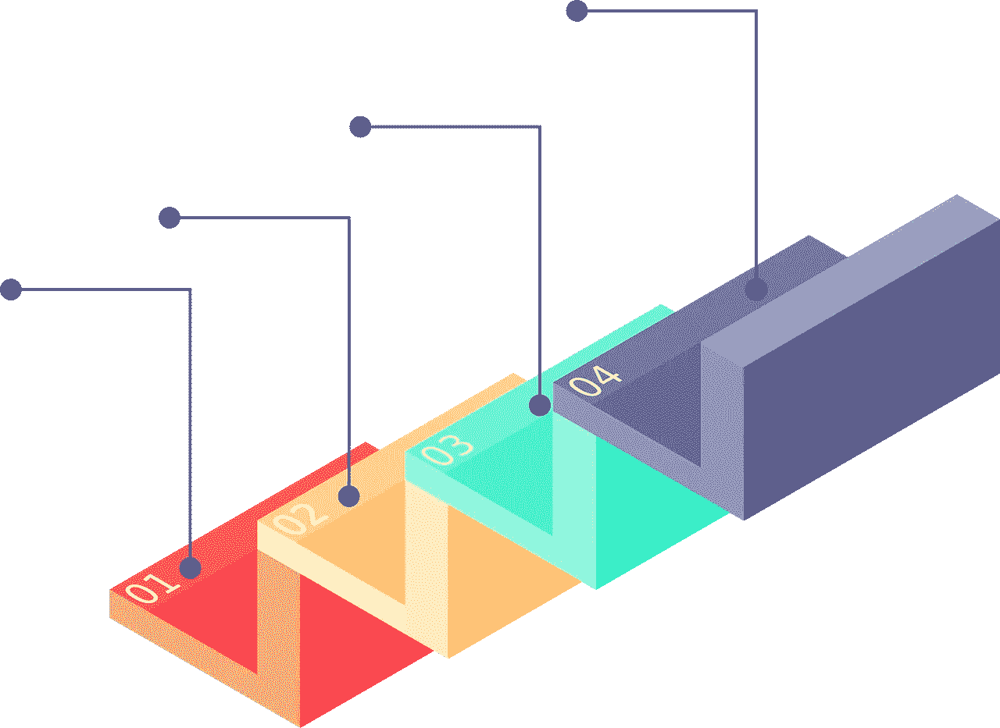
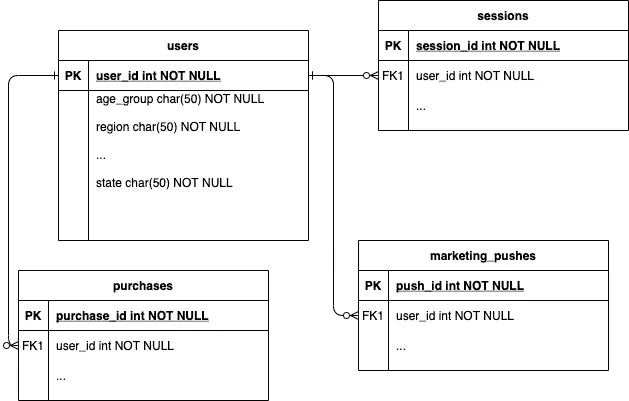

# 金贾+ SQL = ❤️

> 原文：<https://towardsdatascience.com/jinja-sql-%EF%B8%8F-7e4dff8d8778?source=collection_archive---------3----------------------->



来源:[特朗普](https://pixabay.com/users/bytrangle-6596164/?utm_source=link-attribution&utm_medium=referral&utm_campaign=image&utm_content=2895154)来自 [Pixabay](https://pixabay.com/?utm_source=link-attribution&utm_medium=referral&utm_campaign=image&utm_content=2895154)

## 用于可维护、可测试数据分析的宏

SQL 是分析师的面包和黄油。它强大、富有表现力、灵活——但是一门语言给你的力量越大，你就有越多的方式搬起石头砸自己的脚。

更好的抽象可以帮助我们做到这一点。如果我们能够抽象出我们一直使用的代码，那么我们只需要编写并检查代码*一次*。有了正确的抽象，您还可以开始考虑单元测试 SQL，这在专业分析中做得不够，但应该是标准实践。

[**Jinja 宏**](https://jinja.palletsprojects.com/en/3.0.x/templates/) 特别适合对 SQL 进行抽象——如果您决定为您的数据组织使用类似 Fishtown Analytics 的 [**数据构建工具**](https://blog.getdbt.com/what-exactly-is-dbt/)——那么我们将专门探讨如何使用 Jinja。但是这里的经验应该是通用的，超越任何一个特定的工具。

你可以跟随我在 [**这个 Git repo**](https://github.com/NaimKabir/jinja-sql-demo/tree/main) 中包含的一些玩具用例。本文中与回购中的文件相对应的代码片段将以类似如下的内容开头:

```
-- path: macros/volume_by_demographic.sql
```

# 用例#1:参数化查询

这里有一个场景:假设您有一个星型模型，有一个`users`表链接到各种其他表，如`purchases`、`sessions`、`marketing_pushes`等。



来源:作者

你可能想知道`purchases`的销量是如何随着人口统计而变化的。该查询可能如下所示:

```
-- Get purchase volume by demographic
select
    users.age_group,
    users.region,
    count(*) as purchase_volume
from purchases
    join users on purchases.user_id=users.user_id
group by 1,2
```

到目前为止很简单。但是，如果我们希望用户会话的数量减少相同的维度呢？

我们会做:

```
-- Get session volume by demographic
select
    users.age_group,
    users.region,
    count(*) as session_volume
from sessions
    join users on sessions.user_id=users.user_id
group by 1,2
```

这是很多重复的代码！当我们可以用一个抽象来编码关于数据模型的基本假设时，为什么要写同样的东西两次呢？

让我们写一个宏。这些宏片段具有用**粗体**表示的宏逻辑，当调用宏时，变量名在查询的最终“呈现”中被替换为字符串值。为了更好地理解语法，查看一下 [**Jinja 模板设计器文档**](https://jinja.palletsprojects.com/en/3.0.x/templates/) 。

```
-- path: macros/volume_by_demographic.sql****select
    users.age_group,
    users.region,
    count(*) as **{{ count_col_name }}**
from {{ entity_table }}
    join users on **{{ entity_table }}**.user_id=users.user_id
group by 1,2****
```

使用这个宏，我们对购买量和会话量进行的最后两个查询可以通过简单的调用完全呈现出来:

```
-- path: models/purchase_volumes.sql****-- Get purchase volume by demographic
**{{ volume_by_demographic('purchases', 'purchase_volume') }}**
```

或者:

```
-- path: models/session_volumes.sql****-- Get session volume by demographic
**{{ volume_by_demographic('sessions', 'session_volume') }}**
```

在 [**repo**](https://github.com/NaimKabir/jinja-sql-demo/tree/main) 中尝试一下，看看值是如何交换进来以呈现最终查询的！

```
>> ./render.py models/session_volumes.sql
```

现在，如果有一个业务范围的决定，即“人口统计”的概念不应该只是年龄组和地区，因为“地区”太粗略，无法做出任何可操作的决定，会怎么样？

你可以直接回到宏代码中，把“区域”改成“州”或者什么的，并保持宏的最终调用点不变。你只需要在一个地方做出改变。

你所做的抽象是为业务分析实现一个*接口*，在这里你可以交换后端实现，让你的分析逻辑的消费者不受影响——留给你一个 SQL 代码库，它很容易随着动态需求而改变。

正如我们将会看到的(我们已经犯了一些错误)，构建接口是棘手的，但是从某个地方开始总比没有接口好。

# 用例 2:可组合查询

SQL 允许您在子查询或公共表表达式中嵌套逻辑(甚至是递归的)，让您可以无限地将一组记录与另一组记录链接起来。

像这样的查询可能会令人毛骨悚然，即使是我们正在探索的完美的玩具示例。例如，假设我们希望将每个人口统计组的会话量与购买量相关联，以了解每次会话的预期购买量。

在原始 SQL 中，这可能看起来像:

```
with purchase_volumes as (select
    users.age_group,
    users.state,
    count(*) as purchase_volume
from purchases
    join users on purchases.user_id=users.user_id
group by 1,2),session_volumes as (select
    users.age_group,
    users.state,
    count(*) as session_volume
from sessions
    join users on sessions.user_id=users.user_id
group by 1,2)-- Get purchase/session ratios for each age_group*state combinationselect 
    age_group,
    state,
    purchase_volume / session_volume as ratio
from purchase_volumes 
    join session_volumes
    on purchase_volumes.age_group=session_volumes.age_group
    and purchase_volumes.state=session_volumes.state
```

这是一大堆代码，我们声明的每一项都是潜在的出错点。 [**可证明的事实是**](https://www.quantamagazine.org/mathematician-solves-computer-science-conjecture-in-two-pages-20190725/) 复杂性使得像基于 SQL 查询的决策过程这样的系统对小错误更加敏感，这一点在专业分析领域经常得到证实*。*

*抽象化缩小了 bug 的表面区域。上面的查询可以归结为:*

```
*-- path: models/purchase_sessions_ratio.sql-- Get purchase/session ratios for each age_group*state combinationselect 
    age_group,
    state,
    purchase_volume / session_volume as ratio
from (
        **{{ volume_by_demographic('purchases', 'purchase_volume') }}** ) p   
    join (
        **{{ volume_by_demographic('sessions', 'session_volume') }}** ) s
    on p.age_group=s.age_group
    and p.state=s.state*
```

*更不用想了！*

*现在，我们可以只关注转换率逻辑，同时相信基本的体积计数逻辑是正确的。更少的移动部件=更少的破碎系统。*

*试试在 [**回购**](https://github.com/NaimKabir/jinja-sql-demo/tree/main) :*

```
*>> ./render.py models/purchase_sessions_ratio.sql*
```

# *用例 3:可扩展的组合*

*抽象让你比我们已经建立的更加灵活。如果我们不看会话与购买的比率，而是看营销推送与会话的比率，以及*和*营销推送与购买的比率，会怎么样？*

*我们可以对我们处理的最后一个 SQL 块进行宏化，这样它就可以将不同的表引用作为参数！我们将有一个`numerator_vol_ref`来指定哪个表的计数应该是输出比率的分子，还有一个`denominator_vol_ref`来指定相同的分母。*

```
*-- path: macros/volume_ratio.sql****select 
    age_group,
    state,
    N / D as **{{ numerator_vol_ref }}_over_{{ denominator_vol_ref }}**
from (
        **{{ volume_by_demographic(numerator_vol_ref, 'N') }}** ) p   
    join (
        **{{ volume_by_demographic(denominator_vol_ref, 'D') }}** ) s
    on p.age_group=s.age_group
    and p.state=s.state*****
```

*现在，如果我们想再次计算购买-会话比率，我们可以问:*

```
*-- path: models/purchase_sessions_ratio_2.sql****-- Get ratio of purchases to sessions for a demographic group
**{{ volume_ratio('purchases', 'sessions')}}***
```

*但是，如果我们想查看漏斗中的一系列步骤，并且这些步骤是动态的，那该怎么办呢？*

*输入:Jinja 控制流。我们可以在 SQL 模板中执行循环和 if-conditionals，这是一个*超能力。**

*让我们创建一个引用最后一个逻辑块的宏，但是让我们将一个`denominator_vol_ref`和一个`numerator_vol_ref`的整个*数组*作为参数。*

```
*-- macros/volume_ratios.sql****select
    age_group,
    state,
 ****    **{{ ref }}**_over_**{{ denominator_vol_ref }}**
    ****,****
    ****
from
    (**{{ volume_ratio(numerator_vol_refs.0, denominator_vol_ref) }}**)
    as base
    ****
 ****
    join
    (**{{ volume_ratio(ref, denominator_vol_ref) }}**) as **{{ref}}**_r
            on **{{ref}}**_r.age_group=base.age_group
            and **{{ref}}**_r.state=base.state
 ****
 *********
```

*那里发生了很多事。让我们来分解一下我们正在做的一些事情。*

*在这个街区:*

```
*select
    age_group,
    state,
 ****    **{{ ref }}**_over_**{{ denominator_vol_ref }}**
    ****,****
    *****
```

*我们将遍历表引用的列表，我们将使用这些表引用的人口统计量作为比率分子。`if not loop.last`条件语句确保我们在除最后一列之外的每个列名后面都加上一个逗号，以得到格式良好的 SQL。*

*这为我们提供了一组对子查询中公开的列名的引用。*

*在这个街区:*

```
*from
    (**{{ volume_ratio(numerator_vol_refs.0, denominator_vol_ref) }}**)
    as base*
```

*我们使用数组中的索引`.0`从第一个分子表引用创建一个体积比率子查询，并将该子查询别名为`base`。*

*在最后一块:*

```
*****
 ****
    join
    (**{{ volume_ratio(ref, denominator_vol_ref) }}**) as **{{ref}}**_r
            on **{{ref}}**_r.age_group=base.age_group
            and **{{ref}}**_r.state=base.state
 ****
*****
```

*我们再次遍历分子表引用列表。因为我们已经使用了第一个表引用来创建`base`子查询，所以我们忽略第一个带有`if not loop.first`条件的子查询。*

*然后，我们针对每个分子表引用的新的`volume_ratio`子查询以编程方式连接`base`，最终暴露出我们想要的所有列。*

*我们可以在文件中调用宏:*

```
*-- path: models/example_funnel.sql******{{ volume_ratios([
        'purchases', 
        'sessions', 
        'supportTickets'
        ], 
   'marketing_pushes') 
}}***
```

*试试在[中的**回购**中的](https://github.com/NaimKabir/jinja-sql-demo/tree/main):*

```
*>> ./render models/example_funnel.sql*
```

*这个东西将呈现一个庞大的查询，很难理解，手工组装起来会很痛苦。但是用宏呢？不是*可怕*可怕。*

# *用例#4:单元测试*

*这是整件作品的真正主题。*

*我们已经看到抽象是如何让我们通过构建小的乐高积木来构建复杂的查询的。如果你在工作流程中使用它们，你可以从相对简单的部分构建出最终复杂的东西。*

*我们还看到这些部分是可参数化的，我们可以提供给宏的一个关键参数是对一个表的引用！这种引用可以是对“真实的”物化数据库表、公共表表达式或视图的引用。重要的是，我们可以对生产数据*或*使用参数化查询，这是我们有意设计并存储在某处的一组合成数据。*

*这使我们能够编写一堆行，覆盖我们希望查询处理的所有测试用例，并检查结果是否如预期的那样。然后，一旦我们确定它有效，我们就可以对实际的业务相关数量使用完全相同的查询逻辑。*

*如果我们用已经探索过的代码进行一些单元测试，我们可能已经发现了一些错误。例如，在`volume_ratio.sql`中，我们正在做整数除法，不会在我们的查询结果中得到`real`个数字。我们也不检查 0 值分母，这在最坏的情况下是个坏消息。*

*还有几个例子，我们对公开的列如何命名做了隐含的假设——对命名方案的任何微小改变都会破坏下游的宏，而调用者不知道发生了什么。*

*进行单元测试强调了您的组织正在构建的整个分析卡片屋，并允许您迭代，直到您获得一个既正确又易于更改的“数据 API”。*

*它还允许您自信地进行更改，并简单地检查之后的回归，而不是将您的时间花费在生产记录中试图进行健全性检查。*

# *分析工程*

*只有当你以一种特殊的方式塑造你的分析团队时，这篇文章的教训才会有用。在开始使用 Jinja2 和宏的抽象魔法之前，一些隐含的假设必须成立:*

*   *您需要在一个统一的代码库中对分析工作进行编码，而不是在几个团队的商业智能工具页面中进行编码。*
*   *应该有一个连续的“部署”管道，从代码库获取最新的 SQL，并实际上将其分流到仪表板/报告等。这个管道可以处理 Jinja 渲染、查询导出等。*
*   *必须有一个框架来启动测试，如果有一个假设或逻辑错误可能产生不正确的查询结果，则 [**停止该行**](https://en.wikipedia.org/wiki/Andon_(manufacturing)) 。*

*开始这一切的一个很好的方法是浏览 Fishtown Analytics' [**数据构建工具**](https://www.getdbt.com/product/what-is-dbt/) 的文档，该工具旨在处理像这样的组织的许多细节。*

*沿着这条路走下去，你的分析组织将超越侦探、特别查询处理程序和部落机构知识仓库。*

*这将把他们变成一个由*分析工程师*组成的团队，他们的工作是可重复和可靠的。*

## *资源*

*   *[**Jinja2 模板文档**](https://jinja.palletsprojects.com/en/3.0.x/templates/)*
*   *[**数据构建工具教程**](https://docs.getdbt.com/tutorial/setting-up)*