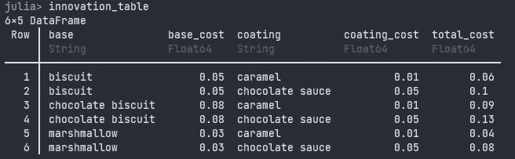

# 在 Julia 中连接数据框架

> 原文：<https://towardsdatascience.com/joining-dataframes-in-julia-c435e3da32f3?source=collection_archive---------28----------------------->

## 学习所有连接——使用 DataFrames.jl 的内部、外部、交叉和半连接

W 帽子是什么加入的？我们为什么要这么做？我们如何使用 DataFrames.jl 来实现呢？在这篇文章中，我将展示一些关于如何连接数据帧的实用而简单的例子。


照片由[蒂姆·约翰逊](https://unsplash.com/@mangofantasy?utm_source=unsplash&utm_medium=referral&utm_content=creditCopyText)在 [Unsplash](https://unsplash.com/s/photos/join?utm_source=unsplash&utm_medium=referral&utm_content=creditCopyText) 上拍摄

> 要获得所有媒体文章的完整访问权限，包括我的文章，请考虑在此订阅。

# 简单连接

上一次，我们弄清楚了如何使用 DataFrames.jl 索引、排序和聚合我们的数据。Joins 是另一个非常常见和重要的操作，出现在列表数据的世界中。跨两个数据框架的联接是基于两个表中存在的共享列值来组合两个数据集的操作。我们称这一列(或几列)为键。因此，第一个表中的每条记录都与第二个表中的一条记录匹配—只要记录的值相同。让我们通过一个小例子来证明这一点。首先，我们设置表 A:

```
5×2 DataFrame
 Row │ id     name
     │ Int64  String
─────┼───────────────
   1 │     1  Alice
   2 │     2  Bob
   3 │     3  Claire
   4 │     4  Daniel
   5 │     5  Edward
```

该表包含所有个人的 id 及其姓名。假设我们有另一个表，其中包含这些个人的收入:

```
6×2 DataFrame
 Row │ id     salary
     │ Int64  Int64
─────┼───────────────
   1 │     3    4078
   2 │     4    2395
   3 │     5    3662
   4 │     6    2202
   5 │     7    2564
   6 │     8    4545
```

我们现在有两张桌子:

*   保存人们的 id 和姓名
*   `B_earnings`保存 id 和收益。

我们想合并这两个表，这样我们就可以一起看到姓名和收入。我们加入吧！

```
3×3 DataFrame
 Row │ id     name    salary
     │ Int64  String  Int64
─────┼───────────────────────
   1 │     3  Claire    4078
   2 │     4  Daniel    2395
   3 │     5  Edward    3662
```

让我们详细讨论一下这个问题。参数 1 和 2 是我们要连接的两个表。参数 3 ( `on`)告诉我们**键列**是什么。我们将使用该列来匹配表中的观察值。

如您所见，我们最终得到了 3 行 3 列。现在回到开始，看看这两个原始数据集是什么样子的。请确保您理解为什么我们最后只有这些行。

由于我们使用了`innerjoin`，我们只**保留了出现在两个数据集**中的 ids 其他的我们都丢弃了。

还有其他种类的连接:

*   **内部连接**:获取出现在两个表中的 id
*   **左连接**:从左(第一个)表中取出所有的 id 和右表的值
*   **右连接**:与左连接相同，但是保留第二个表中的所有 id
*   **外部连接**:从两个表中取出所有 id，不管它们是否出现在另一个表中

不要害怕，我们现在将逐一检查所有这些连接！首先，让我们做一个**左连接**，看看只在第一个数据集中的 id 会发生什么:

```
5×3 DataFrame
 Row │ id     name    salary
     │ Int64  String  Int64?
─────┼────────────────────────
   1 │     1  Alice   missing
   2 │     2  Bob     missing
   3 │     3  Claire     4078
   4 │     4  Daniel     2395
   5 │     5  Edward     3662
```

在这里，我们**保留了表 A 中的所有观察值，不管表 b 中的**发生了什么。对于表 A 中没有匹配的记录，收入列的值为`missing`。这是有道理的，因为我们从来没有真正看到这些收入数字。
当然也有右加入。这将保留第二个表中的所有行。

如果您想拥有两个表中的所有 id，使用一个外部连接:

```
8×3 DataFrame
 Row │ id     name     salary
     │ Int64  String?  Int64?
─────┼─────────────────────────
   1 │     1  Alice    missing
   2 │     2  Bob      missing
   3 │     3  Claire      4078
   4 │     4  Daniel      2395
   5 │     5  Edward      3662
   6 │     6  missing     2202
   7 │     7  missing     2564
   8 │     8  missing     4545
```

加载更多丢失的值，但是我们现在可以看到所有的 id。查看 id6–8 的新的缺失名称！这是外部连接的作用。

这 4 个连接构成了表合并的基础。如果没有别的，记住这四个:

*   inner:只保留键同时出现在两个表中的行
*   左/右:仅保留出现在左侧(第一个)或右侧(第二个)表格中的关键点
*   outer:保留两个表中的所有键

# 更多奇异的连接


马克·巴宾在 [Unsplash](https://unsplash.com/s/photos/exotic?utm_source=unsplash&utm_medium=referral&utm_content=creditCopyText) 上拍摄的照片

上面的连接**会让你的数据分析需求**走得很远，但是我想向你介绍一些不太为人所知，但是仍然有用的连接。

假设您想查看有收入数据的人的姓名，但实际上您并不想要第二个表中的所有列。这就是半连接的作用。它为您提供了与内部连接相同的**行，但是没有添加第二个表**中的任何列:

```
3×2 DataFrame
 Row │ id     name
     │ Int64  String
─────┼───────────────
   1 │     3  Claire
   2 │     4  Daniel
   3 │     5  Edward
```

这将返回 true，表明半连接与只包含表 a 中的列的内部连接相同。

我听到了，这很有用，但没那么疯狂。签出交叉联接:

```
30×4 DataFrame
 Row │ id     name    id_1   salary
     │ Int64  String  Int64  Int64
─────┼──────────────────────────────
   1 │     1  Alice       3    4078
   2 │     1  Alice       4    2395
   3 │     1  Alice       5    3662
   4 │     1  Alice       6    2202
   5 │     1  Alice       7    2564
   6 │     1  Alice       8    4545
   7 │     2  Bob         3    4078
   8 │     2  Bob         4    2395
   9 │     2  Bob         5    3662
  10 │     2  Bob         6    2202
  11 │     2  Bob         7    2564
  ⋮  │   ⋮      ⋮       ⋮      ⋮
  21 │     4  Daniel      5    3662
  22 │     4  Daniel      6    2202
  23 │     4  Daniel      7    2564
  24 │     4  Daniel      8    4545
  25 │     5  Edward      3    4078
  26 │     5  Edward      4    2395
  27 │     5  Edward      5    3662
  28 │     5  Edward      6    2202
  29 │     5  Edward      7    2564
  30 │     5  Edward      8    4545
                      9 rows omitted
```

哇，那爆炸得很快💥！交叉连接获取表 A 中的所有行，对于每一行，它都将其与表 B 中的每一行进行匹配。乍一看，这可能没有任何意义，但是这是一个查找所有两个表的组合的好方法。我们的新表有 30 行，即 5(表 A 的行)x 6(表 B 的行)。

让你相信这确实有用。假设你想通过改变成分来设计一款新的 Twix。为了理解盈利能力，你还需要计算出巧克力的总成本:



显示更好格式的结果截图。

现在你相信我了吧？交叉连接使巧克力创新变得更容易，所以它们很有用！


沃尔特·奥托在 [Unsplash](https://unsplash.com/s/photos/chocolate-factory?utm_source=unsplash&utm_medium=referral&utm_content=creditCopyText) 上的照片

# 要加入的多个键

现在我们有了更好的巧克力，让我们学习如何在**多栏**中加入。将上述连接扩展到使用两个键是非常容易的。事实上，您所要做的就是将一个符号或字符串向量传递给连接函数的参数`on`。为了演示这一点，让我们复制并添加另一列到我们的两个数据集。这将包含用户居住的城市名称。

```
julia> display(C_names)
5×3 DataFrame
 Row │ id     name    city
     │ Int64  String  String
─────┼─────────────────────────
   1 │     1  Alice   New York
   2 │     2  Bob     London
   3 │     3  Claire  London
   4 │     4  Daniel  New York
   5 │     5  Edward  London

julia> display(D_earnings)
6×3 DataFrame
 Row │ id     salary  city
     │ Int64  Int64   String
─────┼─────────────────────────
   1 │     3    4078  New York
   2 │     4    2395  New York
   3 │     5    3662  New York
   4 │     6    2202  London
   5 │     7    2564  New York
   6 │     8    4545  New York
```

你可以这样想，我们有两个独立的数据库。一个在纽约，一个在伦敦。由于系统之间互不了解，它们分别跟踪用户的 id。因此，伦敦用户 1 的姓名与纽约用户 1 的姓名不同。的确，他们是不同的用户！因此，当我们合并这两个表时，我们希望**确保姓名和收入不仅在用户 id 上匹配，而且在数据库名称上匹配**。让我们在两列上做一些连接:

```
1×4 DataFrame
 Row │ id     name    city      salary
     │ Int64  String  String    Int64
─────┼─────────────────────────────────
   1 │     4  Daniel  New York    2395
```

我们可以看到，只有丹尼尔出现在两个数据集中，并且住在同一个地方。

# 不同的列名

您可能面临的一个问题是，您的**键列在您的数据框架中没有相同的名称**。如果是这样，你有两个选择:

*   您可以使用`rename!`重命名列
*   或者您可以将名称映射作为`on`参数传递

现在我们想做的是用姓名连接新的收入表，但是我们想在新表中使用`another_id`作为我们的连接键。

这里我们告诉 Julia 在进行连接时将`=>`列映射到`id`列。当您需要重命名列时，会使用完全相同的格式。

# 摘要

阅读完本文后，您应该掌握了以下连接函数:

*   内部:用于查看重叠部分
*   外层:用于保存所有东西
*   左/右:用于保留一个表中的所有行
*   semi:用于在进行内部连接时只保留第一个表中的列
*   cross:用于创建两个表的乘积，即让每一行都与每一行匹配。

您还知道如何连接多个键或不同的键名。感谢阅读！