# 连接熊猫数据框

> 原文：<https://towardsdatascience.com/joining-pandas-dataframes-472e4a045bac?source=collection_archive---------13----------------------->

## 了解如何轻松合并熊猫数据帧


由 [Unsplash](https://unsplash.com?utm_source=medium&utm_medium=referral) 上的 [CHUTTERSNAP](https://unsplash.com/@chuttersnap?utm_source=medium&utm_medium=referral) 拍摄

通常，您的数据来自不同的来源。为了帮助您进行分析，您通常需要组合不同来源的数据，以便您可以获得所需的数据。在这篇文章中，我将讨论如何合并(连接)熊猫数据帧。关于这个主题的大多数文章都使用简单的数据帧来说明数据帧连接的概念——内部连接、外部连接、左连接和右连接。对我来说，理解这个主题的一个更好的方法是使用一个更现实的例子，这样你就可以理解并能够更好地记住这些概念。

我们开始吧！

# 创建数据帧

首先要做的是创建两个数据框。第一个创建航班号列表和他们出发的机场:

```
import pandas as pddf_flights = pd.DataFrame(
    dict(
        AIRPORT_CODE=['MIA','MIA','LAX','DCA','SIN'],
        FLIGHT_NO=['3322','3213','4223','5678','1234']
    )
)df_flights
```

**df_flights** 数据帧是这样的:

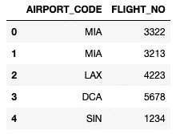

下一个数据帧包含机场代码列表及其各自的机场名称:

```
df_airports = pd.DataFrame(
    dict(
        AIRPORT_CODE=['MIA','LAX','DCA','HEL','SFO'],
        AIRPORT_NAME=['Miami International Airport',
                      'Los Angeles International Airport',
                      'Ronald Reagan Washington',
                      'Helsinki-Vantaa Airport',
                      'San Francisco International Airport']
    )
)df_airports
```

**df_airports** 数据帧看起来像这样:

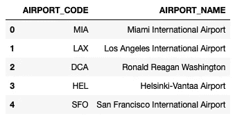

# 列出所有航班的机场名称

假设您需要获得每个航班的所有出发机场名称。因为信息在两个数据帧中，所以需要连接这两个数据帧。在 Pandas 中，使用 **merge()** 方法连接数据帧。对于此要求，您可以基于 **AIRPORT_CODE** 列对两个数据帧执行一个“ **left** ”连接:

```
pd.merge(df_flights, df_airports, on='AIRPORT_CODE', how='left')
```

' *on* '参数指定要联接的列。“*左*是指第一个数据帧— **df_flights** 。上述连接函数的结果如下:

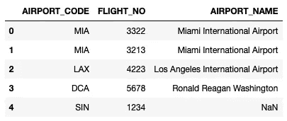

注意来自 **df_flights** 数据帧的所有行(‘*left*’join)都在结果中。还可以观察到，由于机场代码 **SIN** 在 **df_airports** 数据帧中没有条目，因此它在 **AIRPORT_NAME** 列中有一个 **NaN** 值。

> “左”连接确保结果包含第**个**数据帧中所有可用的机场代码。

# 列出各个机场的所有航班

如果您想列出所有机场的所有航班，该怎么办？在这种情况下，你可以执行一个'**右**'连接:

```
pd.merge(df_flights, df_airports, on='AIRPORT_CODE', how='right')
```

*右*是指第二个数据帧— **df_airports** 。上述连接函数的结果如下:

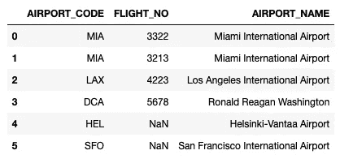

注意，结果现在包含了所有包含在 **df_airports** 数据框架中的机场(*右*连接)。此外，由于有两个航班来自 MIA 机场，结果将包含 MIA 机场的两行。此外，由于 **HEL** 和 **SFO** 机场在 **df_flights** 数据帧中没有任何离港航班，因此结果的 **FLIGHT_NO** 列将包含 **NaN** s

> “右”连接确保结果包含第二个**数据帧中可用的所有机场代码。**

# 列出现有航班的机场名称

您之前看到‘left’join 结果包含从 **SIN** 机场出发的航班的条目:


但是，您可能希望忽略没有有效机场代码的航班。在这种情况下，您可以执行一个' *inner* '联接:

```
pd.merge(df_flights, df_airports, on='AIRPORT_CODE', how='inner')
```

“内部”连接的结果现在将只包含在*两个*数据帧中都有机场代码的行:

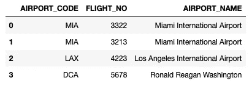

> “内部”连接确保结果中的机场代码在第一个和第二个数据帧中都可用。如果没有指定“how”参数，merge()方法的默认联接是“inner”。

# 列出所有机场名称和航班

与'*inner*join 相反的是'*outer*join，其中两个数据帧中的值在结果中都可用。

使用我们的例子，如果你想得到所有的机场名称和航班，你可以执行一个' *outer* '连接:

```
pd.merge(df_flights, df_airports, on='AIRPORT_CODE', how='outer')
```

结果现在将包含所有机场，不管是否有相应的机场名称或是否有来自某个机场的航班:

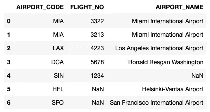

> “外部”连接确保结果中的机场代码在第一个数据帧和第二个数据帧中都可用。

# 基于不同列名的联接

到目前为止，我们的连接非常简单，其中两个数据帧具有我们想要连接的相同列名。在现实生活中，数据帧有不同的列名要常见得多。

假设 **df_flights** 数据帧的 **AIRPORT_CODE** 列现已更改为 **IATA_CODE** :

```
import pandas as pd
df_flights = pd.DataFrame(
    dict(
        **IATA_CODE**=['MIA','MIA','LAX','DCA','SIN'],
        FLIGHT_NO=['3322','3213','4223','5678','1234']
    )
)df_flights
```

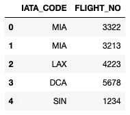

要像前面一样执行连接，现在需要使用 **left_on** 和 **right_on** 参数显式指定各个数据帧的列名:

```
pd.merge(df_flights, df_airports, 
         left_on='IATA_CODE',          # column for df_flights
         right_on='AIRPORT_CODE',      # column for df_airports
         how='left')
```

结果现在将包含来自两个数据帧的连接列( **IATA_CODE** 和 **AIRPORT_CODE** ):

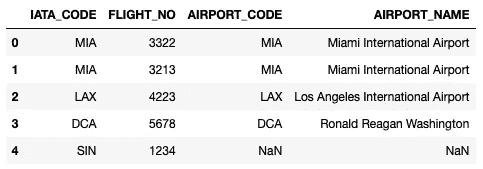

现在，您可以继续删除其中一列。但是，在此之前，请观察最后一行的 **IATA_CODE** 和 **AIRPORT_CODE** 列——一列的值为“ **SIN** ，另一列的值为 **NaN** 。在这种情况下，您应该删除 **AIRPORT_CODE** 列(如果您打算显示所有离港航班的机场代码和机场名称):

```
pd.merge(df_flights, df_airports, 
         left_on='IATA_CODE', 
         right_on='AIRPORT_CODE', 
         how='left')**.drop(columns='AIRPORT_CODE')**
```

结果现在看起来像这样:

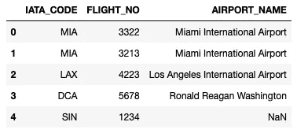

# 使用多列连接

除了联接具有不同列名的数据框架之外，还可以联接基于多列的数据框架。理解这一点的一个好方法是用一个例子。考虑以下数据帧:

```
df_confirmed = pd.DataFrame(
    dict(
        country=['Mainland China','Mainland China',
                 'US','Canada','US'],
        state=['Hunan','Anhui','Seattle, WA',
                 'Toronto, ON','Montana'],
        confirmed=[879,830,1,2,20]
    )
)df_locations = pd.DataFrame(
    dict(
        country=['Bulgaria','US','Mainland China',
                 'Mainland China','US','Canada'],
        state=['Montana','Montana', 'Hunan','Anhui',
               'Seattle, WA','Toronto, ON'],
        lat=[43.4125, 46.965260 ,27.61041, 31.82571, 
             47.7511, 43.6532],
        lng=[23.225, -109.533691, 111.7088, 117.2264, 
             -120.74, -79.3832]    
    )
)
```

**df_confirmed** 数据帧如下:

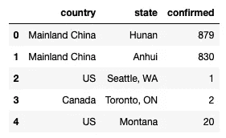

而 **df_locations** 数据帧看起来像这样:

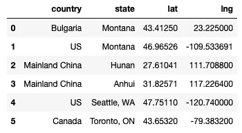

如果您想找到每个州的位置，您可能会尝试通过“州”连接两个数据框:

```
pd.merge(df_confirmed, df_locations, on='state', how='left')
```

但是，结果将包含六行，因为有两个蒙大拿州，一个在美国，一个在保加利亚:

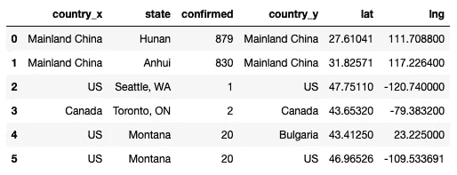

正确的加入方式是基于**国家** *和* **州**列(作为列表提供)加入:

```
pd.merge(df_confirmed, df_locations, on=**['country','state']**,
         how='left')
```

结果现在是正确的:

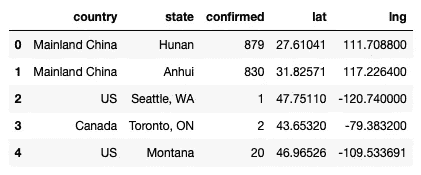

您也可以使用 **left_on** 和 **right_on** 参数连接多个列。

# 结论

就是这样！我希望您现在对连接数据框架的工作方式有了更清晰的了解。以下是我们在本主题中讨论的内容的快速总结:

*   ' *left* '联接返回第一个数据帧中的所有行
*   '*右*'联接返回第二个数据帧中的所有行
*   ' *inner* '联接返回两个数据帧中可用的所有行
*   ' *outer* '联接返回第一个数据帧和第二个数据帧中的所有行
*   您可以使用 **left_on** 和 **right_on** 参数连接基于不同列名的数据帧
*   还可以使用多个列名连接数据框架