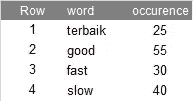
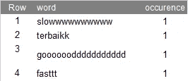
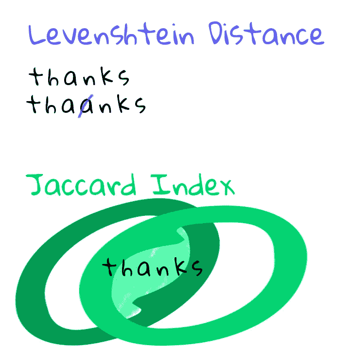
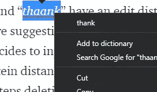
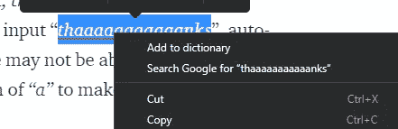
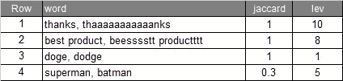
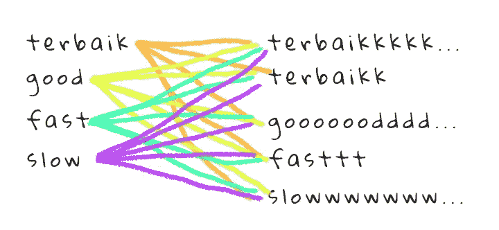
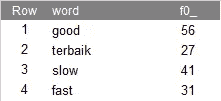

# 没有连接键或公共索引的连接表

> 原文：<https://towardsdatascience.com/joining-tables-without-a-joining-key-or-common-index-5955dc0a7a3a?source=collection_archive---------23----------------------->

## 使用模糊字符串匹配匹配马来西亚人的 2 个不同来源的产品评论，并比较 Jaccard 和 Levenshtein 算法。

当我必须匹配几个马来西亚在线购物平台的产品评论时，就出现了这种情况。让我们马来西亚人与众不同的是我们如何拼写和给出产品评论。

亚马逊评论(上)与马来西亚人的评论(下)。作者提供的截图。

我决定分享我遇到的这个挑战，以及一些可能使这个话题与他人相关的场景。

想象一下，如果今天，您需要连接来自不同来源的两个或多个表，这可能是因为以下情况:

1.  2 家公司合并，需要合并他们的产品数据来清点库存。
2.  您正在比较一系列产品的不同应用的一些评论。
3.  从一个表格中寻找反馈，并尝试将相似的单词组合成一个。

其中一个问题是您无法控制数据，无法让他们重新索引他们的产品 id 或密钥，因为企业要求您尽快提供它们，或者这可能只是出于报告目的，企业无意重新索引以避免服务中断。

**神奇的门户网站，帮助您跳转到本页所需的主题**

*   [今天的挑战](#b85f)
*   [什么是 Levenshtein 距离和 Jaccard 指数](#817d)
*   [每种算法解决和未解决的问题](#d327)
*   [UDF 在大查询中对 Jaccard Index 和 Levenshtein](#be5b)
*   [今日挑战 Jaccard 指数用例](#a2ab)
*   [外卖积分](#06d8)

# 今天的挑战

为了让您更深入地了解我们今天的挑战，这里有一个我们今天将尝试加入的两个表的示例。我们想要得到每个评论出现的总数。代替 Levenshtein 距离，为了这个介绍，我们将集中使用 Jaccard 指数。虽然这可能看起来很荒谬，但这些都是我从马来西亚几大在线购物平台上收集的合法评论。

没有公共键连接的两个表。作者提供的截图。

做一个快速的谷歌搜索最终会有一个解决这个挑战的常用方法，那就是使用一种叫做 Levenshtein Distance 的算法。虽然 Levenshtein 距离在大多数情况下都很有效，但我想介绍另一种算法，称为 Jaccard Index/Jaccard similarity。这不是“更好”或“完美”算法的争论，而是另一种方法的介绍。在深入实际应用之前，我们需要知道 Levenshtein 距离和 Jaccard 指数算法解决了什么问题。

# 什么是莱文斯坦距离和雅克卡指数

通俗地说，Levenshtein 计算将一个字符串更改为另一个字符串需要多少步/编辑，Jaccard 计算第一个字符串与第二个字符串相交的程度。我在下面举例说明了这两种算法的不同之处。

作者创建的 Levenshtein 距离和 Jaccard 指数的插图。

在上图中，Levenshtein 不得不从 *thaanks* 中删除多余的“ *a* ，从而导致一次编辑，使第一个字符串与第二个字符串相似。由此 Jaccard 将比较**每个唯一的**字母是否存在于另一个字符串中。Jaccard 不考虑“ *a* 的数量，因此“ *thaanks* 中的 2 个“ *a* ”被视为一个“ *a* ”。

# **每种算法解决和未解决的问题**

Levenshtein 距离是一些自动校正软件使用的许多算法之一。

作者 Chromium 对 thaank 的自动更正提示截图。

“*感谢*”和“*thank*”的编辑距离为 1，因此自动更正软件建议“*感谢*作为替代。由此，在一些事件中，用户决定输入“*thaaaaaaaaaaaanks*”，使用 Levenshtein 距离的自动校正软件可能无法解决该问题，因为编辑距离很大(删除 10 步*“a”*以使其成为“*感谢*”)。

作者 Chromium 对*thaaaaaaaaaaaanks 的自动更正提示截图。*

如上面的截图所示，我的浏览器没有建议任何替代词，因为我输入的单词可能与他们字典中的任何单词都有很大的编辑距离。我使用我的基于 Chromium 的浏览器作为 Levenshtein 将要展示的例子，但是，我并不是说使用 Levenshtein 距离作为他们的主要算法，他们可能有更复杂的算法来处理语法和不同的语言。

那么 Jaccard 会如何处理“*thaaaaaaaaaaaanks*”对“*谢*”呢？首先，两个单词将被制成一组唯一字符，两个字符串的唯一字符是“*感谢*”。将"*谢*"与"*谢"*相交导致所有字符相交，即 1。但是，当两个不同的单词具有相同的唯一字符时，Jaccard 可能不会返回理想的结果。以“*好*”和“*神*”为例，这两个字符串都有唯一的字符“*神*”，所以由于所有字符都相交，所以结果为 1。

现在您已经了解了这两种算法的工作原理，让我们看看如何在今天的挑战中应用 Jaccard 算法。

# UDF 在对 Jaccard Index 和 Levenshtein 的大查询中

或者您可以使用相同的逻辑，并将其应用于其他数据库。

什么是大查询中的 UDF？[用户自定义函数(UDF)](https://cloud.google.com/bigquery/docs/reference/standard-sql/user-defined-functions) 可以是 SQL 或 Javascript 的形式，允许你在大查询中创建类似编程语言的函数。

我们将使用 Javascript 创建 Jaccard 索引算法，并将结果与 Levenshtein 距离进行比较。`bqutil`是来自谷歌云平台的一个项目，它托管了几个我们可以使用的预建功能。他们的 Github 库可以在[这里](https://github.com/GoogleCloudPlatform/bigquery-utils/tree/master/udfs)找到。在撰写本文时，我已经创建了[一个 pull 请求](https://github.com/GoogleCloudPlatform/bigquery-utils/pull/264)来添加 Jaccard 索引作为供公众使用的`bqutil` UDF。

将创建一个名为 *jaccard* 的临时函数，它接受 2 个字符串并返回一个范围从 0 到 1 的浮点数。如果第一个字符串 *sa* 中的一个字符存在于第二个字符串 *sb* 中，则将交集大小增加 1。循环完成后，通过计算两个字符串的长度并减去交集大小来计算索引，然后将结果再次除以交集大小来获得交集字符的百分比。最后，返回一个 2 小数点的浮点数。

以上查询的结果。作者提供的截图。

然后运行 4 个测试用例来比较 Jaccard 指数和 Levenshtein 距离之间的结果。如图所示，Jaccard 将能够校正相似度为 1 或 100%相似的第一个和第二个示例(感谢和最佳产品示例)。由此 Levenshtein 指出需要 10 和 8 个步骤来将第二个字符串校正为第一个字符串。关于 doge 和 dodge 的第三个例子，Jaccard 指出两者是相似的词，我们知道它不是，Levenshtein 指出需要一个步骤来纠正 doge 的 dodge，反之亦然。

# 今天的挑战 Jaccard 索引使用案例

1.  创造一个 UDF
2.  创建两张桌子来模拟我们今天的挑战
3.  交叉连接两个表，这样我们可以计算第二个表中的每个评论与第一个表中的每个评论之间的距离

对于那些仍然对交叉连接感到困惑的人，我已经根据我们当前的挑战在下面举例说明了它。

作者创建的 t1(左)和 t2(右)的交叉连接图。

交叉联接将一个表中的每条记录与另一个表中的每条记录相匹配。然后，我们对每条记录运行 jaccard 函数，只显示 Jaccard 索引大于 0.8 或 80%相似的记录。

今天挑战的结果

使用 Jaccard 索引和 80%相似度的阈值，它很好地支持了我们的数据集。第二个表中的每条记录都被正确地添加到第一个表中。

# 外卖点

*   不存在“最佳”算法的竞争
*   每种算法都有自己的用例
*   Jaccard 索引处理非常具体的情况，不应该在不考虑每个模糊匹配项目的情况下将其概括为“goto”算法

使用 Jaccard Index，我能够根据一个定制的“马来西亚俚语”字典有选择地纠正我的数据集中至少四分之三的评论，我将这个字典定义为我的来自上述挑战的 *t1* 。读者们，我希望这能向你们介绍另一种选择，如果 Levenshtein 不像我一样对你们有利的话，你们可以考虑一下。