# 伯特之旅:第二部分

> 原文：<https://towardsdatascience.com/journey-to-bert-part-2-6a9a1c8dbba4?source=collection_archive---------34----------------------->

## 各种 NLP 概念和架构的拼贴导致了现代基于变压器的 NLP 模型 BERT。

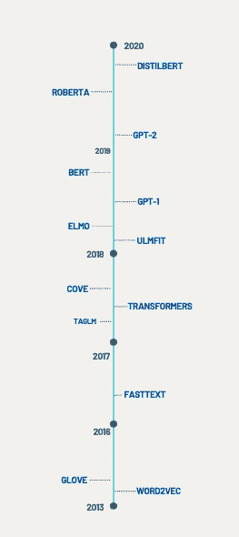

现代 NLP 发展简史。来源:self

这是我不久前写的上一篇博客[伯特之旅](https://medium.com/swlh/journey-to-bert-part-1-a89413855a10)的第二部分。在这篇博客中，我将继续叙述并解释向 BERT 发展的概念里程碑。

## 迄今为止

1.  前神经单词嵌入，如 Glove、TF-IDF
2.  常见的自然语言处理任务，如分类、问答和文本摘要。
3.  Word2Vec 的神经嵌入。
4.  使用深度序列模型(RNN)进行自然语言处理
5.  发现注意力和双向性。

通过下面的模型和方法，我们继续关注 NLP 的进一步发展。从现在开始，最受欢迎的属性是迁移学习、上下文学习和规模。

## TagLM

TagLM(语言模型增强序列标记器)可能是第一个真正尝试产生上下文单词嵌入的软件。Matthew Peters 等人在 2017 年提出了这篇[论文](https://arxiv.org/pdf/1705.00108.pdf)，该论文展示了如何在序列标记任务中通过语言模型嵌入来增强 **un** 上下文单词嵌入。语言模型嵌入基于在未标记的文本数据上预先训练的双向 rnn，并且与用于序列标记的多栈双向 rnn 的隐藏层输出连接。

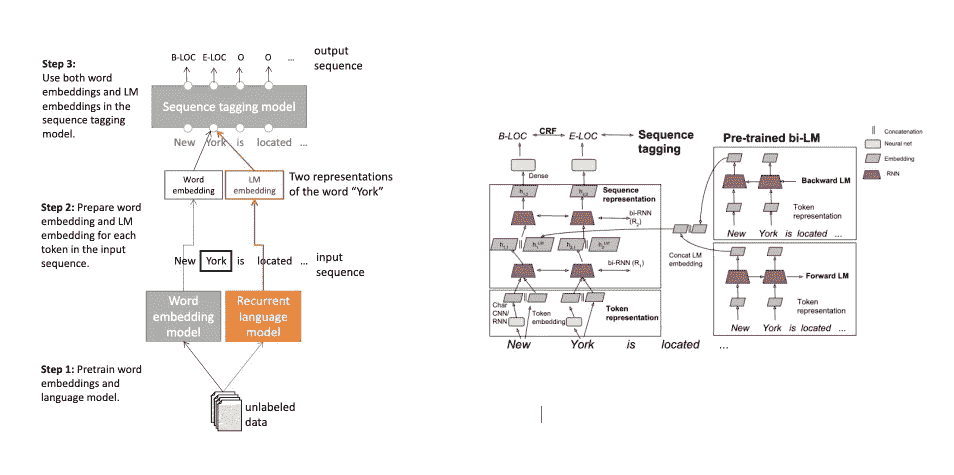

来源:[原创论文](https://arxiv.org/pdf/1705.00108.pdf)

TagLm 在 CoNNL 数据集上的 NER 识别上取得了令人印象深刻的结果，击败了所有以前的 sota 方法。

# 山凹

Context Vector( [CoVe](https://arxiv.org/pdf/1708.00107.pdf) )处理上下文单词向量的方法与 TagML 不相上下。论文由[麦肯等人](https://arxiv.org/pdf/1708.00107.pdf)撰写。2018 年，其主要动机是将 ImageNet 的迁移学习成功应用于计算机视觉的下游任务。作者认为，在 NLP 领域中，ImageNet 的等价物可以是基于 LSTM 的编码器，用于使用基于 LSTM 的注意序列到序列模型的神经机器翻译任务。然后，预训练的编码器可以用作上下文单词嵌入的源，该上下文单词嵌入然后可以扩充传统的单词向量系统(例如 Glove)。NMT 在多个机器翻译数据集上进行训练，这些数据集基本上是两种语言的句子对。

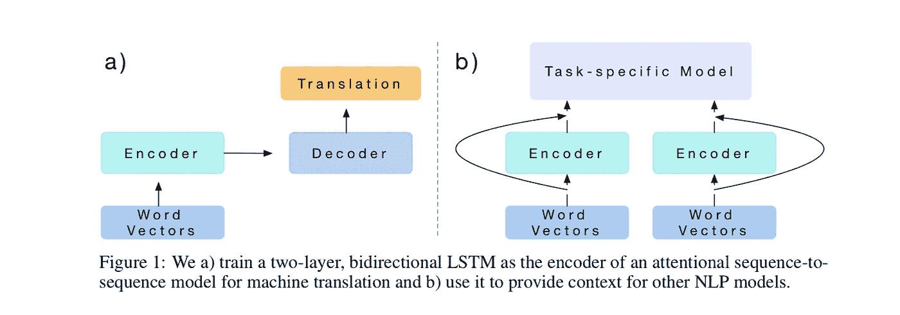

来源:[原始文件](https://arxiv.org/pdf/1708.00107.pdf) r

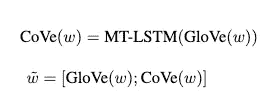

资料来源:[原始文件](https://arxiv.org/pdf/1708.00107.pdf) r

该论文建议将 CoVe 向量(双 LSTM 编码器的最后一层)与 Glove 向量相结合，并说明了在一些常见的 nlp 任务中的性能增益。然而，与 Tag-LM 不同，CoVe 需要**标记的数据**(两种语言的文本对)来训练机器翻译任务的编码器。这是这种方法的一个明显的局限性。此外，下游任务的实际性能提升更多地取决于下游任务的架构。

## 工程与后勤管理局

来自语言模型的嵌入(ELMO)在某种意义上是对来自同一组的 Tag-LM 的细化( [Peters et al.](https://arxiv.org/abs/1802.05365) )。作者认为，在大型语料库中以无监督方式学习的(双向)语言模型携带单词的语义和句法内涵。模型的初始层捕获语法意义(NER、词性标注)，而模型的末端层捕获语义意义(情感分析、问题回答、语义相似度等)。因此，不是仅使用最后一层(如在 Tag-LM 或 Clove 中所做的，其中网络是**预训练的**和**冻结的**)，而是采用所有层的线性组合将是对单词的上下文含义的更好和丰富的估计。ELMO 代表因此被认为是“深”。

在 ELMO，学习语言模型的通常方式是从一个句子中的前一个单词序列双向预测下一个单词。损失函数是负对数似然。

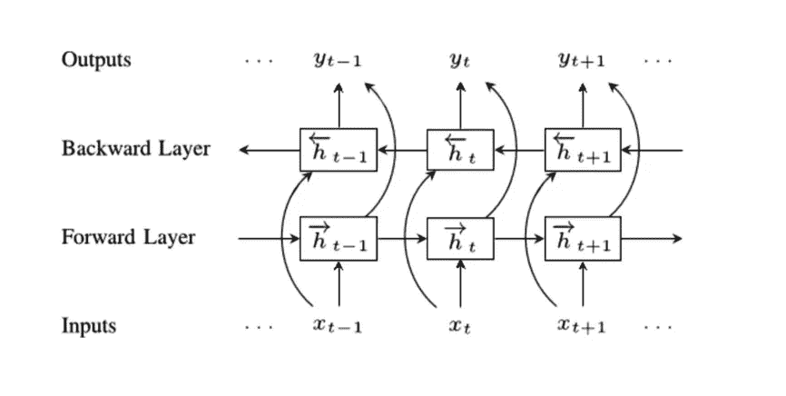

来源:[论文，代码](https://paperswithcode.com/method/elmo)

ELMO 是对 Tag-LM 和 Clove 的改进，这可以归因于表示“深入”的事实。该论文说明了 ELMO 在各种常见的 NLP 任务上实现了递增的性能增益。

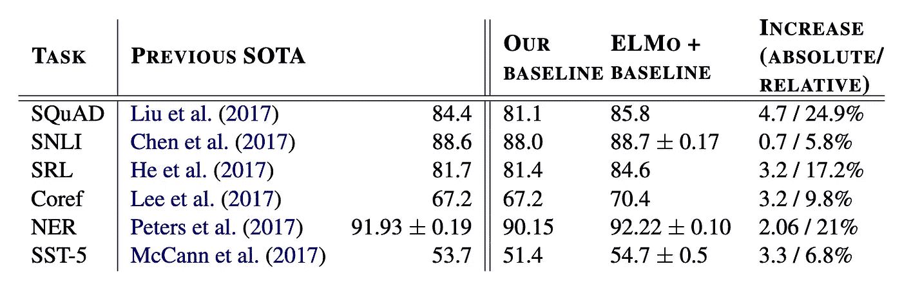

来源:[原创论文](https://arxiv.org/pdf/1802.05365.pdf)

然而，ELMO 仍然存在更多地依赖下游任务的架构来提高性能的缺点。

与 ELMO 竞争的是另一个来自[杰瑞米·霍华德等人](https://arxiv.org/abs/1801.06146) (Fast.ai)，用于文本分类的通用语言模型微调( **ULMFiT** )的提议。除了使用 RNN 进行语言建模的预训练步骤之外，ULMFiT 建议在目标数据集上使用 **LM 微调**。基本原理是了解目标数据集的“分布”或“特定于任务的特征”。最后一步是特定任务的微调。例如分类器(使用几个线性块)。

## **走向变形金刚**

因此，《变形金刚》的架构成为了伯特家族和 GPT 系列等更现代作品的“最底层”构成。Vashwani 等人在 2018 年的论文“注意力是你所需要的一切”中首次提出，它为 rnn(及其风格)提供了一种处理顺序数据的替代方法。

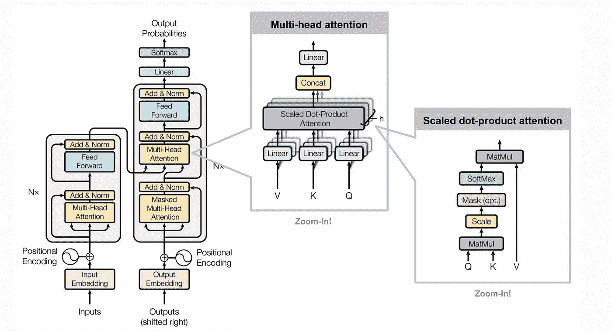

来源:原始文件

不如参考杰·阿尔玛的这篇[优秀文章](https://jalammar.github.io/illustrated-transformer/)全面了解。简单来说，该架构具有以下重要元素。

1.  多头自我注意:在很高的层次上，自我注意允许参考序列中的其他单词和子空间来关联单词的意思。基本上，另一种获取(长期)依赖的方式。“多头”意味着使用多个头来关注具有多个代表性空间的序列中的多个子空间。比如使用多个大脑。从数学上来说，携带自我注意力的嵌入是使用乘以值矩阵的 softmax over keys.queries 来计算的。

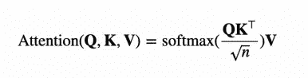

来源:[原创论文](https://arxiv.org/pdf/1802.05365.pdf)

2.**(正弦)位置编码**:有趣的是，变压器本质上并不是连续的。事实上，它观察并处理整个序列。在这种情况下，位置编码封装了标记的顺序。它实际上是使用 sin 和 cos 函数创建的嵌入的向量值。这里有一个极好的参考。

那么变压器架构给 rnn(Bi-lstm)带来了什么好处呢？

1.  消失梯度:变压器中没有记忆门的概念，因为这种容易丢失信息的方法是通过直接访问序列的所有部分来规避的。
2.  长期依赖性:由于多头自我关注层，变形金刚更擅长捕捉长期依赖性。
3.  双向设计:因此，transformer 编码器一次读取整个序列，并使用单词前后的所有环境。因此，它本质上是双向的。事实上，许多人认为它是**无方向性的**。

## **生成式预训练变形金刚(GPT)**

由[拉德福德等人](https://cdn.openai.com/research-covers/language-unsupervised/language_understanding_paper.pdf)于 2018 年首次推出。(就在伯特之前)GPT 是第一批使用变形金刚架构的人之一。来自 OpenAI 的作者提出了这种架构，作为现有想法的有效结合
a .无监督的预训练(如在 ELMO 看到的)和 b .变形金刚。

此外，该框架有两个主要组成部分

**1。无监督的预训练(使用变压器)**这基本上是在给定网络参数上的记号的上下文的情况下最大化记号的可能性。

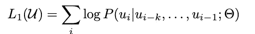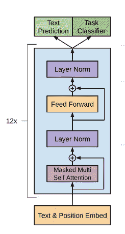

来源:[原创论文](https://cdn.openai.com/research-covers/language-unsupervised/language_understanding_paper.pdf)

为此，该论文提出使用多层(12 层)变换器解码器，该解码器基本上由多头自关注层+位置前馈层组成，该位置前馈层使用 softmax 在目标令牌上产生分布。原始变形金刚架构的这种变化是**单向的**(从左到右)，因为自我关注仅归因于左上下文。

**2。监督微调:**对于分类等下游任务，标记的数据被输入到先前的模型中，用于变压器解码器的表示和微调。附加的线性图层+ softmax 图层有助于最终的分类任务。作者还建议增加一个[额外的学习目标](https://medium.com/walmartglobaltech/the-journey-of-open-ai-gpt-models-32d95b7b7fb2#e96b)来学习一个展示更好的泛化能力的语言模型。

除了上述生态位特征外，**尺度**是 GPT 一号的另一个属性。它是在一个拥有 240 个 GPU 日的大规模图书语料库上训练的。GPT 1 号之后的所有后续模型都是通过强大的 GPU/TPU 和越来越多的参数在大量数据上进行训练的。GPT-1 成功证明了基于大规模预训练+少量监督微调和附加目标学习的转换器可以满足各种 NLP 任务(NLI、问题回答和分类)。事实上，当时它的表现确实超过了各种 sota 车型。

然而，GPT-1 模型本质上是单向的(从左到右)，因为自我关注仅基于先前的表征。伯特提出的问题。

## 伯特

确实是一次长途旅行！伯特(*来自变形金刚*的双向编码器表示)由作者[德夫林等人](https://arxiv.org/pdf/1810.04805.pdf)在谷歌的 GPT-1 之后不久发表。总的来说，这种方法看起来非常类似于 GPT-1 架构中提出的无监督语言模型学习，然后有监督的微调步骤。然而，BERT 的架构更像 Vaswani 等人的原始 transformer 架构，并且基于多层双向 Transformer 编码器。而 GPT-1 架构只是原始架构的仅左上下文(单向)版本，通常被称为“变换器解码器”。

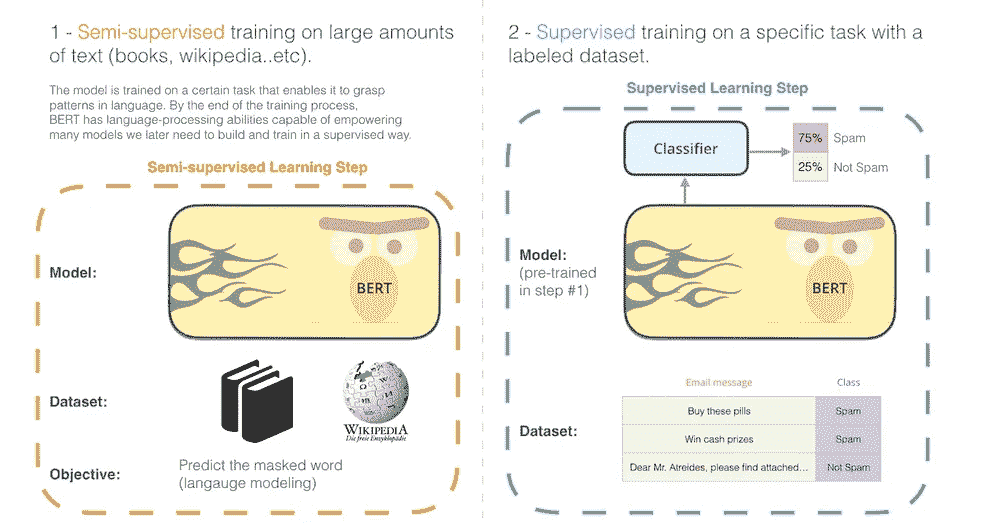

来源:[https://jalammar.github.io/illustrated-bert/](https://jalammar.github.io/illustrated-bert/)

因此，作者的主要论点是单向预训练限制了下游任务的代表性，因此**是次优的**。例如，用于微调问题回答任务的单向预训练模型是次优的，因为没有利用来自两个方向的上下文信息。由于 BERT 是双向的，标准语言模型任务不适合作为目标学习任务。这是因为在 transformers 架构中，所有单词都是一次输入到模型中的(因此是可访问的)。对于一个标准的 LM 任务，每个单词都可以从未来看到自己，因此学习变得微不足道。

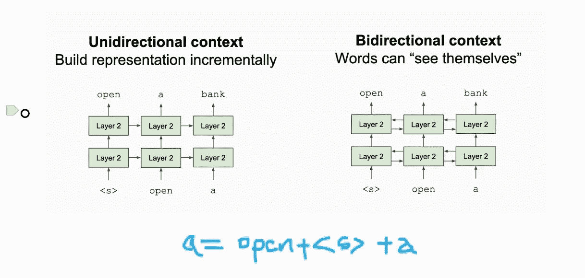

来源:[普林斯顿 COS 484](https://www.cs.princeton.edu/courses/archive/fall19/cos484/lectures/lec16.pdf)

BERT 通过使用**“屏蔽语言建模”**解决了这个问题，这实质上是屏蔽文本中的随机标记并预测它。

来源:[普林斯顿 COS 484](https://www.cs.princeton.edu/courses/archive/fall19/cos484/lectures/lec16.pdf)

除了 MLM，伯特还采用了另一个叫做**“下一句话预测”的学习目标。**在 NSP 中，目标是分类一个句子是否是另一个给定句子的跟随句。直觉上，这有助于学习句子之间的关系。

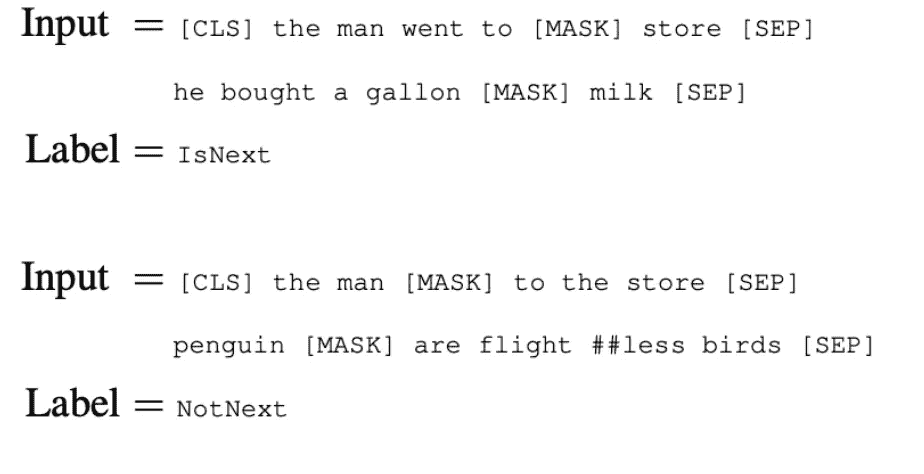

来源:[普林斯顿 COS 484](https://www.cs.princeton.edu/courses/archive/fall19/cos484/lectures/lec16.pdf)

与 GPT-1 一样，微调是 BERT 中的第二阶段。修改(输入表示和输出图层)本质上是特定于任务的。例如，对于分类任务，CLS(事件中的第一个特殊令牌)被馈送到分类器网络。学习是端到端的，这意味着所有层及其权重继续学习。

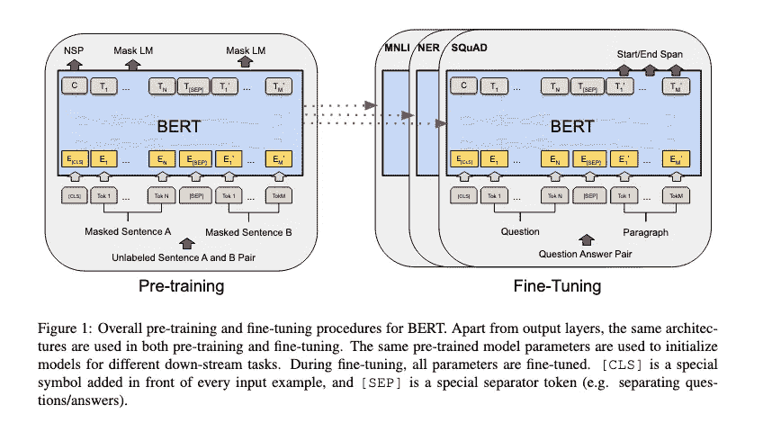

来源:[原创论文](https://arxiv.org/pdf/1810.04805.pdf)

伯特有两种风格，伯特基础和伯特大。它们的主要区别在于层数(变压器模块)。基础=12 层，110 米参数，大型= 24 层，340 米参数。BERT 确实是自然语言处理中的一个里程碑，它成功地展示了一种 sota 方法，该方法实现了基于变压器(自我注意)、双向和巧妙的目标学习任务的迁移学习。并在大规模语料库(books corpus+256 个 TPU 日的英文维基百科)上进行离线训练。

**超越 BERT**
在最初的 BERT 论文之后，在各个方面已经有了很多进步。还有更复杂的变化，如 [RoBERTa](https://arxiv.org/abs/1907.11692) 在更大的语料库上训练更长时间，并采用聪明的学习目标(如动态屏蔽和转储 NSP)。例如，另一个名为 [ALBERT](https://arxiv.org/abs/1909.11942) 的变体旨在通过使用参数缩减技术产生一个更小的模型。ELCTRA 、 [XLNet](https://arxiv.org/abs/1906.08237) 是其他一些有趣的变体。

此外，有一些积极的研究正在进行，以使伯特模型重量轻。(BERT 大~ 340 M 参数)。为此已经提出了几种方法，例如权重**修剪、量化和提取(DistillBERT)** 。这里有一个关于同一的优秀博客:[https://blog.inten.to/speeding-up-bert-5528e18bb4ea](https://blog.inten.to/speeding-up-bert-5528e18bb4ea)

**总结** 我想 NLP 领域已经有了快速而巨大的发展。从使用文本的统计表示到上下文感知的神经表示。从基于统计学和经典 ML 的方法到基于深度学习的序列模型。途中发现注意力和双向性，体会迁移学习的力量。最终走向复杂的变形金刚架构。现代 NLP 框架在利用这些重要的里程碑和规模方面取得了长足的进步。

**参考文献**

1.  http://jalammar.github.io/illustrated-bert/
2.  【http://web.stanford.edu/class/cs224n/ 
3.  [https://devopedia.org/bert-language-model](https://devopedia.org/bert-language-model)
4.  [https://www . cs . Princeton . edu/courses/archive/fall 19/cos 484/lectures/LEC 16 . pdf](https://www.cs.princeton.edu/courses/archive/fall19/cos484/lectures/lec16.pdf)
5.  [https://openai.com/blog/better-language-models/](https://openai.com/blog/better-language-models/)
6.  [https://Neptune . ai/blog/ai-limits-can-deep-learning-models-like-Bert-ever-understand-language](https://neptune.ai/blog/ai-limits-can-deep-learning-models-like-bert-ever-understand-language)