# Python 中相关变量的蒙特卡罗模拟

> 原文：<https://towardsdatascience.com/journey-to-monte-carlo-mc-simulations-with-correlated-variables-in-python-1aef84d5742d?source=collection_archive---------5----------------------->

## [思想和理论](https://towardsdatascience.com/tagged/thoughts-and-theory)

## 用于 MC 模拟的 *MCerp* 软件包，通过 Iman-Conover 方法生成相关性

图片由 Nikodi 在 pixabay 上提供，可免费用于商业用途

今天，我们继续蒙特卡洛的数据科学之旅。

前三篇文章首先概述了 SciPy 的概率分布、它们的属性以及如何在 Python 中使用它们的方法 Python 是模拟的基础。然后，我们讨论了场景分析和三点估算技术，以及有助于场景建模的三角形和 beta-PERT 分布。第三篇文章，在周一，介绍了蒙特卡罗概念，以及我们如何只用 SciPy 库运行模拟。

*   [概率分布和分布拟合用 Python 的 SciPy |走向数据科学](/probability-distributions-with-pythons-scipy-3da89bf60565)
*   [Python 场景分析:用 beta-PERT 分布建模专家评估|走向数据科学](/python-scenario-analysis-modeling-expert-estimates-with-the-beta-pert-distribution-22a5e90cfa79)
*   [Python 驱动的蒙特卡罗模拟|走向数据科学](/python-powered-monte-carlo-simulations-fc3c71b5b83f)

今天的文章将带领我们的帆船 MS Python 驶向下一个停靠港，并介绍具有相关随机变量的 **MC 模拟—** 当我们想要将场景与现实相一致并避免隐藏的偏差时，我们需要考虑的一个重要方面。

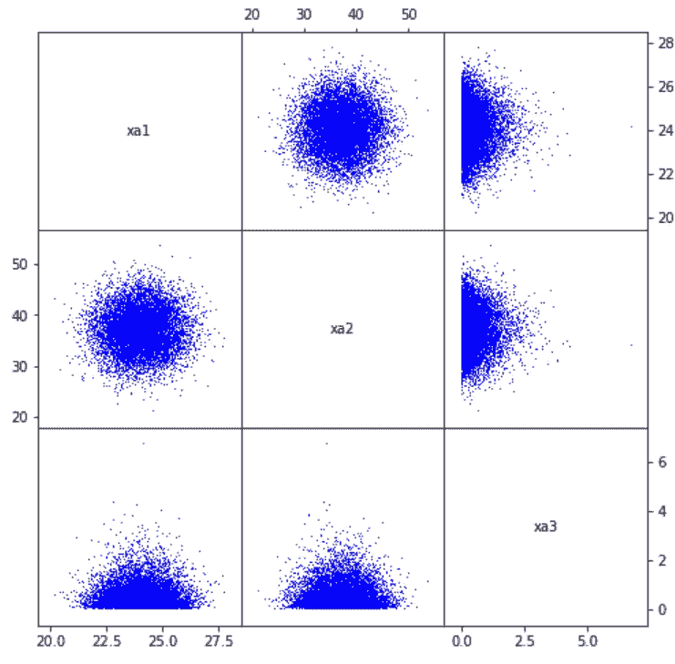

我们将在 Juypter 笔记本中导入 MCerp 库。它应用 Iman-Conover 方法通过拉丁超立方体采样产生相关随机变量。

# 0.涉及相关随机过程的模拟

我以前的 MC 文章解释了一个计算新产品利润的模拟模型。它用预期售价乘以销售量。该模型没有假设交易量和价格是否相关。但当然，事实上的确如此:较高的售价往往会降低需求。

我们需要考虑输入变量可以表现出一前一后移动的趋势:同向——正相关；或者相反方向——负相关。如果不考虑平行运动，模拟模型将对不切实际的结果赋予同等的权重——例如，高价的高需求可能以与低价的高需求相同的频率出现。

相关随机变量确保输入参数之间的关系准确地反映在模拟结果的频率分布中。

以下段落用非数学术语解释了 Iman-Conover 算法:如何生成相关性。如果你只对结果感兴趣——如何使用 mcerp 运行相关模拟——那么你可以跳到下一章。

将随机变量相互关联以反映计划者为其估计的相关矩阵的一种常用方法是*伊曼-康纳法* ( [论坛 _06w 论坛 _ 06w 107 . pdf(casact.org)](https://www.casact.org/sites/default/files/database/forum_06wforum_06w107.pdf)；【correlation.pdf(uio . no)排名的一种无分布方法[。IC 方法可以关联源自不同分布的多个随机变量。](https://www.uio.no/studier/emner/matnat/math/STK4400/v05/undervisningsmateriale/A%20distribution-free%20approach%20to%20rank%20correlation.pdf)

该算法可以描述如下。生成 r 列长度为 N 的相关随机数—

*   假设我们已经有了一个矩阵 X，它有 r 列(每列是一个随机变量)和 N 行(例如，每个变量有 10，000 个值)。
*   首先，用您想要对变量施加的成对相关结构填充相关矩阵 S。
*   对其应用乔莱斯基分解(*来自 scipy.linalg import cholesky* )以获得上三角矩阵 c
*   创建标准正态分位数的向量 v，scipy.stats.norm.ppf(i/(N+1)。将分位数除以向量元素的标准偏差，使其合计的标准偏差为 1.0。
*   将这个向量复制 r 次，并将 v 的副本组合在一个所谓的得分矩阵 M 中，该矩阵具有与我们想要生成的随机变量一样多的正常得分列。随机打乱正常分数每列中的行。
*   计算该得分矩阵 m 的相关矩阵 E。对其应用乔莱斯基分解以获得其上乔莱斯基三角形 f
*   通过乘法将矩阵连接在一起:T = M * inv(F) * C。这个矩阵 T 具有精确的目标相关结构。
*   生成一个矩阵 Y，它包含我们想要关联的每个随机变量的一列，有 N 行，就像原始矩阵 X 一样。矩阵 T 建议 Y 从观察矩阵 X 中的特定行和单元中提取一个值来填充 Y 中的特定行和单元。这将生成 Y 中 X 值的目标等级相关性。
*   x 由独立变量或不同相关的变量组成。对于每个变量，y 将由相同的 N=10，000 个随机变量组成。IC 方法保留它们的值。但是它们将被重新排序以展示我们想要强加的等级相关性。T 和 Y 的相关矩阵将尽可能地反映目标相关矩阵 s

mcerp 文档没有明确提到它的相关性是如何生成的，但是浏览一下它的 Python 源代码就会发现它应用了 Iman-Conover。

# 1.属国

除了导入我们的核心库 pandas、numpy、scipy 和 matplotlib，我们还需要安装库 *mcerp* :

*   pip 安装 mcerp

或者:

*   康达安装-康达锻造 mcerp

这是一个依赖于 numpy、scipy 和 matplotlib 的精简包。

MCerps 的文档简洁，不太专业。我将解释文档没有提供指导的几个方面，但是我们可以从它的 Python 代码中推断出来。

# 2.建立蒙特卡罗模拟

前一篇文章准备了一个业务案例模拟:一个企业计划推出一个新产品。未来的销售量、销售价格和原材料单位成本的发展被建模为具有不确定性的因素，即随机变量。( [Python 驱动的蒙特卡罗模拟|走向数据科学](/python-powered-monte-carlo-simulations-fc3c71b5b83f))

我们采用这种方法，并通过使用 mcerp 来运行该场景，先不使用，然后使用相关性。

*   销售量:3 点估计提供了最小、最可能和最大的单位销售量，PERT 分布连接到一个完全概率曲线。
*   销售价格:取决于与客户的谈判，其中一些客户将能够要求提前付款折扣或批量折扣。策划者估计，平均价格将围绕€ 20 的平均值呈正态分布，标准偏差为€1.00。
*   原材料供应商成本:供应链计划者预见到供应商增加的风险，平均单位成本为€ 13，标准偏差为 0.7

下一个单元格设置模型。三个输入参数由顶部的体积 v、价格 p 和材料单位成本 m 组成，加上一个确定性变量 o，该变量表示另一个不受不确定性影响的单位成本。

我们定义了四个输出或模拟目标，它们本身将是随机变量，其分布函数将在模拟运行期间从三个输入的相互作用中合并。输出变量的数量没有限制。引用一个或多个输入随机变量的任何公式都可以用作模拟输出。

*   毛利
*   收入
*   毛利率=毛利/收入
*   总成本=收入—毛利

当脚本到达该单元时，模拟在几分之一秒内完成。然后，我们可以通过接下来几个单元格中的代码收集模拟结果。

mcerp 参数 *npts* 设置要创建的点数，默认为 10，000，我们在练习中也采用这个数字。您可以通过调整顶部 dependencies 单元格中的常量 nR，将其更改为不同的整数。如果你自己的模型包含大量的随机变量，那么迭代次数大于 10，000 次是明智的。

mcerp 用户指南没有明确地提供为输入参数或输出收集 10，000 个随机变量的方法。但是 mcerp 源代码显示我们可以使用它的 *_mctps* 属性。

rv1 和 rGM1 之间的六个数组变量保存模拟结果，每个变量有 10，000 个数据点，每次迭代一个，因此我们可以跟踪模拟，并在以后重用这些数组进行统计评估。我们将六个数组组合在一个数据帧中，使它们更容易研究和处理。

下面的数据框列出了 10，000 个模拟输出，3 个输入参数和 3 个输出变量各占一行:

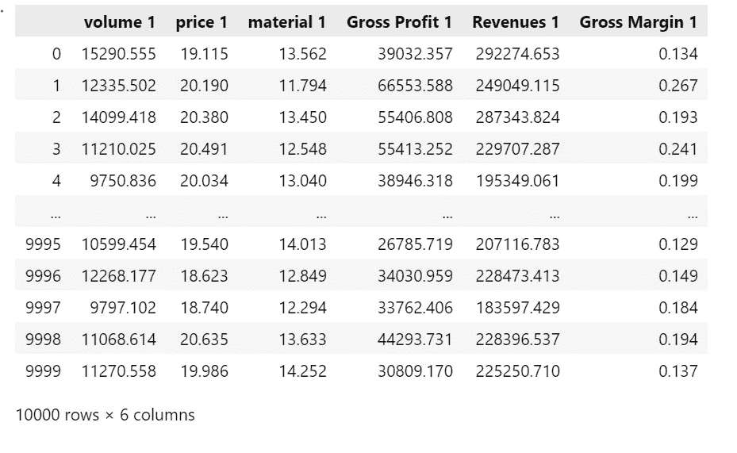

接下来，我们编写一个助手函数，它将在这些输入和输出变量上绘制直方图。

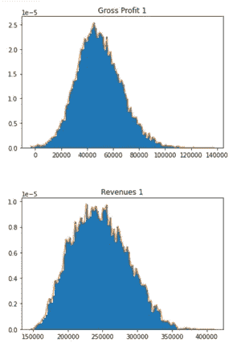

主要的模拟目标，总利润，显示出比正态分布更尖锐的峰值，但只是适度的薄分布。它的尾部导致峰度为 3.2，略高于正态分布。请注意，虽然 SciPy 计算的是正态分布的*超额*峰度(校准值约为 0 ),但 mcerp 报告的是峰度本身，正态曲线的峰度为 3.0。

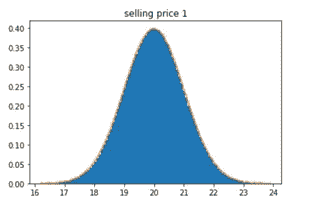

收入曲线看起来几乎是正常的。

毛利率略偏左，尾巴在左边更明显。它将倾向于在低端有更多的异常值。

销售量遵循一条庞大的曲线 platykurtic，这意味着它的过度峰度为负，这表明异常值的倾向低于正态分布。

当然，销售价格模拟了正态分布的偏斜度和峰度，因为我们将其建模为正态随机变量。

这五个图表展示了三个输入变量(数量、价格和材料单位成本)的相互作用如何产生模拟输出，这些输出也代表随机变量，但模型生成的分布是输入的混合。

两个辅助函数将收集输入和输出分布的矩。首先，我们应用 mcerp 的*。*描述()【函数】输入变量；然后，输出。

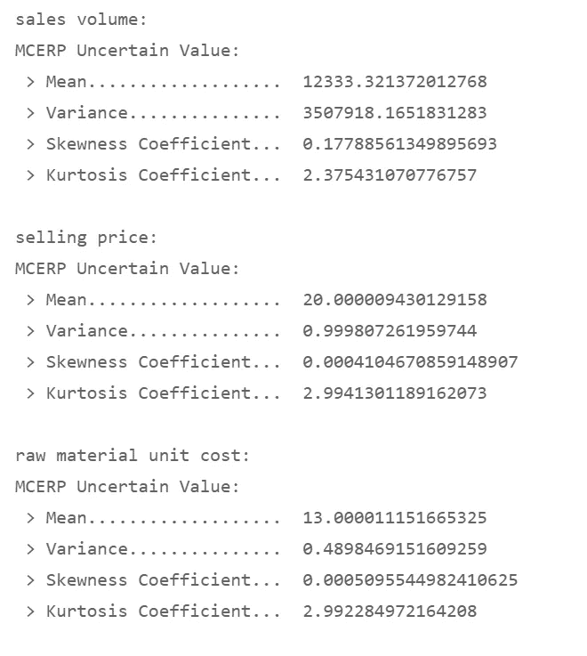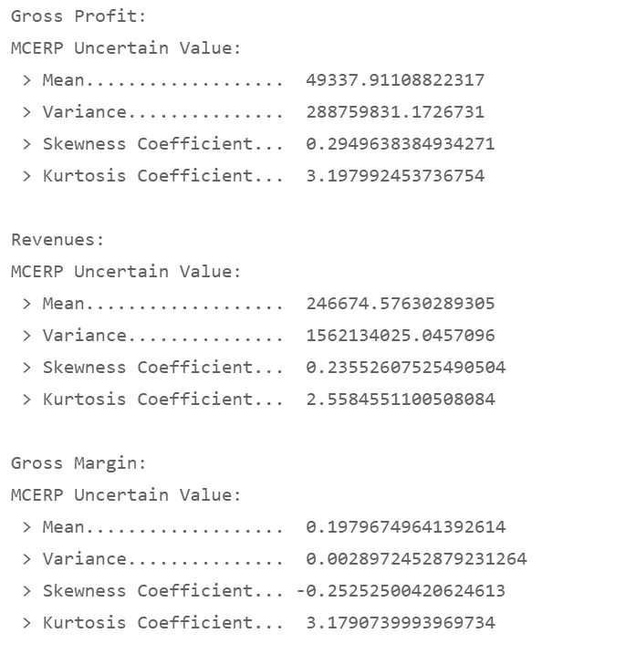

第一次模拟运行时没有预设的关联结构。当我们查看三个输入变量的相关矩阵时，我们看到大多数变量对的互相关接近于零。该模型抽取实际可行的独立或不相关的随机变量。

mcerp 的 *plotcorr()* 功能有助于可视化相关结构。

我们观察到几乎圆形的斑点，这表明相关性接近于零。

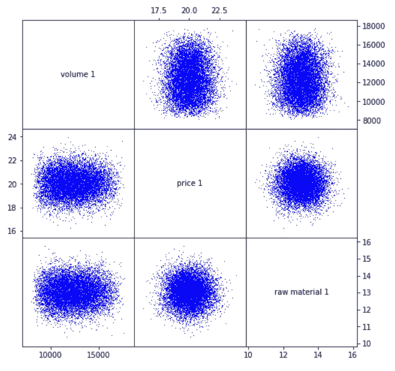

# 3.用相关随机变量模拟

在为下一次模拟做准备时，我们将对模型施加一个估计的相关结构。

*   销量和售价一定是负相关的。更高的价格会减少需求，所以交易量会减少。我们用负系数-0.3 来表示这种关系。这实际上是一种单向关系:价格影响需求量:较高的价格导致较低的需求量。但是更高的需求不会导致更低的价格，恰恰相反。在一个更复杂的模拟模型中，我们将通过额外的变量来表达这种单向关系，这些变量将识别因果机构。在这个快速教程中，我们过于简化了。
*   价格和材料单位成本:计划者假设当供应商提高原材料价格时，企业将能够提高自己的销售价格，但不能完全与原材料成本趋势同步。只有 70%的供应商成本增加可以被客户接受的更高的销售价格抵消。这也是一种单向关系。较高的原材料单位成本会促使企业提高销售价格。但是较低的销售价格不会对原材料供应商的价格策略产生影响，他们不会相应地降低自己的价格。我们保持模型简单，不在销售价格和供应商价格之间的关系中分割这两个方向。
*   相关系数应由规划者结合投入变量的分布进行估算。当然，任何未来的相关性结构都会受到不确定性的困扰。我们可以通过将相关系数表示为随机变量本身来处理不确定性:规划者可以对一对输入变量之间的相关性进行三点估计——最小、可能、最大；然后，三角形或 PERT 分布将连接这三个点，并绘制相关云作为模拟将遍历的 10，000 次迭代的随机变量。

通过调用 mcerp 的 *correlate()* 函数，我们将这种有针对性的相关结构应用于输入变量。

每个输入变量的 10，000 个值保持不变。但是 *correlate()* 函数运行 Iman-Conover 方法，该方法通过对它们重新排序来对它们施加新的等级相关性，例如，高销售价格值与高材料单位成本值成对出现。

*plotcorr()* 函数绘制每对变量的散点图。

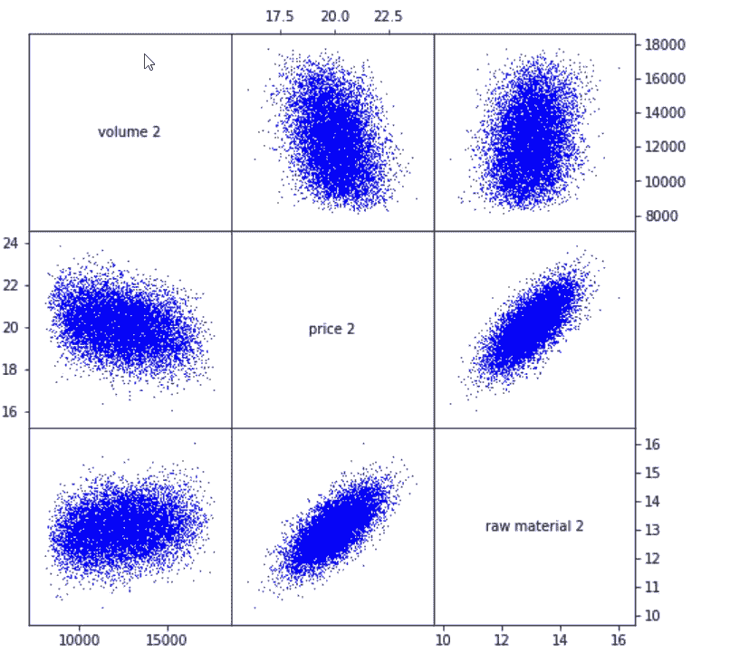

让我们比较一下重新校准关系前后的相关结构。右边:初始的，几乎独立的随机变量。在左边，我们使用了新的关联结构。在右下角拉长的图形中，可以看到销售价格和材料单位成本之间的强正相关关系。价格和交易量之间更温和的负相关性导致了具有相反方向的椭圆点云，但在左上角具有更分散的扩散。

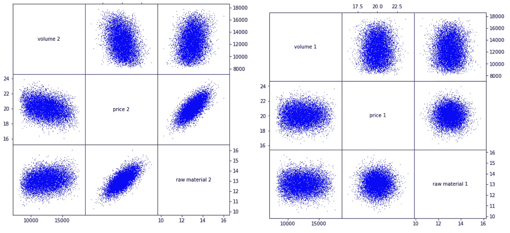

我们检查模型实现的关联结构。

我们只看到与目标相关性的微小偏差，高达 0.002。

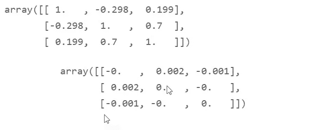

几乎为零的初始相关性被修改了相对较大的数量，在-0.303 和+0.71 之间。

接下来，我们检查第二个模拟模型的输出，并在数据帧中收集它们的 10，000 个值。

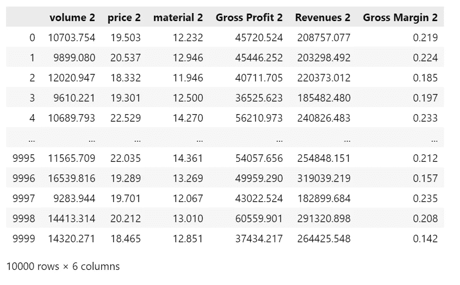

我们绘制了主要模拟输出的直方图，即毛利。

它看起来与第一次模拟的结果没有太大的不同。它是否因为我们强加的关联结构而改变了？

让我们计算它的分布矩。

当我们比较毛利时刻——在重新调整相关性之前和之后——我们确实观察到了变化的结果。相关的输入变量导致了较低的均值、较低的偏斜度和峰度，与初始的不相关模型相比，每一个都降低了几个百分点。不过，标准差已经减半了。从这个意义上说，模型变得更加稳定，或者说更加以平均值为中心。

发生了什么事？通过关联三个输入变量，我们将搜索空间缩小到实际相关的参数组合。初始模型还必须评估难以置信地将极高价格与极低材料单位成本(反之亦然)结合在一起的参数元组，以及极高和极低销售价格下的巨大销量，许多这些不切实际的场景通过强加相关结构而被归入异常值状态。在 10，000 次试验中，异常情况出现的次数较少，因此结果更紧密地围绕€ 48，513 的平均结果。因此，相关结构有助于模型关注更相关的参数元组；这种相关性不会消除异常值，但会将更多的异常值推到背景中。

让我们通过两个 *seaborn jointplots* 来可视化更窄的搜索范围:

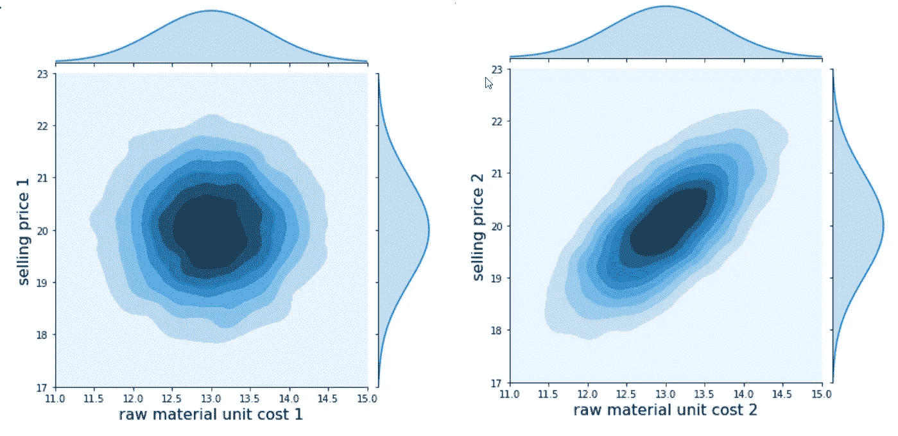

在左边近乎完美的圆形图表中，销售价格和原材料单位成本是独立的，但在右边的椭圆中却高度相关。椭圆将两个随机变量的更多质量集中在更紧密的区域，因此留下更多空白背景空间。

接下来，我们创建一个由几个频率组成的范围，我们要计算这些频率的分位数，以了解临界点处毛利分布的形状。Numpy 的分位数函数将出现的频率转换为 x 值:至少有 q%的时间会出现的毛利。字典收集频率 q 和产生的分位数 xq，然后第 11 行的 list comprehension 逐行打印它们。

我们观察到，在 90%的概率下，毛利将超过€ 32，180(相反，只有 10%的场景会导致利润低于 10%的分位数)。有 90%的概率，利润不会超过€ 57，936。

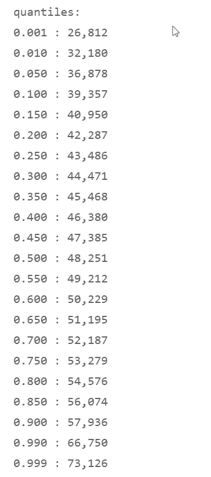

模拟输出的矩和分位数为决策者提供了丰富的信息。

在这种情况下，新产品产生损失的风险(远远)低于 0.1%，如分位数表所示。

中间利润是€48251 英镑。平均利润我们可以预期达到€ 48，513。

机会和风险(低值或负值异常值)的分布相当均匀，表现为偏度和峰度都接近正态分布。

# 4.结论

当我们准备第二个模拟模型时，我们在它的三个输入变量上强加了一个关联结构:数量、价格和材料单位成本。这种相关性将不切实际的参数组合推到了背景中，并帮助模型聚焦于似是而非的参数元组。因此，产出变量的标准偏差显著降低。模拟变得更加紧密地以平均结果为中心。

在现实世界的场景中，我们将不得不面对这样一个问题:我们不仅要确定输入变量将遵循的分布，还要确定它们之间的关系。有时，在我们建立 MC 模型之前，历史数据将使我们能够从实际观察中导出输入的参数和相关性。但是如果历史数据不可用，MC 方法也可以解决这个问题。

如果你记得以前的 MC 文章( [Python 驱动的蒙特卡罗模拟)](/python-powered-monte-carlo-simulations-fc3c71b5b83f)及其关于*嵌套*随机变量的章节，你很快就会得出结论，我们已经讨论了一种方法，它应该能够处理未知*相关结构的不确定性。*

我们将两个威布尔分布参数的估计值建模为两个随机变量。打个比方，我们可以把相关系数定义为随机变量；例如，通过将 PERT 分布映射到它们。规划者——可能只有我们这些数据处理者——应该在 3 点估计上达成一致:变量对之间最小的、可能的和最大的相关性。然后，PERT 或三角分布将处理相关结构，就像它处理随机变量的其他变量一样。相关性的不确定性只会在模型进行 20，000 或 100，000 次迭代时引入一些增量抖动。

当我们面临不确定性时，我们应该尝试对模型假设的波动范围做出一致的估计。然后仿真模型会把它拿起来。蒙特卡罗方法的魅力在于它适用于各种包含不确定性的问题，包括那些无法确定闭合形式方程的问题。

我们只需要考虑大量的假设变量需要更多的迭代次数。对于 20 或 50 个输入随机变量，我们应该将最大迭代次数提高到 10，000 次以上，以确保我们不会在多维搜索网格中留下空白。

然后，MC 方法将接管并通过数值求解变量的相互作用返回模型解。

Jupyter 笔记本可以在 GitHub 上下载: [h3ik0th/mcerp1: Python 蒙特卡罗模拟(github.com)](https://github.com/h3ik0th/mcerp1)

*   标题图片:pixabay 上的 Nikodi，免费用于商业用途
*   其他图片:作者