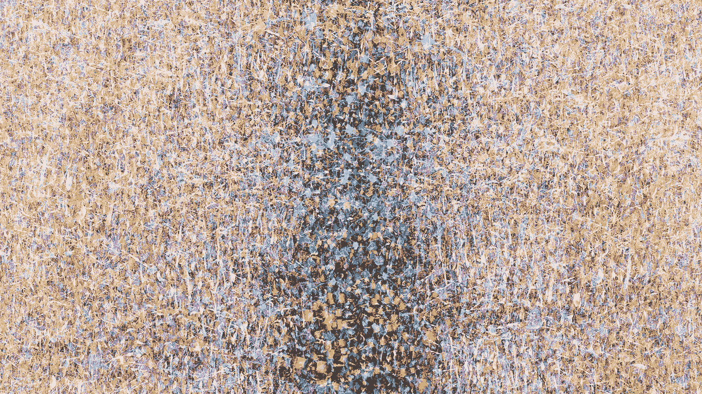
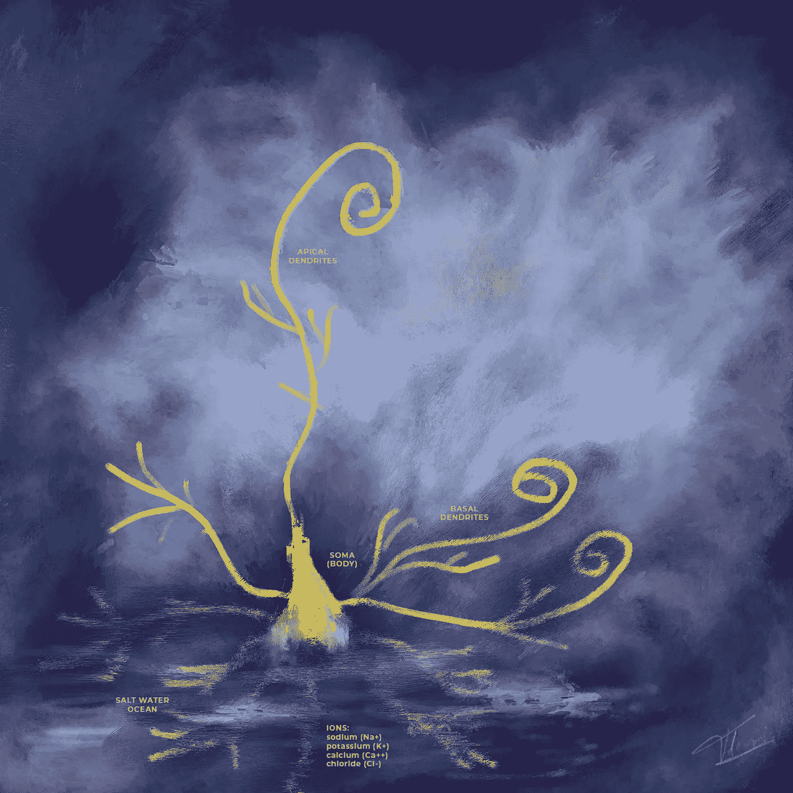
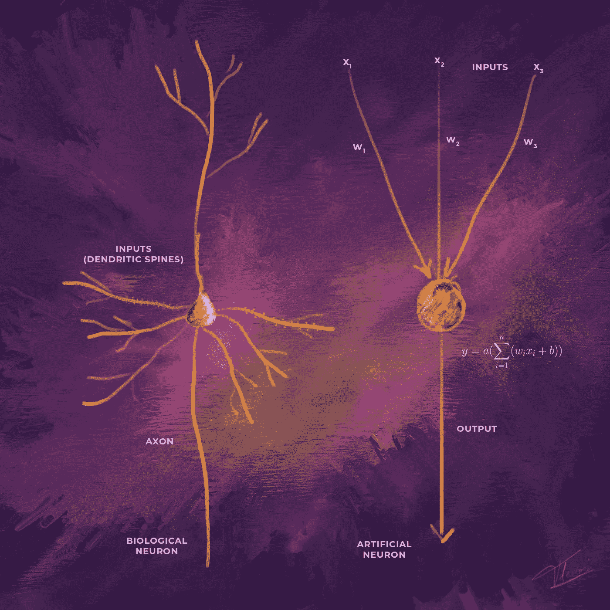
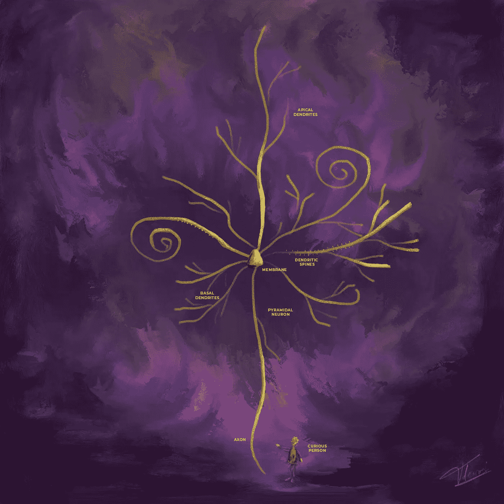
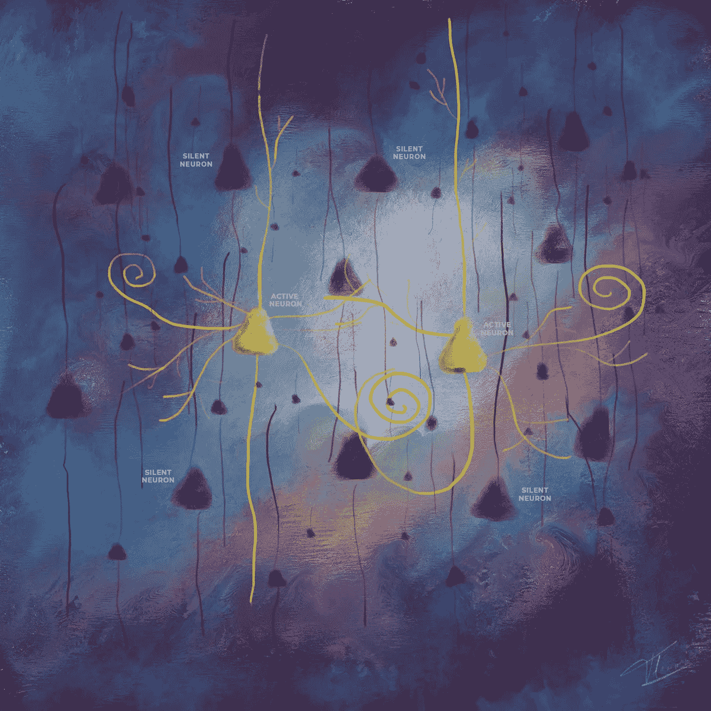
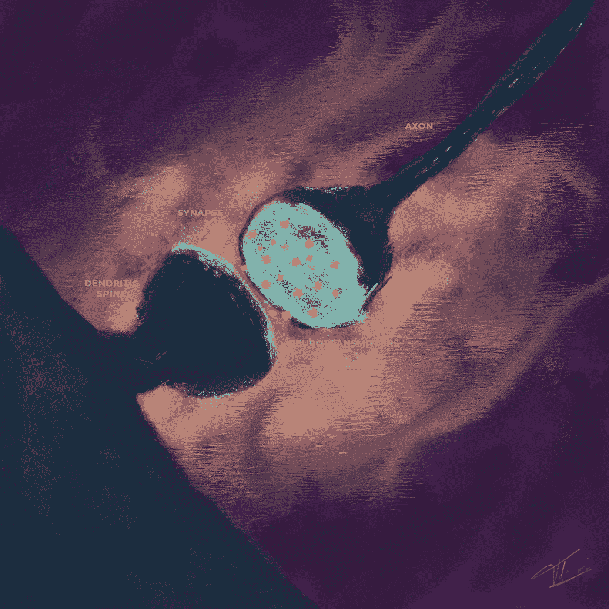
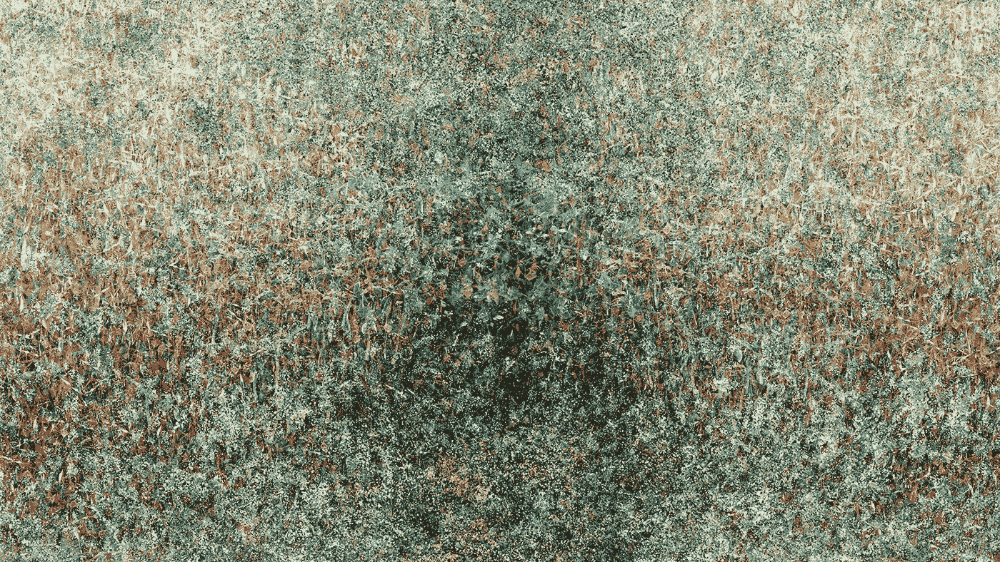
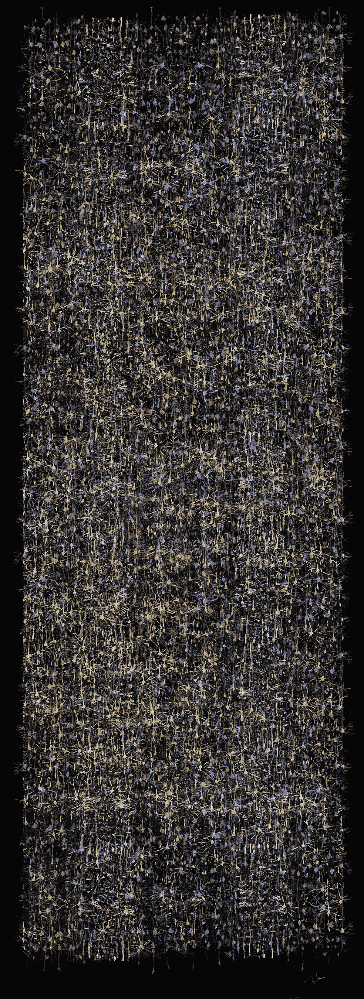

# 通往神经元中心的旅程

> 原文：<https://towardsdatascience.com/journey-to-the-center-of-the-neuron-c614bfee3f9?source=collection_archive---------16----------------------->

## 潜入大脑的咸水海洋，更接近激发我们的人工智能系统并使你的想法成为可能的实体。探索如何理解人工和生物神经元之间的差异可能会给我们提供线索，如何走向更灵活的人工智能。

“百万灵魂的声音”，2 分钟的艺术献礼，向我们的皮层列和新皮层中的数十亿神经元致敬(8K 质量)。将 youtube 设置为 4K 或 8K 分辨率+全屏，以获得最佳体验。“当我们接近宏伟的圆柱时，神秘的图案用百万灵魂的声音从远处召唤我们……我感觉最明亮的太阳被压缩在那些微小的奇迹中..变成了在我们意识中产生共鸣的梦的织锦..我听到你笑了..我听到你坠落…我听到你的眼泪摧毁了地平线..直到我们在寂静等待的圆柱中心汇合..寂静，然后百万个太阳向着一个新存在的觉醒刺来..抱紧我..让我们直入主题，直入专栏的中心..你和我在寂静中合而为一..”/作者 Javier Ideami 创作的视频艺术作品和诗歌|[https://ideami.com](https://ideami.com)

**你的每一个想法**都是通过你的生物神经元实现的**。许多最有用的人工智能架构背后都有一个受其启发的实体。神经元**处于处理过程的**中心**，这些处理过程支撑着智能系统产生的复杂性。好奇想知道更多关于你的想法的引擎，以及它们与它们的人工对应物相比如何？我们开始吧！

**人工智能神经元**最初受到我们生物神经元的启发，然而它们**非常不同。**为什么不应该呢？有许多方法可以到达同一个目的地，就像人类的飞行受到启发，但不会一部分一部分地模仿鸟类的飞行方式一样，我们的人工神经元也只是部分地受到了生物神经元的启发。

**然而**，我们的生物神经元比我们的人工神经元要复杂得多，包含了如此丰富的细节和如此多的秘密。即使我们不需要复制生物神经元的工作方式，**理解两个实体之间的不同****也可以给我们新的线索**关于如何走向更灵活的人工智能形式。

在本文中，我们将回顾这些差异，以及与这些神经元嵌入的网络有关的一些差异。我们还将考虑这些差异如何为即将到来的未来提供新的可能性。

**注** : A.I 是一个广阔的领域。在这个地区有各种各样的外来物种。在进行比较时，我将专门参考一些当今最典型和最流行的深度学习架构。

神经泉瀑布，作者 Javier Ideami |【https://ideami.com 

# 神经元:盐水和电

在我们深入研究神经元功能的细节之前，让我们先快速了解一下内部。这要变咸了！

*   把你的大脑想象成一个装有盐水海洋的容器。在那片海洋中，你有很多我们称之为**神经元**的细胞和很多**离子**。**离子**是正负电荷不相等的原子。而你大脑中的**主要离子**有:**钠**(Na+)**钾**(K+)**钙** (Ca++)和**氯** (Cl-)。这很好地提醒了我们为什么这些矿物质如此重要！
*   所以，生物**神经元**和大多数细胞一样，基本上是由盐水组成的**，氯离子和钠离子漂浮在**周围。并且**一个神经元所做的一切都可以用电学** : **电压**(例如，存在于神经元细胞膜上的电势/电压)和**电流**(带电离子进出神经元的流动)来解释。
*   **人工神经元**是用**计算机代码**创建的，该代码在执行时创建由数字字节组成的**数据结构，以此类推。人工神经元所做的大部分事情都可以用数据的**计算**、**线性和非线性转换**来理解。**

**咸咸的海洋 vs 硅的仙境。**什么更高效？让我们来看看。

作者 Javier Ideami |[https://ideami.com](https://ideami.com)绘画

# 能源:20 瓦的优质服务

**信息处理需要能量，**所以这些神经网络内的能量消耗很重要。它为可能的事情设定了界限，我们的大脑非常高效。

*   现在，当想法在你的头脑中移动时，你的**大脑只消耗了大约 20 瓦的能量**，勉强够点亮一个灯泡。它能够做到这一点**，即使你禁食或睡觉**，并保持**大约 37 摄氏度**度的适度温度。
*   我们的深度学习系统经常使用的强大的**GPU**每单位可以消耗**数百瓦，**比我们的大脑多得多，并且**它们释放大量热量**，达到大约 70 或 80 摄氏度的温度。

最新消息:让人工智能系统更加节能的研究正在进行中。连接和激活的稀疏性可能有助于这些系统接近我们大脑的巨大效率，在任何时候，只有一小部分神经元是活跃的(通常在 0.5%和 2%之间)。

# 功能:全方位检测

我们已经审查了**环境**和**能源**消耗。是时候放大这些实体之一了。神经元在做什么？

*   它**检测来自它接收的许多输入**的模式。我们的大脑中有大约 1000 亿个神经元(估计各不相同，一些专家说实际数字大约是 860 亿)，每个神经元接收来自大约 10000 个其他神经元的输入(有人说大约 7000 个，有人说 8000 个，总之有数千个)。
*   生物神经元有一个**阈值**和**，当超过该阈值时，它会发出一个信号**，我们称之为**动作电位或尖峰**。该信号沿着其**轴突**(神经元的输出)向其他神经元的**突触**传播。
*   **突触**是一种允许一个神经元向另一个神经元传递信号的结构。突触位于神经元的**树突**(其分支)。
*   因此**可以用这个过程总结生物神经元**:**接收**输入，**对它们进行积分，**判断**该积分的结果是否足够强以触发输出信号。**
*   **另一方面，人工神经元**、**执行计算**、**将其输入与其各自的权重**相结合(权重是指定该神经元与其每个输入之间的连接强度的数值)。
*   结果是**通过激活函数**(计算其输入的非线性变换的函数。这使得网络能够学习输入和输出之间的非线性映射)。
*   所以你可以**用这个过程来概括人工神经元**:**接收**输入，**将这些输入中的每一个乘以它们与该神经元的连接强度**的结果相加，**通过非线性函数**传递那个计算**的结果**。

**怎么了:**注意一个关键区别。**生物神经元有一个阈值**，这个阈值**使它们保持沉默，直到被超过**。深度学习系统中的大多数人工神经元产生主动输出(一些可能输出 0。例如，如果输入小于 0，ReLU 激活函数将神经元的输出设置为 0)。正如我们稍后将强调的那样，在任何时候，我们大约 0.5%至 2%的生物神经元是活跃的，而在典型的人工深度学习系统中，这一比例约为 50%。

作者 Javier Ideami |[https://ideami.com](https://ideami.com)绘画

# 到处都有电

让我们暂时回到生物学领域的电的一面。我们经常听说我们的**神经元通过电脉冲**进行交流。让我们深入到电的维度，以便我们能够更好地内化正在发生的事情。

*   **电压**是**一个地方的电荷和另一个地方的电荷之间的**比较**(相对而言)。**
*   神经元中的**电压通常用**毫伏**来测量。毫伏是千分之一伏。我们的**微小神经元**使用**微量的电**来进行它们的操作。**
*   要强调的一个关键点是神经元的**膜电位(电压)。这是神经元相对于其外部空间的**电压**。我们称之为**膜电位**是因为它位于神经元的膜上，也就是**一层薄薄的脂肪**。**
*   **当两个区域之间的电荷存在差异**时，电荷**将倾向于流动，以补偿**的差异并均衡情况。
*   神经元**的**膜**充当了内部电流和外部电流**之间的屏障。我们称之为**的离子通道**就像屏障中的小隧道**，允许物质以可控的方式流动**。
*   **电导**，开口的**大小，决定了这些离子流入和流出膜的速度。**
*   因此**当电压(电势)存在时，两个区域之间的电荷存在相对差异，离子流动以平衡事物**。但是为什么呢？因为**异性电荷相吸，同性电荷相斥的普遍原理**。例如，在某个特定的环境中，正电荷比负电荷多，就会形成一个电流来平衡这种情况，将更多的负电荷带入该区域。
*   **触发阈值**(或**动作电位阈值**)，是神经元**膜上必须达到的**电压，以使神经元通过其轴突触发**输出信号(动作电位)。该**阈值**为**通常**在**约-50mv(毫伏)**处。**
*   神经元的所谓**静息电位在 **-70mv，**，**低于触发阈值**，因此**默认情况下神经元不会触发。****
*   这个门槛的重要性不能被夸大。由于它的存在，**只有最强烈的激活水平通过神经元的轴突(其输出)进行交流**。这使得**信息以一种非常紧凑和有效的方式被编码。**
*   还记得我们开头提到的那些 **20 瓦**的能耗吗？**生物** **神经元只交流相关**和关键信息。其余的，他们保持沉默。

让我们提醒自己，我们没有理由复制或模仿生物神经元的复杂性。我们可以创造出以完全不同的方式展示灵活的智能形式的系统。而且**方式越简单越好。**但是**深入了解我们的生物神经元可以给我们一些想法**，这些想法可以丰富我们在使用人工神经元时的实验和策略。

作者 Javier Ideami |[https://ideami.com](https://ideami.com)绘画

# 是时候了:扣球还是不扣球？

两种神经元之间的一个非常重要的差异(T3)与时间维度(T4)有关。

*   **生物神经元在**非常短暂的**时刻发出**信号。它们发出**尖峰**，持续时间非常短(通常在 1 毫秒左右)。由神经元传输的**信息**在那些尖峰的时序中被**编码。**尖峰序列**是一系列**尖峰和静默。****
*   **在每一个尖峰**之后，神经元的**膜电位返回到一个小值**(它甚至可以低于其静止电位)。为了使**再次达到峰值**，电压**需要回到高于**点火阈值**的水平。**
*   当**学习**过程发生时，一个神经元有助于激活其他神经元 **的**效率可以**动态**改变**通过**长时程增强(LTP)**等过程，这些过程对我们学习和创建记忆的方式至关重要(长期抑郁是 LTP 的相反过程)。**
*   **大多数人工神经元**都是**一般不断地产生输出**(在每个执行周期中)，向线下的下一个神经元发送连续的信号(有时它们的激活函数可能会将它们的输出设置为 0)。
*   所以，在大多数人工深度学习网络中，**时间维度是不相关的**。在我们的生物网络中，它的使用方式本身没有门槛。我们的人工系统要简单得多。但是有时候越简单越好。今天深度学习系统的发展方向足以将我们带到专家们喜欢称之为 AGI(人工通用智能)的地方吗？或者更灵活的人工智能？。关于那件事，还没有定论。

**近况:****冯诺依曼**架构是我们今天使用的大多数硬件背后的**。为了更接近大脑的功能，一些研究人员开始研究其他类型的结构。神经形态计算**就是一个例子。这种架构允许**更多的并行处理和健壮性**。最重要的是，它可以与**脉冲神经网络**一起工作，后者处理**空间和时间维度**，就像大脑一样。像 IBM 或英特尔这样的公司已经生产出了神经形态芯片。这一研究领域面临着许多重大挑战，既包括研究前沿，也包括必须应对与冯·诺依曼模型高度适应的现有生态系统。

作者 Javier Ideami |[https://ideami.com](https://ideami.com)

# 请留点空间:稀疏的魔力

当神经元相互结合时，在任何时刻激活的神经元的数量和它们之间的连接数量在能量消耗、弹性、健壮性和其他相关因素方面会产生很多后果。

*   当想法流过你的大脑时，平均只有大约 2%的神经元在放电。大部分都是沉默。因为在任何时候只有一小部分神经元是活跃的，所以噪音和其他失真很难干扰这些网络的模式检测过程。稀疏性使我们的生物网络具有弹性和强健性。
*   相反，在我们的**人工深度学习网络**中，大多数神经元都在**中持续产生输出**(一些可能通过它们的激活函数将其输出设置为 0)。这就是为什么深度学习系统**通常非常脆弱，对**我们称之为**对抗性攻击/例子**非常敏感的潜在原因之一。**对抗性攻击**是**微妙的**，网络输入的最小**变化(通常我们的感知不可见)，即**在其输出**中产生剧烈且不正确的变化。深度学习网络的**非稀疏特性**使得它们**对其输入的变化**更加敏感。当大部分权重都是相关的并且一直在发挥作用时，**任何变化都会产生戏剧性的后果。****
*   但是**稀疏性**超越了激活。Numenta 是一家著名的研究公司，一群才华横溢的科学家和工程师将神经科学和机器智能研究结合在一起。他们的团队由杰夫·霍金斯和苏布泰·艾哈迈德领导。努门塔的团队已经非常深入地探索了大脑稀疏性的问题，以及与我们的新皮层如何运作相关的其他领域。我们可以从他们的工作、研究和出版物中学到的一件事是，我们的新大脑皮层在两个层面上是稀疏的。
*   首先，如上所述，就激活而言，**最好的估计是，在任何时候，我们的生物神经元中有 0.5%到 2%是活跃的。**
*   然后，我们也有**神经元之间连接**的稀疏性。**当一层神经元投射到另一层神经元上时，Numenta 的团队告诉我们，目前的估计表明有 1%到 10%的可能神经元之间的连接存在。**
*   相比之下，**现在大多数深度学习系统都非常密集。** **就连通性而言 100%密集，**通常。大约 50%的激活率。

**最新消息:**利用稀疏连接和稀疏激活的新架构是一个正在进行的研究领域。不管 A .我不一定要复制大脑做什么，稀疏作为一种策略，在构建更有弹性和更健壮的系统的任务中非常有意义。

作者 Javier Ideami |[https://ideami.com](https://ideami.com)绘画

# 输入和参数

最终我们想用这些神经元来学习。所以现在让我们更深入地了解这些网络为了产生学习而调整的**旋钮**。之后，我们将研究学习算法本身。我们从比较两种神经网络的**输入和参数**开始。

*   在**生物网络**中，你可以有 **3 种类型的输入** : **兴奋性**(使接收神经元更容易激发)**抑制性**(做相反的事情)和**泄漏**(与抑制性的功能相似)。
*   如前所述，这些**输入通过**突触**、**发送和接收神经元**之间的连接点与接收神经元**对接。大多数突触位于接收神经元的树突上。
*   **树突是从神经元上分出的分支**(树突来自希腊语- **dendro** -，意为树)。在树突处，不同的**输入信号被整合**。这些树突上有小刺。正是在那里**来自发送神经元(轴突)的输出接口(突触)**建立与其他神经元的连接。
*   在**人工网络中，**通常有**单一类型的输入，**通常有多个相关联的**权重**(表示该输入与连接到它的多个其他神经元之间的连接强度的数字，每个连接一个权重)。
*   那些权重**保存可以是负的或正的连续值。**每个权重值，结合在神经元上执行的计算，实际上将有助于使接收神经元或多或少地活跃(类似于前面描述的兴奋-抑制动态)。
*   因此，**在生物神经元中，**有这种**兴奋和抑制信号之间的战斗**。这场战斗的结果决定了细胞膜上的电压。为了让神经元**激发**，膜电压**需要超过动作电位阈值**。
*   在**人工神经元中，**事情更简单。没有明确的阈值和**，每个**权重的不同强度**(正或负)组合起来或多或少地刺激**接收神经元。

让我们**更接近两个实体的参数**。

*   在**生物网络**中，我们有**突触权重的概念，**它**决定了来自发送神经元**的信号通过其突触连接对接收神经元 **的影响。**
*   更近一点来说，这种**影响所代表的**是**发送神经元的动作电位释放神经递质**、**以及这些神经递质打开接收侧突触通道**的能力。
*   在**人工网络中，**我们有**权重**来决定发送和接收神经元之间每个连接的强度。而那些**重量就是**简单来说就是**数字**。它们可以是浮点数、整数、单比特等。
*   因此，尽管**人工重量是一个简单的数字，**生物**突触重量取决于许多因素**。这些因素包括，例如，可以释放到突触中并在另一侧被吸收的神经递质的**数量(在这里，特定种类的受体和离子的数量开始发挥作用)，信号在轴突中移动的程度(轴突中的**髓鞘化**对此有影响)，信号传播的**效率**以及轴突和接收神经元的树突之间的**数量**。正如我们所见，这远远超出了一个简单的数字。**

这些就是这些网络的参数。还有**把**拉远一点，**他们代表着什么**？

*   一般来说，这些权重代表**一个神经元对什么敏感，** **它正在检测什么**。如果一个**权重值很大，**它**意味着相关神经元对它正在接收的输入非常敏感**。
*   因此，我们可以感觉到**学习过程，在两种情况下**，都与**改变和调整这些权重有关，**随着学习的进展，在网络中产生不同的模式。
*   所以，为此做好准备:**你的每一个想法和记忆都由突触权重模式**来代表。类似的事情也发生在我们的人工网络中，数字权重模式代表不同抽象层次的信息，这些模式在整个学习过程中不断进化。

我们得到了结构、输入、参数和输出。该学习了！

作者 Javier Ideami 的绘画|【https://ideami.com T3

# 学习:反向传播和超越

为了让**学会**，我们需要**调整那些权重**，那些参数，并且朝着正确的方向去做。但是怎么做呢？学习算法是什么？

*   在我们的**人工深度学习网络**、**反向传播、**结合**梯度下降、**是**典型的** **算法**的选择。
*   例如，在受监督的系统中(我们提供一个带有标签的数据集，比如一些带有标识动物种类的标签的动物图像)，我们运行网络，然后计算它的**性能、它的损失值**或误差(我们正在获得的和我们想要获得的之间的差异)。
*   然后，从网络的输出开始**并向其输入** ( **反向传播**当前损耗值**，这就是为什么我们称之为反向传播)，我们使用**演算**及其**链式法则**到**的力量计算网络的每个参数对最终损耗值的影响。**我们能够做到这一点，因为在神经网络的不同层执行的所有计算都是可微分的。**
*   一旦我们知道调整每个权重将如何影响网络的最终损失值，我们就可以继续**调整每个参数** **使最终损失值最小化，**我们的目标和我们在每个时刻的位置之间的差异。
*   如果我们**继续重复这个过程**，沿着这些梯度向下移动**，**我们将**到达一个地方，在这个地方，我们所有权重的组合产生的计算在我们的目标值和我们当前的网络输出之间产生一个非常小的差异**。学习已经发生了。
*   那么我们的生物网络呢？大脑中是否存在类似于反向传播的现象？围绕这个有**争议**。**一些专家**认为**大脑中可能有**正在进行的事情，虽然**与**不同，但可能与反向传播有相似之处。**其他人认为**我们的生物网络学习方式**与之无关。**因此，**评审团仍未确定**，这一领域有很多活跃的研究。

**怎么了:反向传播**是一个很棒的学习算法。然而，像任何算法一样，它有优点也有缺点。如果我们超越了在大脑中寻找类似反向传播的东西，并考虑其他选择，会怎么样？研究员 Ben Goertzel 是 AGI 领域的专家，他认为我们最终会超越反向传播，使用其他种类的学习算法，以更好的方式适应未来 AGI 系统的需求。这些可能包括应用于复杂神经架构的 **CMA-ES** 类型的**进化算法**。

Ben 告诉我们,**如果我们使用这些进化算法**，我们就可以，例如，使用**推理进行适应性估计**和**其他策略来指导进化学习**过程，这些策略在我们使用反向传播时更难实施。

Ben 提出了一个非常有趣的问题:**有多少神经架构仅仅因为不适合与反向传播算法一起工作而被丢弃？这是一个很好的提醒，让我们的选择和思维对新的可能性保持开放。**

我们的**大脑**受益于**两种学习过程:** **进化过程**将**编码在我们的基因**中，而**则发生在我们一生中的神经网络**中。在我们的人工网络中结合这两种方法可以打开新进展的大门。

# 进化:运动中的一切

这就把我们带到了这些神经结构的进化方面。

*   现在，你大脑皮层中的神经网络已经和几个小时前不同了。他们**从未停止进化**。
*   总的来说，缩小来看，在我们的生物网络中，有许多不同层次的**优化过程在进行**，不仅在参数方面，而且在网络本身、结构、算法等层面(例如，与我们的基因组相关)。
*   当处于活动状态时，**我们典型且最受欢迎的人工深度学习系统** **通过使用反向传播来优化它们的参数**(权重)，而**就是这样。**架构本身保持静态，除了我们不时对其超参数进行的更改(手动或通过 **autoML** 、**网格搜索**和其他类似选项)。

**最新进展:**关于**自我优化机制的研究**这可能允许深度学习架构**随着学习过程的进行，转变和进化它们的结构并优化它们的策略**，这可能使我们的人工网络更具适应性和灵活性。像 Kenneth Stanley 教授这样的研究人员已经对朝着这个方向发展的动态系统产生了非常有趣的结果。

神经森林，作者 Javier Ideami 绘制|[https://ideami.com](https://ideami.com)

# 何时:持续学习

这些学习过程需要多长时间？

*   在我们**当前最典型的深度学习网络**中，训练过程有**开始和结束**。我们首先训练，完成学习过程，然后执行我们所谓的**推理**。我们在一个单独的过程中将这种学习应用于以前未见过的数据。
*   随着新数据的到来，我们可以不断地重新训练我们的网络，并迭代地更新我们的模型。
*   在我们的大脑中，学习过程从不睡觉。持续的学习正在进行。当我们思考、行动甚至睡觉时，我们突触连接的强度也会发生变化。

最近怎么样:持续学习是人工智能社区的热门话题。我们知道，如果我们最终要达到一种更加灵活和强大的人工智能，学习需要有更多的连续性。这一领域正在进行大量的研究。

# 让我们社交吧

生物神经元比我们的人造神经元更加社会化。这是什么意思？

*   在典型的深度学习网络中，**人工神经元**在朝向下一层的单一方向上进行**通信(反向传播计算反向进行)，并且它们只连接到前一层和下一层。也有例外，但我们在这里谈论的是最典型的深度学习网络。**
*   **生物神经元**可能在多个方向上进行交流，并拥有**更广泛和更丰富的连接**(同时也是更稀疏的那些)**。**一些神经元在皮质柱上下沟通。其他人有横向联系。我前面提到的时间方面为这个过程引入了一个更丰富的方面。

**进展如何:**利用更灵活和更丰富的连接形式的新型人工智能架构是另一个活跃的研究领域。例如，**研究人员**正在研究**图形神经网络**和其他使用**超图**和**元图的架构。**由 **Ben Goertzel、**创立的 **singularityNET** 项目、在这方面做了很多工作。它将**区块链**技术与人工智能服务相结合，产生了一个**去中心化** **A.I 网络**。最近，该项目与 **Cardano** 生态系统合作，加速其向全球分散 AGI 系统的进展。

作者 Javier Ideami |[https://ideami.com](https://ideami.com)绘画

# 放大

为了完成我们的旅程，让我们暂时缩小一下。

*   参与我们智力高级部分的神经元位于我们的新大脑皮层。
*   我们的大脑皮层由**微柱构成，**每个微柱由大约 **100 个神经元**组成，这些神经元处理相似类型的数据。
*   许多**微柱根据皮层柱**构成，我们的新皮层中有**大约 150000 个柱。**
*   如果你有兴趣更深入地了解这些皮质专栏中发生的事情，我建议你去看看科学家兼企业家杰夫·霍金斯的书**“一千个大脑:一种新的智力理论】**，这是一本真正的杰作，他在书中剖析了他的团队在 **Numenta 进行的最新研究。**

如果你想进一步探索最近的神经科学研究如何为实现更具弹性、一致性和灵活性的人工智能指明方向，比如杰夫·霍金斯和他的团队**所做的研究**，你可以看看下面我写的另一篇关于这个主题的文章

</towards-the-end-of-deep-learning-and-the-beginning-of-agi-d214d222c4cb>  

**百万灵魂的声音诗**

> *“当我们接近宏伟的圆柱时，*
> 
> *神秘的图案用百万灵魂的声音从远处呼唤着我们……*
> 
> 我感觉到最明亮的太阳被压缩在那些奇妙的小点中..
> 
> 简化成一幅在我们意识中产生共鸣的梦的织锦..
> 
> 我听到你的笑声..我听到你坠落…我听到你的眼泪摧毁了地平线..
> 
> 直到我们合并在纵队的中央，那里静候着我们..
> 
> 寂静，然后百万个太阳向着一个新存在的觉醒刺来..
> 
> 抱紧我..让我们直入主题，直入专栏的中心..
> 
> 你和我在寂静中合而为一..”
> 
> *—作者哈维尔·伊达米*