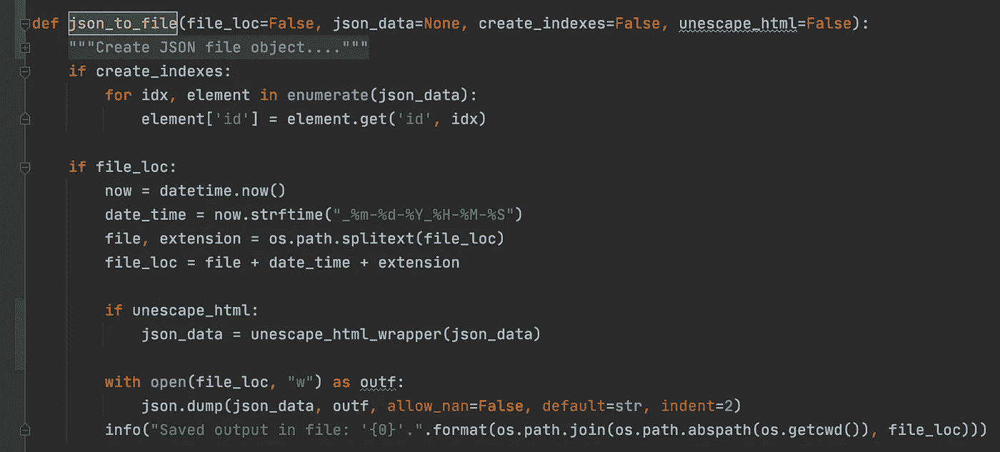
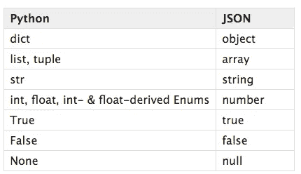

# Python 中的 JSON 和文本数据

> 原文：<https://towardsdatascience.com/json-and-textual-data-in-python-5aa7c376a0d4?source=collection_archive---------43----------------------->

## 如何在 Python 中集成非常流行的 JSON 数据格式来存储文本数据。



作者图片

在这个故事中，我们将关注 JavaScript 对象符号或 JSON，这可能是世界上首选的数据交换格式，也是对更传统的文件存储选项(XML、CSV、TSV)的必然升级。

我们将介绍创建和加载 JSON 文件、文件存储和换行符分隔的 JSON 存储的基础知识，并研究使用文本数据和 JSON 的更具体的用例。

# 为什么选择 JSON

JSON 在 web 应用程序中被广泛用作交换数据的首选方式，尤其是在前端和后端中间件之间。

*   它可以异步加载信息，因此您的网站响应更快，可以更容易地处理数据流。
*   当从另一个站点交换数据时，您还可以使用它来克服跨域问题。
*   JSON 比以前万维网上的标准标记语言 XML 更简单、更轻量级。

除此之外，它还有四个优点，特别是对于文本数据。

## JSON vs. CSV 和 TSV

与更传统的文本数据存储格式(如逗号分隔文件(CSV)或制表符分隔文件(TSV ))相比，它通常更好，因为您的文本数据永远不会包含这些文件的文件分隔符。

我期望我的输出有三列:文本、年龄、姓氏，但是因为是复合句，我现在有 5 列。一种解决方法是使用一个在文本中从未出现过的分隔符。竖线`|`更不常见，但是你仍然不能 100%确定文本中不包含竖线。

CSV 和 TSV 文件将一切转换为`strings`，但是 JSON 对象可以包含任何东西:`lists, strings, dictionaries, floats`。完美的数据存储！

## 标签属性

JSON 由一个键值映射组成，就像 Python 字典一样。这使我们能够标记我们的属性。嵌套的 JSON 对象也很常见。

```
map = {label1: attribute1, label2: attribute2}nested_map = {
    id1: {attribute1: label1, attribute2: label2}, 
    id2: {attribute1: label1, attribute2: label2}
    }
```

## JSON 对熊猫数据帧

我认为 JSON 优于 Pandas DataFrames，尤其是对于文本数据。数据通常有多个(嵌套)级别，例如在命名实体识别的情况下，数据集可能如下所示:

但是当在 Pandas 数据框架中加载这个数据集时，我该如何处理`entities`？我是把它们放在一栏里，还是把它们放在不同的栏里？一句话里有多个实体怎么办？我还需要全部打开吗？

# Python 的 JSON 基础

函数中带附加`s`的 JSON 用于编码/解码**字符串**，不带附加`s`的 JSON 用于编码/解码**文件**。JSON 所做的是将 Python 对象转换成受 [JavaScript](https://en.wikipedia.org/wiki/JavaScript) 对象字面语法启发的格式。Python 对象到这种格式的默认转换如下图所示。它支持 Python 中的所有标准对象。



Python 对象的默认 JSON 编码器

## 重要说明

JSON 期望键-值映射中的每个键都是唯一的，没有简单的方法来避免这一点。非唯一键，或者如下例所示进行求和，或者在处理其他数据类型时被覆盖。

```
**>>>** weird_json = '{"x": 1, "x": 2, "x": 3}'
**>>>** json.loads(weird_json){'x': 3}
```

# JSON 文件

JSON 对象非常类似于 Python 的键-值字典映射，因此当保存到文件中时，它只是一个很长的字符串，在一行中表示字典。由此产生的一个问题是，对于 Sublime 或 Pycharm 这样的文本编辑器来说，打开文档会变得非常沉重，并且降低了可读性。

减少负载和提高可读性的一个选择是在转储 JSON 时使用`indent`参数。另一个有用的论点是`sort_keys`，那好..在保存文件之前对关键字进行排序。

```
**>>>** with open("out.json", "w") as json_out:
        json.dump({'b': 5, 'a': 7}, json_out, indent=4, sort_keys=True) {
    "a": 7,
    "b": 5
}
```

## JSON 换行符分隔文件

保存 JSON 的一个非常常见的方法是保存数据点，比如一个列表中的字典，然后将这个列表转储到一个 JSON 文件中，如`nested_text_data.py`中所示。另一个更新的选择是使用 [JSON 换行符分隔的](https://jsonlines.org/) JSON 或`ndjson`。这种格式将每个 JSON 数据点保存在新的一行上。一个巨大的优势是，您可以迭代每个数据点，而不需要将整个对象(列表)加载到内存中。

```
{"text": "Hi my name is Louis", "age": 26}
{"text": "Hi my name is Max", "age": 22}
```

Python 中有一个库`jsonlines`用来写这些文件。

# JSON 和 HTML 实体

你见过 JSON 数据`&amp; &gt; &lt;`中的`& > and <`的 ASCII 格式表示或者不间断空格`&nbsp;`吗？

数据经常以 JSON 格式作为来自 API 或 web 服务的响应。因此，文本数据(1)为 ASCII 格式，并且(2)非 Unicode 字符被转换为 Unicode 表示形式`\u2014`:

```
"Ik wil de te naamstelling van &nbsp; mijn betaalrekening &amp; pas aanpassen Mej. \u2014-&gt;  Mw."
```

这个 StackOverflow 线程建议在转储这个 JSON 时使用`ensure_ascii=False`标志。在阅读了`[json.dump()](https://docs.python.org/2.7/library/json.html#basic-usage)` [文档](https://docs.python.org/2.7/library/json.html#basic-usage)和【StackOverflow 线程之后，我明白了确保 ASCII 是很重要的，尤其是如果你不确定你的 JSON 的格式，如果你使用一个 web 服务 API 的话，经常会出现这种情况。此外，它没有解决我的 HTML 实体问题…

解决方案是 HTML 库中的`[html.unescape()](https://docs.python.org/3/library/html.html)`,它从字符串中转义所有的 HTML 实体。

# 模块化 JSON 编写函数

我使用一个自定义函数来编写 JSON 对象。我喜欢这个函数，因为它有助于我进行静态文件管理:在文件名中添加日期和时间，并在我保存文件的地方提供日志反馈。

如您所见，我还在一个包装器`unescape_all_html()`中包含了`unescape.html()`函数，用于我最常用的 JSON 数据格式:字典列表。找到下面的包装纸。

就是这样！我希望本指南向您介绍了如何在 Python 中使用 JSON(和文本)!快乐编码:)