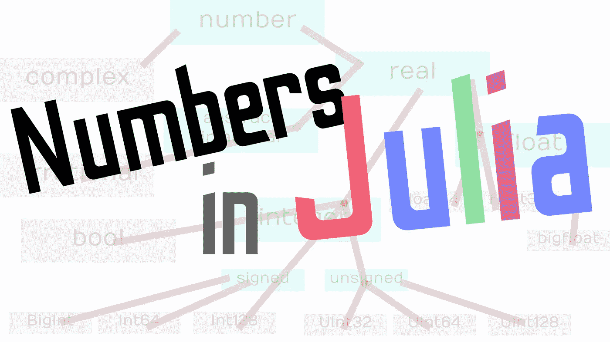
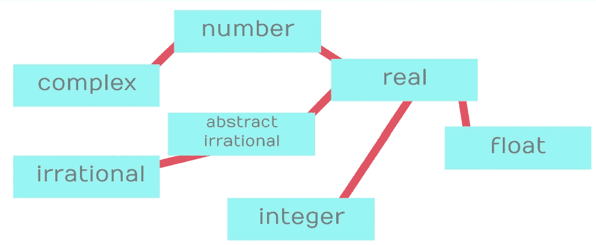
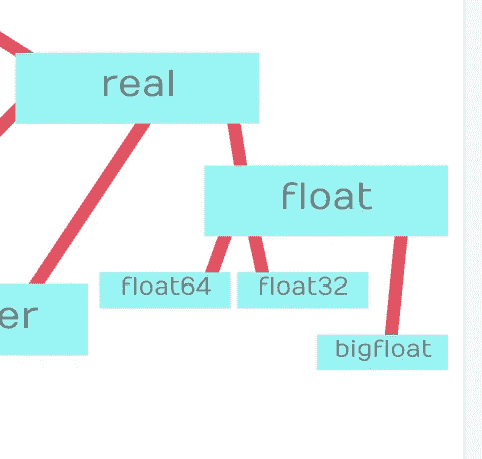
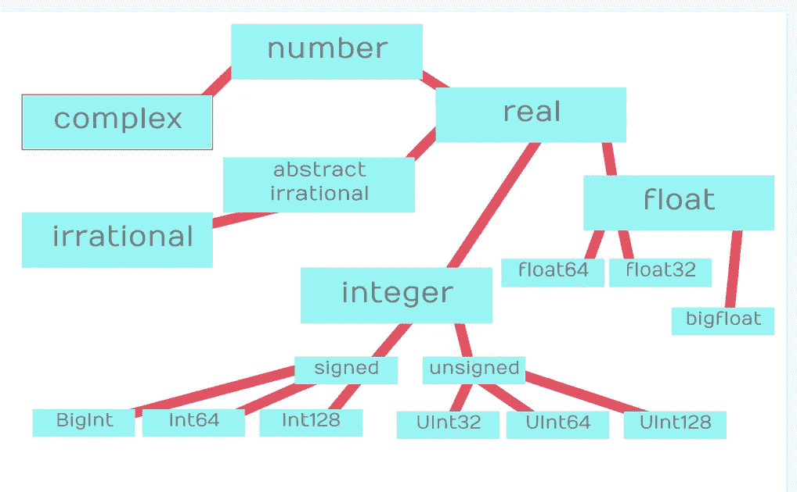
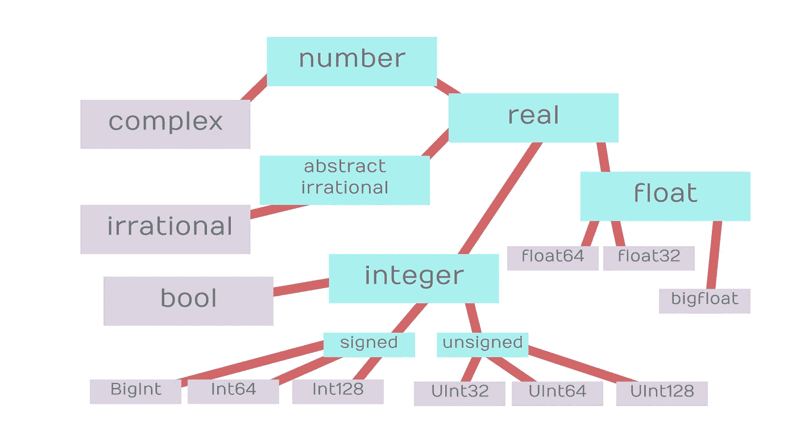

# 朱莉娅和虚数:数字等级

> 原文：<https://towardsdatascience.com/julia-and-imaginary-numbers-the-numerical-hierarchy-694aef87a7ce?source=collection_archive---------30----------------------->

## 对朱莉娅如何处理数字的深入探究

(图片由作者提供)

# 介绍

Julia 是一门伟大的语言，在处理数字时，它以其奇妙的方法而备受推崇。当然，在科学的奇妙世界里，这也意味着虚数，以及由一个假想的父母和一个真实的父母所生的复数。在很大程度上，朱莉娅对实数和虚数的处理绝对精彩。当这种语言与不太数学化的编程语言或者在发布时不打算被科学使用的语言相比时，这一点尤其正确。

Julia 的《数字的神奇世界》深入探讨了它的类型和超类型层次结构，并冷静地审视了超类型和多分派编程方法必须构建的非常复杂的类型系统，这些系统可以处理一系列操作，同时仍然保持相对简单的代码。

如果你想了解更多关于 Julia 的超级类型特征，我写了一整篇文章，你可以在这里查看！：

 [## 概述 Julia 中的抽象超类型层次结构

### Julia 的酷类型抽象介绍！

towardsdatascience.com](/overview-abstract-super-type-heirarchies-in-julia-26b7e64c9d10) 

# 数字

在 Julia 中，数字层次的顶端是您可能熟悉的类型:

> 数字

数字是具有连续值的任何东西。数字可以是虚数、无理数，甚至是复数。在朱莉娅的书中，我们没有严格意义上的虚数。相反，我们使用复数的虚界，在这些类型中创建了我们的第一个层次划分。请注意，任何采用数字类型的函数都可以使用它下面的任何数字类型。这就是 Julia 中的超级类型如此独特和出色的原因，通过简单地对任意类型使用多重分派，我们可以从本质上限制我们类型的不同部分只处理特定的函数。然而，下一种类型不是任意的，因为它实际上是我们前面提到的复数。

这种类型的另一个初始划分是实数。如果我们有一个需要接受实数的函数，我们可以将实数类型转换成任何参数，这样就可以提供任何类型的数字，无论是 float64、Int64 还是其他。让我们来看看目前为止可视化的层次结构:

(图片由作者提供)

至于复杂类型，是存根。除此之外没有进一步的分类，它是语言中唯一可用于处理任何虚构的连续值的类型。记住这一点，让我们看看在 Julia 编程语言中实数的更多可能的分类。

# 实数

在 Julia 编程语言中有三种类型的实数:

*   漂浮物
*   不合理的
*   整数

您可能对其中一些类型很熟悉，因为我们在编程中经常会用到它们。然而，在这个层次结构中，还有更多类型存储在更低的位置，便于各种类型的浮点数和整数。然而，就无理数而言，该类型经过一个超类型抽象层，新类型将从该抽象层继承函数。这是为什么呢？

这样做是为了使更多的类型可以通过成为该类型的抽象版本的子类型来实现和利用相同的功能。回头看看类型层次，我们可以看到事情真的开始变得**真实**:

(图片由作者提供)

至于无理数，可能就是这样了，但是如果不使用浮点数和整数，还有更多的东西需要解开。Julia 支持 BigInt 和 BigFloat 数据类型，这是没有操作错误的巨大值。就科学和数值计算而言，这当然是语言的一个非常有价值的属性。进一步来说，我们有带符号和不带符号的整数，甚至还有另一个子类型，你可能在数字层次结构中找不到。

# 浮点数和整数

作为浮点类型的子类型，我们有 32 位浮点、64 位浮点和大浮点。当然，在大多数情况下，您将使用 Float64s，但是，根据您可能使用的数据类型和系统类型，大浮点和 32 位浮点有时确实很方便。更新我们的层次结构，我们看到所有这些浮动都是抽象浮动类型的直接子类型:

(图片由作者提供)

至于整数，我们需要从两个抽象类型开始，有符号和无符号。第一次听到这个，两者之间的区别可能是一个奇怪的问题。然而，答案很简单，无符号整数是一种不同的方式，计算机可以存储必须是正数的整数，然而有符号整数可以保存正值和负值，但容量不太大。我的建议是更多地使用带符号的浮点数，因为在 Julia 中我们也有大整数类型，它允许那些较大的数字作为单独的数据存储。

(图片由作者提供)

我们现在只缺少一种类型，实际上是布尔类型。布尔类型实际上继承了整数的所有数值、实数和属性。这就是为什么我们可以在 Julia 语言中添加 bool 类型，或者在 bool 类型上获得连续起源的条件返回。

# 结论

添加了 bool 类型后，我们的层次结构就完整了，现在我们在内存中拥有了 Julia 语言中所有类型的数字！作为最后一个有趣的观察，我将把所有的结构都涂成紫色，而把任意的类型都涂成青色。我认为这将给出一个演示，说明在这些不同的超类型下实际传递和分类了哪些类型。

(图片由作者提供)

我认为这些信息非常有价值，不仅对 Julia 程序员，而且对普通程序员以及科学界都是如此。看到数字分类被应用到一种编程语言中，并使用其特定的范例和方法，这真的很酷。我认为 Julian 的实现很有趣，也有点令人兴奋，所以我决定与你们所有人分享这些很酷的类型！我希望这篇文章读起来令人愉快，并且提供了比你需要知道的更多的关于 Julia 中不同类型的连续值的信息。感谢您的阅读！