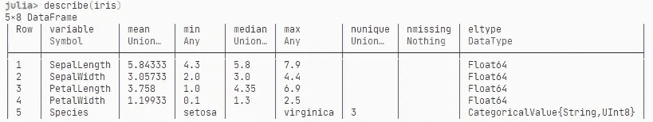

# Julia DataFrames.jl 基础

> 原文：<https://towardsdatascience.com/julia-dataframes-jl-basics-95dba5146ef4?source=collection_archive---------19----------------------->

## 用 DataFrames.jl 戳戳你的数据


照片由[罗莎琳德·张](https://unsplash.com/@rosalindjchang?utm_source=unsplash&utm_medium=referral&utm_content=creditCopyText)在 [Unsplash](https://unsplash.com/s/photos/poke-with-finger?utm_source=unsplash&utm_medium=referral&utm_content=creditCopyText) 拍摄

让我们探索一下 Julia 中 [DataFrames.jl](https://github.com/JuliaData/DataFrames.jl) 的一些基本功能。如果你对 R 的 DataFrames 或 Python 的 Pandas 有一些经验，那么这应该对你来说是一帆风顺的。如果您没有以前的 dataframes 经验，不要担心，这是您可以想象的最基本的介绍！🌈

如果你在寻找更高级的东西？看看我关于朱莉娅的其他文章:

[](/joining-dataframes-in-julia-c435e3da32f3) [## 在 Julia 中连接数据框架

### 学习所有连接——使用 DataFrames.jl 的内部、外部、交叉和半连接

towardsdatascience.com](/joining-dataframes-in-julia-c435e3da32f3) [](/vectorize-everything-with-julia-ad04a1696944) [## 向量化朱莉娅的一切

### 告别 for loops，广播所有的东西

towardsdatascience.com](/vectorize-everything-with-julia-ad04a1696944) 

> 要获得所有媒体文章的完整访问权限，包括我的文章，请考虑在此订阅。


[大英图书馆](https://unsplash.com/@britishlibrary?utm_source=unsplash&utm_medium=referral&utm_content=creditCopyText)在 [Unsplash](https://unsplash.com/s/photos/iris-painting?utm_source=unsplash&utm_medium=referral&utm_content=creditCopyText) 上拍摄的照片

为什么是数据框架？我们已经知道 **Julia 内置了对类似数组的**对象的支持，那么我们为什么还需要另一种矩形数据格式呢？在数据科学中，很多情况下我们在同一个表中混合了数字和字符串数据。例如，考虑一个就业表。一列可能是这个人是否被雇佣(`Boolean`)，另一列可能包含这个人工作的行业的信息(`String`)，还有一列是作为`float`的薪水。`DataFrames`非常适合处理这样的数据，因为它**将你的观察结果集中在一起，而不会因为混合数据类型而惩罚你**。

> 数据框架允许你把你的观察结果放在一起，而不会因为混合数据类型而惩罚你。

在之前的帖子中([这里](/reading-csv-files-with-julia-e2623fb62938?source=your_stories_page-------------------------------------)和[这里](/vectorize-everything-with-julia-ad04a1696944))我已经展示了如何使用`CSV.jl`读取表格文件格式，所以我们将跳过这一部分，使用`RDatasets`包来处理一个真正经典的 iris 数据集。不要求知道这些数据中有什么，但是如果你好奇的话，这些数据来自 [UCI 机器学习库](https://archive.ics.uci.edu/ml/datasets/Iris/)。总的来说，这个表包含了一束漂亮的花的信息。

让我们摘些花吧🌼：

```
150×5 DataFrame
│ Row │ SepalLength │ SepalWidth │ PetalLength │ PetalWidth │ Species │
│   │Float64│ Float64    │ Float64 │Float64│ CategoricalValue     │
├───┼───────┼────────────┼─────────┼────-──┼───────────┤
│ 1 │ 5.1   │ 3.5        │ 1.4     │ 0.2   │ setosa    │
│ 2 │ 4.9   │ 3.0        │ 1.4     │ 0.2   │ setosa    │
│ 3 │ 4.7   │ 3.2        │ 1.3     │ 0.2   │ setosa    │
│ 4 │ 4.6   │ 3.1        │ 1.5     │ 0.2   │ setosa    │
│ 5 │ 5.0   │ 3.6        │ 1.4     │ 0.2   │ setosa    │
│ 6 │ 5.4   │ 3.9        │ 1.7     │ 0.4   │ setosa    │
│ 7 │ 4.6   │ 3.4        │ 1.4     │ 0.3   │ setosa    │
...
```

> DataFrames.jl 的最新版本不再使用`head`或`tail`，而是使用`first(df, n)`和`last(df, n)`功能！

如果您在 REPL，默认情况下，Julia 将打印结果对象—一个数据帧。如果没有，我们可以用`head(iris)`**检查前几行**:

```
julia> head(iris)
6×5 DataFrame
│ Row │ SepalLength │ SepalWidth │ PetalLength │ PetalWidth │ Species │
│     │ Float64     │ Float64    │ Float64     │ Float64    │ Cat…    │
├─────┼─────────────┼────────────┼─────────────┼────────────┼─────────┤
│ 1   │ 5.1         │ 3.5        │ 1.4         │ 0.2        │ setosa  │
│ 2   │ 4.9         │ 3.0        │ 1.4         │ 0.2        │ setosa  │
│ 3   │ 4.7         │ 3.2        │ 1.3         │ 0.2        │ setosa  │
│ 4   │ 4.6         │ 3.1        │ 1.5         │ 0.2        │ setosa  │
│ 5   │ 5.0         │ 3.6        │ 1.4         │ 0.2        │ setosa  │
│ 6   │ 5.4         │ 3.9        │ 1.7         │ 0.4        │ setosa  │
```

这给出了数据集的前 5 行，您可以通过指定第二个参数来查看更多行，例如，`head(iris, 10)`将给出前 10 行。

> 想看看最后几排吗？使用`tail()`。

# 数据框架基础

`head`函数已经给出了数据集的一个非常好的概述。它还打印列名、列类型和一些示例行。然而，有不同的方法获得相同的数据。

如果您正在**寻找列名**，请使用`names`，它会给出一个字符串数组:

```
julia> names(iris)
5-element Array{String,1}:
 "SepalLength"
 "SepalWidth"
 "PetalLength"
 "PetalWidth"
 "Species"
```

如果你需要数据集的**大小，使用`size`——这也适用于数组和矩阵！**

```
julia> size(iris)
(150, 5)
```

所以我们有 150 行和 5 列。漂亮的一束花。

如果需要将**类型的列**作为数组，使用`eltypes`:

```
julia> eltypes(iris)
5-element Array{DataType,1}:
 Float64
 Float64
 Float64
 Float64
 CategoricalValue{String,UInt8}
```

最后一栏看起来很特别。这是一个分类列，将字符串映射到无符号的 8 位整数`UInt8`。这基本上是一个**因子变量**，它使得存储数据更加有效，因为 Julia 只需要存储整数而不是字符串。所以我们知道`Species`列没有很多不同的级别，但是具体有多少呢？让我们找出答案。

# 摘要和简单索引

使用`descirbe`函数，我们可以很好地了解所有列。对于“种类”列，它甚至会打印唯一级别的数量:

```
julia> describe(iris)
5×8 DataFrame
│ Row │ variable    │ mean    │ min    │ median │ max       │ nunique │ nmissing │ eltype                         │
│     │ Symbol      │ Union…  │ Any    │ Union… │ Any       │ Union…  │ Nothing  │ DataType                       │
├─────┼─────────────┼─────────┼────────┼────────┼───────────┼─────────┼──────────┼────────────────────────────────┤
│ 1   │ SepalLength │ 5.84333 │ 4.3    │ 5.8    │ 7.9       │         │          │ Float64                        │
│ 2   │ SepalWidth  │ 3.05733 │ 2.0    │ 3.0    │ 4.4       │         │          │ Float64                        │
│ 3   │ PetalLength │ 3.758   │ 1.0    │ 4.35   │ 6.9       │         │          │ Float64                        │
│ 4   │ PetalWidth  │ 1.19933 │ 0.1    │ 1.3    │ 2.5       │         │          │ Float64                        │
│ 5   │ Species     │         │ setosa │        │ virginica │ 3       │          │ CategoricalValue{String,UInt8} │
```

这可能会在你的机器上被奇怪地格式化，所以这里也有一个截图:



上表截图

你可以看到桌子上有三种不同的花。除此之外，我们还可以学习每个数字列的平均值**以及平均值、最小值、最大值甚至中值**。我们没有丢失数据。如果你问我，我会说这是一个非常好的数据集😉。

既然我们对正在做的事情有了一个清晰的概念，那就让我们开始切片吧。很常见的情况是，我们希望从数据集中提取一列或多列。我们可以通过按名称引用列或使用括号`[]`进行索引来做到这一点。我们可以使用字符串、符号或点符号:

```
julia> iris.SepalLength
150-element Array{Float64,1}:
 5.1
 4.9
 4.7
 4.6julia> iris.SepalLength == iris["SepalLength"] == iris[:SepalLength] == iris[1]
true
```

在选择列时，您有很多选择😃。

一旦选中，这些列就变成了普通的数组，因此对数组起作用的函数会按预期工作:

```
julia> sum(iris.SepalLength)
876.5julia> sum(iris.SepalLength .^ 2)
5223.849999999999
```

选择行也很容易。这里的技巧是，默认情况下，当我们使用整数作为索引时，`DataFrames`会查找列。要选择行，我们只需要用两个对象做索引。如果我们想要所有可用的列，我们可以传递一个冒号`:`作为第二个参数。

```
julia> iris[1, :] 
DataFrameRow
│ Row │ SepalLength │ SepalWidth │ PetalLength │ PetalWidth │ Species │
│     │ Float64     │ Float64    │ Float64     │ Float64    │ Cat…    │
├─────┼─────────────┼────────────┼─────────────┼────────────┼─────────┤
│ 1   │ 5.1         │ 3.5        │ 1.4         │ 0.2        │ setosa  │
```

切片和数组也是有效的，所以我们可以说:给我们前 10 行(Julia 使用基于 1 的索引)和第 2 和第 4 列:

```
julia> iris[1:10, [2,4]]
10×2 DataFrame
│ Row │ SepalWidth │ PetalWidth │
│     │ Float64    │ Float64    │
├─────┼────────────┼────────────┤
│ 1   │ 3.5        │ 0.2        │
│ 2   │ 3.0        │ 0.2        │
│ 3   │ 3.2        │ 0.2        │
│ 4   │ 3.1        │ 0.2        │
│ 5   │ 3.6        │ 0.2        │
│ 6   │ 3.9        │ 0.4        │
│ 7   │ 3.4        │ 0.3        │
│ 8   │ 3.4        │ 0.2        │
│ 9   │ 2.9        │ 0.2        │
│ 10  │ 3.1        │ 0.1        │# you can have list of names to select columns too
julia> iris[1:4, ["SepalWidth", "Species"]]
4×2 DataFrame
│ Row │ SepalWidth │ Species │
│     │ Float64    │ Cat…    │
├─────┼────────────┼─────────┤
│ 1   │ 3.5        │ setosa  │
│ 2   │ 3.0        │ setosa  │
│ 3   │ 3.2        │ setosa  │
│ 4   │ 3.1        │ setosa  │
```

# 屏蔽和过滤


照片由 [L N](https://unsplash.com/@younis67?utm_source=unsplash&utm_medium=referral&utm_content=creditCopyText) 在 [Unsplash](https://unsplash.com/s/photos/mask?utm_source=unsplash&utm_medium=referral&utm_content=creditCopyText) 上拍摄

我们知道如何根据名称或索引来选择行和列。但是如果我们想要**根据它们的值**选择行呢？一种方法是使用一个**布尔掩码**并将其传递给索引。让我们找出所有花瓣长度超过 6:

实现相同目的的另一种方法是使用一个**高阶函数**，例如`filter`。filter 函数有两个参数:

1.  一个函数，它将类似数组的对象的一个元素作为输入，并返回一个布尔值。
2.  一个类似数组的对象(在我们的例子中是一个 DataFrame ),我们可以对它进行迭代。

对于每一行，`filter`将应用 1 下的函数。当该函数返回`true`时，我们保留该行，否则，我们丢弃它:

注意，我们在 DataFrame 行上迭代，所以我们需要在函数中选择列！

> 符号 df `-> df.PetalLength>= 6`是一个 lambda(无名)函数。

既然我们在高阶函数，这里还有一个:`colwise`。这个函数非常有用，尤其是如果您想获得每列的一些汇总统计数据:

```
julia> colwise(maximum, iris)
5-element Array{Any,1}:
 7.9
 4.4
 6.9
 2.5
  CategoricalValue{String,UInt8} "virginica"
```

# 结论

阅读完本文后，您现在应该知道如何:

*   使用`RDatasets.dataset()`获得简单的数据集
*   使用`head()`打印前几行
*   使用`tail()`打印最后几行
*   使用`names()`查看列名
*   使用`eltypes()`获得列类型的数组
*   使用`size()`获取数据框架表的大小
*   使用`describe()`打印数据的汇总统计
*   索引列和行
*   使用屏蔽数组或`filter()`按单元格值过滤行
*   使用`colwise()`对每列应用函数

如果你想了解更多，我推荐 [Julia Academy 的优秀课程 Dataframes，该课程的主要撰稿人之一](https://juliaacademy.com/p/introduction-to-dataframes-jl1)。

感谢一路读到最后！我希望你能找到一些对你的数据科学工作流有用的例子。