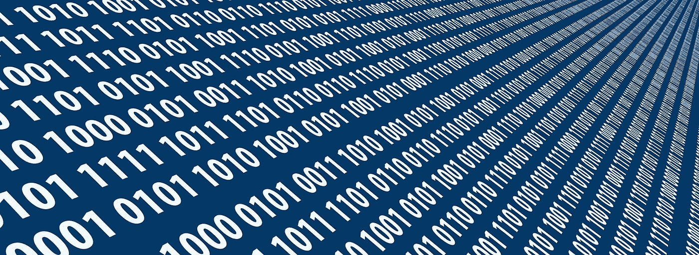

# 茱莉亚不硬！

> 原文：<https://towardsdatascience.com/julia-is-not-hard-c3e8b97d3a4?source=collection_archive---------24----------------------->

## 关于 Julia 是一门难学的编程语言的谣言是不真实的——原因如下。

(src =[https://pix abay . com/插图/banner-header-binary-zero-one-6684416/](https://pixabay.com/illustrations/banner-header-binary-zero-one-6684416/))

# 介绍

W 每当一种新的工具或编程语言进入行业，无论是否面向数据科学，总会有人猜测它对行业意味着什么。此外，有些人可能想知道，就难度、风格、范式和数学能力等众多因素而言，它与他们目前可能正在使用的语言相比如何。Julia 编程语言是这个令人惊叹的编程长长列表中的一个新成员。

Julia 编程语言面向科学计算社区，数据科学家、分析师和从事生物信息学的人都是 Julia 语言的目标受众。也就是说，Julia 在很大程度上仍然是一种通用语言，这使得它比许多其他不能在软件中进行通用应用的统计编程语言具有更强的立足点。考虑到 Julia 是一种相对年轻的语言，关于这种语言是什么样的，以及它是为谁服务的，肯定有各种各样的关注和讨论。

首先，作为一名数据科学家，我认为 Julia 编程语言是一种非常令人兴奋的语言。它提供了科学计算多年来一直渴望的特性，语言速度快，数学上恰当，并且有一个奇妙的类型系统。也就是说，有很多关于这种语言是否功能齐全的讨论，此外，有传言说这种语言非常难学。有些人甚至不遗余力地宣称 Julia 是一种只为“聪明人”设计的语言。今天我想阐明其中的一些话题，谈谈我喜欢 Julia 的什么，并把这种语言的这些方面与生态系统中可用的其他语言和工具进行比较。

# 朱莉娅并不辛苦

我想谈的关于 Julia 语言的第一个流行观点是语言的难度。这实际上是从未使用过这种语言，但对它很好奇的程序员的普遍看法。好的一面是，朱莉娅语言一点也不难学。一个数据科学家在开始使用 Julia 时可能会用到的许多基本语法都是 Python 的镜像。在某些情况下，Julian 语法甚至在主观上更容易理解。

朱莉娅的伟大之处在于她多才多艺。以这种方式使用 Julia 是完全合适的，并且可以非常容易和有效地进行大量的数据科学工作，享受 Julia 编程语言的好处。也就是说，Julia 也可以进行实验，并且有许多不同的可能性，有些人可能从未从这样的语言中期望过。Julia 有一个复杂的类型系统，它有各种各样惊人的能力！在我看来，类型系统是最健壮的系统之一，这种语言真的将多种调度提升到了一个新的水平。所以问题仍然存在，对朱莉娅的这种误解首先来自哪里？

我认为这个断言来自于迄今为止真正使用朱莉娅的人。由于生态系统还不太成熟，业内许多程序员仍在使用 Python。我自己，尽管我爱 Julia，也一直在写 Python。目前，你根本无法打败 Python 的生态系统。这也是我认为 Julia 作为一门难懂的编程语言而获得声誉的部分原因。许多使用这种语言的人也是为它编写生态系统的人。此外，这种语言非常适合于原型制作之类的事情，那些制作原型和做类似事情的人通常被社区认为是聪明的。

# 是的，朱莉娅功能齐全

关于 Julia 的另一个误解是，它仍然只是一种语言，没有科学计算范围之外的许多功能。Julia 语言可以做像 Python 这样的其他语言能做的大多数事情。事实上，这种语言是一种功能非常丰富、非常真实的通用编程语言。

这种误解可能来自于 Julia 相当小的用户群和生态系统。我觉得想到像朱莉娅这样的小语种当然是完全可以理解的事情。也就是说，我也认为 Julia 有一些其他语言的程序员绝对会喜欢的特性，比如我自己。生态系统肯定是缺乏的，但像这样的东西当然要花很多时间来克服。

# 结论

Julia 是一种绝对适用于任何想使用它的人的语言。虽然这种语言很少在软件工程这样的应用中使用，但这并不意味着这种语言是不可能做到的。你甚至可以用 C 语言编译一个 Julia 可执行文件，所以这种语言在这些方面比许多其他统计语言更有能力。如果你以前没有尝试过这种语言，我当然会建议你试一试，你可能最终会爱上它！我希望这篇文章澄清了对 Julia 语言的误解，也许读完之后，你会认为使用 Julia 是一个更明智的选择！感谢您的阅读！