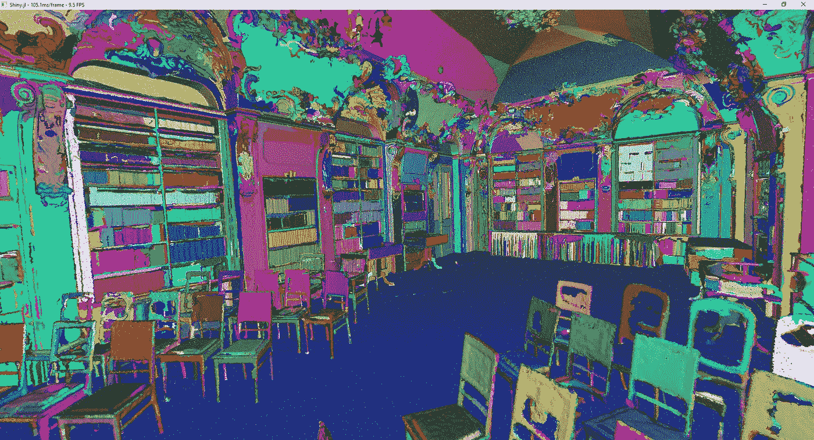
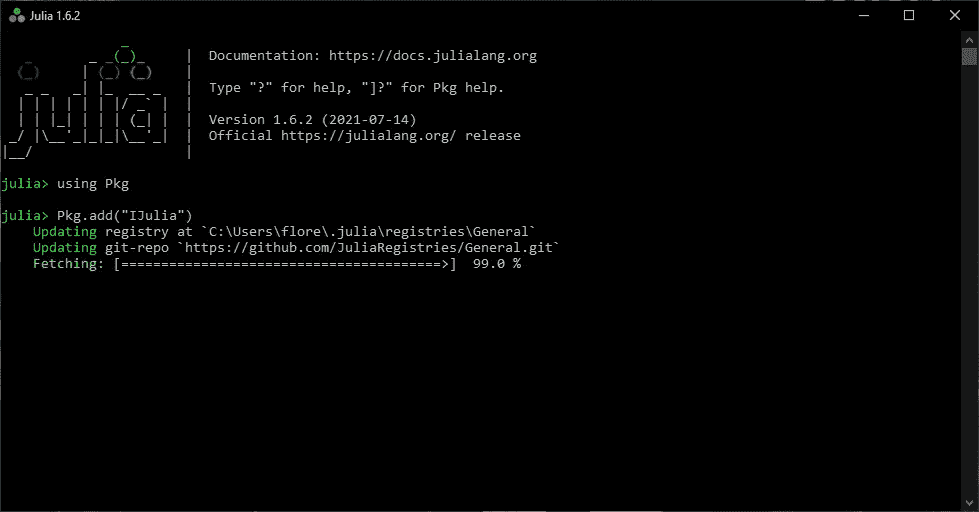
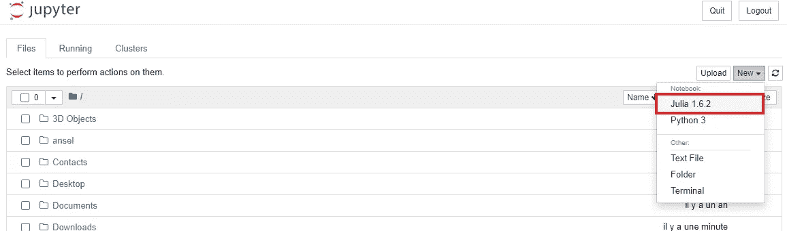
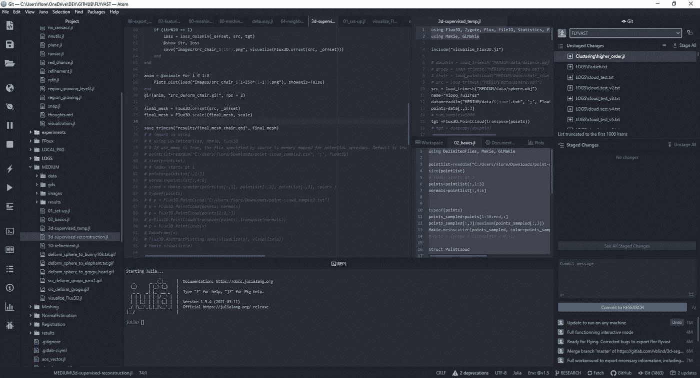
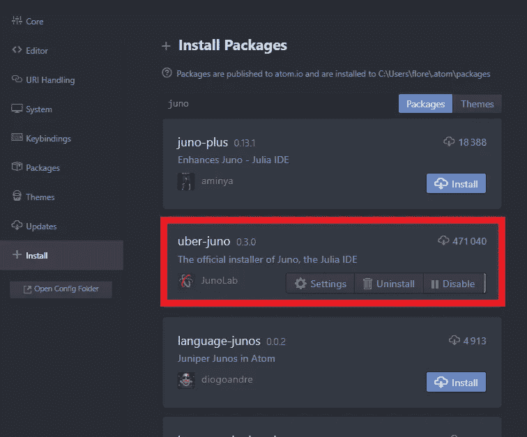
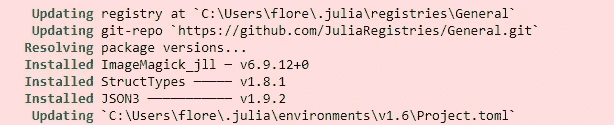
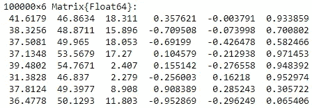
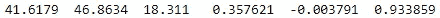
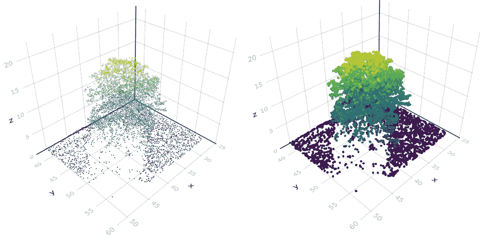
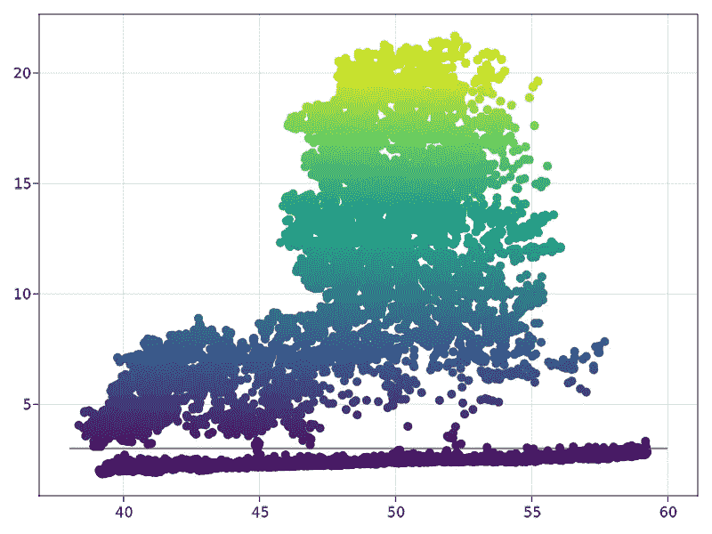

# 朱莉娅三维数据科学教程

> 原文：<https://towardsdatascience.com/julia-tutorial-for-3d-data-science-bf62aa004b0c?source=collection_archive---------15----------------------->

## 实践教程、3D 数据

## 通过用于 3D 点云和网格处理的 6 步工作流程，探索 Python、Matlab、R、Perl、Ruby 和 C 的全能替代方案。



库的 3D 点云被自动分割，然后在 Julia 中可视化。弗洛伦特·普克斯

如果你总是在寻找伟大的想法和新的“工具”，使它们更容易实现，那么你可能听说过朱莉娅。不到十年的非常年轻的语言👶，这是进入快速脚本/编码以快速实现工作想法的一个超级酷的方式🌼。

假设你对科学计算、机器学习、数据挖掘、3D 数据科学、大规模线性代数、分布式和并行计算感兴趣，我认为这是值得跟进的实践教程，与 Julia 一起开始做有趣的 3D 东西！

在本新手教程中，我将直接切入主题，为您提供一个激光聚焦的 6 步工作流程，让您在接下来的十分钟内开始使用 3D 数据！准备好了吗？

# 一点历史？


哈，不过在此之前，我想强调一下《朱丽亚》的创作者们的野心。朱莉娅的创造者，即杰夫·贝赞森、斯特凡·卡尔平斯基、维尔拉·b·沙阿和艾伦·埃德尔曼。他们在 2012 年的博客中讲述了他们的抱负，以及他们发起朱莉娅运动的根本原因:

> 我们想要一种开源的语言，有一个自由的许可证。我们想要 C 的速度和 Ruby 的活力。我们想要一种同形异义的语言，既有像 Lisp 那样的真正的宏，又有像 Matlab 那样明显、熟悉的数学符号。我们想要像 Python 一样可用于一般编程，像 R 一样易于统计，像 Perl 一样自然用于字符串处理，像 Matlab 一样强大用于线性代数，像 shell 一样善于将程序粘合在一起。这种东西学习起来非常简单，却能让最严肃的黑客感到高兴。我们希望它是交互式的，我们希望它是编译过的。应该和 c 一样快。

但是这些主张成立吗🤔？这是一种“我都想要”的语言吗？好吧，我第一次发现朱莉娅是在 2019 年初，当时我正在德国亚琛工业大学(RWTH Aachen University)视觉计算研究所(计算机图形学)做研究访问。

  

从那以后，我基本上是通过朱莉娅发誓的！这来自于 Pythonista/C“程序员”的思维模式。它超级清晰，拿起来毫不费力，超级快，而且你可以在里面循环 python 脚本，直接调用你喜欢的库，纯 Julia 会执行的疯狂快！的确，朱丽亚是编译出来的，不是解读出来的。为了获得更快的运行时性能，Julia 使用 LLVM 编译器框架进行实时(JIT)编译。在最好的情况下，Julia 可以接近或匹配 C 语言的速度，这太棒了🚀！用三个字来说，我会说 Julia 是**快速**、**动态**和**可再生环境。**

⚠️警告说，虽然在写作的时候，文档和教程仍然很少，而且与你使用 Python 时所习惯的相比，社区也很小。但是，嘿，我打算改变一下。我们开始吧。

# 步骤 1:下载并安装 Julia

好了，现在你有了你的咖啡☕或茶杯🍵在你旁边，准备好寻找我们进入雾中的路，让我们潜水吧！首先，我们需要从官网下载茱莉亚:[https://julialang.org/downloads/](https://julialang.org/downloads/)

**注** : *本教程是用 Julia 版本 1.6.2，64bits 使用 windows 制作的，但是你可以用任何稳定版，应该可以(原则上*😉*)。*

一旦可执行文件被下载，就安装漂亮的东西，直到你漂亮的手准备好闪亮的“软件”为止！

# 步骤 2:设置您的 Julia 开发环境

Julia 支持各种编辑器，如 [VSCode](https://www.julia-vscode.org/) 、 [Atom](https://junolab.org/) 、 [Emacs](https://github.com/JuliaEditorSupport/julia-emacs) 、 [Sublime](https://github.com/JuliaEditorSupport/Julia-sublime) 、 [Vim](https://github.com/JuliaEditorSupport/julia-vim) 、 [Notepad++](https://github.com/JuliaEditorSupport/julia-NotepadPlusPlus) ，以及 ide 如 [IntelliJ](https://github.com/JuliaEditorSupport/julia-intellij) 。如果你喜欢 Jupyter 笔记本，也可以直接和 Julia 一起用。对于本教程，我将向您展示我最喜欢的三个选择。

## 茱莉亚拿着朱庇特笔记本

如果你想用 powerpoint 风格的方式演示你的项目，或者你想做的更多的是探索性的数据分析，这将是第一选择。最简单的方法是，启动新安装的 Julia 可执行文件，然后会弹出如下窗口。


Julia.exe 让这个小窗口出现，它充当了你工作的 REPL。弗洛伦特·普克斯

从那里，你所要做的就是键入命令`using Pkg`，然后按下`Enter`，接着是命令`Pkg.add("IJulia")`和`Enter`。在 Jupyter 笔记本中安装使用 Julia 所需的`IJulia`包的过程大约需要 1 分钟。



使用 Pkg.add()命令添加软件包会导致 Julia 更新注册表，然后获取必要的元素以在当前环境中安装软件包。弗洛伦特·普克斯

然后，您可以在您选择的环境中从哪个 Jupyter 笔记本启动 [Anaconda Navigator](https://www.anaconda.com/) (带 GUI)。

***注*** *:* 如果你没有安装 Anaconda，可以按照下面的教程进行操作:

</discover-3d-point-cloud-processing-with-python-6112d9ee38e7>  

一旦 GUI 出现，您就可以直接启动 Jupyter。弗洛伦特·普克斯

一旦打开，你可以用 Julia 作为编程语言创建一个新的笔记本



一旦进入 Jupyter，你可以点击 new，选择 Julia 1。创建一个新的基于 Julia 的笔记本。F. Poux

## 朱莉娅与原子 IDE 和朱诺

我倾向于支持 Atom+Juno 组合，它允许您从交互式 REPL 模式中受益，就像您习惯的 Spyder 一样。如果您选择遵循这些步骤，您首先需要按照在[https://atom.io/](https://atom.io/)给出的说明在您的系统中安装 Atom。



ATOM 中 GUI 的快照。它使得创建成熟软件的过程变得更加容易。弗洛伦特·普克斯

然后，您可以启动 Atom 并通过 Packages>Settings view>Open 或快捷方式`Ctrl+,`进入包安装设置。在那里搜索`juno`，然后点击`uber-juno`的安装按钮，如果没有安装`juno-client`。一旦安装了 Juno，你可以尝试用`Juno > Open REPL`或`Ctrl+J Ctrl+O`(MAC OS 上的`Cmd+J Cmd+O`)打开 REPL，然后在 REPL 中按`Enter`来启动 Julia 会话。就是这样！我们准备编码了！



在酒吧搜索 Juno 时，我会寻找有用的必要软件包，其中包括 uber-juno 和 juno-client。F. Poux

**注意** : *如果 REPL 没有* ***而不是*** *正确启动，并且没有显示 Julia 徽标，请从软件包菜单转至 Juno 客户端设置，并验证 tour Julia 可执行文件的路径。*


我的 Julia 可执行文件的路径。弗洛伦特·普克斯

## 额外奖励:茱莉亚和谷歌实验室

您也可以使用 google Colab 环境，但是这需要一个特定代码块来使用 Julia 而不是 Python。为此，您将在[找到这个链接](https://colab.research.google.com/drive/1JntKGssOxWxBpmy7IaWdYL1tzVTKnseW?usp=sharing)一个模板，它使得直接在 Colab 中工作成为可能。它还包含本教程的主要代码。

**注意** : *每次你想在 Google Cloud 上使用 Julia，都需要运行第一个块，刷新页面，直接继续到第二个块，不需要重新运行第一个，直到每个元素都为你准备好。*

# 步骤 3:加载数据集

太好了，那么现在我们准备好朱丽亚代码了。首先，让我们使用命令`pwd()`来发现我们正在哪里工作，也就是我们当前的工作目录。嗯，看起来我们是在基本目录中，所以让我们把它改成一个项目目录，你可以用`cd(“C://DEV/JULIA/TUTORIALS/3D_PROJECT_1”)`创建这个目录来存储你的大部分项目(数据、结果等等)，然后用`pwd()`检查新的路径。


好的，我们都准备好了。首先，让我们下载一个数据集，一个小的噪声点云。为此，非常方便的是，可以使用以下命令:

```
download("https://raw.githubusercontent.com/florentPoux/3D-small-datasets/main/tree_sample.csv","point_cloud_sample.csv")
```

**注意**:*`*download()*`*命令首先获取你想要下载的数据的链接，我把它放到了我的 GitHub 账号上，然后在下载后在本地指定它的名称。**

*很好，我们现在在工作目录中有了用`cd()`命令指定的数据的本地版本。现在，我们如何在脚本中加载它？嗯，我们将使用一个名为`DelimitedFiles`的**包**。*

***注** *:包是一组方便的函数、方法、类等等，它允许你在现有代码的基础上构建，而不需要从头开始编写任何东西。* `*DelimitedFiles*` *包允许操作(例如，读和写)定界文件，就像我们手头的当前点云*。*

*要使用一个包，我们首先必须通过键入`using Pkg`来加载**包管理器实用程序**。要添加一个新的包，非常简单；我们只需编写`Pkg.add(“DelimitedFiles”)`，等待下载+需求检查完成。*

**

*最棒的是，你不必担心依赖关系(当前需要的其他包),因为一切都为你处理好了！很酷吧。最重要的是，我们可以轻松地创建优秀的包，以确保结果的可重复性，例如，和独立的环境，但这是另一个教程😉。*

***注意** *:* *管理软件包非常简单，我们有一堆函数来更新软件包，了解它们的当前状态，如果它们之间有任何冲突(很少)，或者加载其他志同道合的编码者未注册的软件包，甚至是你未来的本地软件包*😉。我通常使用 REPL 来管理它们，并在正确的环境中使用命令 `*]*` *进入包管理器。要退出软件包管理器，只需要做* `*Ctrl+C*` *。**

*好了，现在包已经安装好了(您只需要在每个环境中运行一次)。您可以通过键入`using DelimitedFiles`在您当前的项目中使用它，并且，如果没有函数名的冲突，您不需要编写函数来自哪个包。读取分隔文件`DelimitedFiles.readdlm()`等同于`readdlm()`。*

*从那里，让我们读取手边的点云并将数据存储在变量`pointlist`中:*

```
*pointlist=readdlm(“point_cloud_sample.csv”,’;’)*
```

*第一行应该如下所示。*

**

# *步骤 4:第一步预处理操作*

*好吧，到现在都很酷，嗯？现在，让我们看看第一个真正的惊喜，如果你习惯于其他编程语言的话:**索引**。您可以尝试执行`pointlist[0]`来检索第一个元素。我们得到了什么？一个*边界错误*。*

*哈哈，在 Julia 中，**索引从 1** 开始，所以如果你想检索第一个元素(第一个点的 X 坐标)，你只需输入返回`41.61793137`的`pointlist[1]`。起初有点令人困惑，但至少从科学的角度来看，它非常方便且符合逻辑😅。所以现在，如果您想要检索第一个点，那么您需要知道索引首先作用于第一个轴(行)，然后是第二个轴(列)，依此类推。因此，要检索第一个点(第一行和每一列):*

```
*pointlist[1,:]*
```

**

*非常酷，现在，为了更进一步，如果我们想在`points`变量中存储坐标，在`normals`变量中存储法线，我们只需要:*

```
*points  = pointlist[:,1:3]
normals = pointlist[:,4:6]*
```

***注意** *:* *如果你想知道一个变量的类型，* `*typeof()*` *就是你要找的。* `*typeof(points)*` *会显示我们处理的是矩阵，是二维数组的别名。还有* `*Float64*` *是计算机数字格式，通常在计算机内存中占用 64 位；它通过使用浮点表示宽动态范围的数值。当单精度(* `*Float32*` *)的范围或精度不够时，可以选择双精度。**

*最后一个简单的预处理步骤是知道如何快速采样变量，比如说，每十分之一行。为此，我们可以这样做(有点像 Python，但我们需要放上单词`end`来处理 total 变量):*

```
*points_sampled=points[1:10:end,:]* 
```

*我们首先处理行，每十分之一取一行，对于每一行，我们保留所有列，在`,`之后是`:`。*

***提示**这种方式执行起来非常快速和简单；因此，它通常在不使用太多记忆的情况下获得第一视觉结果来知道我们正在处理什么。如果你想更深入，我建议你按照下面的教程。对朱莉娅的改编应该不会有太大问题😉。*

*</how-to-automate-lidar-point-cloud-processing-with-python-a027454a536c>  

# 步骤 5: 3D 数据可视化

我们现在准备处理 3D 数据可视化，这是掌握我们正在处理的东西的关键一步！这里，一个库是首选的解决方案:`Makie`。因为我们还没有使用它，我们首先需要导入这个包，以及其他两个“后端”，这取决于您的范例(webGL 可视化或 OpenGL 可视化)，即`WGLMakie` 和`GLMakie`。没有比这更简单的了，我们只需运行下面三行代码一次:

```
Pkg.add(“Makie”)
Pkg.add(“WGLMakie”)
Pkg.add(“GLMakie”)
```

**注意** *:一旦执行，如果您想随时浏览您当前环境中已经安装的软件包，您可以使用* `*Pkg.installed()*` *命令。*

一旦安装了所需的包，为了使它们在您的工作会话中可用，您可以添加行`using Makie, GLMakie`(或者`using Makie, WGLMakie`，如果您想要在 web 上与 Colab 或 Jupyter 交互的话)，很像 Python 中的`import matplotlib`。

很好，现在，在可视化之前，让我们为无色点准备一点颜色，这取决于它们的 z 值。我们将创建一个颜色向量，其大小为采样点云的大小，范围从 0 到 1，取决于它与最大值的接近程度，通过划分每个点:

```
zcoloring_scale=points_sampled[:,3]/maximum(points_sampled[:,3])
```

**提示** *: Julia 自动理解你想用* `maximum()` *将* `*points_sampled[:,3]*` *中的每个元素除以最大值。得心应手吧。但它是* ***播*** *的特例，在 Julia 中，你只要在你的函数或数学符号前输入一个* `*.*` *就可以了。如果在这里做* `*./*` *，也会得到同样的结果。*

好了，现在，我们要做的就是把我们的结果绘制成三维的散乱点云。为此，我们使用来自`Makie`的`scatter`函数，我们传递点的坐标(`points_sampled`)、颜色向量`zcoloring_scale`以及一些参数，如每个点的大小和`markersize`，以及我们是否想要显示轴。

```
scatter(points_sampled, color=zcoloring_scale, markersize=100, show_axis=true)
```



左边是使用散点函数的图。右边是使用 meshscatter 函数的图。在这两种情况下，我们现在可以掌握我们正在处理点云的类型。弗洛伦特·普克斯

你也可以绘制一个`meshscatter`图，为每个点生成一个小球体(就像上面右边的图片)

```
scene_1 = meshscatter(points_sampled, color=zcoloring_scale, markersize=0.2, show_axis=true)
```

多么酷啊！如果你想在网络上有一些交互性，你应该确保使用`WGLMakie`而不是`GLMakie`，它只会给你一个固定的后端来生成一个视图。

**提示** *:如果你想将你的图形打印到一个文件中，一个简单的方法是首先使用* `*Pkg.add(“FileIO”)*` *和* `*using FileIO*` *安装* `*FileIO*` *软件包，该软件包包含了处理大量文件格式(包括网格、图像、矢量等)所必需的方法和功能，一旦在你的运行会话中可用，一个简单的* `*save(“scatter.png”, scene_1)*` *就会将图形保存到你的工作目录中的图像中。*

## [附加功能] 3D 网格输入/输出

一种显示网格的简单方法是使用 FileIO，就像上面暗示的那样。用两行简单的代码，你可以显示你的网格。以我的 GitHub 上可用的点云为例:

```
download("https://raw.githubusercontent.com/florentPoux/3D-small-datasets/main/hippo_1k.obj","hippo_1k.obj")
```

然后，您可以将它存储在 obj 变量中:

```
obj = load(“hippo_1k.obj”)
```

你传递给`Makie.mesh()`函数，简称为`mesh()`来显示你的 3D 模型。

```
mesh(obj, color=”honeydew2”, show_axis=false)
```


使用 Makie 的 3D 网格可视化工具的结果。弗洛伦特·普克斯

如果这不是优化代码清晰，我不知道它是什么😆！

**提示**🙃。

# 步骤 6: 3D 数据分析

现在我们可以研究一些数据，并使用一些函数。首先要知道如何访问 3D 点云数据集的特定部分。在我们的例子中，我们希望找到并(或多或少)将地面与其余部分分开。首先，我们将通过可视化找到地面较高的 z，然后使用它作为阈值。让我们绘制数据集的 2D 投影:

```
scatter(points_sampled[:,2:3], color=zcoloring_scale, markersize=100, show_axis=true)
```



点云在 y 轴上的 2D 投影，以尝试并抓住潜在的阈值线来分离我们的 3D 点云数据集。

我们可以确定在大约 3 米(红线)处有一个阈值。让我们直接用它来做实验。

**提示**😀。

现在，我们希望找到低于和高于视觉定义的阈值的所有点，并将它们存储在一个单独的变量中。我们将使用`findall`函数返回满足括号中条件的点的索引。让我们只关注`points[:,3]`，因为我们只需要研究它并检索索引，我们稍后可以使用这些索引来过滤我们的完整点云。多酷啊😆？

```
indexes_ground=findall(x->x < 3, points[:,3])
indexes_tree=findall(x->x>=3, points[:,3])
```

非常好！现在，如果我们想要获得对应于这些索引列表的点，我们只需在 points 变量中传递`indexes_ground`或`indexes_tree`作为行选择器，例如，用于获得属于地面的所有点和所有其他点。如果我们想画这个，我们可以这样做:

```
meshscatter(points[indexes_ground,:], color=”navajowhite4”, markersize=0.3, show_axis=false)
meshscatter!(points[indexes_tree,:], color=”honeydew3”, markersize=0.3, show_axis=false)
current_figure() 
```

厉害！我们刚刚做了一个手动实例分割步骤，其中我们有一个基础元素和一个树元素，并且使用了一种新的语言；干得好！

# 结论

在 Julia 中，您刚刚学习了如何导入、子采样、导出和可视化由数十万个点组成的点云！干得好！但是这条路并没有到此为止，未来的文章将会深入探讨点云空间分析、文件格式、数据结构、可视化、动画和网格划分。我们将特别关注如何管理大点云数据，如下面的文章中所定义的。

</the-future-of-3d-point-clouds-a-new-perspective-125b35b558b9>  </how-to-automate-3d-point-cloud-segmentation-and-clustering-with-python-343c9039e4f5> 的在线课程立即开始。

<https://learngeodata.eu/point-cloud-processor-formation/>  

如果你刚接触媒体，你可以通过下面的链接来支持我的工作:

<https://medium.com/@florentpoux/membership> *