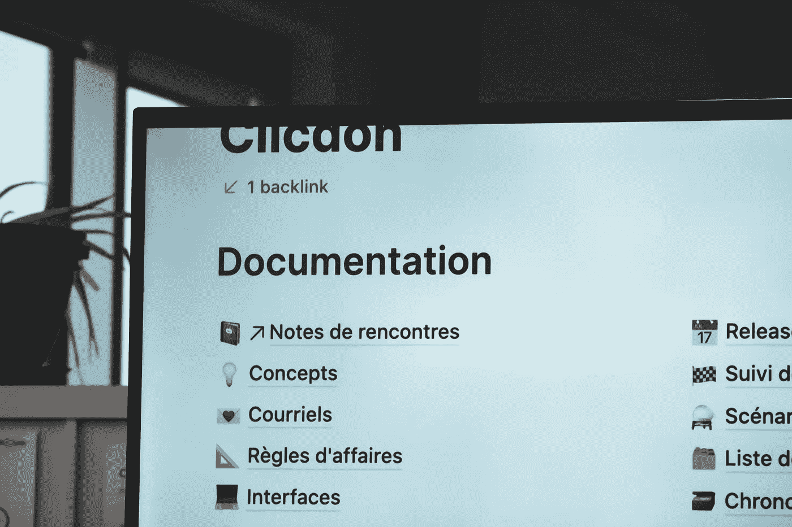

# Julia 的文档字符串系统非常棒，原因如下

> 原文：<https://towardsdatascience.com/julias-doc-string-system-is-awesome-and-here-is-why-197ba6a0236b?source=collection_archive---------23----------------------->

## 概述为什么我认为 Julian 文档优于大多数其他语言的方法



(图片由[西格蒙德](https://unsplash.com/photos/cdMAU_x9mxY)在 [Unsplash](http://Unsplash.com) 上拍摄)

# 介绍

> 朱莉娅有太多可爱的地方了。

我喜欢朱莉娅的一点是，他们对事物有很好的想法，其中一些是打破常规的，而另一些无论何时你想起来都是显而易见的。在某些情况下，这种语言超出了人们的预期，因为它采用了多种调度方式，并拥有像 Pkg 包管理器这样令人惊奇的随机特性。如果您想了解我喜欢这种编程语言的一些方面，并且可能会强迫一个人去接触这种语言，我写了一整篇关于它的文章，您可以在这里阅读:

</5-awesome-things-to-love-about-the-julia-language-688d7c403474>  

Julia 处理得很好的一件事是文档。进入 Julia 文档系统的途径有很多，然而，当你第一次介绍 Julia 文档系统时，很有可能会迷路或感到困惑。我相信这是我们看到许多缺少文档的包的部分原因。这—这整个系统并不太年轻或太老—我认为虽然 Julia 有一些文档问题，但他们最终通常会归结为包太年轻。我跑题了，今天我想深入 Julia 的文档系统，并揭示它实际上是如何工作的，这样你就可以开始编写你的软件了！

# 文档字符串

我们列表中用于创建文档的第一个也是最明显的工具是 doc-string。文档字符串是写在方法定义之上的代码字符串，目的是描述它。出于多种原因，这些是必不可少的。首先，对于查看您的包的开发人员来说，文档字符串是绝对重要的资产。如果他们是第一次查看这段代码，情况尤其如此。考虑到这一点，使用文档字符串可能非常重要。

特别是在 Julia 中，doc-strings 还可以为用户提供一个很好的界面，通过命令行与文档进行交互。您可以提供完整标记格式的文档字符串，例如:

```
"""
# This is a huge title
[This is a link](http://medium.com/@emmettgb)
This is plain <p> text. \\
```
This is a code example
```"""
function documented()end
```

你可以阅读文档字符串的完整指南…

> Julia 文档文档

  

markdown 在 REPL 内部也打印得很好，然后在构建基于 web 的文档站点的过程中更进了一步。

# 创建文档

在 Julia 中创建文档通常是通过 Documenter.jl 包来完成的。这个包允许您使用自己目录中的独立环境来创建一个具有自己的虚拟环境的新项目。从那里，您的包和 Documenter.jl 作为依赖项被加载。以下是这些情况下项目目录的直观表示:

```
- assets
- doc
- src
- ...
```

您还可以查看 Lathe.jl 存储库作为参考，这里包含了文档和测试目录:

<https://github.com/ChifiSource/Lathe.jl>  

在这个文档中有一个全新的项目和一个全新的 Project.toml 文件。我不打算在这里讨论如何使用 Documenter.jl，但我确实写了一整篇文章来讨论它和使用它，您可以在这里阅读:

</how-to-automate-julia-documentation-with-documenter-jl-21a44d4a188f>  

# JuliaHub

  

Juliahub 是一个很棒的新的 Julia 网站，它把包和它们各自的文档提高到了一个新的容易访问的水平。因为大多数成熟到可以真正使用的包在它们的存储库中都会有这个 doc 目录，并且应该有一个类似于。jl 存储库中，Julia 可以从。TOML 文件和 Documenter markdown 文件，项目在下面的目录中。

也就是说，JuliaHub 是很多东西的家。科学工作可以在这个网站上完成，Julia 软件包可以和他们的文档一起访问。它非常简单，但是增加了文档一致性的新元素，因为只要在 Julia 注册中心内，就可以在同一个网站上找到它。我写了一整篇关于 JuliaHub 的文章，以及它如何将这样的文档提升到一个新的水平，您可以在这里阅读:

</juliahub-the-greatest-approach-to-putting-together-packages-and-documentation-707688a472d2>  

# 结论

Julia 是一种典型的夸张语言。你想要一个编译器，他们给你一个 JIT 编译器。你想要一个类型系统，他们给你多个分派和内部外部构造函数。你想要一个包管理器，你可以得到带有 TOML 虚拟环境的 Pkg。在文档的前面也没有例外。

非常感谢您阅读我的文章。我希望它有助于展示宇宙中所有 Julia 代码背后的文档引擎的力量。祝您有美好的一天，编程愉快！