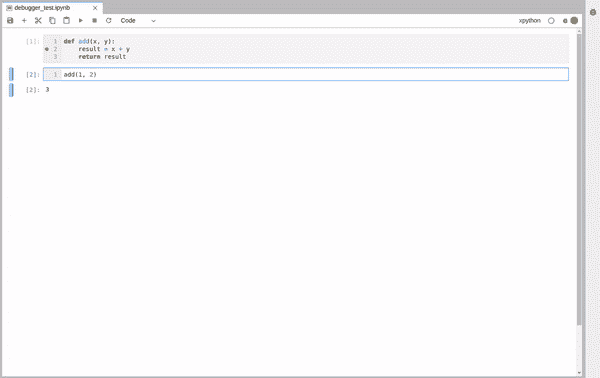
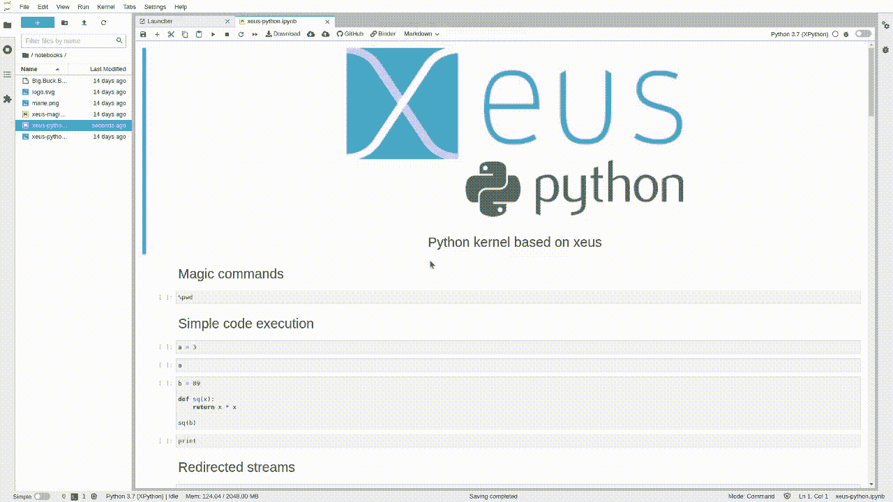
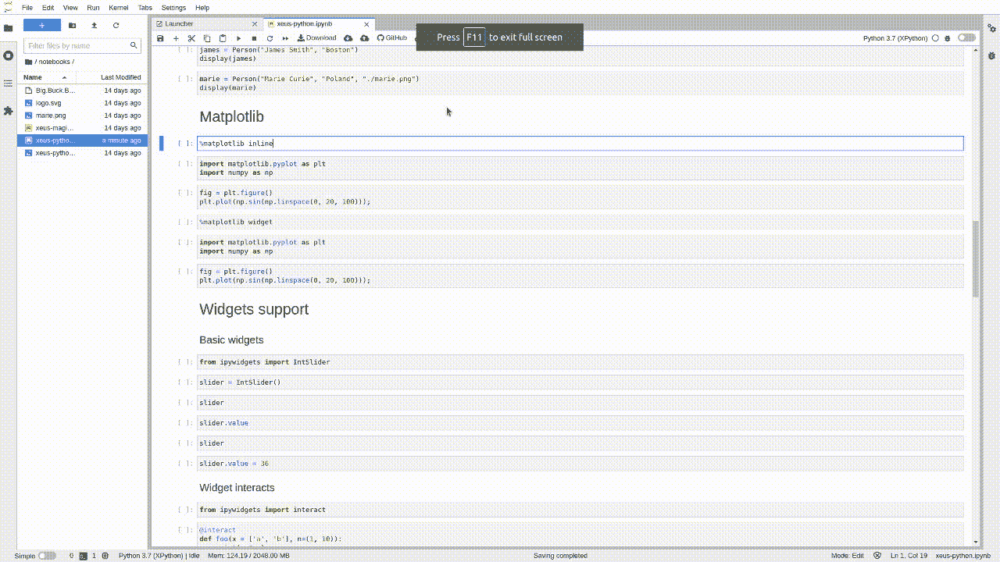

# Jupyter:准备抛弃 IPython 内核

> 原文：<https://towardsdatascience.com/jupyter-get-ready-to-ditch-the-ipython-kernel-54d60776d7ef?source=collection_archive---------4----------------------->

## 通过 xeus-python，JupyterLab 离成为成熟的 IDE 更近了一步。


[博伊图梅洛·菲特拉](https://unsplash.com/@writecodenow?utm_source=unsplash&utm_medium=referral&utm_content=creditCopyText)在 [Unsplash](https://unsplash.com/?utm_source=unsplash&utm_medium=referral&utm_content=creditCopyText) 上的照片

大约一年前，JupyterLab 的可视化调试器发布了。这是使 JuypterLab 成为成熟的 IDE 的一个步骤，因为它提供了 IDE 调试器所能提供的大部分功能:

*   变量资源管理器、断点列表和源代码预览
*   导航调用堆栈的可能性(下一行、进入、退出等)。)
*   直观地在感兴趣的行旁边设置断点的能力
*   指示当前执行停止位置的标志



JupyterLab 可视化调试器

该项目建立在 xeus-python 内核的基础上，这是 python 编程语言 Jupyter 内核的一个轻量级实现。你可以在我当时写的一篇文章中读到这一点，这篇文章成了我在媒体上最成功的一篇文章。

</jupyter-is-now-a-full-fledged-ide-c99218d33095>  

然而，`xeus-python`并没有提供所有的 IPython 内核特性。最重要的是，它不支持魔术命令或 Matplotlib 图形，而这两者对于数据科学家来说是非常有用的。

你发现关键词了吗？关键词是*“did”；o* 一年后，`xeus-python`如果越来越接近与`ipykernel`旗鼓相当。我们准备好享受它带来的所有好处。

> [学习率](https://www.dimpo.me/newsletter?utm_source=medium&utm_medium=article&utm_campaign=xeus-python)是为那些对 AI 和 MLOps 的世界感到好奇的人准备的时事通讯。你会在每周五收到我关于最新人工智能新闻和文章的更新和想法。在这里订阅！

# Xeus Magic

笔记本一直是软件思想增量开发的工具。数据科学家使用 Jupyter 来记录他们的工作，探索和实验新的算法，快速勾画新的方法，并立即观察结果。

尽管 JupyterLab 将项目推向提供类似 IDE 的开发体验，但仍有一些缺失。其中之一就是可视化调试器的存在。覆盖这个漏洞产生了新的问题，因为 Jupyter 可视化调试器的实现依赖于`xeus-python`内核。

主要问题是`xeus-python`没有提供所有的 IPython 内核特性。值得注意的是，它不支持魔法命令和`matplotlib`人物。我有一个好消息:`xeus-python`现在正在向`ipykernel`靠拢。

截至今天，`xeus-python`支持魔法命令和`matplotlib`人物，以及许多其他`ipykernel`额外功能，比如丰富的配置系统。

我敦促你在评论区开始讨论，以了解还缺少什么，这样我们就可以推动项目向前发展！

**魔法支持:**



xeus-python 中的神奇命令

**Matplotlib 支持:**



xeus-python 中的 Matplotlib

# 入门指南

不用安装`xeus-python`就可以在 Binder 上试驾。请点击下面的链接。这会让你知道`xeus-python`能做什么，以及它是否适合你

<https://mybinder.org/v2/gh/jupyter-xeus/xeus-python/stable?urlpath=/lab/tree/notebooks/xeus-python.ipynb>  

如果你对这个想法感兴趣，你可以使用 mamba 或 conda 安装最新的`xeus-python`版本:

```
mamba install xeus-python -c conda-forge
```

或者

```
conda install xeus-python -c conda-forge
```

此外，看看我的其他笔记本故事，用这个优秀的工具提升你的游戏:

*   Jupyter 已做好生产准备；原样
*   [期待已久的 JupyterLab 3.0 终于来了](/the-long-awaited-jupyterlab-3-0-is-finally-here-3b6648b3a860)
*   [Jupyter 在 VS 代码:利弊](/jupyter-is-taking-a-big-overhaul-in-visual-studio-code-d9dc621e5f11)
*   [Jupyter 有一个完美的代码编辑器](/jupyter-has-a-perfect-code-editor-62147cb9bf21)
*   [Jupyter widgets 的新时代](/the-new-age-of-jupyter-widgets-cc622bee2c4b)

# 结论

笔记本一直是软件思想增量开发的工具。尽管 JupyterLab 将项目推向提供类似 IDE 的开发体验，但仍有一些缺失。

解决这些问题产生了新的问题；例如，可视化调试器依赖于`xeus-python`并且`xeus-python`没有提供所有的 IPython 内核特性。然而，它更接近与`ipykernel`的功能对等。

这个故事展示了为什么会出现这种情况，以及您现在可以如何开始使用 JupyterLab 的`xeus-python`内核。我敦促你在评论区开始讨论，以了解还缺少什么，这样我们就可以推动项目向前发展！

# 关于作者

我的名字是[迪米特里斯·波罗普洛斯](https://www.dimpo.me/?utm_source=medium&utm_medium=article&utm_campaign=xeus-python)，我是一名为[阿里克托](https://www.arrikto.com/)工作的机器学习工程师。我曾为欧洲委员会、欧盟统计局、国际货币基金组织、欧洲央行、经合组织和宜家等主要客户设计和实施过人工智能和软件解决方案。

如果你有兴趣阅读更多关于机器学习、深度学习、数据科学和数据操作的帖子，请关注我的 [Medium](https://towardsdatascience.com/medium.com/@dpoulopoulos/follow) 、 [LinkedIn](https://www.linkedin.com/in/dpoulopoulos/) 或 Twitter 上的 [@james2pl](https://twitter.com/james2pl) 。此外，请访问我的网站上的[资源](https://www.dimpo.me/resources/?utm_source=medium&utm_medium=article&utm_campaign=xeus-python)页面，这里有很多好书和顶级课程，开始构建您自己的数据科学课程吧！