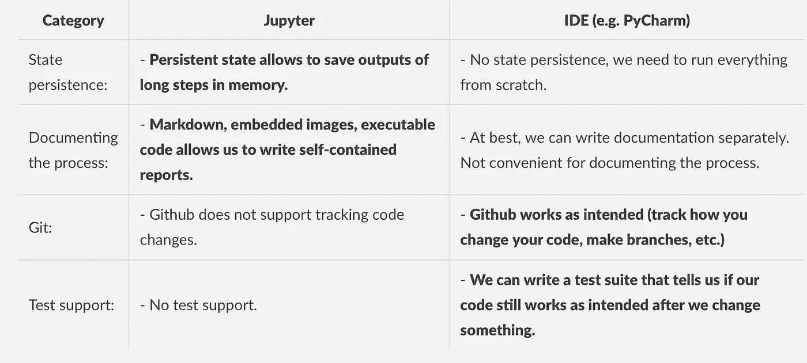
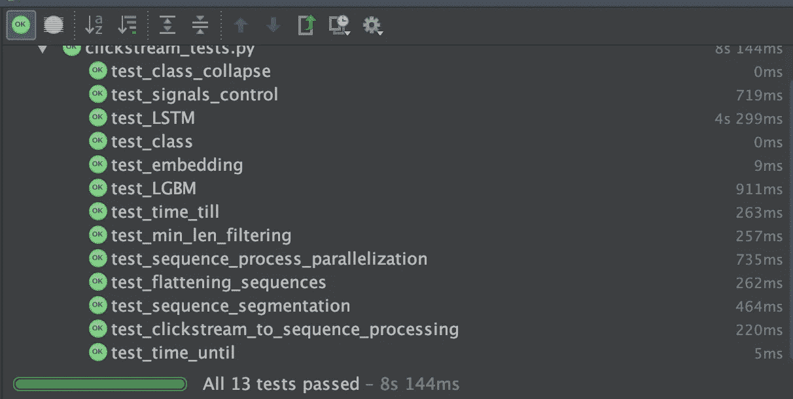
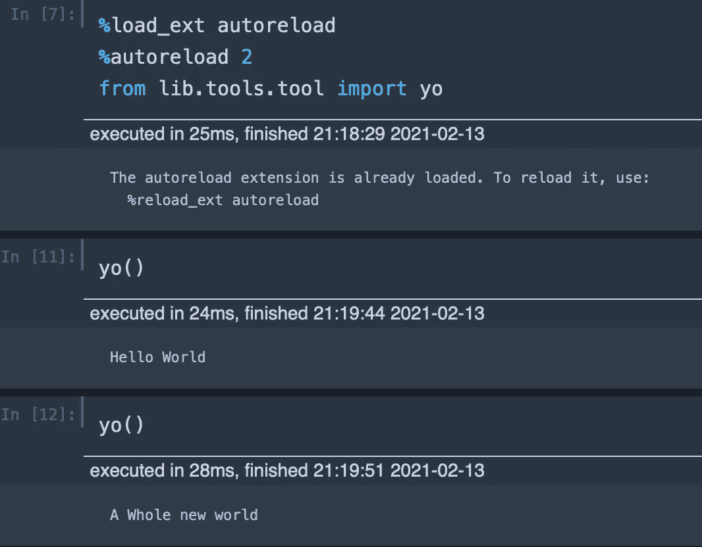
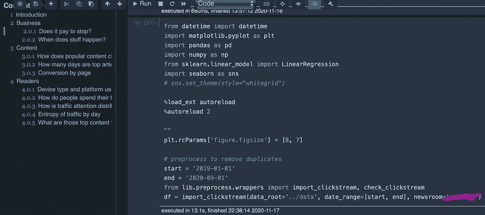

# Jupyter + IDE:如何让它工作

> 原文：<https://towardsdatascience.com/jupyter-ide-how-to-make-it-work-6253f78eec67?source=collection_archive---------13----------------------->

## *这篇文章描述了一个工作流程，它将在* ***IDE*** *中编写代码与在* ***Jupyter 笔记本*** *中使用该代码进行分析分开，同时实际上使使用笔记本更快更干净*

# 介绍

如果你用 Python 处理数据，你可能知道 **Jupyter 笔记本**。这种格式对于同时编写代码和探索数据是有意义的..是吗？！

大多数关于依赖笔记本的批评都可以在这个精彩的演讲中找到: [*我不喜欢笔记本*，乔尔·格鲁什。总而言之，笔记本并不是一个大型项目的好环境:git 版本控制并不真正起作用，测试不受支持，最终笔记本变成了分散在各个单元的一堆代码。当然，所有这些都与一个简单的论点相悖:](https://www.youtube.com/watch?v=7jiPeIFXb6U)

“但是..笔记本太方便了”(大概一年前的我)

当处理数据时，您几乎永远不知道您的方法是否有效，因为您的代码正在运行。你总是在开发一个模型的过程中和之后做分析，跟踪不同假设的结果，记录观察结果，等等。笔记本格式确实符合这一流程。但这并不意味着不能改进。

## 利弊

我们来总结一下我们到底为什么对 Jupyter 笔记本和 IDEs(集成开发环境)又爱又恨。



PyCharm 中使用 **pytest** 的测试套件示例。

最后，让我们看看如何在一个简单的工作流程中结合两者的优点。

# 工作流设置

*   **(可选)使用 pyenv 为每个项目空间隔离您的 python。** [**安装指南**](https://medium.com/@henriquebastos/the-definitive-guide-to-setup-my-python-workspace-628d68552e14) **。**

虚拟环境是一个不同的话题，但我认为它们也非常有帮助。

*   **可编辑 pip 安装**

我们使用 pip 将 python 指向一个将成为我们代码的“包”。虽然它不是一个真正的包，而是一个到我们代码的链接。这使我们可以像导入 python 包一样导入代码，同时还可以编辑代码并动态更新“包”。

```
cd YOUR_PROJECT_ROOT
mkdir lib
```

通过在项目根目录下创建一个`setup.py`文件来定义包:

```
from setuptools import setup
setup(
  name='lib',
  version='0.1.0',
  packages=['lib'],
)
```

安装带有 pip 的*可编辑*标志的软件包:

```
pip install -e .
```

*   **包装结构**

我们仍然需要我们的代码有一个包结构。`lib`目录中的每个文件夹都需要有一个空的 __init__。py 文件。

```
|-- setup.py
|-- lib
|   |-- **__init__.py**
|   |-- tools
|       |-- **__init__.py**
|       |-- tool.py
```

举个例子，在`lib/tools/tool.py`中定义一个函数:

```
def yo():
    print("Hello World")
```

现在，您可以使用以下命令在 python shell 中导入它:

```
>>> from lib.tools.tool import yo
>>> yo()
Hello World
```

*   **自动重装**

Jupyter 可以在您的 Jupyter 笔记本中使用`autoreload.`动态重新加载任何包更改，运行一次自动重新加载导入:

```
%load_ext autoreload
%autoreload 2
```

# 结果

现在，当我们使用我们最喜欢的 IDE 在`lib`中编辑代码时，我们会有:

1.  python 自动将编辑内容放到一个`lib`包中，
2.  Jupyter notebook 会在我们使用该软件包时自动传播更改。

只要您保存了正在处理的文件，更改就会立即从 IDE 传播到笔记本！注意，我不需要重新运行函数导入来查看更改。



我编辑了该函数，以便在 IDE 中打印不同的字符串。

## 我实际上是如何使用这个工作流程的:

它允许我将我的笔记本保持在要点上，记录我想要保留的结果，同时将高质量的代码保存在适当的存储库中，以便以后可以重用，而不需要在笔记本之间复制粘贴代码块。



它还允许我使用强大的 IDE 来开发高质量的代码，使我在记录代码、语法错误等方面浪费更少的时间。