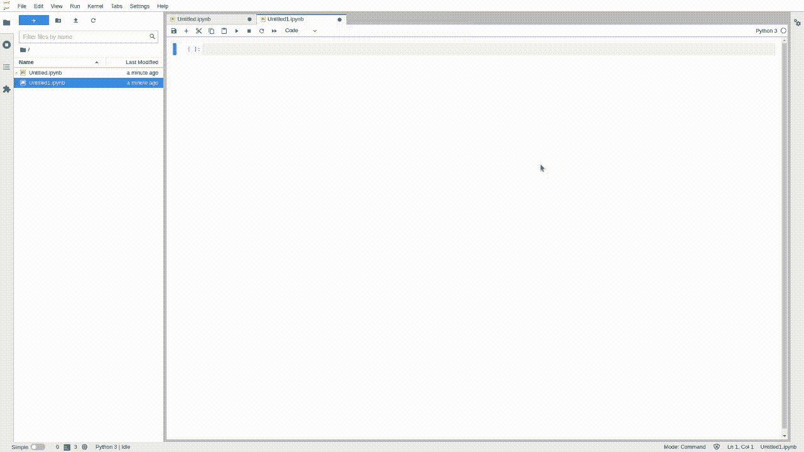
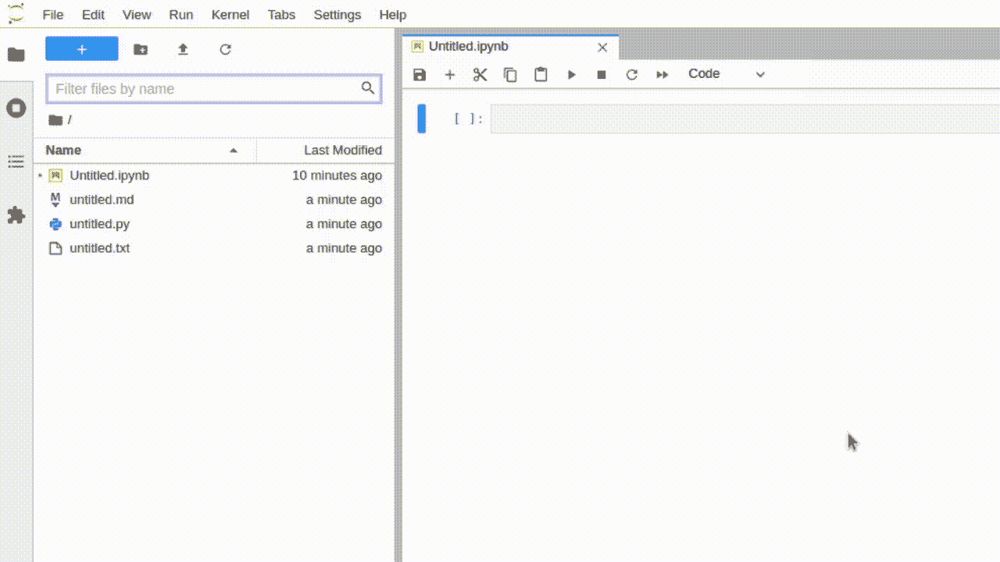

# Jupyter 现在是一个成熟的 IDE:事后看来

> 原文：<https://towardsdatascience.com/jupyter-is-now-a-full-fledged-ide-in-hindsight-3f0c5f35aa8d?source=collection_archive---------6----------------------->

## JupyterLab 3.0，可视化调试器，nbdev，Kale，IDOM。对于朱庇特计划来说，这是伟大的一年。


照片由[努贝尔森·费尔南德斯](https://unsplash.com/@nublson?utm_source=unsplash&utm_medium=referral&utm_content=creditCopyText)在 [Unsplash](https://unsplash.com/s/photos/programming?utm_source=unsplash&utm_medium=referral&utm_content=creditCopyText) 拍摄

Jupyter 笔记本是软件思想增量开发的伟大工具。数据科学家使用 Jupyter 来记录他们的工作，探索和实验新的算法，创建新方法的快速草图，并立即观察结果。

然而，当时机成熟时，软件开发人员转向代码编辑器和 ide，如 Visual Studio Code 和 Pycharm，将想法转换成库和框架。

JupyterLab 是为了解决 Jupyter 笔记本的一些缺点而开发的。事实上，过去的 14 个月对 JupyterLab 来说是一个伟大的时期；它确立了自己作为该项目的下一代用户界面的地位，并且更接近于成为一个成熟的 IDE。

**一个新的主要版本，允许您构建 Python 库并将代码单元转换为机器学习管道的扩展，一个新的小部件引擎和一个可视化调试器推动着项目向前发展。**

欢迎来到朱庇特计划的魔法世界！

> [学习率](https://www.dimpo.me/newsletter?utm_source=medium&utm_medium=article&utm_campaign=jupyter_ide)是为那些对 AI 和 MLOps 的世界感到好奇的人准备的时事通讯。你会在每周五收到我关于最新人工智能新闻和文章的更新和想法。在这里订阅！

# JupyterLab 3.0

2020 年 12 月 24 日，圣诞节前一天，团队发布了 JupyterLab 的版本`3.0`，作为给数据科学家和机器学习工程师的礼物。

首先，新版本支持多种语言。例如，按照官方[文档](https://jupyterlab.readthedocs.io/en/latest/user/language.html)中的教程将显示语言更改为简体中文。

接下来，简单界面模式(以前的单文档模式)使您能够专注于单个文档或活动，而无需关闭主工作区中的其他选项卡。



简单界面模式——作者图片

目录扩展现在是核心 Jupyter 的一部分，文件浏览器过滤器甚至更有用，因为它集成了用于命令面板的相同模糊匹配机制。



文件浏览器过滤器-按作者分类的图像

最后，JupyterLab 3.0 引入了一种以`pip`或`conda`包的形式分发 Jupyter 扩展的新方法，以及一种调用命令面板的新方法，看起来和感觉起来都更直观。

有关 JupyterLab 3.0 版本的更多详细信息，请阅读下面的文章:

</the-long-awaited-jupyterlab-3-0-is-finally-here-3b6648b3a860>  

# nbdev

[杰瑞米·霍华德](https://github.com/jph00)和[西尔万·古格](https://github.com/sgugger)，着迷于文化编程的想法，于 2019 年推出了 nbdev。这个框架允许您在熟悉的 Jupyter 笔记本环境中编写代码，在找到给定问题的有效解决方案之前探索和试验不同的方法。然后，使用某些关键字，nbdev 允许您将有用的功能提取到一个成熟的 python 库中。

更具体地说，nbdev 补充了 Jupyter，增加了对以下内容的支持:

*   遵循最佳实践，从笔记本中自动创建 python 模块
*   在标准 IDE 中编辑和导航代码
*   将任何更改同步回笔记本
*   从代码中自动创建可搜索的超链接文档
*   `pip`和`conda`包装
*   测试
*   使用 GitHub 动作的持续集成
*   版本控制冲突处理

nbdev 使软件开发人员和数据科学家能够在不脱离 Jupyter 环境的情况下，遵循最佳实践，开发文档完备的 python 库。要开始，只需运行:

```
pip install nbdev
```

阅读以下关于 nbdev 的更多信息:

</jupyter-is-now-a-full-fledged-ide-c99218d33095>  

# 羽衣甘蓝

Kale 是一个开源项目，它简化了数据科学家使用 Kubeflow 和 Kubernetes 的体验。Kale 以 JupyterLab 扩展的形式提供了一个 UI，它可以将您的笔记本代码单元转换为机器学习管道，并将其部署在 Kubeflow 上。

你可以把 Kale 当成你的 Kubeflow 的机器学习项目 orchestrator 作为一名数据科学家，您可以在我们最喜欢的笔记本环境中工作，无需任何代码更改，就可以在 Kubeflow 和 Kubernetes 上运行您的 ML 管道。

此外，由于 Kale 与 AutoSklearn 的集成，您可以配置和执行超参数优化实验，将您的模型作为可伸缩的 API，甚至可以运行 AutoML 实验。

要开始使用 Kale，请查看以下资源:

*   [从笔记本到 Kubeflow 管道](/jupyter-is-ready-for-production-as-is-b36f1d1ca8f8)
*   [数据集版本化和管理](/the-way-you-version-control-your-ml-projects-is-wrong-42910cba9bd9)
*   [在 Kubeflow 中调试](/how-to-use-time-travel-to-debug-your-ml-pipelines-efb5263372c0)
*   【Katib 和 Kale 简化了超参数调整
*   [在 Kubernetes 上为你的模特服务的最简单方式](/the-simplest-way-to-serve-your-ml-models-on-kubernetes-5323a380bf9f)

# 可视化调试器

大约一年前，JupyterLab 的可视化调试器发布了。这是使 JuypterLab 成为成熟的 IDE 的一个步骤，因为它提供了 IDE 调试器所能提供的大部分功能:

*   变量资源管理器、断点列表和源代码预览
*   导航调用堆栈的可能性(下一行、进入、退出等)。)
*   直观地在感兴趣的行旁边设置断点的能力
*   指示当前执行停止位置的标志

然而，这个项目是建立在 xeus-python 内核上的，这是 python 编程语言的 Jupyter 内核的一个轻量级实现。`xeus-python`没有提供所有的 IPython 内核特性。最重要的是，它不支持魔术命令或 Matplotlib 图形，而这两者对于数据科学家来说是非常有用的。

关键词是*“did”；o* 一年后，`xeus-python`如果越来越接近与`ipykernel`旗鼓相当。我们准备好享受它带来的所有好处。

</jupyter-get-ready-to-ditch-the-ipython-kernel-54d60776d7ef>  

此外，对`ipykernel`的合并 pull 请求将可视调试器带到 Python 编程语言的主 Jupyter 内核中！

</jupyter-visual-debugger-is-becoming-mainstream-92fe0c336e9e>  

# IDOM 部件

Jupyter 笔记本的交互特性是这个项目如此吸引人的原因。但是，为了更进一步，数据科学家使用 Jupyter 小工具来可视化他们的结果或创建迷你网络应用程序，以便于浏览内容或鼓励用户互动。

然而， [IPyWidgets](https://github.com/jupyter-widgets/ipywidgets) 并不总是容易使用。它们不遵循前端开发人员开创的声明式设计原则，并且生成的组件不能像在浏览器环境中那样进行传输。

此外，开发人员创建这些库主要是为了满足数据科学家的可视化需求。因此，它们缺少像 React 和 Vue 这样的流行前端框架带来的特性。

是时候迈出下一步了；IDOM 引入了用于定义和控制交互式网页或创建可视 Jupyter 组件的库。你关心的是第二部分。要阅读更多关于 IDOM 部件的信息，请阅读下面的故事:

</the-new-age-of-jupyter-widgets-cc622bee2c4b>  

# 结论

Jupyter 笔记本是软件思想增量开发的一个很好的工具，过去的 14 个月是这个项目的一个很好的时期。

一个新的主要版本(JupyterLab 3.0)，可视化调试器，一个允许您编写和打包 Python 库的库，一个在不更改一行代码的情况下将您的代码单元转换为 ML 管道的库，以及一组新的小部件推动项目向前发展。

更重要的是，标准的 Jupyter 小部件越来越好，对笔记本文件的支持无处不在。

</top-jupyter-extensions-2021-edition-d02aa698547b>  </jupyter-is-taking-a-big-overhaul-in-visual-studio-code-d9dc621e5f11>  

欢迎来到朱庇特计划的魔法世界！

# 关于作者

我叫[迪米特里斯·波罗普洛斯](https://www.dimpo.me/?utm_source=medium&utm_medium=article&utm_campaign=jupyter_ide)，我是一名为[阿里克托](https://www.arrikto.com/)工作的机器学习工程师。我曾为欧洲委员会、欧盟统计局、国际货币基金组织、欧洲央行、经合组织和宜家等主要客户设计和实施过人工智能和软件解决方案。

如果你有兴趣阅读更多关于机器学习、深度学习、数据科学和数据运算的帖子，请在 Twitter 上关注我的 [Medium](https://towardsdatascience.com/medium.com/@dpoulopoulos/follow) 、 [LinkedIn](https://www.linkedin.com/in/dpoulopoulos/) 或 [@james2pl](https://twitter.com/james2pl) 。

所表达的观点仅代表我个人，并不代表我的雇主的观点或意见。